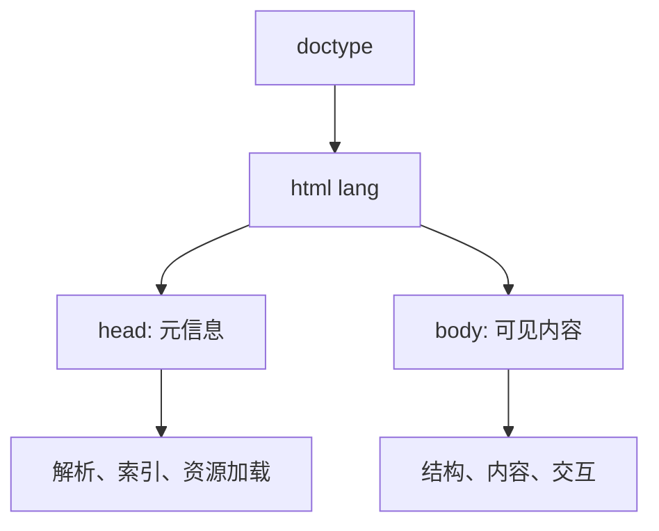
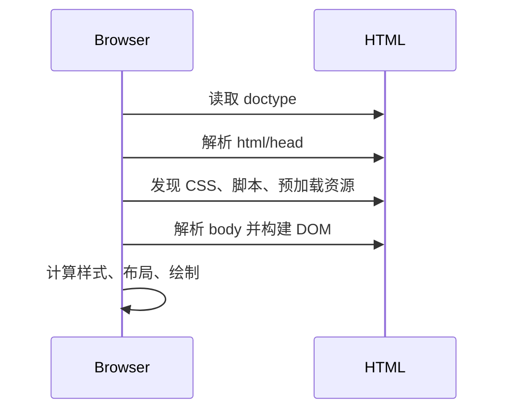

## 基础模板

下面是一份适合作为练习起点的 HTML 模板。它不是“万能模板”，但覆盖了现代页面最基础的解析、语言、视口、资源和正文入口。

```html
<!doctype html>
<html lang="zh-CN">
  <head>
    <meta charset="UTF-8" />
    <meta name="viewport" content="width=device-width, initial-scale=1.0" />
    <meta name="description" content="HTML 文档结构示例" />
    <title>文档结构</title>
    <link rel="stylesheet" href="./style.css" />
    <script src="./main.js" defer></script>
  </head>
  <body>
    <main>
      <h1>页面主标题</h1>
      <p>这里是页面正文内容。</p>
    </main>
  </body>
</html>
```

## 文档骨架

`<!doctype html>` 是 HTML 文档的解析开关，不是给用户看的内容。浏览器在解析文档最开始就要决定使用标准模式还是怪异模式，现代页面应始终把它放在第一行。

```html
<!doctype html>
```

标准模式会让浏览器尽量按照当前 HTML、CSS 规范处理布局和尺寸；怪异模式是为了兼容早期网页保留下来的历史行为。省略 `doctype` 时，页面可能不会马上崩，但盒模型、表格、图片对齐、百分比高度等细节更容易出现“看起来解释不通”的差异。

| 写法 | 解析模式 | 典型影响 |
| --- | --- | --- |
| `<!doctype html>` | 标准模式 | CSS 布局、盒模型和尺寸计算更稳定 |
| 缺失或历史写法 | 可能进入怪异模式或接近怪异模式 | 不同浏览器兼容行为更复杂 |

#### 模式检测

调试老页面时，可以用 `document.compatMode` 快速确认当前模式：

```javascript
console.log(document.compatMode); // "CSS1Compat" 表示标准模式
```

如果输出是 `"BackCompat"`，说明页面处在怪异模式。此时不要先怀疑 CSS 写错，应该先检查 HTML 文件最前面是否存在正确的 `doctype`。

在真实项目里，`doctype` 最容易出问题的场景通常不是新页面，而是历史模板、邮件模板、CMS 富文本页或后端拼接页面。现代框架脚手架基本都会自动生成正确声明，但只要页面不是从标准模板开始，就值得先检查这一行。它的位置也很重要，前面不要出现注释、空白之外的异常字符或服务端输出内容，避免浏览器在解析初期进入不可预期状态。

更实际的排查顺序通常是：先确认是否进入标准模式，再看 DOM 是否被浏览器自动修正，最后才判断样式或脚本。很多“我明明写的是这个结构，为什么页面上不是这样”的问题，本质上不是 CSS 失效，而是 HTML 解析阶段已经把结构改写了。尤其是富文本编辑器、第三方内容片段、服务端模板拼接这些场景，错误嵌套一旦进入 DOM，后续再靠选择器修补往往很脆弱。

HTML 解析器有很强的容错能力，这既是优点，也是陷阱。浏览器会尽量把不完整的标签、错误嵌套和缺失闭合补成一棵可用 DOM 树，所以页面可能“看起来能跑”，但最终 DOM 不一定等于你写出来的文本结构。比如把块级内容错误放进某些只允许短语内容的位置，浏览器可能会自动结束标签，导致 CSS 选择器、脚本查询和无障碍结构都和预期不同。排查奇怪 DOM 时，应该看 DevTools 里的实际 DOM，而不是只看源文件。

```html
<!-- 源码看似只是嵌套错误，但浏览器可能会自动修正 DOM -->
<p>
  段落开始
  <div>不应该放进 p 里的区块</div>
  段落结束
</p>
```

这类容错让 HTML 对初学者友好，但在工程里也要求我们写结构清晰、嵌套合法的模板。尤其是服务端模板、Markdown 渲染、富文本渲染这类自动生成 HTML 的地方，更要关注最终输出是否仍然是合法结构。

#### 根元素与语言环境

`html` 是整份文档的根元素，`head` 和 `body` 都是它的子元素。它的职责不是布局，而是声明“这是一份 HTML 文档”，并承载全局语言环境。

```html
<!doctype html>
<html lang="zh-CN">
  <head></head>
  <body></body>
</html>
```

`lang` 会影响屏幕阅读器发音、浏览器翻译、搜索引擎语言判断和拼写检查。中文页面使用 `zh-CN`，英文页面使用 `en`，多语言页面可以在局部内容上继续声明：

```html
<p>这是一段中文内容，里面包含 <span lang="en">HTML document</span>。</p>
```



`lang` 和 [[1.1.7 无障碍|无障碍]]、[[1.1.6 SEO|SEO]] 都有关系，但在文档结构里先记住一个判断：只要页面主要语言确定，就不要省略。

多语言站点还要注意局部语言切换。比如中文文章里夹杂英文术语、代码文档里出现英文原文、国际化页面里嵌入不同语言评论，都可以在局部元素上补 `lang`。这不是形式主义，屏幕阅读器会据此调整发音，浏览器翻译也会更容易判断哪些内容需要处理。

`dir` 也是根元素上常见的全局信息，用来声明文字方向。中文和英文通常是从左到右，阿拉伯语、希伯来语等语言则可能从右到左。多数中文前端项目很少直接处理 `dir`，但如果做国际化、跨境站点或多语言富文本，就要把语言和方向一起纳入文档结构考虑。

```html
<html lang="ar" dir="rtl">
  <body>
    <main>...</main>
  </body>
</html>
```

语言、方向、编码这些信息都属于“页面被理解之前的基础条件”。它们不直接决定视觉设计，却会影响浏览器和辅助技术如何解释内容。

如果页面中有局部 RTL 内容，例如引用一段阿拉伯语或希伯来语，通常不一定要把整个页面切成 `rtl`，而是给局部容器单独声明方向。这样可以避免数字、标点和嵌套英文片段的排版被整体翻转。文档结构层面先把方向想清楚，后面的 CSS 才不会在排版上反复补洞。

#### 解析顺序

浏览器读取 HTML 时是从上到下解析的。它会先看到 `doctype`，再进入 `html`，然后读取 `head` 中的元信息和资源声明，最后构建 `body` 中的可见内容。



这个顺序会影响资源加载。放在 `head` 里的 CSS 通常会较早被发现，普通同步脚本可能阻塞 HTML 继续解析，带 `defer` 的脚本会等文档解析后再按顺序执行。理解这个顺序后，后面学习 [[1.4.7 页面加载|页面加载]] 时会更容易建立完整链路。

HTML 解析不是等所有资源下载完才继续。浏览器会边解析边发现资源，并用预加载扫描器提前寻找 CSS、脚本、图片等引用。正因为如此，资源放在哪里、是否阻塞解析、是否声明优先级，都会影响首屏。一个页面“内容很少但白屏很久”，常常不是 HTML 本身慢，而是关键 CSS、同步脚本或字体资源挡住了渲染。

解析过程中还有一个重要现象：HTML 源码、DOM 树和最终渲染树不是同一个东西。源码是你写的文本，DOM 是浏览器解析后的节点树，渲染树则结合 CSS 决定哪些节点参与布局和绘制。`head` 中的资源声明会影响渲染树生成，`body` 中的结构会影响 DOM，CSS 再决定可见表现。理解这三者的差异，很多“源码里有，页面上没有”“DOM 里有，但看不见”的问题就会清楚很多。

```text
HTML 源码 -> HTML 解析器 -> DOM
CSS 源码  -> CSS 解析器  -> CSSOM
DOM + CSSOM -> 渲染树 -> 布局与绘制
```

从调试角度看，最常见的误判是把“源码结构”和“最终结构”混为一谈。比如表单控件缺少 `label`、列表项没有包在 `li` 里、脚本在解析阶段改写了页面节点，这些都可能让最终 DOM 和源码看起来不一致。检查页面结构时，应该优先看浏览器实际生成的 DOM、Accessibility Tree 和渲染结果，而不是只盯着源码文件。

## head 区域

`head` 放的是机器可读信息：编码、标题、摘要、视口、样式、脚本、图标、预加载提示等。它不直接展示正文，却决定页面如何被解析、加载、收藏、搜索和分享。

```html
<head>
  <meta charset="UTF-8" />
  <meta name="viewport" content="width=device-width, initial-scale=1.0" />
  <meta name="description" content="HTML 文档结构示例" />
  <title>文档结构</title>
  <link rel="icon" href="/favicon.ico" />
  <link rel="stylesheet" href="/styles.css" />
  <script src="/main.js" defer></script>
</head>
```

## 常见元信息

#### 编码声明

```html
<meta charset="UTF-8" />
```

编码声明应该尽量靠前。浏览器拿到 HTML 字节流后，需要尽早知道用什么字符集解码。现代项目统一使用 UTF-8，可以同时覆盖中文、英文、符号和大多数多语言内容。

#### 视口声明

```html
<meta name="viewport" content="width=device-width, initial-scale=1.0" />
```

移动端浏览器曾经会把页面当成桌面宽度渲染后再缩小显示。视口声明告诉浏览器：布局视口应等于设备宽度，初始缩放为 1。没有它，[[1.2.9 响应式|响应式]] 里的媒体查询、流式布局和移动端字号判断都会失真。

#### 标题与摘要

`title` 是浏览器标签页、历史记录、收藏夹和搜索结果标题的重要来源；`meta description` 不是排名保证，但会影响搜索结果摘要、分享卡片文案和用户是否愿意点击。

| 元素 | 位置 | 作用 | 常见问题 |
| --- | --- | --- | --- |
| `title` | `head` | 页面标题 | 所有页面标题相同 |
| `meta description` | `head` | 页面摘要 | 堆关键词、过长、与正文不符 |
| `link rel="stylesheet"` | `head` | 引入 CSS | 阻塞关键渲染路径 |
| `script defer` | `head` 或 `body` | 延后执行脚本 | 忘记 `defer` 导致阻塞解析 |

资源引入会影响 [[1.4.7 页面加载|页面加载]] 和 [[1.4.1 渲染流程|渲染流程]]。关键 CSS 通常应尽早发现，业务脚本大多适合使用 `defer`，独立第三方脚本才更常考虑 `async`。

`head` 里还经常放社交分享和移动端体验相关元信息，例如 Open Graph、favicon、manifest、theme-color。它们不一定影响页面主体渲染，却会影响收藏、分享卡片、安装入口和浏览器外观。写这些信息时要避免“全站复制同一套”，详情页、文章页、商品页通常需要更准确的标题、摘要和图片。

元信息也要区分“页面级”和“站点级”。站点级信息如默认 favicon、基础 manifest、通用主题色可以复用；页面级信息如 `title`、`description`、canonical URL、分享图则应该跟随页面内容变化。很多内容站 SEO 表现不好，并不是正文不够，而是所有页面的元信息几乎一样，搜索引擎和用户都难以区分页面价值。

```html
<link rel="canonical" href="https://example.com/articles/html-document" />
<meta property="og:title" content="HTML 文档结构" />
<meta property="og:description" content="理解 doctype、head、body 与资源加载顺序。" />
<meta property="og:image" content="https://example.com/cover.png" />
```

这些信息不需要每个普通后台页都写全，但内容页、商品页、落地页和公开分享页应该认真维护。

如果项目使用静态站点生成、服务端渲染或多入口模板，还可以把一些页面级元信息下沉到构建层。例如文章标题、摘要、作者、发布时间、canonical、OG 图都可以在模板阶段生成，减少每个页面手写重复内容的成本。结构上越早把“页面身份”写清楚，后面 SEO、分享和缓存策略就越容易统一。

#### 资源声明

`head` 里经常会出现 `link` 和 `script`。它们不只是“引入文件”，还会改变浏览器发现资源、下载资源和执行代码的时机。

```html
<link rel="preload" href="/fonts/brand.woff2" as="font" type="font/woff2" crossorigin />
<link rel="stylesheet" href="/app.css" />
<script src="/app.js" defer></script>
```

同步脚本会阻塞解析，`defer` 脚本会在 HTML 解析完成后按顺序执行，`async` 脚本下载完成后就执行，适合不依赖页面主流程的第三方脚本。

| 写法 | 下载 | 执行 | 适合场景 |
| --- | --- | --- | --- |
| 普通 `script` | 发现后下载 | 下载后立即执行并阻塞解析 | 极少数必须立即执行的脚本 |
| `defer` | 并行下载 | DOM 解析后按顺序执行 | 业务脚本 |
| `async` | 并行下载 | 下载完成后立即执行 | 独立统计、广告等第三方脚本 |

脚本位置不是玄学。要先判断它是否依赖 DOM、是否必须保持顺序、是否属于主流程，再决定放在 `head`、`body` 底部，还是用 `defer` / `async`。

`preload` 也不要滥用。它适合当前页面马上需要的关键资源，例如首屏主图、关键字体或关键脚本；如果用它提前加载大量非关键资源，会抢占带宽，反而让真正关键的 CSS、图片或 JS 更晚到达。资源声明要服务加载优先级，而不是看到重要文件就全部预加载。

资源声明还要注意跨域属性。例如字体预加载通常需要 `crossorigin`，否则浏览器可能把预加载和后续实际请求当成不同请求，造成重复下载。模块脚本、图片、字体、manifest 的跨域和 MIME 类型也会影响加载是否成功。也就是说，`link` 不只是“写个路径”，它是在告诉浏览器用什么方式提前准备资源。

资源声明还会影响缓存和网络优先级。比如首屏字体、关键 CSS、图标雪碧图、模块入口脚本，往往都有不同的加载紧迫度。HTML 层只负责把意图表达出来，具体是否该预加载、是否该延后、是否该拆分成异步 chunk，则要结合页面职责判断。把所有资源都往 `head` 里塞，并不会让页面更快，反而可能制造关键路径拥塞。

## body 区域

`body` 承载用户可见、可听、可操作的页面内容。标题、段落、导航、按钮、表单、图片、视频、表格等都应该在 `body` 中组织。

```html
<body>
  <header>
    <h1>前端知识库</h1>
    <nav aria-label="主导航">
      <a href="/html">HTML</a>
      <a href="/css">CSS</a>
    </nav>
  </header>

  <main>
    <article>
      <h2>文档结构</h2>
      <p>HTML 通过标签组织页面内容。</p>
    </article>
  </main>

  <footer>
    <small>© 2026</small>
  </footer>
</body>
```

`head` 和 `header` 是两个完全不同的概念：

| 对比项 | `head` | `header` |
| --- | --- | --- |
| 所属区域 | 文档元信息 | 页面或区块内容 |
| 是否展示 | 不直接展示 | 展示 |
| 常见内容 | `title`、`meta`、`link`、`script` | 标题、logo、导航、搜索框 |
| 是否可出现多个 | 通常一个 | 页面和区块中都可出现 |

主体结构不要先按视觉切块，而要先按信息角色切块。比如主导航用 `nav`，正文用 `main`，文章用 `article`，普通样式容器再用 `div`。这样后续进入 [[1.1.3 语义化|语义化]]、[[1.2.4 文档流|文档流]] 和布局时，结构会更稳。

写 `body` 时可以先忽略视觉细节，只问“用户进入页面后要先理解什么”。这会让结构更接近内容本身：站点导航、页面主标题、主要内容、辅助信息、页脚。等结构稳定后再做 CSS 布局，后期改版时就不容易把语义一起改乱。

应用型页面也需要主体结构。即使页面最终由框架挂载到一个根节点，也应该保证根节点外的 HTML 有基本可用信息，例如正确标题、语言、视口、应用挂载点和无脚本兜底。对于需要 SEO 或首屏可读的页面，不能把所有内容都留给客户端脚本生成；至少页面骨架和关键元信息应该在 HTML 阶段就可用。

```html
<body>
  <noscript>当前应用需要启用 JavaScript 才能正常使用。</noscript>
  <div id="root"></div>
</body>
```

`noscript` 不能替代完整降级体验，但能给用户一个明确反馈，避免在脚本失败时只看到空白页。

如果页面是 SSR 或静态化输出，`body` 里的主体内容最好在无脚本时仍然具备基本可读性。也就是说，脚本可以增强交互，但不能成为“页面是否存在内容”的唯一来源。这个判断会直接影响首屏、爬虫抓取和慢网环境下的可用性。

## 结构检查

写完页面骨架后，可以按这个顺序快速自查：

1. 第一行是否是 `<!doctype html>`。
2. `html` 是否声明了正确的 `lang`。
3. `meta charset` 是否靠前，编码是否统一为 UTF-8。
4. 移动端页面是否有 `viewport`。
5. `title` 是否能准确概括当前页面。
6. 脚本是否会不必要地阻塞 HTML 解析。
7. `body` 是否有清晰的主内容入口。

真正写页面时，可以从这份模板开始，再逐步加入 [[1.1.2 常用标签|常用标签]]、[[1.1.4 表单|表单]]、[[1.1.5 多媒体|多媒体]] 和 [[1.1.8 表格|表格]]。如果一开始骨架就清楚，后续 SEO、无障碍、响应式和性能优化都会少很多返工。

模板不是复制完就结束。每次新建页面都应根据页面类型补齐必要信息：内容页关注标题、摘要和正文结构；表单页关注标签、校验和提交；营销页关注首屏资源和分享信息；后台页关注主体入口、脚本加载和应用挂载点。基础结构越早写对，后续框架接管页面时越不容易丢掉 HTML 原生能力。

如果要给模板做二次检查，可以直接对照这四个问题：这是不是标准模式、语言和方向是否正确、页面能否脱离脚本基本可读、首屏关键资源有没有被过度阻塞。只要这四项都稳，后面的 CSS 和 JavaScript 往往会轻松很多。
