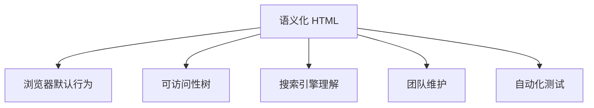

## 文档结构

语义化的核心不是“少用 `div`”，而是让标签表达内容本身的角色：这是一段导航、一个主题分区、一篇可独立阅读的文章，还是页面主体。浏览器默认样式可以被 CSS 改掉，但元素语义会影响可访问性树、搜索引擎理解、阅读模式、快捷导航和团队维护。

```html
<body>
  <header>
    <a href="/" aria-label="返回首页">前端笔记</a>
    <nav aria-label="主导航">
      <a href="/html">HTML</a>
      <a href="/css">CSS</a>
    </nav>
  </header>

  <main id="main-content">
    <article>
      <header>
        <h1>HTML 语义化</h1>
        <p>理解标签表达的内容角色。</p>
      </header>

      <section>
        <h2>文档结构</h2>
        <p>结构元素让页面轮廓更清晰。</p>
      </section>
    </article>
  </main>

  <footer>
    <small>© 2026 前端笔记</small>
  </footer>
</body>
```

`main` 表示当前页面的主体内容，通常一个页面只保留一个未隐藏的 `main`；全站导航、页脚版权、侧边栏广告这类跨页面重复内容不应该塞进 `main`。这个边界会直接影响跳过导航、阅读模式和辅助技术的地标导航，细节会在 [[1.1.7 无障碍|无障碍]] 中继续展开。

如果页面是单页应用，路由切换后也应该保证当前视图有清晰主体区域。框架负责渲染组件，但语义仍然落在最终 HTML 上。不要因为页面由 React、Vue 生成，就忽略 `main`、`nav`、标题层级这些结构。

单页应用里最容易被忽略的是“当前页面变了，但语义地标没变”。比如侧边栏、面包屑、主内容区都存在，但路由变化后标题和 `main` 里展示的实际内容没有及时更新，读屏器就会觉得页面仍然停留在旧状态。结构语义不是静态模板的专利，动态页面更需要在状态切换时维持清晰轮廓。

`section` 表示一个有主题的分区，通常应配合标题使用；如果只是为了包一层样式，优先用 `div`。`article` 表示可独立分发或复用的内容，例如文章、帖子、评论、卡片式资讯。判断 `section` 与 `article` 时可以问一句：这块内容单独拿出去是否仍然成立？成立更偏 `article`，只是当前主题下的一节更偏 `section`。

`article` 还常常出现在信息流里。比如新闻列表中的单条新闻、评论区中的单条评论、博客首页上的单篇摘要，都可以被视为独立内容单元。即便最终视觉上排成卡片，它们在语义上依然是“可以单独成立的一篇内容”。这种结构对于收藏、分享、搜索摘要和自动化测试都更友好。

| 元素 | 语义重点 | 更适合的场景 | 常见误用 |
| --- | --- | --- | --- |
| `header` | 页面或区块头部 | 站点头部、文章头部 | 只当顶部样式容器 |
| `nav` | 一组重要导航链接 | 主导航、目录、分页导航 | 把所有链接列表都包成 `nav` |
| `main` | 页面唯一主体内容 | 当前页面核心功能或正文 | 放入全站重复侧栏 |
| `section` | 有主题的内容分区 | 章节、设置分组、专题块 | 没标题的样式容器 |
| `article` | 可独立成立的内容 | 文章、评论、帖子、资讯卡片 | 普通布局块 |
| `aside` | 与主内容相关但可分离 | 相关阅读、作者信息、侧栏说明 | 主流程里的补充句子 |
| `footer` | 页面或区块尾部 | 版权、作者、辅助链接 | 所有底部视觉区域 |

当页面存在多个章节时，标题层级也要和语义块一起配合。比如一个 `article` 里可以有多个 `section`，每个 `section` 都用自己的标题表达子主题；如果只是把几个卡片平铺在一起，那它们未必都需要 `section`，有时一个 `ul` 外层就足够了。语义不是“能加标签就加标签”，而是“每个标签都在回答结构问题”。

## 标题层级

标题层级描述内容结构，不描述视觉大小。`h1` 到 `h6` 的作用是建立文档轮廓，帮助人、搜索引擎和辅助技术快速理解页面“讲了什么、分成几层”。如果只是想让文字变大，应该使用 CSS，而不是把普通文本写成标题。

```html
<main>
  <h1>课程详情</h1>

  <section>
    <h2>课程介绍</h2>
    <p>介绍课程目标、适合人群和学习路径。</p>
  </section>

  <section>
    <h2>讲师信息</h2>
    <h3>讲师经历</h3>
    <p>讲师参与过的项目和教学经验。</p>
  </section>
</main>
```

标题不要机械追求“每个 `section` 都必须从 `h2` 开始”，而要看它在当前文档中的层级。一个 `article` 内部可以有自己的标题结构，但整体仍要让读者从上到下扫一遍就能知道页面骨架。

```html
<!-- 不推荐：为了视觉效果跳级 -->
<h1>产品中心</h1>
<h4>热销产品</h4>

<!-- 推荐：结构正确，视觉交给 CSS -->
<h1>产品中心</h1>
<h2 class="heading-lg">热销产品</h2>
```

标题层级最常见的问题不是“用了几个 `h1`”，而是标题和内容关系不稳定：卡片标题看起来像标题却没有标题语义，弹窗标题没有关联到对话框，列表分组标题只是一个加粗的 `span`。这些问题在视觉上不一定明显，但会让键盘用户、读屏用户和搜索引擎失去结构线索。

标题层级也会影响内容维护。一个页面如果标题结构清楚，新增模块时很容易知道它属于哪个层级；如果标题只靠字号表达，后续改版时就容易出现同级内容层次不一致的问题。

标题还要和“可见标题”保持一致。不要为了 SEO 在页面里塞隐藏标题，也不要把视觉标题只写成图片或背景图。用户看到的结构、DOM 里的结构、搜索引擎理解的结构应该尽量一致。弹窗、抽屉、卡片这类局部区域也一样：如果它们有明确主题，就应该有稳定的标题文本，而不是只靠图标和样式表达。

## 交互语义

交互语义最重要的边界是：链接负责导航，按钮负责动作，表单控件负责输入。只要把这三类混在一起，代码短期可能能跑，长期会在键盘操作、可访问名称、默认行为、表单提交和浏览器历史记录上出问题。

```html
<!-- 导航到另一个资源，用链接 -->
<a href="/docs/html">查看 HTML 文档</a>

<!-- 在当前页面执行动作，用按钮 -->
<button type="button" id="open-dialog">打开设置</button>

<!-- 提交表单时明确 button 类型 -->
<form action="/subscribe" method="post">
  <label for="email">邮箱</label>
  <input id="email" name="email" type="email" required />
  <button type="submit">订阅</button>
</form>
```

不要用 `div` 或 `span` 模拟所有交互。原生 `button` 默认支持键盘聚焦、Enter/Space 触发、禁用状态和表单语义；`a` 默认支持打开新标签、复制链接、浏览器历史记录和状态栏地址提示。自己模拟这些行为不仅麻烦，还很容易漏掉边界。

```html
<!-- 不推荐：看起来像按钮，但缺少按钮语义和默认键盘行为 -->
<div class="button" onclick="save()">保存</div>

<!-- 推荐 -->
<button type="button" onclick="save()">保存</button>
```

如果确实必须自定义复杂组件，例如树、菜单、弹窗、标签页，要先使用正确的 HTML 结构，再谨慎补 ARIA。ARIA 是补充语义，不是替代语义；能用原生元素解决时，不要先写 `role`。

交互语义还要考虑默认行为。链接可以复制地址、在新标签打开、被搜索引擎理解；按钮可以被键盘激活、支持禁用、参与表单。自定义控件如果没有完整补齐这些行为，就会出现视觉可用但体验不完整的问题。

交互语义一旦选错，后面经常会出现连锁补丁。比如用 `a href="#"` 做弹窗按钮，就需要阻止默认跳转、处理焦点、补键盘行为，还可能污染浏览器历史；用 `div` 做按钮，则要补 `role`、`tabindex`、键盘事件和禁用状态。与其在错误元素上补一堆逻辑，不如一开始就用更接近真实意图的原生元素。

## 列表语义

列表表达的是“同类项目的集合”，不只是缩进和圆点。导航菜单、步骤流程、功能清单、搜索结果、标签集合、商品列表，都可以用列表来表示。选择 `ul`、`ol`、`dl` 时，关键看项目之间的关系。

```html
<nav aria-label="章节目录">
  <ol>
    <li><a href="#structure">文档结构</a></li>
    <li><a href="#heading">标题层级</a></li>
    <li><a href="#interaction">交互语义</a></li>
  </ol>
</nav>
```

`ol` 适合步骤、排名、时间线、目录这类顺序会影响理解的内容；`ul` 适合并列信息；`dl` 适合术语解释、属性说明、键值信息。不要因为不想要列表默认样式就放弃列表语义，样式可以通过 CSS 重置。

```html
<dl>
  <dt>语义化</dt>
  <dd>使用能表达内容角色的 HTML 元素组织页面。</dd>

  <dt>可访问名称</dt>
  <dd>辅助技术用来描述控件或区域的名称。</dd>
</dl>
```

列表里最容易错的是“视觉像列表，结构不是列表”。例如把 10 个商品卡片直接平铺成 10 个 `div`，读屏器很难告诉用户“当前是第几个，共几个”。如果写成 `ul > li`，用户能更快理解这是一组同类项目。

列表语义对组件化也有帮助。比如菜单组件、商品列表组件、搜索结果组件如果底层统一使用列表结构，样式可以自由变化，但测试和可访问性都会更稳定。

列表里也要区分“集合”和“描述”。如果一组内容只是多个彼此独立的卡片，用 `ul` 更自然；如果每一项都在回答同一个问题，例如“名称是什么、取值是什么”，`dl` 更合适；如果每一项的顺序不能打乱，例如教程步骤、内容目录、操作流程，就用 `ol`。这种判断比“看起来像不像列表”更重要。

## 表格语义

表格用于二维数据关系，不用于页面排版。只要内容需要同时沿“行”和“列”理解，例如价格表、排班表、课程成绩、规格对比，就应该优先考虑 `table`。如果只是想让两列内容对齐，应该使用 CSS Grid、Flex 或普通布局容器。

```html
<table>
  <caption>课程报名统计</caption>
  <thead>
    <tr>
      <th scope="col">课程</th>
      <th scope="col">报名人数</th>
      <th scope="col">完课率</th>
    </tr>
  </thead>
  <tbody>
    <tr>
      <th scope="row">JavaScript 基础</th>
      <td>1200</td>
      <td>82%</td>
    </tr>
  </tbody>
</table>
```

`caption` 说明表格主题，`thead`、`tbody`、`tfoot` 表达数据分区，`th` 表示表头，`scope` 说明表头作用范围。复杂合并表格还需要 `id` 和 `headers` 明确单元格关联，这部分在 [[1.1.8 表格|表格]] 里会更细。

| 场景 | 推荐结构 | 原因 |
| --- | --- | --- |
| 课程报名统计 | `table` | 行列关系是核心信息 |
| 文章卡片列表 | `ul` / `article` | 是同类内容集合，不是二维数据 |
| 双栏布局 | CSS Grid / Flex | 只是视觉排列 |
| 参数解释 | `dl` | 是术语与说明关系 |

表格不要为了“响应式麻烦”就改成纯 `div`。移动端可以先用横向滚动保留语义；只有当业务目标从“横向比较”变成“逐条阅读记录”时，才适合改成卡片化展示。

表格语义的价值在复杂数据里更明显。读屏器可以通过表头和单元格关系帮助用户理解数据位置，自动化测试也可以更稳定地定位行列。如果用一堆 `div` 模拟表格，这些关系就需要额外补回来。

如果表格数据来自接口，前端还要保持“数据关系”和“视觉展示”的一致性。比如排序、分页、固定列、展开行只是交互增强，不能让表头和单元格的关系变得不可理解。移动端把表格改成卡片时，也要确认用户是否仍然需要横向比较；如果需要，卡片化可能反而破坏信息结构。

## 机器理解

语义化的最终价值是让页面不仅“看起来像”，还“被正确理解”。浏览器、搜索引擎、阅读模式、读屏器、自动化测试和团队成员都会从语义结构里获取线索。



语义化不是 SEO 的捷径，也不是无障碍的全部，但它是两者共同的结构基础。比如正确的标题层级能帮助搜索引擎判断内容重点，也能让读屏用户按标题跳转；`main` 和 `nav` 能帮助辅助技术建立地标；`button` 和 `a` 的正确选择能让浏览器默认行为符合用户预期。

语义和无障碍的关系尤其紧密。屏幕阅读器不是在“看页面样式”，而是在读结构树；自动化测试也越来越多地通过角色、名称和层级定位元素，而不是死盯 class。换句话说，语义越清楚，页面就越容易被机器和人同时理解。

写 HTML 时可以按这个顺序判断：

1. 这段内容的真实角色是什么？
2. 是否已经有原生元素能表达这个角色？
3. 这个元素的默认行为是否符合交互预期？
4. 如果换成无样式页面，结构是否仍然清楚？
5. 如果由读屏器按标题、地标、列表、表格导航，用户是否能理解当前位置？

当答案不清楚时，先不要急着补 `class` 和样式。先把内容结构想清楚，再进入 [[1.2.4 文档流|文档流]]、[[1.2.7 Flex|Flex]]、[[1.2.8 Grid|Grid]] 这些布局问题，文档会更稳，也更不容易在后期 SEO、无障碍和测试阶段返工。

语义化也不是为了“标签漂亮”。它的实际收益是让浏览器默认行为、搜索理解、辅助技术、样式维护和测试定位都站在同一套结构上。结构越清楚，后续工程成本越低。

还可以把语义检查做成习惯动作：按 `Tab` 看焦点顺序，禁用 CSS 看结构轮廓，打开浏览器无障碍树看角色和名称，检查标题是否从页面主旨自然展开。只要这些基础动作都顺，页面通常就不会离语义太远。

## 语义层次

语义化不是只有“标签选对”这一层。它还包括文档层次、区块边界、交互边界和内容可分发性。

```text
语义层次：
1. 文档层：html、head、body
2. 区块层：main、article、section、nav、aside
3. 文本层：h1~h6、p、strong、em、code
4. 交互层：a、button、form、input
5. 媒体层：img、picture、audio、video
```

不同层次承担不同角色。比如一个页面可以同时有正确的文档层结构、正确的文章层结构和正确的交互层结构，但如果文本层被滥用成样式容器，语义仍然不完整。

语义层次之间要互相配合。比如一篇文章不仅需要 `article`，还需要正确标题、段落、图片替代文本和引用结构；一个表单不仅需要 `form`，还需要 label、错误提示和提交按钮语义。

层次一旦建立，后面的组件化、测试和文档化都会轻松很多。一个结构清晰的页面，即使换皮、重构或迁移框架，保留下来的也会是“角色”，而不是某个写死的 class 名称。

## 语义误用

常见误用往往来自“先看样式，再找标签”。比如把所有区域都写成 `div`，把标题写成 `span` 加粗，把按钮写成可点击 `div`，把列表写成一堆卡片容器。

```html
<!-- 不推荐 -->
<div class="title">课程介绍</div>
<div class="btn" onclick="buy()">立即购买</div>

<!-- 推荐 -->
<h2>课程介绍</h2>
<button type="button" onclick="buy()">立即购买</button>
```

语义误用的后果通常不会立刻炸，但会在后续逐渐暴露：读屏器不可理解、自动化测试定位困难、搜索引擎抽取不准、团队协作时标签选择混乱。

语义误用越早修越便宜。等组件库、样式和测试都依赖错误结构后，再把 `div` 改回 `button` 或把伪列表改回 `ul`，往往会牵动大量样式和脚本。

判断是否误用时，可以直接问一个朴素问题：如果把样式全部去掉，这个元素还像它本来应该是的东西吗？如果答案是“不像”，那往往就是语义该调整的时候了。

## 语义检查

判断一个页面是否足够语义化，可以做一个简单检查：

1. 去掉 CSS 之后，页面结构是否仍能看懂。
2. 按标题、列表、表格、地标导航时，轮廓是否清楚。
3. 链接、按钮、表单控件是否仍然是原生元素。
4. 每个区域是否都能说清“它的角色是什么”。

如果一个页面只能靠样式和 `div` 的嵌套才能理解，通常说明语义还不够完整。语义化的目标不是“写得像教科书”，而是让结构本身就足够表达信息。

检查语义时可以临时禁用 CSS 或用浏览器无障碍树查看页面结构。只要页面在没有样式时仍能读懂，标题、列表、表格、表单和导航仍然成立，语义基础通常就比较稳。

还可以用几个简单动作验证：只用键盘 `Tab` 一遍，看焦点是否能顺着结构合理移动；把页面缩成纯文本看，是否还能理解章节关系；用浏览器的“查看源代码”和“检查元素”对比，确认最终 DOM 是否还是预期结构。语义做得好的页面，往往一眼就能看出主次和层次。
