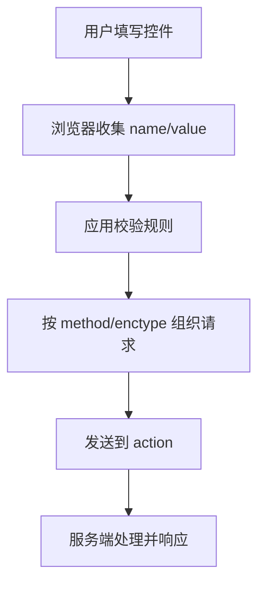

## 提交容器

表单的核心不是“页面上有输入框”，而是“把一组字段按约定提交给系统”。`form` 定义了提交边界，浏览器会在这个边界内收集带 `name` 的成功控件，按 `method` 和 `enctype` 组织请求，再发送到 `action` 指定的位置。

```html
<form action="/login" method="post">
  <label for="username">用户名</label>
  <input id="username" name="username" type="text" autocomplete="username" />

  <label for="password">密码</label>
  <input id="password" name="password" type="password" autocomplete="current-password" />

  <button type="submit">登录</button>
</form>
```

`id` 用于页面内标识和 `label` 关联，`name` 才决定提交字段名。没有 `name` 的输入框可以参与交互，但不会进入浏览器自动构造的提交数据。



文件上传表单还需要调整编码类型：

```html
<form action="/upload" method="post" enctype="multipart/form-data">
  <label for="avatar">头像</label>
  <input id="avatar" name="avatar" type="file" accept="image/png,image/jpeg" />
  <button type="submit">上传</button>
</form>
```

`accept` 只是浏览器文件选择提示，不能当成安全校验。真正的文件类型、大小、内容检查必须在服务端完成，这一点会延伸到 [[1.6.6 文件上传|文件上传]]。

`form` 的价值在于提供一套浏览器原生提交模型。即使现代项目经常用 JavaScript 接管提交，也不应该忽略 `name`、`label`、`type`、`autocomplete`、原生校验这些基础能力。它们能让键盘、自动填充、密码管理器和辅助技术更自然地工作。

浏览器提交时并不是把表单里的所有控件都提交出去，而是收集“成功控件”。简单理解：控件要在表单边界内、没有被禁用、具有 `name`，并且符合自身提交规则。比如未勾选的 `checkbox` 通常不会提交，`disabled` 控件不会提交，只有被点击的提交按钮才会作为提交来源参与数据构造。理解这一点，才能解释很多“页面上明明有值，后端却收不到”的问题。

```html
<form action="/settings" method="post">
  <input name="nickname" value="codex" />
  <input name="readonlyName" value="只读但会提交" readonly />
  <input name="disabledName" value="禁用且不会提交" disabled />
  <button name="intent" value="save" type="submit">保存</button>
  <button name="intent" value="preview" type="submit">预览</button>
</form>
```

上面两个提交按钮可以让服务端区分用户点击的是“保存”还是“预览”。如果只是前端按钮，不希望触发表单提交，就应该写成 `type="button"`。

## 控件类型

表单控件要尽量选择能表达数据类型的原生元素。正确的 `type` 能让浏览器提供更合适的键盘、校验、自动填充和移动端输入体验。

```html
<input type="text" name="nickname" />
<input type="email" name="email" autocomplete="email" />
<input type="tel" name="phone" autocomplete="tel" />
<input type="password" name="password" autocomplete="new-password" />
<input type="number" name="age" min="1" max="120" />
<input type="checkbox" name="agree" value="yes" />
<input type="radio" name="plan" value="basic" />
<select name="city">
  <option value="">请选择城市</option>
  <option value="shanghai">上海</option>
</select>
<textarea name="intro" rows="4"></textarea>
```

| 控件 | 适合输入 | 关键点 |
| --- | --- | --- |
| `text` | 普通短文本 | 搭配 `maxlength`、`autocomplete` |
| `email` | 邮箱 | 浏览器可做基础格式校验 |
| `tel` | 电话 | 移动端键盘更合适，不等于强校验 |
| `password` | 密码 | 搭配正确的 `autocomplete` |
| `checkbox` | 多选或开关 | 未勾选时通常不提交 |
| `radio` | 单选 | 同组使用相同 `name` |
| `select` | 固定选项 | 选项很多时要考虑搜索组件 |
| `textarea` | 多行文本 | 适合备注、简介、评论 |

#### label 绑定

`label` 是表单可用性的基础。它让字段有可访问名称，也扩大了点击区域。

```html
<label for="email">邮箱</label>
<input id="email" name="email" type="email" />
```

也可以包裹控件：

```html
<label>
  <input type="checkbox" name="agree" value="yes" />
  我已阅读并同意协议
</label>
```

复杂表单不要只依赖 `placeholder` 充当标签。用户开始输入后，`placeholder` 会消失；读屏器和自动填充也更依赖稳定的标签语义。

控件类型还会影响移动端键盘。邮箱、电话、数字、网址等字段如果选对 `type` 和 `inputmode`，用户输入成本会明显降低。不要把所有输入都写成 `type="text"` 再靠脚本校验。

`number` 也不是所有数字输入的默认答案。手机号、银行卡号、验证码虽然看起来是数字，但它们通常不是用于数学计算的数值，不需要上下箭头、步进和数值格式化，更适合使用 `type="text"` 搭配 `inputmode="numeric"`、`maxlength` 和业务校验。金额、数量、评分这类确实需要数值范围和步进的字段，才更适合 `number`。

```html
<input name="code" type="text" inputmode="numeric" maxlength="6" autocomplete="one-time-code" />
<input name="quantity" type="number" min="1" max="99" step="1" />
```

## 校验规则

HTML 原生校验适合拦住明显错误，改善交互体验，但不能替代服务端校验。前端校验是“尽早反馈”，服务端校验才是“最终可信”。

```html
<label for="username">用户名</label>
<input
  id="username"
  name="username"
  type="text"
  required
  minlength="3"
  maxlength="12"
  pattern="[a-zA-Z0-9_]+"
/>
```

| 属性 | 作用 | 适合场景 |
| --- | --- | --- |
| `required` | 必填 | 登录名、邮箱、协议确认 |
| `minlength` / `maxlength` | 文本长度 | 用户名、备注、标题 |
| `min` / `max` | 数值或日期范围 | 年龄、数量、时间 |
| `pattern` | 正则约束 | 简单格式限制 |
| `step` | 数值步进 | 金额、评分、数量 |

#### 错误提示

原生校验提示由浏览器控制，适合简单表单。业务表单通常还需要自定义错误区域，并把错误信息和字段关联起来：

```html
<label for="email">邮箱</label>
<input
  id="email"
  name="email"
  type="email"
  required
  aria-describedby="email-error"
/>
<p id="email-error">请输入可接收通知的邮箱地址。</p>
```

如果使用 JavaScript 自定义校验，不要只改变边框颜色。错误文本、焦点位置、提交按钮状态、服务端错误回显都要一起考虑。

校验规则要分层：HTML 原生校验负责基础格式，前端业务校验负责即时反馈，服务端校验负责最终可信。三层缺一不可。前端校验通过，只能说明“当前页面判断可提交”，不能说明数据一定安全可靠。

JavaScript 可以通过 Constraint Validation API 读取和触发表单校验。`checkValidity()` 只返回是否通过，`reportValidity()` 会让浏览器展示错误提示，`setCustomValidity()` 可以设置自定义错误。自定义错误一旦设置为非空字符串，控件就会一直处于无效状态，所以校验通过时必须清空。

```javascript
const form = document.querySelector("form");
const password = document.querySelector("#password");
const confirmPassword = document.querySelector("#confirm-password");

form.addEventListener("submit", (event) => {
  if (password.value !== confirmPassword.value) {
    confirmPassword.setCustomValidity("两次输入的密码不一致");
  } else {
    confirmPassword.setCustomValidity("");
  }

  if (!form.reportValidity()) {
    event.preventDefault();
  }
});
```

原生校验适合做“显而易见的第一道门”，比如必填、邮箱格式、长度范围。复杂业务规则不要硬塞进 `pattern`，过长正则既难维护，也很难给用户解释错误原因。

## 提交方式

`GET` 和 `POST` 不只是写法不同，而是表达不同意图。`GET` 适合查询，结果可以被复制、刷新、收藏；`POST` 适合产生副作用的提交，例如创建订单、登录、发布评论。

```html
<form action="/search" method="get">
  <label for="keyword">关键词</label>
  <input id="keyword" name="keyword" type="search" />
  <button type="submit">搜索</button>
</form>
```

```html
<form action="/orders" method="post">
  <input type="hidden" name="productId" value="p_1001" />
  <button type="submit">提交订单</button>
</form>
```

| 方法 | 数据位置 | 典型场景 | 注意点 |
| --- | --- | --- | --- |
| `GET` | URL 查询参数 | 搜索、筛选、分页 | 不放敏感信息 |
| `POST` | 请求体 | 登录、注册、提交订单 | 需要服务端校验和 CSRF 防护 |

表单提交天然会触发请求，可能引起页面导航、缓存和安全策略变化。涉及登录态、Cookie、跨站请求时，要和 [[1.4.5 存储|存储]]、[[1.6.2 CSRF|CSRF]] 一起理解。

提交方式还会影响用户是否能复制和分享当前状态。搜索、筛选、分页更适合 `GET`，因为参数进入 URL 后可以回退、收藏和分享；创建、修改、删除这类有副作用操作则更适合 `POST` 或由脚本发起受控请求。

用 JavaScript 接管提交时，也可以继续复用原生表单模型。`FormData` 会按浏览器规则收集字段，比手动从每个输入框拼对象更不容易漏掉复选框、文件、同名字段和提交按钮意图。

```javascript
const form = document.querySelector("#profile-form");

form.addEventListener("submit", async (event) => {
  event.preventDefault();

  const data = new FormData(form);
  const response = await fetch(form.action, {
    method: form.method,
    body: data,
  });

  if (!response.ok) {
    form.querySelector("[role='alert']").textContent = "保存失败，请稍后重试。";
  }
});
```

提交成功后还要考虑刷新和重复提交。传统页面常用 POST 后重定向到结果页或详情页，避免用户刷新时重复提交；前端应用则通常通过禁用按钮、请求去重、幂等接口和成功状态提示来处理同类问题。

## 交互细节

表单体验往往输在细节：无法自动填充、点击标签无反应、错误提示不清楚、按钮类型误触发、移动端键盘不合适。

#### 自动完成

`autocomplete` 是给浏览器的提示，告诉它字段期望什么类型的数据。登录表单、地址表单、支付表单都应该认真设置。

```html
<input name="name" autocomplete="name" />
<input name="email" type="email" autocomplete="email" />
<input name="address" autocomplete="shipping street-address" />
<input name="password" type="password" autocomplete="current-password" />
```

不要把所有字段都设成 `autocomplete="off"`。这会降低可用性，也可能影响密码管理器。只有一次性验证码、临时搜索词等确实不希望保存的字段，才考虑关闭或使用更明确的 token。

#### 按钮语义

`button` 在表单中默认可能触发提交，所以表单内按钮要显式写 `type`。

```html
<button type="submit">保存</button>
<button type="reset">重置</button>
<button type="button">发送验证码</button>
```

#### 分组与说明

同一组字段可以用 `fieldset` 和 `legend` 组织，让结构更清晰。

```html
<fieldset>
  <legend>通知方式</legend>
  <label><input type="checkbox" name="notice" value="email" /> 邮件</label>
  <label><input type="checkbox" name="notice" value="sms" /> 短信</label>
</fieldset>
```

表单越复杂，越应该保持“标签明确、分组清楚、错误可读、提交可预期”。如果后续由 React 或 Vue 接管状态，也不要丢掉这些原生语义，因为框架只是组织交互，不能替代 HTML 本身的表单能力。

表单交互还要考虑失败恢复。网络失败、服务端校验失败、登录过期、重复提交、文件过大，都应该有清晰提示和重试路径。用户已经输入的内容不要因为一次失败就丢失。

错误提示最好靠近字段，同时在表单顶部提供汇总。字段旁错误便于修改，顶部汇总便于用户快速知道哪里有问题。复杂表单提交失败后，可以把焦点移动到第一个错误字段或错误汇总区域，让键盘用户不需要重新寻找问题位置。

## 表单结构

一个完整表单通常至少包含四个层次：字段、标签、说明和提交动作。字段负责采集数据，标签负责标识，说明负责补充约束，提交动作负责把数据交给下一步。

```html
<form action="/profile" method="post">
  <fieldset>
    <legend>基本信息</legend>

    <label for="nickname">昵称</label>
    <input id="nickname" name="nickname" type="text" maxlength="20" />

    <p id="nickname-hint">昵称最多 20 个字符。</p>
  </fieldset>

  <button type="submit">保存</button>
</form>
```

`fieldset` 和 `legend` 很适合把相关字段分组，尤其是地址、联系信息、通知方式、支付信息这类表单。分组之后，用户和读屏器都更容易理解当前填写的上下文。

## 输入体验

输入体验不仅是“能输入”，还包括键盘类型、自动填充、占位提示和错误恢复。

```html
<input type="email" name="email" autocomplete="email" inputmode="email" />
<input type="tel" name="phone" autocomplete="tel" inputmode="tel" />
<input type="url" name="homepage" autocomplete="url" />
```

`inputmode` 可以进一步提示移动端键盘布局。它不会替代 `type`，但能在部分场景改善输入效率。比如手机号、数字验证码、邮箱、网址等字段，合理设置后会明显减少用户切换键盘的次数。

输入体验还包括自动大小写、自动纠错和密码管理器。比如验证码可以设置合适的 `inputmode` 和 `autocomplete="one-time-code"`，登录表单应使用 `username`、`current-password`，注册表单新密码则应使用 `new-password`。

`placeholder` 只适合作为输入提示，不适合替代标签。它会在输入后消失，颜色通常较浅，也不一定被辅助技术稳定读取。字段名称、输入示例、约束说明应该分工清楚：`label` 告诉用户填什么，`placeholder` 给一个短示例，说明文本解释格式或限制。

## 提交控制

提交不只是点击按钮，还可能来自回车、脚本调用和浏览器默认行为。表单设计要预先想清楚哪些动作应该提交，哪些只是局部操作。

```html
<form id="search-form" action="/search" method="get">
  <input name="keyword" type="search" />
  <button type="submit">搜索</button>
  <button type="button">清空</button>
</form>
```

如果表单里有多个按钮，一定要明确 `type`。很多“为什么点了取消却提交了”的问题，根源都在这里。

JavaScript 接管提交时，也要保留提交状态。提交中禁用按钮、展示 loading、防止重复点击、失败后恢复按钮，都是表单可靠性的组成部分。

提交控制还要处理取消和超时。用户连续编辑字段时，旧请求不应该覆盖新输入；页面离开或弹窗关闭时，未完成请求也应该被取消或忽略。对于搜索建议、用户名唯一性校验这类高频请求，通常要结合防抖、取消请求和“只接受最后一次结果”的策略。

## 增强校验

原生校验适合阻挡明显错误，但复杂业务通常还要在 `submit` 前后补充更细的规则。比如密码强度、重复输入一致性、异步唯一性校验，都超出了 HTML 原生能力。

```html
<input
  id="password"
  name="password"
  type="password"
  required
  minlength="8"
  aria-describedby="password-hint"
/>
<p id="password-hint">至少 8 位，包含字母和数字。</p>
```

如果要做异步校验，比如用户名是否已存在，前端应该给出“正在检查”的状态，后端则仍然要再次校验。前端提示是体验，后端校验是边界。

异步校验还要处理竞态。用户快速修改输入时，旧请求可能比新请求更晚返回，不能让旧结果覆盖新状态。常见做法是记录请求序号、取消旧请求或只接受最后一次输入对应的结果。

```javascript
let currentRequest = 0;

async function validateUsername(username) {
  const requestId = ++currentRequest;
  const response = await fetch(`/api/users/check?username=${encodeURIComponent(username)}`);
  const result = await response.json();

  if (requestId !== currentRequest) {
    return;
  }

  usernameInput.setCustomValidity(result.available ? "" : "用户名已被占用");
}
```

异步校验的结果只能作为提交前提示，不能作为服务端放行依据。因为用户可能绕过前端、网络结果可能过期、多个客户端可能同时提交同一个值。真正的唯一性、权限和数据完整性必须由服务端最终确认。
