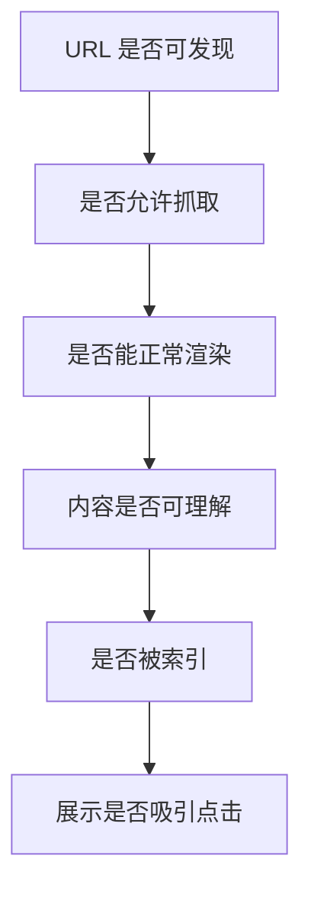

## 抓取基础

SEO 的基础不是“讨好算法”，而是让搜索引擎和用户都能顺利完成三件事：发现页面、理解页面、判断页面是否值得展示。前端能直接影响的是 HTML 是否可抓取、内容是否清楚、链接是否可跟随、资源是否能正常加载，以及核心内容是否在搜索引擎可处理的渲染路径里。

```text
发现 URL
  -> 抓取 HTML
  -> 解析链接、文本、媒体和元信息
  -> 渲染必要资源
  -> 建立索引
  -> 排名展示
```

搜索引擎通常通过链接发现新页面，也可以通过站点地图发现重要 URL。前端页面如果把核心入口藏在点击后才出现的脚本逻辑里，或者用不可访问的按钮伪装链接，就会降低发现效率。导航、列表页、详情页之间应形成清楚的链接网络，这和 [[1.1.3 语义化|语义化]] 中的结构表达是一回事：人能顺着页面理解内容，机器也更容易理解。

```html
<nav aria-label="课程导航">
  <a href="/courses/html">HTML</a>
  <a href="/courses/css">CSS</a>
  <a href="/courses/javascript">JavaScript</a>
</nav>
```

不要把普通跳转写成只有点击事件的元素：

```html
<!-- 不推荐：搜索引擎和辅助技术都难以把它识别成链接 -->
<span onclick="location.href='/courses/html'">HTML</span>
```

SEO 的前端底线可以分成四层：

| 层级 | 前端关注点 | 典型问题 |
|---|---|---|
| 可发现 | URL、链接、站点地图 | 页面只能通过搜索框或 JS 点击到达 |
| 可抓取 | HTTP 状态、robots、资源访问 | CSS/JS 被拦截，页面无法正常渲染 |
| 可理解 | 标题、正文、语义结构、媒体说明 | 标题混乱、图片无 `alt`、内容重复 |
| 可体验 | 加载速度、移动端适配、稳定布局 | LCP 慢、移动端横向滚动、布局抖动 |

SEO 优化要先保证页面真实有价值，再处理技术表达。单纯重复关键词、隐藏文字、堆链接，短期也许看起来“更像 SEO”，长期反而会损害用户体验和搜索质量。

## title

`title` 是搜索结果标题、浏览器标签页、收藏夹名称的重要来源之一。它应该准确描述当前页面，而不是只写站点名或所有页面共用同一个模板。

```html
<title>前端性能优化指南 - 示例站点</title>
```

一个好的 `title` 通常包含页面核心主题，必要时带上站点名、品牌名或关键限定词。

```html
<!-- 课程详情页 -->
<title>HTML 表单：控件、校验与提交方式 - 前端笔记</title>

<!-- 商品详情页 -->
<title>MacBook Pro 14 英寸 M4 选购指南 - 示例商城</title>

<!-- 分类页 -->
<title>前端工程化文章合集 - 示例博客</title>
```

标题不宜写成关键词列表，也不宜把不相关词硬塞进去。搜索结果标题最终可能被搜索引擎根据页面内容重写，所以 `title`、页面 `h1`、正文主题最好保持一致但不要机械重复。

| 写法 | 问题 | 更合适的方向 |
|---|---|---|
| 首页 - 首页 | 信息量太低 | 写清站点定位 |
| HTML,CSS,JS,React,Vue | 关键词堆砌 | 聚焦当前页面主题 |
| 全站所有页面同标题 | 无法区分页面 | 每个重要页面独立生成 |
| 超长营销句 | 搜索展示容易截断 | 核心词前置，表达简洁 |

## meta description

`meta description` 是搜索摘要的候选来源，它不直接等于排名按钮，但会影响用户是否愿意点击。它应该用一两句话说明页面能解决什么问题，而不是重复标题或堆关键词。

```html
<meta
  name="description"
  content="系统学习前端性能指标、加载优化、渲染性能和包体积治理。"
/>
```

搜索引擎可能根据用户查询改用正文片段作为摘要，因此 `description` 要服务于“页面概括”，不能假装控制搜索结果文案。对于内容页、商品页、课程页、文档页，每个重要页面应有独立描述；对于分页、筛选页、内部管理页，则要判断是否需要索引。

```html
<!-- 文档页：说明学习范围 -->
<meta
  name="description"
  content="介绍 HTML 表单的 form、input、label、原生校验、文件上传和提交方式，并给出常见业务写法。"
/>

<!-- 商品页：说明核心卖点 -->
<meta
  name="description"
  content="了解 MacBook Pro 14 英寸的芯片、内存、屏幕、接口和适合人群，帮助你选择合适配置。"
/>
```

如果页面没有明确正文，只靠 `description` 写得漂亮，搜索引擎依然很难判断页面质量。摘要是入口，正文才是主体。

## 标题结构

标题结构是页面内容大纲。一个页面通常有一个核心 `h1`，然后用 `h2`、`h3` 组织主要部分。标题不要只为了字号而选择，字号应该交给 CSS。

```html
<h1>前端性能优化</h1>
<h2>加载优化</h2>
<h2>渲染性能</h2>
```

更完整的文章结构可以这样写：

```html
<article>
  <h1>HTML 表单</h1>

  <section>
    <h2>控件类型</h2>
    <p>文本、数字、邮箱、日期、文件等控件承担不同输入语义。</p>
  </section>

  <section>
    <h2>校验规则</h2>
    <h3>必填校验</h3>
    <h3>格式校验</h3>
  </section>
</article>
```

标题层级不要求绝对不能跳级，但跳级会让大纲更难读。对于文档、博客、营销页，标题应该能让用户只扫目录就知道页面讲什么。对于搜索引擎来说，标题也是理解主题边界的重要信号。

标题写作时可以按这个顺序判断：当前页面讲什么，当前段落解决什么问题，这个标题是否能独立概括段落内容。不要把标题写成“第一部分”“重点内容”“其他说明”这类弱语义表达。

## 语义链接

链接不仅帮助用户跳转，也帮助搜索引擎发现页面和理解页面之间的关系。链接文本要能描述目标页面，尤其是站内导航、文章目录、相关推荐、面包屑和详情页入口。

```html
<a href="/performance">查看性能优化专题</a>
```

不推荐：

```html
<a href="/performance">点击这里</a>
```

语义链接对搜索引擎和读屏器都有帮助，这和 [[1.1.7 无障碍|无障碍]] 的目标一致：用户在不知道视觉上下文时，也能通过链接文本判断目标。

站内链接常见有三种价值：

| 链接类型 | 作用 | 示例 |
|---|---|---|
| 导航链接 | 建立站点主路径 | 首页、课程、文章、关于 |
| 上下文链接 | 补充当前内容依赖 | 在表单文章中链接到文件上传 |
| 相关推荐 | 形成主题聚合 | HTML 表单、无障碍、前端安全 |

对用户生成内容中的外链，要考虑 `rel` 策略；对付费广告或无法背书的外链，也要避免把站点信誉无条件传递出去。

```html
<a href="https://example.com" rel="nofollow ugc">
  用户发布的外部链接
</a>
```

外链安全还涉及 `target="_blank"` 的窗口关系，具体可在 [[1.1.2 常用标签|常用标签]] 中的链接部分继续展开。

## canonical

如果多个 URL 展示相同或高度相似内容，可以用 canonical 指定首选 URL。

```html
<link rel="canonical" href="https://example.com/articles/performance" />
```

它适合解决“同一内容被多个 URL 访问”的问题，例如带追踪参数、排序参数、打印版页面、移动版页面、分页聚合页等。

```html
<!-- 当前 URL: https://example.com/articles/performance?utm_source=newsletter -->
<link rel="canonical" href="https://example.com/articles/performance" />
```

canonical 是提示，不是强制命令。更强的处理方式是服务端重定向；如果页面确实不应该存在，可以返回合适的 HTTP 状态；如果页面不应出现在搜索结果里，应考虑 `noindex`。不要把完全不同内容的页面 canonical 到同一个 URL，这会让搜索引擎难以判断页面关系。

| 场景 | 更合适的处理 |
|---|---|
| 追踪参数导致重复 URL | canonical 到干净 URL |
| 旧文章迁移到新地址 | 301/308 重定向 |
| 搜索结果页不希望索引 | `noindex` |
| 多语言页面 | `hreflang` + 各自 canonical |
| 商品筛选组合很多 | 结合 canonical、robots、站点结构判断 |

## robots

`robots` meta 可以控制当前页面是否索引、是否跟随链接。它写在 HTML 的 `head` 中，作用对象是“已经能被抓取到的页面”。

```html
<meta name="robots" content="index, follow" />
```

不希望被索引的页面：

```html
<meta name="robots" content="noindex, nofollow" />
```

后台、测试页、搜索结果页、隐私页面、登录后私有页要谨慎设置索引策略。注意 `robots.txt` 和 `robots` meta 不是同一个东西：`robots.txt` 主要控制抓取路径，`robots` meta 控制当前页面索引行为。如果页面被 `robots.txt` 禁止抓取，搜索引擎可能看不到页面里的 `noindex`。

```txt
robots.txt 示例：阻止抓取后台路径
User-agent: *
Disallow: /admin/
```

常见指令可以这样判断：

| 指令 | 含义 | 使用场景 |
|---|---|---|
| `index` | 允许索引 | 默认公开页面 |
| `noindex` | 不出现在搜索结果 | 搜索页、测试页、隐私页 |
| `follow` | 可以跟随页面链接 | 默认公开页面 |
| `nofollow` | 不跟随页面链接 | 低信任链接聚合页 |
| `max-snippet` | 控制摘要长度 | 需要限制摘要展示 |

前端不能只靠 `noindex` 保护敏感数据。真正的权限和隐私必须在服务端控制，SEO 指令只是搜索展示策略，不是安全边界。

`robots` 还经常和站点分层策略一起使用。比如公开文档页希望索引，搜索结果页、个人中心、调试页、预览页可能不希望索引，分页聚合页则要根据重复内容和权重分配决定是否收录。不要把“能不能被索引”混成一个简单的 yes/no 问题，它其实和内容价值、重复度、权限和入口路径有关。

## 结构化数据

结构化数据用机器可读的方式描述页面实体，例如文章、商品、面包屑、组织、视频、课程等。它能帮助搜索引擎理解页面内容，某些类型还可能影响搜索结果展示样式。

```html
<script type="application/ld+json">
{
  "@context": "https://schema.org",
  "@type": "Article",
  "headline": "前端性能优化指南",
  "author": {
    "@type": "Person",
    "name": "示例作者"
  },
  "datePublished": "2026-07-29"
}
</script>
```

结构化数据不能伪造页面不存在的内容。比如页面没有 FAQ，就不应写 FAQ 结构化数据；商品没有真实评分，就不应伪造评分。结构化数据应和可见内容一致，否则会变成搜索质量风险。

面包屑是前端很常见的结构化数据场景：

```html
<script type="application/ld+json">
{
  "@context": "https://schema.org",
  "@type": "BreadcrumbList",
  "itemListElement": [
    {
      "@type": "ListItem",
      "position": 1,
      "name": "首页",
      "item": "https://example.com/"
    },
    {
      "@type": "ListItem",
      "position": 2,
      "name": "前端",
      "item": "https://example.com/frontend"
    }
  ]
}
</script>
```

结构化数据写完后要用搜索引擎提供的测试工具检查语法和类型支持。前端工程里也可以把 JSON-LD 作为页面组件的一部分生成，但要避免客户端渲染过晚导致抓取不稳定。

结构化数据最适合服务“页面实体明确”的内容页，例如文章、商品、课程、活动、组织、FAQ、面包屑。它不是 SEO 魔法，也不能替代高质量正文；它的作用是让搜索引擎更快知道页面是什么、主要字段是什么、哪些信息可以展示给用户。

## 渲染可见性

搜索引擎越来越能处理 JavaScript，但重要页面的核心内容仍应尽量在初始 HTML 或稳定的服务端渲染路径中可见。CSR 页面不是一定不能做 SEO，而是要确认搜索引擎抓取时能拿到内容、链接和元信息。

| 页面 | 更适合 |
|---|---|
| 文档、博客、营销页 | SSR/SSG |
| 登录后后台 | CSR 可接受 |
| 商品详情 | SSR/SSG/ISR |
| 用户私有页 | noindex |

如果页面初始 HTML 只有一个空容器，正文、标题和链接都依赖接口返回后再渲染，搜索引擎需要额外执行脚本才能理解页面。

```html
<!-- SEO 风险较高：初始 HTML 信息很少 -->
<body>
  <div id="root"></div>
  <script src="/assets/app.js"></script>
</body>
```

更稳的内容页会在首屏 HTML 中包含主要语义结构：

```html
<body>
  <main>
    <article>
      <h1>前端性能优化指南</h1>
      <p>本文介绍性能指标、加载优化、渲染优化和验证方法。</p>
    </article>
  </main>
</body>
```

对于 React、Vue、Next 等框架，SEO 要和渲染模式一起判断：营销页、文档页、商品页通常更适合 SSR/SSG；登录后后台、复杂交互工具、用户私有页可以接受 CSR。这里的本质不是“哪种框架更 SEO”，而是核心内容何时、以什么形式出现在可抓取页面里。

如果同一套代码既要服务公开页又要服务后台页，最好把“可索引”和“不可索引”的页面类型分开。公开页要认真处理 title、description、canonical、结构化数据和正文可见性；后台页则更重视权限、交互和性能，通常不应该把搜索引擎优化当成第一目标。

页面加载性能也会影响 SEO 体验。图片尺寸、懒加载、关键 CSS、字体加载、脚本拆分等内容会在 [[6.2.1 图片优化|图片优化]] 和页面性能章节继续展开；在 HTML 层面至少要保证资源声明正确、核心内容不被无意义脚本阻塞。

## 链路诊断

SEO 问题不要一上来就改标题和关键词，应该先确认页面处在搜索链路的哪一环出了问题。



如果页面没有被发现，应该检查站内链接、站点地图和入口结构；如果能发现但不能抓取，要检查 robots、HTTP 状态和资源访问；如果能抓取但不索引，要检查内容质量、重复页面、canonical 和 noindex；如果能索引但点击低，再看标题和摘要是否准确。

## HTTP 信号

搜索引擎理解页面时不只看 HTML，还会看 HTTP 状态码、重定向、缓存和响应头。

| 信号 | 含义 | 常见问题 |
| --- | --- | --- |
| `200` | 页面正常可访问 | 空页面也返回 200 |
| `301` / `308` | 永久迁移 | 链式重定向过多 |
| `302` / `307` | 临时跳转 | 误把永久迁移写成临时 |
| `404` | 页面不存在 | 软 404 返回 200 |
| `5xx` | 服务端错误 | 抓取不稳定 |

前端路由项目尤其要注意“软 404”：页面显示“内容不存在”，但服务端仍返回 `200`。用户能看懂，搜索引擎却可能认为这是一个正常页面。内容不存在时，服务端或框架层应返回正确状态。

如果页面是前后端分离应用，SEO 判断不要只盯着前端源码，而要沿“抓取结果”去看。一个页面在浏览器里能正常显示，不代表搜索引擎看到的就是同样的内容。特别是登录态、懒加载、接口失败、首屏空壳、骨架屏长时间不消失这些情况，都可能让页面实际可见内容和搜索引擎可理解内容不一致。

## 站点结构

站点结构要让重要页面离入口更近。首页、分类页、专题页、列表页、详情页之间应该形成清晰路径，而不是所有详情页都只能靠搜索框或接口结果出现。

```html
<nav aria-label="面包屑">
  <ol>
    <li><a href="/">首页</a></li>
    <li><a href="/frontend">前端</a></li>
    <li><a href="/frontend/html">HTML</a></li>
  </ol>
</nav>
```

面包屑既帮助用户理解当前位置，也帮助机器理解页面层级。它和结构化数据可以配合，但不能只写 JSON-LD 而没有可见导航。可见结构和机器结构应该一致。

## 内容重复

重复内容常见于分页、筛选、排序、追踪参数、多语言、多端页面。不是所有重复都要删除，但要告诉搜索引擎哪一个 URL 更值得作为主版本。

```text
重复来源：
1. ?utm_source=xxx
2. ?sort=price
3. /m/product/1 与 /product/1
4. 打印页与正文页
5. 多语言页面互相缺少标注
```

重复内容处理通常不是单一标签能解决。参数页可以 canonical 到主页面，旧地址可以重定向，多语言页面应配合语言标注，不适合索引的内部搜索页可以 noindex。

## 前端框架

使用 React、Vue、Next 等框架时，SEO 的关键不是框架名，而是核心内容和元信息在抓取时是否稳定可见。

```text
内容页更关注：
1. 初始 HTML 是否包含主要标题和正文
2. meta 是否能按页面生成
3. 链接是否是真实 href
4. 图片是否有 alt 和尺寸
5. 状态码是否正确
```

SPA 后台管理系统通常不需要公开索引，但文档页、博客页、商品页、课程页就要严肃考虑 SSR、SSG 或预渲染。SEO 不是后期补几个 meta 就能完成的，它从路由、渲染、内容模型和发布策略就已经开始了。
