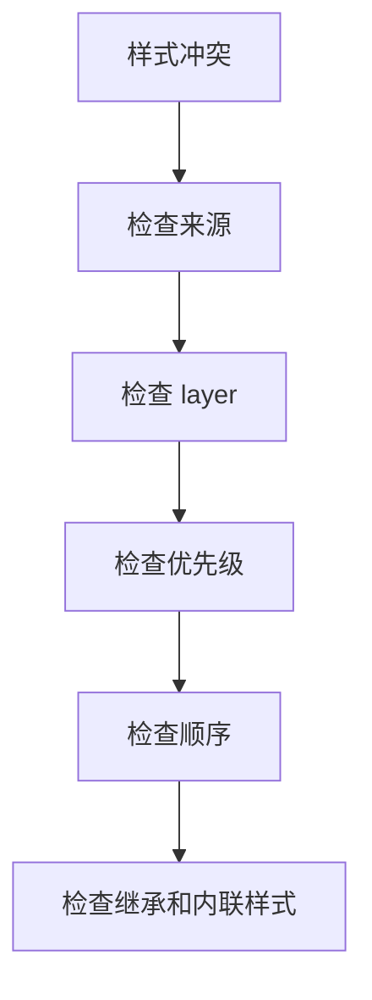

## 层叠来源

CSS 层叠决定当多个规则作用到同一个元素同一个属性时，哪条声明最终生效。它比“优先级”更完整，因为最终结果还受来源、重要性、层、顺序和继承影响。

```css
p {
  color: black;
}

.intro {
  color: blue;
}
```

如果一个段落同时匹配 `p` 和 `.intro`，最终颜色取决于层叠规则，而不是单纯看哪条看起来更接近。

```text
浏览器默认样式
  -> 用户样式
  -> 作者样式
  -> 动画/过渡
  -> important 声明
  -> layer、优先级、顺序
```

日常开发主要写的是作者样式，但浏览器默认样式、组件库样式、全局 reset、主题样式、工具类都会参与层叠。层叠不是 CSS 的缺陷，而是它能让多来源样式协同工作的机制。

在真实项目里，层叠通常不是两条规则之间的简单胜负，而是一整套样式体系的协作：浏览器默认样式提供可用基线，reset 抹平差异，base 定义文字和基础元素，components 定义组件外观，theme 调整设计变量，utilities 做最后的局部辅助。只要这些层级混在一起，样式冲突就会变成“谁写得更强谁赢”的消耗战。

## 优先级

选择器优先级通常按 ID、类/属性/伪类、元素/伪元素计算。具体计算细节已经在 [[1.2.2 优先级|优先级]] 里展开；在层叠里更重要的是理解它只在同一层叠阶段内比较。

```css
#app .intro {
  color: red;
}

.intro {
  color: blue;
}
```

ID 选择器优先级高于类选择器。项目中应尽量避免靠堆高优先级解决样式冲突，否则后续覆盖会越来越困难。

```css
/* 不推荐：权重越来越高 */
.page .content #app .intro {
  color: red;
}
```

如果你需要不断加深选择器，通常说明样式归属错了：基础样式可能写得太强，组件样式可能泄漏到页面，或者第三方样式没有通过正确的覆盖入口处理。

排查时不要只问“怎么覆盖它”，还要问“它为什么会覆盖到这里”。如果某个全局选择器影响了组件，问题可能在基础层范围太大；如果组件内部样式影响了外部页面，问题可能在命名或作用域；如果主题样式必须反复写强选择器，问题可能是组件没有暴露合适的变量或变体入口。

## 来源顺序

优先级相同时，后出现的规则覆盖先出现的规则。

```css
.button {
  color: blue;
}

.button {
  color: red;
}
```

最终是红色。组件样式、全局样式、第三方样式的加载顺序会直接影响结果。

在工程里，来源顺序常常来自 import 顺序：

```css
@import './reset.css';
@import './base.css';
@import './components.css';
@import './utilities.css';
```

如果工具类需要覆盖组件样式，它就应该在组件样式之后进入层叠；如果 reset 写在组件后面，就可能把组件基础样式冲掉。与其靠“碰巧后加载”，更好的方式是给样式建立清晰层级。

构建工具会让来源顺序更隐蔽。CSS 被拆包、合并、按路由异步加载后，开发时的 import 顺序未必就是最终覆盖顺序。因此工程里更推荐把“覆盖关系”显式化，例如使用 cascade layers、CSS 变量、组件变体，而不是让样式结果依赖打包产物的偶然顺序。

## important

`!important` 会提高声明重要性。它适合少量工具类、覆盖第三方不可控样式、用户样式等特殊场景，不应该作为普通组件样式的常规手段。

```css
.hidden {
  display: none !important;
}
```

工具类里 `!important` 可以接受，因为它的语义就是强制执行。但如果业务组件大量使用 `!important`，后续覆盖只能继续加 `!important`，样式会失去层次。

```css
/* 不推荐 */
.card-title {
  color: red !important;
}
```

遇到样式不生效，先查层叠来源、layer、优先级和顺序，再决定是否需要 `!important`。它应该是最后手段，不是调试快捷键。

## 继承

部分 CSS 属性会继承，例如 `color`、`font-family`、`line-height`；部分不会继承，例如 `margin`、`padding`、`border`、`width`。

```css
body {
  color: #1f2937;
  font-family: sans-serif;
  line-height: 1.6;
}
```

文本相关属性适合放在上层继承。布局盒模型属性通常应在具体元素上设置。

```html
<article class="article">
  <h1>CSS 层叠</h1>
  <p>这一段会继承 article 或 body 上的文字样式。</p>
</article>
```

继承可以减少重复，但也会带来“为什么子元素变色了”的疑惑。表单控件、按钮、链接等元素有浏览器默认样式，未必完全继承父级字体或颜色，通常需要基础层统一处理。

```css
:where(button, input, textarea, select) {
  font: inherit;
}
```

## cascade layers

CSS Cascade Layers 可以显式定义层叠层级，适合大型项目管理 reset、基础样式、组件样式、工具类之间的覆盖关系。

```css
@layer reset, base, components, utilities;

@layer base {
  body {
    font-family: sans-serif;
  }
}

@layer utilities {
  .text-red {
    color: red;
  }
}
```

后声明的 layer 优先级更高。上面的顺序表示 `utilities` 可以覆盖 `components`，`components` 可以覆盖 `base`，`base` 可以覆盖 `reset`。

更完整的组织方式可以这样：

```css
@layer reset, tokens, base, components, overrides, utilities;

@layer tokens {
  :root {
    --color-primary: #1677ff;
  }
}

@layer components {
  .button {
    color: white;
    background: var(--color-primary);
  }
}

@layer utilities {
  .bg-transparent {
    background: transparent;
  }
}
```

layer 的价值是把“谁应该覆盖谁”写成结构，而不是散落在 import 顺序和选择器权重里。它不能替代良好命名，但能显著降低大型样式系统的冲突成本。

使用 layer 时要注意：未分层样式通常会参与普通层叠，可能比已分层样式更难预期。大型项目最好约定所有主要样式都进入明确 layer，第三方库也尽量包进指定层，避免一部分样式走层级体系，另一部分样式游离在体系外。

```css
@import url("./vendor.css") layer(vendor);

@layer reset, vendor, base, components, utilities;
```

这样第三方样式会被放进 `vendor` 层，业务组件和工具类覆盖它时就不必靠堆高选择器权重。

## 样式隔离

现代前端项目常用 CSS Modules、Scoped CSS、CSS-in-JS、Shadow DOM、BEM、原子化 CSS 等方式减少全局层叠冲突。

| 方案 | 特点 | 仍需注意 |
|---|---|---|
| CSS Modules | 类名局部化 | 全局样式和组合类仍会层叠 |
| Vue scoped | 组件作用域选择器 | 深度选择器会突破边界 |
| CSS-in-JS | 样式与组件绑定 | 注入顺序和运行时成本 |
| Shadow DOM | 浏览器级封装 | 主题穿透和样式暴露 |
| BEM | 命名约束 | 依赖团队纪律 |
| 原子化 CSS | 工具类组合 | 类名顺序和生成规则 |

隔离方案能减少冲突，但不能替代理解层叠。全局主题、reset、第三方样式、组件库覆盖、富文本内容仍然会涉及层叠规则。

```css
/* CSS Modules 也可能需要显式全局样式 */
:global(.markdown-body) {
  line-height: 1.7;
}
```

样式隔离解决的是“作用域太大”的问题；层叠解决的是“同一作用域内谁生效”的问题。两者经常一起出现。

隔离方案也有边界。CSS Modules 能减少类名冲突，但不能阻止继承属性从父级流入；Vue scoped 能限制选择器范围，但深度选择器和全局样式仍会穿透；Shadow DOM 隔离更强，但主题变量、字体和弹层挂载又需要新的约定。隔离越强，主题和跨组件协作也越需要设计入口。

## 调试顺序

层叠问题不要靠猜。浏览器 DevTools 会直接显示被覆盖的规则和最终生效的规则。

```text
看 DevTools Styles / Computed
  -> 确认属性来自哪条规则
  -> 检查是否被划掉
  -> 比较 important、layer、优先级
  -> 检查加载顺序和继承来源
  -> 判断是否需要调整样式归属
```

常见现象可以这样定位：

| 现象 | 可能原因 | 处理方向 |
|---|---|---|
| 规则命中但被划掉 | 优先级或顺序较低 | 降低原规则权重或调整层级 |
| 后写样式不生效 | 前者优先级更高或 layer 更高 | 比较层叠阶段 |
| 子元素继承了奇怪颜色 | 上层设置了可继承属性 | 查 Computed 继承链 |
| 工具类压不过组件 | layer 或加载顺序不对 | 明确 utilities 层 |
| 组件库样式难覆盖 | 注入顺序、内联样式或高权重 | 使用官方覆盖机制 |

真正稳定的层叠治理不是把每条规则写得更强，而是让 reset、基础样式、组件样式、主题覆盖、工具类各在自己的层级里工作。这样即使项目变大，样式冲突也更容易定位。

如果一个样式冲突修复会影响很多页面，通常不要直接在页面里覆盖，而应该回到所属层级修：基础问题改 base，组件问题改 component，主题问题改 token，临时页面差异才放在局部 override。这样修一次能收敛一类问题，而不是制造下一次冲突。

## 层叠阶段

层叠不是单次比较，而是多阶段决策。先看来源和重要性，再看层，再看优先级，最后看书写顺序和继承。

```text
决策顺序：
1. 样式来源
2. 是否 important
3. 所在 layer
4. 选择器优先级
5. 同级顺序
6. 继承与初始值
```

理解这个顺序后，就不会把所有问题都归咎于“选择器太弱”。很多时候样式不生效，是因为层级位置错了，而不是权重算错了。

## 层叠与继承

层叠决定同一个属性的最终值，继承决定某些属性会从父元素传给子元素。两者经常同时存在，但不是一回事。

```css
body {
  color: #1f2937;
  font-family: sans-serif;
}

.card {
  color: #111;
}
```

子元素如果没有显式声明 `color`，通常会继承父级。布局属性不会继承，所以父级写了 `margin`，子级不会自动获得。排查颜色、字体、行高时常常是继承；排查间距、宽高时通常看层叠和盒模型。

## 组件覆盖

组件库和业务样式冲突时，最稳的方式不是随意加强选择器，而是给覆盖设计明确入口，例如主题变量、组件变体、覆盖层或局部作用域。

```css
@layer components {
  .button {
    background: var(--button-bg);
  }
}

@layer overrides {
  .button[data-variant="danger"] {
    background: #dc2626;
  }
}
```

如果组件库本身提供 theme token、CSS 变量或 variant API，优先使用它们；只有库没有提供覆盖点时，才考虑外部强覆盖。

## 工具类

工具类适合承担小范围、明确、低歧义的覆盖任务，例如隐藏、间距、颜色、布局辅助。它们通常应处在较高 layer 或较低耦合位置。

```css
.sr-only {
  position: absolute;
  width: 1px;
  height: 1px;
  overflow: hidden;
  clip-path: inset(50%);
}
```

工具类的目标是“做一件事就走”，不是“把业务规则藏进类名”。如果工具类越来越像业务规则，说明样式系统该重新分层了。

## 调试思路

层叠问题可以按这个顺序查：

1. 规则是否真的命中。
2. 属性是否被划掉。
3. 来源层是否正确。
4. layer 是否正确。
5. 优先级是否更高。
6. 是否被 `!important` 或内联样式压住。



层叠本质上是在多套规则之间做仲裁。仲裁规则越清楚，团队越少靠“试试看”改 CSS。
