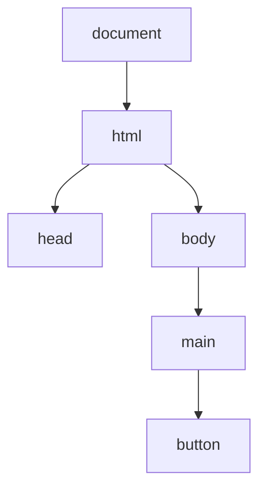

## 文档对象

DOM 是浏览器把 HTML 文档解析成的对象树。JavaScript 通过 DOM API 读取和修改页面结构、属性、文本、样式和事件。



DOM 不是 HTML 字符串本身，而是浏览器内存中的节点结构。修改 DOM 可能影响样式计算、布局和绘制，因此 DOM 操作既是功能入口，也是性能入口。

```javascript
document.title = '新的标题';
document.body.classList.add('ready');
```

DOM 是 JavaScript 和页面之间的桥。JS 计算再快，如果最后频繁、混乱地改 DOM，也会拖慢页面。

DOM 还有一个容易被忽略的特点：它是浏览器解析、样式、布局、无障碍树共同依赖的基础结构。你修改的不只是一个 JS 对象，也可能改变 CSS 匹配、布局尺寸、事件目标和辅助技术读到的结构。因此 DOM 操作最好以“状态变化”而不是“随手改节点”的方式组织。

## 节点类型

DOM 树里不只有元素节点，还包括文档节点、文本节点、注释节点等。日常开发最常操作的是元素节点。

```javascript
document.nodeType; // 9
document.body.nodeType; // 1
document.createTextNode('hello').nodeType; // 3
```

| 类型 | 示例 | `nodeType` |
|---|---|---|
| Document | `document` | 9 |
| Element | `<div>` | 1 |
| Text | 文本内容 | 3 |
| Comment | `<!-- -->` | 8 |

理解节点类型能解释为什么 `childNodes` 和 `children` 不一样：前者包含文本节点，后者只包含元素节点。

```javascript
element.childNodes;
element.children;
```

如果只关心标签元素，优先使用 `children`、`firstElementChild`、`nextElementSibling` 这一类 Element API。

空白、换行和注释都会成为节点。模板或 SSR 输出中如果保留了换行，`childNodes[0]` 可能是文本节点而不是你以为的元素节点。只要目标是元素结构，就尽量使用 Element API，减少被文本节点干扰的可能。

## 元素查询

现代代码最常用 `querySelector` 和 `querySelectorAll`，它们接收 CSS 选择器。

```javascript
const button = document.querySelector('.submit-button');
const items = document.querySelectorAll('[data-id]');
```

`querySelectorAll` 返回的是静态 `NodeList`，不会随着 DOM 变化自动更新。旧 API 如 `getElementsByClassName` 返回的 `HTMLCollection` 通常是动态集合。

```javascript
const list = document.querySelectorAll('li');
```

查询 DOM 时，尽量缩小范围。先拿到容器，再在容器内部查找，通常比反复全局查询更清楚。

```javascript
const container = document.querySelector('.todo-list');
const checkedItems = container.querySelectorAll('input:checked');
```

查询逻辑最好依赖稳定 class、`data-*` 属性或语义结构，不要依赖过深、过脆的 CSS 选择器。

DOM 查询还要注意结果是否可能为空。`querySelector` 找不到会返回 `null`，如果马上访问属性就会报错。业务代码里可以在入口处做存在性检查，或者让组件初始化只发生在对应容器存在时。

```javascript
const root = document.querySelector('[data-widget="todo"]');

if (root) {
  mountTodo(root);
}
```

## 节点创建

DOM 可以通过 `createElement` 创建，再插入文档。

```javascript
const item = document.createElement('li');
item.textContent = 'JavaScript';

document.querySelector('ul').append(item);
```

批量插入时，使用 `DocumentFragment` 可以先在内存中组装节点，再一次性插入。

```javascript
const fragment = document.createDocumentFragment();

for (const name of ['HTML', 'CSS', 'JavaScript']) {
  const li = document.createElement('li');
  li.textContent = name;
  fragment.append(li);
}

document.querySelector('ul').append(fragment);
```

结构复杂时，可以用 `template` 保存静态结构，再克隆节点填充数据。

```html
<template id="course-template">
  <li class="course-item">
    <span class="course-title"></span>
  </li>
</template>
```

```javascript
const template = document.querySelector('#course-template');
const clone = template.content.cloneNode(true);

clone.querySelector('.course-title').textContent = 'DOM';
document.querySelector('.course-list').append(clone);
```

`template` 比手写很长一串 `createElement` 更适合结构固定、数据变化的场景。

创建节点时要区分“结构来自开发者”还是“内容来自用户”。结构可以用模板或安全的 HTML 片段维护，用户内容应通过 `textContent`、属性白名单或安全渲染流程进入页面。把用户内容拼接成字符串再塞进 `innerHTML`，是 DOM 操作里最常见也最危险的捷径。

## 属性与文本

设置文本时优先使用 `textContent`。它把内容当作文本，不会解析 HTML。

```javascript
title.textContent = userInput;
```

`innerHTML` 会解析 HTML 字符串，如果内容来自用户输入，就可能带来 XSS 风险。

```javascript
// 危险：不要把用户输入直接拼进 innerHTML
container.innerHTML = `<p>${userInput}</p>`;
```

更稳的方式是创建节点、设置文本和属性。

```javascript
const link = document.createElement('a');
link.href = safeUrl;
link.textContent = label;
container.append(link);
```

只要用户可控内容进入 HTML 解析路径，就要考虑 [[1.6.1 XSS|XSS]]。DOM 操作不是单纯显示内容，它也是安全边界。

属性设置也要注意上下文。`href`、`src`、`style`、事件属性这些位置都不是普通文本。比如链接地址需要限制协议，避免把 `javascript:` URL 当作普通链接写入。安全的 DOM 操作不是“不用 innerHTML 就万事大吉”，而是每个上下文都要按它的语义处理。

## 样式状态

样式可以通过 `classList` 或 `style` 修改。优先切换 class，把具体表现留给 CSS。

```javascript
button.classList.add('active');
button.classList.toggle('disabled', isDisabled);
```

直接修改 `style` 适合少量动态值，例如坐标、尺寸、动画进度。

```javascript
panel.style.transform = `translateX(${offset}px)`;
element.style.setProperty('--progress', progress);
```

动态视觉状态可以通过 CSS 变量传值，让 JS 只负责数据，CSS 负责表现。

状态类要表达状态，而不是表达具体样式。比如 `is-open`、`is-selected`、`data-state="loading"` 比 `red`、`move-left` 更稳定。这样后续视觉改版时，不需要改 JS 逻辑；JS 只声明“当前是什么状态”，CSS 决定“这个状态长什么样”。

## 事件绑定

DOM 事件通过 `addEventListener` 绑定。事件对象会包含触发源、当前监听元素和用户操作信息。

```javascript
document.querySelector('button').addEventListener('click', (event) => {
  console.log(event.target);
});
```

动态列表适合事件委托，把监听器绑定到稳定的父容器上。

```javascript
document.querySelector('ul').addEventListener('click', (event) => {
  const item = event.target.closest('li');
  if (!item) return;

  console.log(item.dataset.id);
});
```

事件委托依赖事件冒泡，细节可以回到 [[1.3.11 事件|事件]]。DOM 操作和事件通常一起出现：DOM 负责结构，事件负责响应。

绑定事件时还要考虑节点生命周期。如果节点会被重新渲染、删除或替换，绑定在旧节点上的监听器也会跟着失效或被保留。动态列表更适合事件委托；独立组件更适合在挂载时绑定、卸载时清理。

## 表单数据

表单可以用 DOM API 读取字段，也可以用 `FormData` 统一收集。

```javascript
const form = document.querySelector('form');

form.addEventListener('submit', (event) => {
  event.preventDefault();

  const formData = new FormData(form);
  const payload = Object.fromEntries(formData);
  saveProfile(payload);
});
```

`FormData` 适合普通表单和文件上传；如果有复杂校验、联动字段或框架状态，则要明确 DOM 表单值和应用状态谁是数据源。

表单 DOM 和框架状态混用时最容易出问题。比如输入框显示的是 DOM 当前值，但提交时读的是旧状态；或者状态更新了，DOM 控件还没同步。无论使用原生表单还是框架表单，都要明确“最终提交的数据从哪里来”，避免 DOM 和状态双源头互相打架。

## 可访问性状态

DOM 修改不仅影响视觉，也会影响辅助技术。按钮禁用、弹窗打开、错误提示显示时，要同步语义状态。

```javascript
button.disabled = true;
button.setAttribute('aria-busy', 'true');
```

```javascript
dialog.hidden = false;
dialog.setAttribute('aria-modal', 'true');
dialog.setAttribute('role', 'dialog');
```

如果只改 class，不改语义属性，屏幕阅读器可能无法感知状态变化。这部分和 [[1.1.7 无障碍|无障碍]] 有直接关系。

DOM 状态也会影响焦点。弹窗打开后需要把焦点移动到弹窗内，关闭后通常要回到触发按钮；错误提示出现后可能要让用户能快速定位问题。只改可见性而不管理焦点，会让键盘用户和读屏用户迷失。

## 性能边界

DOM 操作通常比普通 JavaScript 计算更贵，因为它可能影响样式计算、布局和绘制。频繁读写布局信息容易造成性能问题。

```javascript
// 不推荐：读写交错
for (const item of items) {
  item.style.width = `${container.offsetWidth}px`;
}
```

更好的方式是先读后写，或批量处理。

```javascript
const width = container.offsetWidth;

for (const item of items) {
  item.style.width = `${width}px`;
}
```

持续视觉更新尽量和浏览器渲染节奏对齐。

```javascript
requestAnimationFrame(() => {
  panel.style.transform = `translateX(${x}px)`;
});
```

DOM 是浏览器渲染链路的一部分，和 [[6.3.6 重排与重绘|重排与重绘]] 联系很紧。写 DOM 代码时，要同时关心正确性、安全性和渲染成本。

性能优化时不要机械追求“少操作 DOM”，而要追求“少触发昂贵的 DOM 影响”。一次性插入 100 个离线组装好的节点，可能比交替读取布局和写样式 10 次更稳定。DOM 性能问题通常来自读写交错、频繁同步布局、大量无意义重渲染和过大的更新范围。
