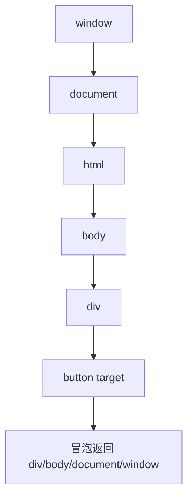

## 事件模型

事件是浏览器把用户操作、网络状态、文档变化和系统行为通知给 JavaScript 的机制。事件对象里最重要的两个概念是 `target` 和 `currentTarget`。

| 属性 | 含义 | 常见用途 |
|---|---|---|
| `event.target` | 真正触发事件的元素 | 判断用户点中了哪个子元素 |
| `event.currentTarget` | 当前正在执行监听器的元素 | 获取绑定监听器的容器 |

```html
<ul id="list">
  <li data-id="1">HTML</li>
  <li data-id="2">CSS</li>
  <li data-id="3">JavaScript</li>
</ul>
```

```javascript
const list = document.querySelector('#list');

list.addEventListener('click', (event) => {
  const item = event.target.closest('li');
  if (!item || !list.contains(item)) return;

  console.log('点击条目：', item.dataset.id);
  console.log('监听容器：', event.currentTarget.id);
});
```

`target` 通常是最具体的子元素，`currentTarget` 是绑定监听器的父元素。理解这点，才能避免把事件处理写成一堆重复绑定。

事件对象还会随着传播阶段变化。`target` 在一次事件中通常保持不变，`currentTarget` 会随着监听器所在元素变化。写事件委托时，应优先从 `event.target` 找到符合条件的子元素，再用 `currentTarget` 或容器引用确认它确实属于当前容器。

## 传播阶段

DOM 事件传播分为捕获、目标和冒泡三个阶段。默认情况下，`addEventListener` 监听的是冒泡阶段；传入 `{ capture: true }` 才会监听捕获阶段。



```javascript
document.body.addEventListener('click', () => {
  console.log('body bubble');
});

document.body.addEventListener('click', () => {
  console.log('body capture');
}, { capture: true });
```

捕获阶段适合在事件到达目标前做全局拦截，例如埋点、快捷键、弹窗外层关闭；绝大多数业务交互用冒泡就够了。

传播阶段的价值在于让不同层级可以处理同一次用户操作。子元素处理具体动作，父容器处理列表行为，页面层处理关闭浮层，全局层处理埋点或快捷键。不要一开始就阻止传播，否则上层系统会失去感知用户行为的机会。

## 事件委托

事件委托利用冒泡，把多个子元素的监听器合并到父元素上。

```javascript
document.querySelector('.menu').addEventListener('click', (event) => {
  const action = event.target.closest('[data-action]');
  if (!action) return;

  switch (action.dataset.action) {
    case 'edit':
      openEditor(action.dataset.id);
      break;
    case 'delete':
      confirmDelete(action.dataset.id);
      break;
  }
});
```

事件委托适合列表、表格、菜单、动态插入节点等场景。它的优势是监听器更少、初始化更轻、后续增删节点更省事。

不是所有事件都适合委托。像 `focus`、`blur` 这类默认不冒泡的事件，就不能直接照搬委托思路。

事件委托还要注意 `closest()` 可能找到嵌套在其他组件里的匹配元素，所以通常要配合容器包含关系检查。

```javascript
const action = event.target.closest('[data-action]');

if (!action || !event.currentTarget.contains(action)) {
  return;
}
```

这能避免外层委托误处理弹窗、嵌套菜单或传送到别处的节点。

## 默认行为

很多元素自带默认行为，例如链接跳转、表单提交、输入框聚焦、复选框切换。`preventDefault()` 可以阻止默认行为，但不会阻止事件传播。

```javascript
const form = document.querySelector('form');

form.addEventListener('submit', async (event) => {
  event.preventDefault();

  const formData = new FormData(form);
  await saveProfile(Object.fromEntries(formData));
});
```

不要滥用 `preventDefault()`。如果只是想阻止父元素监听器执行，应该用传播控制；如果是想阻止浏览器行为，才用默认行为控制。

```javascript
link.addEventListener('click', (event) => {
  if (shouldBlock) {
    event.preventDefault();
  }
});
```

默认行为本身经常是浏览器帮你做好的能力：链接可复制、表单可回车提交、标签可聚焦、复选框可切换。阻止默认行为前，要确认你是否真的提供了等价替代。比如把链接改成按钮样式，不应该顺手阻止它跳转；表单接管提交，也应该保留键盘提交和校验反馈。

## 传播控制

`stopPropagation()` 会阻止事件继续向上冒泡，`stopImmediatePropagation()` 还会阻止同一元素上后续监听器执行。

```javascript
modal.addEventListener('click', () => {
  closeModal();
});

modal.querySelector('.dialog').addEventListener('click', (event) => {
  event.stopPropagation();
});
```

传播控制要谨慎使用。组件内部随意阻止传播，会破坏外层埋点、快捷键、弹层管理和事件委托。更好的做法是让事件边界清晰，只在确实需要隔离交互时使用。

```javascript
button.addEventListener('click', (event) => {
  event.stopImmediatePropagation();
});
```

`stopImmediatePropagation()` 更激进，通常只在同一元素上确实有多个监听器冲突时才用。

传播控制如果用在组件库内部，会影响外层业务监听器、日志埋点、无障碍辅助逻辑和测试工具。更推荐通过事件目标判断、状态判断和组件边界设计来避免冲突，而不是随手阻止传播。只有在弹窗内点击不应触发遮罩关闭、拖拽过程中不应触发点击等明确隔离场景下，才适合使用。

## 监听选项

`addEventListener` 的第三个参数可以是布尔值，也可以是选项对象。现代写法更推荐对象。

```javascript
const controller = new AbortController();

window.addEventListener('resize', handleResize, {
  passive: true,
  signal: controller.signal,
});

controller.abort();
```

| 选项 | 作用 |
|---|---|
| `capture` | 在捕获阶段触发 |
| `once` | 触发一次后自动移除 |
| `passive` | 声明不会调用 `preventDefault()` |
| `signal` | 通过 `AbortController` 移除监听 |

滚动、触摸类事件常用 `passive: true`，这样浏览器更容易做滚动优化；如果需要阻止默认滚动，就不能设成 `passive`。

`signal` 是现代事件清理里非常实用的选项。它能把多个监听器挂到同一个 `AbortController` 上，组件销毁时一次性清理，比手动保存多个 handler 更不容易漏。

```javascript
const controller = new AbortController();

document.addEventListener('click', handleClick, { signal: controller.signal });
window.addEventListener('resize', handleResize, { signal: controller.signal });

controller.abort();
```

## 事件生命周期

监听器会持有回调引用，也可能间接持有 DOM、状态对象和闭包变量。组件卸载后如果不移除全局监听器，就可能产生内存保留或重复响应。

```javascript
function mountSearchBox(input) {
  const controller = new AbortController();

  input.addEventListener('input', handleInput, {
    signal: controller.signal,
  });

  window.addEventListener('keydown', handleShortcut, {
    signal: controller.signal,
  });

  return () => controller.abort();
}
```

事件和 [[1.3.16 内存泄漏|内存泄漏]] 联系很紧：绑定在 `window`、`document`、定时器或第三方实例上的监听器，不会因为某个 DOM 节点移除就自动消失。

局部节点上的监听器通常会随着节点不可达一起被回收，但全局对象、长生命周期服务、第三方实例上的监听器必须显式清理。判断是否需要清理，可以问：监听目标是否比当前组件活得更久？如果是，就应该有解绑逻辑。

## 组合边界

事件不只是“点了就执行”。它还负责表达交互意图、传播范围和默认行为。

- 需要阻止链接跳转时，才调用 `preventDefault()`
- 需要阻止父层处理时，才控制传播
- 需要处理动态子元素时，优先考虑事件委托
- 需要长生命周期监听时，优先考虑 `signal` 或显式清理

事件模型理解清楚之后，DOM、表单、弹窗、拖拽和组件封装都会稳定很多。

事件设计最终要落到交互意图。点击链接是导航，点击按钮是动作，输入事件是数据变化，提交事件是一次完整意图。事件处理越贴近真实意图，代码越不容易变成到处拦截、到处阻止、到处特判的网。
