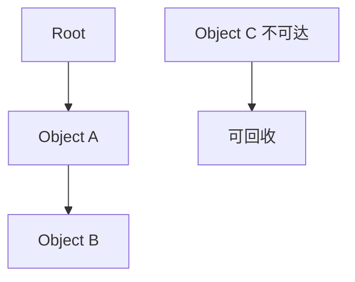

## 可达性

现代 JavaScript 引擎主要根据可达性判断对象是否可以回收。从根对象能访问到的对象，都被认为仍然有用。

```text
GC Roots
  -> globalThis
  -> 当前调用栈
  -> 闭包
  -> DOM 引用
  -> 定时器和事件监听
```

如果一个弹窗关闭后，事件监听器仍然引用它的状态，这些状态仍然可达，就不会被回收。

可达性比“是否还在页面上”更重要。一个 DOM 节点从文档中移除了，但如果仍被 JS 变量、Map、闭包或事件监听器引用，它依然可达；一个对象即使内部互相引用，只要从根对象走不到，也可以回收。GC 不理解业务上“这个已经没用了”，它只看引用图。

## 标记清除

标记清除是垃圾回收的基础思想：从根对象开始标记可达对象，未标记对象就是垃圾，可以清理。



它能处理循环引用，因为判断依据不是引用计数，而是从根是否可达。

```javascript
let a = {};
let b = {};

a.friend = b;
b.friend = a;

a = null;
b = null;
```

即使两个对象互相引用，只要从根对象已经访问不到它们，它们就可以被回收。

这也是现代 GC 和早期引用计数模型的重要差异。引用计数难以处理循环引用，而标记清除从根出发，可以判断整个循环是否仍然可达。前端排查内存问题时，不要只看对象之间有没有互相引用，而要看是否有从根对象到它们的路径。

## 分代回收

V8 这类引擎通常使用分代思想：大多数对象生命周期很短，少量对象会存活很久。

| 区域 | 特点 |
|---|---|
| 新生代 | 短生命周期对象，回收频繁 |
| 老生代 | 存活较久对象，回收成本更高 |

临时对象通常很快被回收；长期缓存、大对象、全局状态如果持续增长，就会进入更昂贵的回收路径。

```javascript
function render(items) {
  return items.map((item) => ({
    id: item.id,
    label: item.name,
  }));
}
```

短生命周期对象不一定可怕，可怕的是本该短命的对象被缓存、监听器或闭包长期留住。

分代假设让引擎可以对短命对象采用更频繁、更便宜的回收策略。普通函数里创建临时数组、临时对象并不一定是问题；真正需要警惕的是这些临时对象被放进全局缓存、长期闭包、事件总线或模块级 Map，导致它们从新生代一路活到老生代。

## 增量与并发

为了减少主线程长时间停顿，现代引擎会使用增量标记、并发标记、并行回收等策略，把一次很长的回收工作拆成更小的任务。

```text
传统长暂停
  -> 增量拆分
  -> 并发处理
  -> 降低卡顿
```

即便引擎很聪明，大量内存分配和长期保留对象仍然会造成压力。前端性能问题里，GC 抖动常常表现为“不是一直慢，而是隔一会儿卡一下”。

GC 停顿和业务代码执行会竞争主线程时间。用户感知到的卡顿不一定来自某个慢函数，也可能来自短时间内创建了大量对象，随后 GC 集中工作。列表渲染、图表刷新、拖拽过程、动画循环里如果不断创建大对象，就更容易出现这种抖动。

## 常见保留

垃圾回收不会释放仍然可达的对象。常见保留来源包括闭包、全局缓存、事件监听器、定时器、DOM 引用和第三方实例。

```javascript
const cache = new Map();

function remember(id, value) {
  cache.set(id, value);
}
```

如果缓存没有上限和过期策略，它就是人为保留对象，GC 无法判断它是否还需要。

缓存一定要回答三个问题：最多保留多少，什么时候过期，谁负责清理。浏览器和 JS 引擎不会替你判断某条缓存是否“业务上已经没用”。只要 Map 还持有它，它就是可达对象。

## 弱引用容器

`WeakMap` 的键是弱引用。当键对象没有其他强引用时，不会因为 `WeakMap` 而阻止回收。

```javascript
const metadata = new WeakMap();

function setMeta(element, data) {
  metadata.set(element, data);
}
```

`WeakMap` 适合给对象附加元数据，例如 DOM 节点、实例对象。它不能遍历，也不能获取 size，这是弱引用能力的代价。

```javascript
const el = document.querySelector('.card');
metadata.set(el, { openedAt: Date.now() });
```

如果需要可遍历缓存，`Map` 更合适；如果更关心“不阻止对象释放”，`WeakMap` 更合适。

弱引用容器不是普通缓存的替代品。因为它不可遍历、无法知道 size，也不能依赖回收时机，所以不适合做需要统计和淘汰策略的缓存。它更适合“对象还活着时附加元数据，对象死了就让元数据自然消失”的场景。

## 排查工具

排查 GC 和内存问题通常使用浏览器 DevTools Memory 面板。

| 工具 | 用途 |
|---|---|
| Heap Snapshot | 查看对象和引用链 |
| Allocation Timeline | 观察分配趋势 |
| Performance Memory | 查看内存变化 |
| Detached DOM | 找 DOM 泄漏 |

垃圾回收和 [[1.3.16 内存泄漏|内存泄漏]] 是一体两面：GC 负责回收不可达对象，内存泄漏关注为什么对象仍然可达。

```text
能回收但没回收 -> 看 GC 时机
不能回收 -> 看引用链
```

不要把一次内存上升直接判断成泄漏。缓存、图片解码、JIT 编译、数据加载都可能让内存临时升高。泄漏更像“重复同一操作后，内存持续上升且不回落”。

判断 GC 问题时，要区分“内存分配多”和“对象无法释放”。分配多可能通过减少临时对象、复用结构、降低刷新频率改善；无法释放则要看引用链，找到是谁还持有对象。前者偏性能优化，后者才是泄漏治理。
