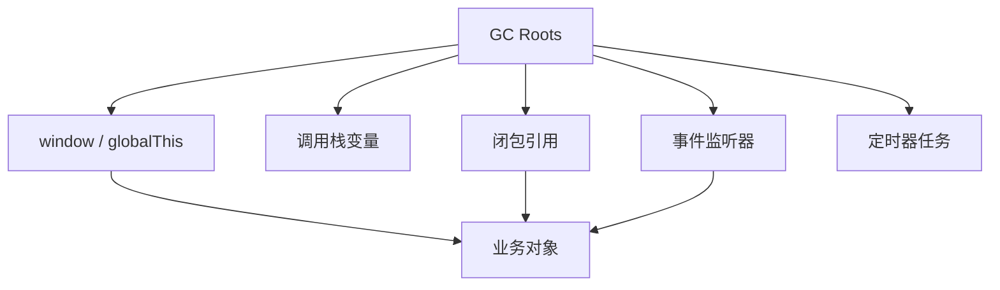

## 排查线索

内存泄漏常见信号包括：页面越来越卡、列表越来越慢、弹窗关闭后资源不释放、切页后旧数据仍然保留。

排查时先看“谁还在引用它”，再看“为什么这份引用没有清掉”。

```text
现象持续出现
  -> 多次重复操作
  -> 手动触发 GC
  -> 对比 Heap Snapshot
  -> 看 Retainers 引用链
```

不要把一两次内存上升直接当成泄漏。图片解码、缓存预热、JIT 编译、数据加载都可能造成临时波动。

内存泄漏更像一种趋势：重复执行同一套操作后，内存基线不断抬高，手动 GC 后仍然回不去。排查时要设计可重复步骤，比如打开弹窗、关闭弹窗、切换页面、销毁组件，重复多次后再对比快照。没有可重复路径，就很难判断是不是泄漏。

## 可达性

JavaScript 的内存回收以“可达性”为核心。只要一个对象还能从全局对象、当前调用栈、闭包、事件监听器、定时器、模块缓存或 DOM 引用访问到，垃圾回收器就不会释放它。



这也解释了为什么泄漏常发生在“看起来已经离开页面”的地方：页面节点没了，但某个全局监听器、缓存或闭包还握着它。

可达性排查要沿 Retainers 链看，而不是只看对象本身。一个对象占用很大内存，但真正的问题可能是一个很小的监听器、数组或 Map 把它挂住了。找到“谁还持有它”比盯着“大对象本身为什么不消失”更有效。

## 闭包保留

闭包会延长外层变量生命周期。闭包本身不是问题，问题在于它被长期保存。

```javascript
function createSearchCache() {
  const largeResult = new Array(100000).fill({ title: 'item' });

  return function search(keyword) {
    return largeResult.filter((item) => item.title.includes(keyword));
  };
}

const search = createSearchCache();
```

如果 `search` 被挂到全局对象、事件监听器或长期缓存中，`largeResult` 就不会释放。优化时不要盲目消灭闭包，而要确认闭包生命周期是否和业务一致。

闭包泄漏常见于工具函数返回的回调被长期保存。比如防抖函数、事件处理器、订阅回调、Promise 回调都可能捕获组件状态。解决方式不是不用闭包，而是在生命周期结束时取消定时器、移除监听、取消订阅或释放缓存。

## DOM 引用

DOM 节点从页面移除后，如果 JavaScript 变量仍然引用它，节点和它关联的子树、事件、数据都有可能被保留。

```javascript
let cachedPanel = null;

function openPanel() {
  cachedPanel = document.querySelector('.panel');
  document.body.removeChild(cachedPanel);
}
```

组件或工具类缓存 DOM 节点很常见，但销毁时也要清空引用。

```javascript
function destroyPanel() {
  cachedPanel?.remove();
  cachedPanel = null;
}
```

DOM 泄漏常见于列表、弹窗、富文本编辑器、图表、地图和拖拽库，因为这些场景经常创建复杂 DOM 子树和第三方实例。

第三方组件尤其要关注销毁 API。图表、地图、编辑器、播放器通常不只是创建 DOM，还会创建事件监听、定时器、Worker、Canvas 资源或内部缓存。移除外层容器不等于销毁实例，通常需要调用 `destroy()`、`dispose()`、`unmount()` 这类方法。

## 事件监听器

绑定在 `window`、`document`、`body`、全局事件总线、WebSocket、第三方 SDK 上的监听器，不会因为组件 DOM 移除自动消失。只要监听器回调引用了组件状态，就会把组件也留住。

```javascript
function mountPage(state) {
  function handleResize() {
    state.width = window.innerWidth;
  }

  window.addEventListener('resize', handleResize);

  return function unmountPage() {
    window.removeEventListener('resize', handleResize);
  };
}
```

现代浏览器可以用 `AbortController` 统一释放监听器。

```javascript
function mountDropdown() {
  const controller = new AbortController();

  document.addEventListener('click', closeDropdown, {
    signal: controller.signal,
  });

  window.addEventListener('keydown', handleEscape, {
    signal: controller.signal,
  });

  return () => controller.abort();
}
```

事件泄漏和 [[1.3.11 事件|事件]] 的传播机制无关，本质是监听器注册位置的生命周期比业务对象更长。

判断事件是否可能泄漏，可以看监听目标：绑定在组件内部 DOM 上，节点释放后通常风险较小；绑定在 `window`、`document`、事件总线、WebSocket、SDK 实例上，就必须有清理路径。目标越长寿，清理越重要。

## 定时器任务

`setInterval`、递归 `setTimeout`、`requestAnimationFrame` 和轮询请求都可能造成泄漏。只要任务没有停止，回调引用的对象就会持续可达。

```javascript
function startPolling(orderId) {
  const timer = setInterval(async () => {
    await fetch(`/api/orders/${orderId}`);
  }, 5000);

  return () => clearInterval(timer);
}
```

页面切走、组件卸载、弹窗关闭、用户退出登录时，都应该停止相关定时器。对轮询来说，还要处理请求未返回时组件已销毁的情况。

轮询泄漏还有一个变体：每次进入页面都启动新的轮询，但离开时没有停止，导致请求越来越多。排查时可以看 Network 面板是否同类请求数量随切页次数增长，也可以在代码里把启动和停止封装成同一个生命周期接口。

## 缓存增长

缓存是主动保留对象，所以最容易变成“设计出来的泄漏”。没有上限、没有过期策略、没有淘汰策略的 `Map` 会随着使用持续增长。

```javascript
const cache = new Map();

function getUser(id) {
  if (cache.has(id)) return cache.get(id);

  const user = fetchUser(id);
  cache.set(id, user);
  return user;
}
```

更稳妥的缓存要有容量或过期策略。

```javascript
class LruCache {
  constructor(limit = 100) {
    this.limit = limit;
    this.map = new Map();
  }

  set(key, value) {
    if (this.map.has(key)) this.map.delete(key);
    this.map.set(key, value);

    if (this.map.size > this.limit) {
      const oldestKey = this.map.keys().next().value;
      this.map.delete(oldestKey);
    }
  }

  get(key) {
    if (!this.map.has(key)) return undefined;
    const value = this.map.get(key);
    this.map.delete(key);
    this.map.set(key, value);
    return value;
  }
}
```

缓存策略不一定复杂，但必须存在。常见策略包括 LRU、TTL、按路由清理、按用户清理、登出清理、容量上限。没有策略的缓存只是把泄漏包装成“性能优化”。

## 弱引用

`WeakMap` 和 `WeakSet` 的键是弱引用，当键对象没有其他强引用时，可以被垃圾回收。

```javascript
const metadata = new WeakMap();

function attachMetadata(element, data) {
  metadata.set(element, data);
}

function readMetadata(element) {
  return metadata.get(element);
}
```

如果用普通 `Map` 以 DOM 节点为 key，即使 DOM 被移除，只要 `Map` 还在，节点依然可达。`WeakMap` 不可遍历，也不能获取 size，但它适合附加不想阻止释放的数据。

`WeakMap` 很适合保存 DOM 元数据、实例私有数据、对象关联信息。它不适合需要“列出所有缓存项”的场景，因为弱引用的核心就是不让你依赖对象何时被回收。

## 排查路径

排查内存泄漏时，要观察“多次操作后内存是否持续上升并且不回落”。单次内存升高不一定是泄漏。

| 线索 | 可能原因 |
|---|---|
| 反复进入页面内存上升 | 组件卸载未清理 |
| 关闭弹窗后 DOM 节点仍在 | DOM 引用或事件监听器 |
| 请求越来越多 | 定时器或订阅重复注册 |
| 输入越来越卡 | 历史记录、闭包或列表缓存增长 |
| DevTools Detached DOM 增多 | 移除节点仍被 JS 引用 |

一个实用流程是：记录基线，重复执行打开/关闭或进入/退出操作，手动触发 GC，再对比 heap snapshot。重点看 retained size、retainers 和 detached nodes。

内存泄漏真正的治理入口，是清掉不该存在的引用，而不是单纯“让 GC 更勤快”。 

治理完成后也要复测同一条路径。修复内存泄漏不能只看代码“应该清了”，要重复执行之前的复现步骤，对比 heap snapshot、detached nodes 和 retained size 是否下降。可验证的引用链断开，比主观感觉更可靠。
