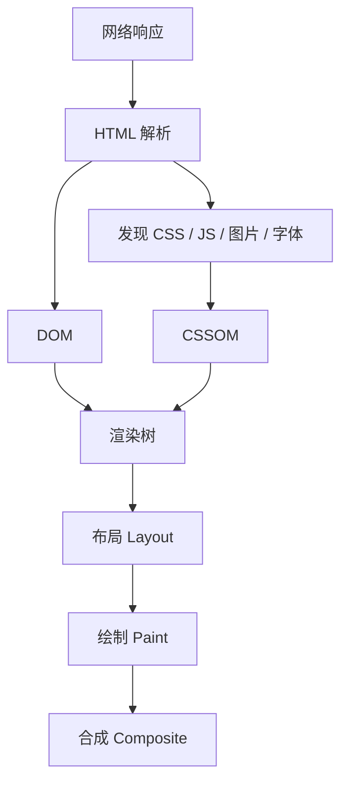

## 解析入口

浏览器渲染不是“把页面一次性全部下载完再画”，而是边解析、边构建、边调度。HTML 解析器从网络流拿到字节后，会逐步生成 DOM；遇到样式表时会构建 CSSOM；DOM 和 CSSOM 合并后，才进入可视化阶段。



这条链路和 [[1.4.7 页面加载|页面加载]] 直接相关：越早发现关键 CSS、越少阻塞主线程，首屏越稳。

```html
<link rel="stylesheet" href="/app.css" />
<script src="/blocking.js"></script>
<script src="/main.js" defer></script>
```

同步脚本会阻塞 HTML 解析；`defer` 会等 DOM 解析完再执行，更适合大多数初始化逻辑。真要尽早执行的小脚本，也要控制体积并确认不会读写尚未生成的节点。

浏览器还有预加载扫描器，会在主解析器处理 HTML 时提前发现部分资源引用。它能改善资源发现速度，但不能替代正确的资源声明。比如脚本里动态拼出来的图片、CSS 中深层引用的字体、运行时才插入的关键脚本，都可能发现较晚。首屏关键资源越早以标准方式出现在 HTML 中，越容易被浏览器提前调度。

## 树结构

DOM 表示文档结构，CSSOM 表示样式规则，渲染树只包含参与可视化的节点。理解三棵树的边界，才能解释“为什么改了一个样式却影响整页”。

| 结构 | 来源 | 包含内容 | 不包含内容 |
|---|---|---|---|
| DOM | HTML | 元素、文本、属性、层级 | CSS 计算结果 |
| CSSOM | CSS | 选择器、声明、层叠结果 | 不匹配的节点 |
| 渲染树 | DOM + CSSOM | 可见节点及最终样式 | `display: none` 节点 |

`display: none` 的节点不会进入渲染树；`visibility: hidden` 仍参与布局，只是不绘制；`opacity: 0` 往往仍保留绘制与交互区域。它们都能“看不见”，但对布局、绘制和命中区域的影响并不相同。

```css
.removed { display: none; }
.hidden { visibility: hidden; }
.transparent { opacity: 0; }
```

页面结构越清楚，后面的样式计算、可访问性判断和 SEO 解析也越容易得到一致结果。

渲染树只关心可视化，但 DOM 还会影响事件、脚本和无障碍树。`display: none` 的节点不会占布局空间，通常也不会被辅助技术当成可见内容；`opacity: 0` 的元素可能仍能接收点击；`visibility: hidden` 仍占位但不可见。写隐藏逻辑时，要先判断你是想移出布局、隐藏视觉，还是保留交互区域。

## 样式计算

样式计算会把 CSS 规则应用到匹配元素上，再根据继承、层叠、优先级、默认样式和计算值得到最终样式。

```css
.page .panel ul > li:first-child span.title {
  color: #222;
}

.menu-item-title {
  color: #222;
}
```

复杂选择器不一定立刻造成肉眼可见的性能问题，但会增加维护成本，也更容易和 DOM 结构绑定过深。高频状态最好尽量落在当前组件边界内。

样式计算的成本不仅来自选择器复杂度，也来自变更范围。给 `body` 切换一个影响大量后代的 class，可能让整页重新计算样式；只在组件根节点切换状态，影响范围就小得多。状态越局部，样式重算越容易控制。

## 布局计算

布局阶段会决定每个可见盒子的几何信息，包括宽高、位置、行盒、滚动区域和包含块关系。布局最贵的地方在于它常常具有连锁效应：一个子元素内容变长，可能影响父元素高度，再影响兄弟元素位置。

```css
.shell {
  display: grid;
  grid-template-columns: 240px minmax(0, 1fr);
  min-height: 100vh;
}

.content {
  min-width: 0;
}
```

`minmax(0, 1fr)` 和 `min-width: 0` 这类写法看起来细碎，实则能避免内容撑破布局。很多布局抖动最后都会落到 [[1.4.6 重排重绘|重排重绘]]。

布局计算最怕读写交错。读取 `offsetWidth`、`getBoundingClientRect()` 这类布局信息前，如果刚刚修改过 DOM 或样式，浏览器可能被迫立刻刷新布局，形成强制同步布局。批量读、批量写，能减少这种来回打断。

## 绘制与合成

绘制阶段会把文本、颜色、边框、阴影、图片等画成图层内容；合成阶段再把多个图层按顺序合成为最终画面。浏览器会根据滚动、视频、固定定位、3D transform、透明度动画等因素决定是否提升图层。

```css
.card {
  transition: transform 200ms ease, opacity 200ms ease;
}

.card:hover {
  transform: translateY(-4px);
  opacity: 0.96;
}
```

`transform` 和 `opacity` 经常适合作为动画属性，因为它们更可能只影响合成而不触发布局。`will-change` 只能短时使用，滥用反而会增加内存占用。

```css
.drawer.is-opening {
  will-change: transform;
}
```

合成层不是越多越好。提升图层可以让某些动画更顺，但每个图层都需要内存和管理成本。大面积 `filter`、`backdrop-filter`、阴影动画和半透明叠层可能让绘制和合成成本升高。性能优化要看具体页面，而不是看到动画就一律加 `will-change`。

## 资源阻塞

渲染链路里的阻塞点主要来自关键 CSS、同步脚本、字体和首屏图片。把关键资源放在头部能尽早参与渲染，但过多的关键资源会拖慢首屏。

```html
<link rel="preload" href="/fonts/brand.woff2" as="font" type="font/woff2" crossorigin />
<link rel="stylesheet" href="/critical.css" />
<script src="/main.js" defer></script>
```

资源优化要围绕“首屏到底需要什么”判断，而不是机械预加载所有资源。`preload` 适合当前页面马上要用的关键资源，`prefetch` 更适合未来导航可能会用到的资源。

字体也是常见阻塞点。字体文件下载慢会导致文字不可见、字体替换或布局跳动。关键字体可以预加载并设置合适的 `font-display`，非关键字体则不应该抢占首屏带宽。渲染流程里的资源优先级，最终都要服务用户先看到可读内容。

## 指标定位

渲染流程最终会体现在用户指标上。LCP 更关注最大内容绘制，CLS 更关注布局稳定性，INP 更关注交互响应。

```javascript
new PerformanceObserver((list) => {
  for (const entry of list.getEntries()) {
    console.log(entry.entryType, entry.name, entry.startTime);
  }
}).observe({ type: 'largest-contentful-paint', buffered: true });
```

排查渲染问题时，可以按“网络、主线程任务、样式与布局、绘制与合成、用户指标”逐层定位。很多时候真正的瓶颈不在 DOM 数量本身，而在 CSS 阻塞、字体策略、脚本长任务或组件重复渲染。

性能指标能告诉你哪里痛，但不能直接告诉你原因。LCP 慢可能是图片发现晚、服务器慢、CSS 阻塞或主线程忙；CLS 高可能是图片没尺寸、字体替换、广告插入或异步内容顶开布局；INP 差可能是事件回调太重、渲染更新太大或长任务阻塞。指标只是入口，仍然要回到渲染链路逐层拆。
