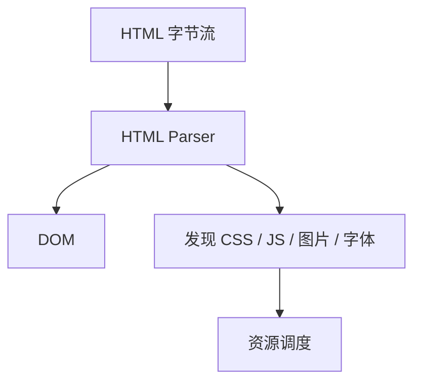

## 导航入口

页面加载从导航开始。导航可能来自地址栏输入、链接点击、表单提交、脚本跳转、刷新、前进后退或历史记录恢复。浏览器首先要判断这是完整导航、同文档导航，还是可以从 BFCache 恢复。

```text
输入 URL / 点击链接
  -> 解析地址
  -> 检查缓存和 Service Worker
  -> 发起网络请求
  -> 提交导航
```

如果只是 hash 变化或 History API 导航，可能不需要重新请求主文档；如果是完整页面导航，就会进入网络、解析和渲染链路。

前进后退还可能命中 BFCache。BFCache 会把整个页面快照保留下来，用户返回时可以非常快地恢复页面状态。它不同于 HTTP 缓存：HTTP 缓存保存资源，BFCache 保存页面运行状态。页面如果注册了某些不兼容行为、持有未关闭连接或在生命周期事件里做了不合适的操作，可能无法进入 BFCache。

## 网络阶段

网络阶段包括 DNS、连接建立、TLS、请求发送、服务器处理、响应返回。HTTP/2、HTTP/3、连接复用、缓存命中都会影响耗时。

```text
DNS
  -> TCP / QUIC
  -> TLS
  -> Request
  -> Response
```

静态资源如果命中强缓存，可能不需要真正发出网络请求；协商缓存命中时，服务器返回 `304`，浏览器继续使用本地副本。缓存细节可以回到 [[1.4.3 缓存|缓存]]。

```http
Cache-Control: max-age=31536000, immutable
```

网络阶段的首要目标是尽快拿到 HTML 入口，因为浏览器只有解析主文档后，才能发现更多关键资源。

这也是为什么 TTFB、服务器渲染、CDN、缓存和 HTML 体积都会影响首屏。HTML 到得越晚，浏览器越晚发现 CSS、脚本、图片和字体。即使静态资源很快，如果入口文档慢，关键路径仍然会被拖住。

## HTML 解析

浏览器接收 HTML 后会逐步解析成 DOM。解析不是等所有资源都下载完再开始，而是边接收、边解析、边发现资源。



HTML 中的 CSS、脚本、图片、字体、preload 等声明，会触发不同优先级的资源请求。

```html
<link rel="stylesheet" href="/app.css" />
<script src="/main.js" defer></script>

```

HTML 结构越清楚，资源声明越靠前，浏览器越容易尽早发现关键路径。

页面加载阶段要避免“关键资源晚发现”。比如首屏大图通过 JS 请求后再插入、字体只在深层 CSS 中引用、关键 CSS 被拆到异步 chunk，都会让浏览器无法尽早调度。首屏真正需要的资源，应尽量在 HTML 或早期 CSS 中被发现。

## 阻塞资源

页面加载中常见阻塞来自关键 CSS、同步脚本和字体。CSS 通常会阻塞渲染，因为浏览器需要样式信息才能正确绘制；同步脚本会暂停 HTML 解析，因为脚本可能修改 DOM 或读取样式。

```html
<script src="/blocking.js"></script>
<script src="/main.js" defer></script>
```

| 脚本属性 | 下载 | 执行 | 适合场景 |
|---|---|---|---|
| 无属性 | 阻塞解析 | 立即执行 | 极少量关键脚本 |
| `defer` | 并行下载 | DOM 解析后按顺序 | 应用入口 |
| `async` | 并行下载 | 下载完尽快执行 | 独立统计、广告 |

资源阻塞会直接影响 [[1.4.1 渲染流程|渲染流程]] 和首屏指标。脚本越重，越要关注它是否真的应该进入首屏关键路径。

第三方脚本是常见阻塞源。统计、客服、广告、A/B 实验、监控 SDK 都可能增加下载、执行和主线程成本。它们通常不应该阻塞核心内容展示，接入时要明确加载时机、失败兜底和性能预算。

## `DOMContentLoaded`

`DOMContentLoaded` 表示初始 HTML 已经解析完成，DOM 树已经构建完成。它不等待图片、视频、字体等所有资源加载完成。

```javascript
document.addEventListener('DOMContentLoaded', () => {
  initPage();
});
```

`defer` 脚本通常会在 `DOMContentLoaded` 之前执行完成。同步脚本和 CSS 阻塞可能推迟这个事件。

```text
HTML 解析完成
  -> defer 脚本执行
  -> DOMContentLoaded
```

需要操作 DOM 结构时，`DOMContentLoaded` 是常见安全时机；但现代框架入口通常已经由构建产物安排好执行顺序。

不要把 `DOMContentLoaded` 当成“页面可用”的指标。它只说明 DOM 解析完成，不代表首屏内容已经绘制，也不代表用户可以流畅交互。用户关心的是能不能看到主要内容、能不能点击输入，这要结合 FCP、LCP、INP 和主线程状态看。

## `load`

`load` 事件表示页面和依赖资源已经加载完成，包括图片、样式表、脚本等。

```javascript
window.addEventListener('load', () => {
  console.log('页面资源加载完成');
});
```

不要把首屏初始化都等到 `load` 后再做。图片和第三方资源可能很慢，等 `load` 会让页面显得迟钝。`load` 更适合非关键统计、资源完整性检查或依赖所有媒体资源的逻辑。

如果某段逻辑不影响首屏展示，可以延后到 `load`、空闲时机或用户触发时再执行。加载优化的核心不是“所有事情都更快”，而是“关键事情更早完成，非关键事情不要抢路”。

## 可见指标

页面加载不只关心事件触发，还要关心用户何时真正看到内容。FCP、LCP、CLS、INP 等指标比单纯 `load` 更接近用户体验。

```javascript
new PerformanceObserver((list) => {
  for (const entry of list.getEntries()) {
    console.log(entry.entryType, entry.startTime);
  }
}).observe({ type: 'largest-contentful-paint', buffered: true });
```

首屏可见通常受 HTML 响应、关键 CSS、主线程脚本、首屏图片、字体加载和服务端渲染模式共同影响。

```text
TTFB
  -> FCP
  -> LCP
  -> 交互响应
```

加载事件是浏览器内部时机，性能指标是用户体验时机。两者都要理解，但不能混用。

性能指标也要区分实验室数据和真实用户数据。Lighthouse 可以帮助发现明显问题，但真实用户的网络、设备、缓存状态、地理位置差异更大。关键页面最好结合 RUM 数据观察真实 LCP、CLS、INP 分布。

## 加载优化

加载优化要围绕关键路径：更快拿到 HTML，更早发现关键资源，减少阻塞，延迟非关键资源，避免首屏布局抖动。

```html
<link rel="preload" href="/hero.jpg" as="image" />
<link rel="preload" href="/fonts/brand.woff2" as="font" type="font/woff2" crossorigin />
<script src="/main.js" defer></script>
```

常见策略：

| 策略 | 目标 |
|---|---|
| HTML 短缓存 | 入口及时更新 |
| hash 资源长缓存 | 提升重复访问速度 |
| 关键 CSS 提前 | 减少渲染阻塞 |
| 脚本 defer / code splitting | 减少解析阻塞和主线程压力 |
| 图片尺寸与懒加载 | 减少 CLS 和无效带宽 |
| 关键资源 preload | 提前发现首屏资源 |

不要机械预加载所有资源。错误的 preload 会抢占带宽，让真正关键的资源更慢。加载优化最终要用 Network、Performance、Lighthouse 和真实用户指标验证。

加载优化还要关注失败路径。资源 404、chunk 加载失败、Service Worker 缓存旧资源、网络超时、字体失败都可能导致白屏或体验下降。稳定的页面加载策略不仅要快，还要能失败降级、重试或提示用户刷新。
