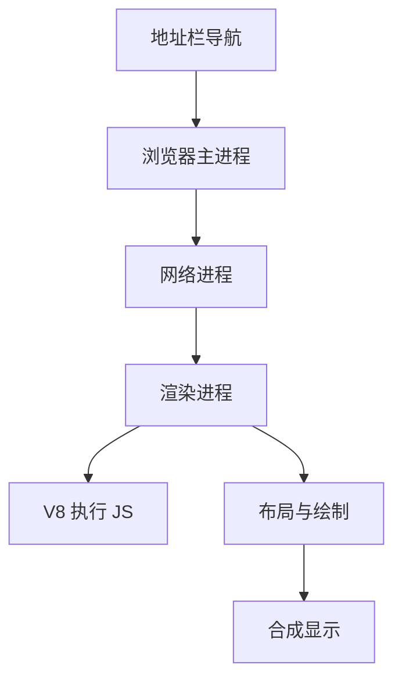

## 多进程模型

现代浏览器通常不是单进程程序，而是由多个进程协作完成页面展示、脚本执行、网络请求、存储、安全隔离和开发者工具等能力。

```text
浏览器主进程
  -> 渲染进程
  -> 网络进程
  -> GPU 进程
  -> 存储相关服务
  -> 扩展进程
```

多进程架构的核心目标是稳定性、安全性和资源隔离。如果所有标签页都运行在同一进程里，一个页面崩溃就可能拖垮整个浏览器。

多进程也意味着资源消耗更高。每个站点、标签页、扩展和 GPU/网络服务都可能占用独立资源。浏览器会在安全、稳定和内存之间做权衡，所以不同浏览器、不同版本、不同站点隔离策略下，进程数量不一定完全一致。

## 浏览器主进程

浏览器主进程负责浏览器级别控制能力，例如窗口、标签页、地址栏、书签、权限提示、下载管理、进程调度和部分系统交互。

```text
用户输入 URL
  -> 浏览器主进程接收
  -> 调度网络请求
  -> 选择或创建渲染进程
  -> 管理导航提交
```

主进程不直接执行页面里的业务 JavaScript。页面脚本主要在渲染进程中执行。区分这点，能避免把“浏览器”理解成一个模糊整体。

主进程更像调度者和协调者。地址栏输入、权限弹窗、文件选择器、下载管理这些浏览器级能力通常由主进程或相关服务控制。页面想使用能力时，需要通过浏览器暴露的受控 API，而不是直接访问系统。

## 渲染进程

渲染进程负责具体网页的解析、布局、绘制、合成和 JavaScript 执行。

```text
HTML / CSS / JS
  -> DOM / CSSOM
  -> Layout
  -> Paint
  -> Composite
```

前端最常打交道的是渲染进程：DOM 操作、事件处理、样式计算、脚本长任务、内存泄漏、渲染卡顿，大多都能在这里找到关系。

渲染进程里的主线程承担很多工作：执行 JS、处理事件、计算样式、布局、绘制准备等。只要 JS 长任务占住主线程，渲染和输入响应都会被影响。这也是为什么前端性能经常围绕“主线程预算”展开。

## 网络进程

网络进程负责 HTTP/HTTPS 请求、DNS、连接复用、缓存交互、证书校验、代理、Cookie 携带等能力。

```javascript
fetch('/api/profile', {
  credentials: 'include',
});
```

前端看到的是 Fetch API，浏览器内部还要处理连接、缓存、Cookie、CORS、重定向和安全校验。网络进程和 [[1.4.3 缓存|缓存]]、[[1.4.4 跨域|跨域]]、[[1.4.7 页面加载|页面加载]] 都直接相关。

网络进程还会和缓存、证书、代理、DNS、连接池协作。一次 `fetch` 看起来是一行代码，内部可能经过缓存判断、Service Worker 拦截、CORS 校验、Cookie 附加、重定向跟随和响应解码。排查网络问题时，要把这些层级逐一拆开。

## JavaScript 引擎

JavaScript 引擎负责执行脚本。在 Chrome 中主要是 V8。V8 解析源码、生成字节码、执行热点优化、管理堆内存和垃圾回收。

```text
源码
  -> 解析
  -> 字节码
  -> 执行
  -> 优化 / 去优化
  -> 垃圾回收
```

V8 不是浏览器的全部。`document`、`window`、DOM、网络、定时器和事件循环是浏览器宿主环境提供的能力。更深入的引擎细节可以看 [[1.3.17 V8|V8]]。

这也解释了为什么同样是 V8，Chrome 和 Node.js 能力不同。V8 执行语言，宿主提供环境。浏览器给你 DOM 和渲染，Node 给你文件系统和服务端网络，Electron 则把两者组合起来并增加新的安全边界。

## 沙箱隔离

渲染进程通常运行在沙箱中，权限受限。页面脚本不能随意访问本地文件、系统 API、其他站点数据或浏览器内部能力。

```text
页面 JS
  -> 受限 API
  -> 浏览器校验权限
  -> 主进程或服务进程代办
```

沙箱不是让页面什么都不能做，而是把能力放在明确边界里。文件选择、剪贴板、摄像头、定位、通知等 API 都需要权限策略和用户授权。

权限 API 的核心原则是最小授权和用户可感知。页面不应该在没有明确场景时请求摄像头、定位、通知等能力；权限被拒绝时也要有降级路径。浏览器架构把危险能力放在受控通道里，前端代码要尊重这个边界。

## 站点隔离

站点隔离会尽量把不同站点放到不同进程中，降低跨站数据被同进程侧信道攻击读取的风险。它是浏览器安全模型的重要组成部分。

```text
https://a.example
https://b.example
https://evil.test
```

不同站点即使同时打开，也不应该轻易共享内存空间。站点隔离和同源策略、Cookie SameSite、CORS、COOP/COEP 等机制一起构成浏览器安全边界。

站点隔离解决的是更底层的进程和内存隔离，同源策略解决的是脚本读取边界，CORS 解决的是服务端授权读取，Cookie 策略解决的是凭证携带。它们不是互相替代，而是在不同层级共同收紧攻击面。

## IPC 通信

多进程意味着模块之间需要通信。浏览器内部会通过 IPC 在主进程、渲染进程、网络进程等之间传递消息。

```text
渲染进程发起请求
  -> IPC 到网络进程
  -> 网络进程处理请求
  -> 响应数据返回渲染进程
```

IPC 带来隔离，也带来成本。因此浏览器会尽量把高频渲染工作放在合适的线程或进程中完成，而不是所有事情都跨进程来回传。

对前端来说，IPC 成本通常不是直接优化对象，但理解它能帮助判断架构边界。比如文件选择、权限请求、跨进程渲染、扩展通信都不是普通函数调用，背后可能有异步消息和安全校验。

## 崩溃隔离

多进程架构可以降低崩溃影响范围。某个标签页的渲染进程崩溃时，浏览器主界面和其他标签页通常仍然可用。

```text
某页面崩溃
  -> 对应渲染进程退出
  -> 标签页显示崩溃提示
  -> 其他标签页继续运行
```

对前端开发来说，单页面内存持续增长或脚本长任务，不一定影响整个浏览器，但会明显影响当前页面进程。

渲染进程崩溃通常来自极端内存占用、引擎错误、GPU/绘制问题或页面触发的浏览器 bug。普通前端更常遇到的是页面卡死而不是整个浏览器崩溃：主线程被长任务占住，用户无法交互，但进程还活着。

## 开发者视角

浏览器架构能帮助把问题定位到正确层级。

| 现象 | 更可能关注 |
|---|---|
| 页面白屏 | 网络、HTML 解析、脚本错误 |
| 点击卡顿 | 主线程长任务、事件循环 |
| 动画掉帧 | 布局、绘制、合成 |
| 登录态异常 | Cookie、存储、CORS |
| 某标签页崩溃 | 渲染进程、内存、脚本 |
| 更新不生效 | HTTP 缓存、Service Worker、CDN |

不要把所有问题都归为“浏览器问题”。浏览器架构能帮你判断是网络层、渲染层、脚本层、存储层、安全策略还是发布缓存策略出了问题。

定位问题时可以先问“现象发生在哪一层”：请求没出去看网络和 CORS，响应到了但页面不变看 JS 和状态，DOM 变了但视觉不变看 CSS 和渲染，视觉变了但点击慢看主线程和事件循环。分层判断能大幅减少盲目排查。

## 模块协作

一次页面访问会经过多个模块协作：主进程处理导航，网络进程请求资源，渲染进程解析和执行，GPU/合成相关模块负责最终显示。



这个协作过程最终会落到 [[1.4.7 页面加载|页面加载]] 和 [[1.4.1 渲染流程|渲染流程]]：资源如何到达、何时解析、何时执行脚本、何时绘制首屏，都会影响用户体感。

一次导航不是单条流水线，而是多模块并行协作。网络可以同时拉资源，渲染进程可以边解析边构建 DOM，GPU/合成可以处理部分视觉工作，主进程协调导航提交和进程生命周期。理解这种并行协作，才能解释为什么“资源下载完了”不等于“页面已经可交互”。

## 安全模型

浏览器安全模型不是单一机制，而是一组互相配合的边界：同源策略限制跨源读取，CORS 让服务器显式授权，Cookie 属性约束凭证携带，沙箱限制页面权限，站点隔离降低跨站攻击影响。

```text
同源策略：默认隔离
CORS：服务端授权读取
Cookie：凭证携带策略
沙箱：限制进程能力
权限 API：用户授权能力
```

前端安全问题往往发生在这些边界被误解时。CORS 不是鉴权，Cookie 不是任意安全，LocalStorage 不是保险箱，浏览器架构也不能替代服务端权限控制。

浏览器提供的是客户端安全边界，服务端仍然必须做最终权限判断。页面脚本可以被 XSS 影响，本地存储可以被用户清理，CORS 只限制浏览器读取，Cookie 只是一种凭证传递方式。安全设计必须把浏览器机制和服务端控制放在一起看。
