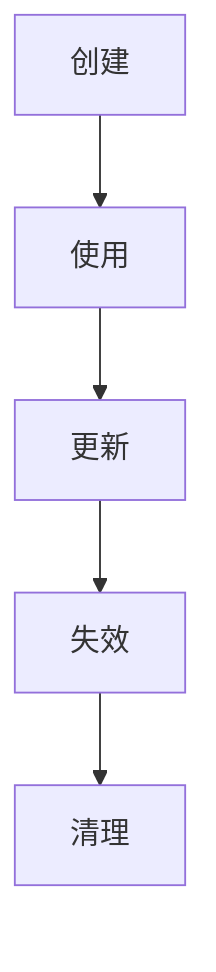

## 状态是什么

状态是“会变化、并且变化后会影响界面或行为”的数据。它不是所有变量，也不是所有缓存，而是那些一旦变化就需要被系统注意到的值。

换句话说，状态不是“值会不会变”，而是“值变了以后，系统需不需要重新考虑展示或行为”。这个判断一旦搞清楚，后面很多状态管理问题其实就会少一半。

```text
状态成立的三个判断：
1. 会变化
2. 变化后会影响 UI 或行为
3. 需要被某个边界读取或更新
```

在前端里，输入值、登录信息、筛选条件、请求结果、展开收起、主题、分页页码都可能是状态。与之相对的是临时计算值、一次性循环变量、纯函数局部变量，它们通常不需要进入状态管理体系。

前端经常把“有值”误认为“有状态”。比如页面里计算出来的总价、格式化后的日期、一次性渲染的 index，大多数情况下都只是派生结果，不值得单独保存。

状态还可以理解为“会影响下一次决策的事实”。比如输入框里的关键字会影响请求参数，登录态会影响路由和按钮权限，弹窗开关会影响界面结构。反过来，一个函数里的临时变量即使会变化，只要它不会跨过当前执行过程影响 UI 或行为，就不需要进入状态系统。

```ts
function calculateTotal(items: CartItem[]) {
  let total = 0;

  for (const item of items) {
    total += item.price * item.count;
  }

  return total;
}
```

这里的 `total` 会变化，但它只是计算过程里的局部变量，不是应用状态。真正的状态是 `items`，因为它代表购物车事实来源。

## 状态与变量

变量是语言层的存储容器，状态是应用层可观察的数据。

```ts
const price = 99; // 常量，不是状态
const [name, setName] = useState(""); // 输入值，属于状态
const total = items.length * price; // 派生值，通常直接计算
```

一个变量即使能改变，也不一定适合作为状态。只有当它会驱动视图、触发交互或参与跨边界同步时，才值得进入状态管理。

例如鼠标位置会变，但如果只是某个小组件内部短暂使用，未必需要进全局状态；相反，用户登录态即使很少变，一旦变化就会影响整站行为，它才是真正值得管理的状态。

判断变量是否应该升级为状态，可以看它是否跨渲染、跨组件、跨请求或跨会话存在。只在一次函数调用里存在的值，不需要状态管理；跨越组件渲染周期、用户交互过程或网络请求过程的值，才需要被框架或 store 记住。

## 状态与行为

状态不是孤立存在的，它通常和行为绑定：输入、切换、提交、请求、重试、失效、恢复。

```tsx
function SearchBox() {
  const [keyword, setKeyword] = useState("");

  return <input value={keyword} onChange={(e) => setKeyword(e.target.value)} />;
}
```

这里的 `keyword` 不是“字符串”，而是“会影响搜索结果的输入状态”。理解这一点，才能分清哪些数据应该持久化，哪些只是临时存在。

很多状态设计之所以会乱，就是因为只看字段名，不看字段背后的行为。只要把行为也一起考虑，状态的归属通常会更清楚。

同一个字段在不同场景里可能属于不同状态类型。比如 `keyword` 在搜索框里是输入状态，在 URL 里是可恢复状态，在接口请求里是查询参数，在服务端缓存里又是缓存 key 的一部分。不要只看名字，要看它当前承担的角色。

```text
keyword 输入
  -> 更新搜索框
  -> 写入 URL
  -> 触发请求
  -> 形成缓存 key
```

这种链路越长，越需要明确每一层谁是源头，谁只是同步结果。

## 状态生命周期

状态通常会经历创建、使用、更新、失效、清理几个阶段。



短生命周期状态适合放在组件附近，长生命周期状态才适合提升到页面、上下文或 store。生命周期越长，管理成本越高。

所以设计状态时，除了“谁会读”之外，还要问“它会活多久”。一个短期临时值如果被放得太远，后面清理、恢复和追踪都会更麻烦。

生命周期还决定清理策略。弹窗关闭后是否清空表单，页面离开后是否保留筛选，用户登出后是否清空缓存，切换账号后是否重置权限，这些都是状态生命周期问题。

```text
弹窗表单：关闭时清理
列表筛选：URL 保留
登录信息：登出时清理
接口缓存：失效后重取
```

状态没有清理策略，就会变成陈旧数据。很多“切换账号后看到上一个账号数据”的问题，本质都是生命周期没设计。

## 状态类型

| 类型 | 例子 | 特点 |
| --- | --- | --- |
| UI 状态 | 弹窗、tab、折叠 | 局部、短期、直接影响界面 |
| 业务状态 | 订单、表单草稿、用户资料 | 领域明确、可能被多个组件共享 |
| 服务端状态 | 列表、详情、搜索结果 | 来自接口，需要缓存和失效 |
| 请求状态 | loading、error、success | 描述异步过程 |
| 派生状态 | 统计值、过滤结果 | 可由其他状态计算得到 |

分类不是为了贴标签，而是为了决定放哪、谁更新、谁负责失效。

尤其是服务端状态和请求状态，很多团队容易和本地 UI 状态混在一起。其实它们更新频率、失效方式和错误处理都不一样，最好从一开始就分清。

请求状态不是服务端数据本身，而是“异步过程的状态”。例如 `loading`、`error`、`submitting` 描述的是请求正在发生、失败了还是完成了；服务端状态描述的是请求返回的数据及其新鲜度。两者经常一起出现，但不能混成一个布尔值。

```ts
type QueryState<T> =
  | { status: "idle" }
  | { status: "loading"; previousData?: T }
  | { status: "success"; data: T; updatedAt: number }
  | { status: "error"; error: Error; previousData?: T };
```

这个模型比 `loading + data + error` 三个独立变量更能避免矛盾组合。

## 状态边界

同一份事实尽量只有一个权威来源。

```text
例子：
1. 用户名既存在组件 state 里，又存在 store 里
2. 总价既由商品列表算出，又被单独保存
```

重复保存同一事实，往往会带来同步、覆盖和调试困难。能派生的值尽量派生，能局部放的状态不要一开始就全局化。

状态边界清楚以后，组件之间的依赖也会更少。页面不需要知道每个细节状态从哪来，只需要知道自己该读哪一份、改哪一份。

重复状态最危险的地方是“看起来都对，但时间不一样”。比如详情页更新了用户名，列表缓存仍是旧用户名；购物车本地加了数量，服务端库存已经不足；表单草稿保存了旧权限下的数据，切换用户后仍被恢复。状态边界不清，问题会以业务 bug 的形式出现。

## 状态设计

建模时可以先问四个问题：

1. 这是谁拥有的。
2. 这会影响谁的 UI。
3. 它会不会被缓存或失效。
4. 它能不能从别的状态算出来。

如果能直接算出来，就不要再存一份。状态设计的核心不是“更全”，而是“更少、更准、更容易更新”。

这也是为什么状态设计不能先从“我要存什么”开始，而应该从“我真正需要控制什么变化”开始。前者容易堆状态，后者更接近业务真实需要。

建模时可以把状态写成一句话：当什么发生时，哪个事实会变，谁需要知道。比如“用户输入关键词时，搜索条件会变，列表和 URL 需要知道”；“订单提交成功时，订单列表缓存需要失效，按钮提交状态需要结束”。这种描述比单纯列字段更接近真实设计。
