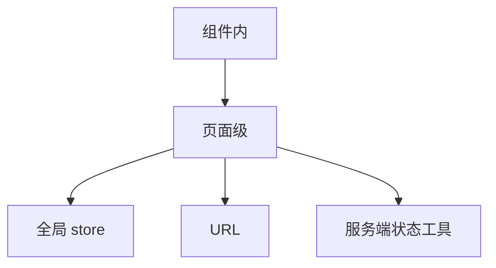

## 本地状态

本地状态只影响单个组件或局部子树，例如输入值、弹窗开关、hover、分页页码。

```tsx
const [open, setOpen] = useState(false);
const [keyword, setKeyword] = useState("");
```

它的生命周期最短，放在最近的组件最合理。如果状态只服务一个交互闭环，把它放在组件内，通常比抬到全局更清爽。

典型例子是弹窗开关、输入框草稿、局部选中态。这些状态一旦提升到全局，反而会让更多组件感知到本不该关心的变化。

本地状态的优势是成本低、影响范围小、清理自然。组件卸载时它就消失，不需要额外设计失效规则。缺点是共享困难，如果兄弟组件都需要它，就要提升。

```tsx
function PasswordInput() {
  const [visible, setVisible] = useState(false);

  return (
    <>
      <input type={visible ? "text" : "password"} />
      <button onClick={() => setVisible((value) => !value)}>切换</button>
    </>
  );
}
```

这种状态放进全局 store 没有收益，只会增加维护面。

## 页面状态

页面状态介于本地状态和全局状态之间，适合多个页面内组件共享，但不需要跨页面长期存在的数据。

```tsx
function ProductPage() {
  const [filters, setFilters] = useState({ keyword: "", category: "all" });

  return (
    <>
      <FilterPanel value={filters} onChange={setFilters} />
      <ProductTable filters={filters} />
    </>
  );
}
```

筛选条件、分页、当前 tab、页面级表单草稿都可以先放页面层。不要因为多个子组件要用，就立刻上全局 store。

页面状态经常是“一个路由内的共享上下文”。它适合由页面容器管理，再通过 props、context 或组合函数分发给子组件。页面离开时是否保留，要看它是否进入 URL 或持久化层。

```text
页面状态适合：
筛选面板
结果列表
批量选择
页面内弹窗
```

如果用户希望刷新后保留筛选，就把筛选同步到 URL；如果只是本次页面交互，留在页面 state 即可。

## 全局状态

全局状态适合跨页面共享，例如登录信息、主题、语言、权限、购物车。

```text
全局状态不等于“所有数据都放进去”
```

能局部就局部，只有共享和复用真的成立时才全局化。全局状态最适合“所有人都要读，但少数地方负责改”的数据。如果读写都很分散，通常更需要重新切分边界，而不是继续扩大全局面。

全局状态的风险是看似方便，但会让依赖关系隐形。任何组件都能读写时，很难知道状态为什么变化。全局状态应尽量少、稳定、语义明确，并通过 action 或方法收口写入。

```text
适合全局：当前用户、主题、语言、权限、购物车摘要
不适合全局：某个输入框值、某个弹窗开关、某页临时排序
```

## 服务端状态

服务端状态来自接口、缓存和同步结果。它的核心问题不是“存哪里”，而是“如何同步、缓存、刷新和失效”。

```text
典型例子：
1. 列表数据
2. 详情页数据
3. 搜索结果
4. 用户信息
```

这类状态常常要用专门的数据层工具，而不是当普通本地 state 管。它和本地状态的最大区别是：本地状态由你自己完全掌控，服务端状态还要面对网络延迟、过期、重试、失败和并发请求。

服务端状态不适合被随意复制进多个 store。接口数据一旦复制太多份，就会出现某个地方刷新了、另一个地方仍然旧的情况。

服务端状态的归属通常不是“React state 还是 Vue ref”，而是“是否需要缓存层”。只要涉及缓存 key、新鲜度、后台刷新、乐观更新、请求去重，就应该考虑专门的数据层，而不是把接口结果塞进全局 store 后手写失效。

## URL 状态

URL 也是状态归属的一种。搜索、筛选、分页、排序、详情 id 这类“可分享、可刷新、可恢复”的状态，适合放到 URL。

```text
/products?keyword=phone&page=2&sort=price
```

URL 状态的优势是天然可复制和可回退；缺点是不适合存复杂对象、隐私信息和短生命周期草稿。判断它是否该进 URL，可以问：用户刷新页面后，是否希望状态还在。

URL 状态还影响历史栈。搜索输入每次按键都写 URL，可能让返回按钮变得很烦；提交筛选后写 URL，则更符合用户预期。同步 URL 时要考虑 `push` 和 `replace` 的差别。

## 读取者

状态归属要看谁在读。

```text
读者越多，状态越需要上移
```

如果只有一个组件在读，没必要共享；如果多个兄弟组件都要读，先考虑最近公共父级；如果跨页面、跨会话都要用，再考虑全局。

读取者还要看频率。一个高频变化的值，如果被很多组件订阅，容易造成大范围渲染。比如鼠标坐标、输入框实时值、拖拽位置，不适合直接放到大范围 context 或全局 store 让整棵树感知。

## 修改者

状态也要看谁在改。修改者越多，越需要统一入口。

```text
修改者分散时，建议收口到 action 或 store 方法
```

写入口越多，越容易出现“谁都能改，但没人知道谁最后改了”的问题。归属不清时，先统一写入口，再决定是否提升状态。

修改者多并不一定意味着要全局化，它也可能意味着需要定义更清楚的动作。比如购物车可以被商品列表、详情页、购物车页修改，但写入口应收口到 `addItem`、`removeItem`、`updateQuantity` 这些动作，而不是每个页面直接改数组。

## 生命周期

状态归属和生命周期相关。会频繁销毁重建的局部组件，不适合承载长期共享数据。

例如列表筛选条件可以放页面级，但登录态、语言、主题更像跨页面的长期状态；而弹窗开关、输入草稿通常不该越过组件边界。

```text
短生命周期：组件内
页面生命周期：页面级
会话生命周期：全局状态
数据新鲜度生命周期：服务端状态工具
```

## 来源边界

来源边界通常分三类：

| 来源 | 特点 | 归属倾向 |
| --- | --- | --- |
| 用户输入 | 局部、即时 | 组件或页面 |
| 接口数据 | 异步、可缓存 | 数据层或服务端状态工具 |
| 派生数据 | 可计算、可复原 | 不单独存储 |
| URL | 可分享、可恢复 | 路由或查询参数 |
| 持久化存储 | 跨刷新、跨会话 | storage 或持久化 store |

如果来源是用户交互，优先看组件边界；如果来源是接口，优先看缓存和失效；如果来源是计算结果，优先看能否直接派生。

## 迁移路径

如果状态归属不清，可以按“最近使用处 -> 页面 -> 全局”逐步移动。不要一开始就把所有状态塞进 store。

判断时可以直接问三个问题：谁最先需要它，谁最常改它，谁最怕它失效。答案越集中，状态就越应该放近；答案越分散，越需要统一入口和更清晰的边界。



状态归属不是一次性设计完成的。项目早期可以放近一点，等共享关系真的出现，再向上迁移。比起“提前全局化”，逐步迁移通常更安全。

迁移状态时，要同时迁移读取路径、写入路径和清理规则。只把值搬到 store 里，不整理谁能写、何时清理、如何失效，状态只是换了地方继续混乱。好的迁移应该让调用方更少知道细节，而不是让更多地方直接依赖内部结构。
