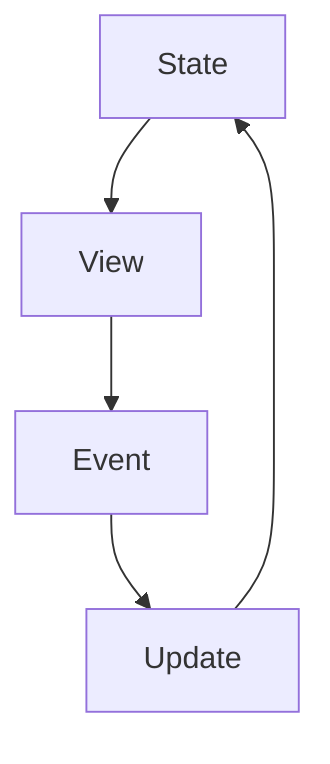
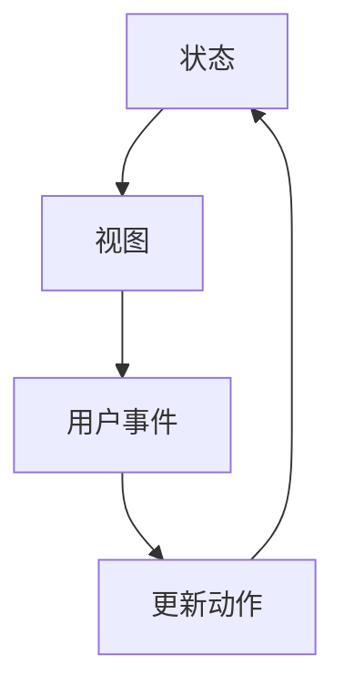

## 数据流向

数据流描述状态如何从来源流向界面，以及用户操作如何触发状态变化。单向数据流的核心是：界面从状态派生，事件描述意图，状态更新后再驱动界面刷新。



这种循环让数据变化更可追踪，也让调试时能顺着“哪个事件导致状态变化”往回找。

数据流的重点是让“原因”和“结果”分开。状态描述当前事实，视图展示事实，事件表达用户意图，更新逻辑把意图变成新的事实。只要这条链路清楚，状态问题就能顺着路径排查。

一旦原因和结果混在一起，问题就会开始放大。比如组件里既直接改本地状态，又同步全局 store，又顺手写缓存，最后界面虽然变了，但你很难说清到底是哪一步真正决定了结果。数据流的价值，正是在这种时候把变化路径收拢起来。

## 更新路径

更新路径越明确，状态越容易维护。比较稳定的路径通常是：

```text
用户操作 -> 事件处理 -> 状态更新 -> 视图重新渲染
```

如果组件既直接改状态，又监听外部对象，又偷偷同步缓存，更新路径就会分叉，问题定位会变难。Redux、Pinia、Zustand 虽然 API 不同，但都在尝试让更新路径更清晰。

更新路径越多，越需要命名动作。比如“用户点击保存”“请求成功返回”“缓存失效刷新”“登出清理状态”都应该是不同动作，而不是都写成模糊的 `setData`。

命名动作的意义不只是好读，它还能帮助日志、调试工具和团队沟通。看到 `saveSuccess`、`logoutCleared`、`filtersChanged` 这类动作名时，大家会更快理解状态为什么变；而看到一堆 `setState`、`updateData`，后续排查成本会明显变高。

## 调试线索

调试状态问题时，不要只看“当前值错了”，还要看它是怎么变成这个值的。

- 状态来源是否唯一。
- 是否有多个地方同时写入。
- 更新是否依赖旧值。
- 异步请求是否存在竞态。
- 派生状态是否和源状态不同步。

这些线索能帮助判断问题应该在组件本地修、在 Store 里修，还是在服务端状态缓存里修。

调试时可以先找第一个错误点：事件有没有触发，事件参数是否正确，状态是否按预期变化，派生数据是否正确，组件是否订阅了正确数据。如果前一个环节已经错了，后面看到的渲染问题只是结果。

这种顺着数据流逐段排查的方式，比一开始就猜“是不是框架渲染有问题”更可靠。多数状态问题并不神秘，真正复杂的是更新路径太多、来源太散、命名太模糊，导致你不知道该从哪一层开始看。
## 单向流动

前端状态管理最常见的数据流是单向的：状态向下传递，事件向上通知，状态更新后再触发视图刷新。



单向数据流的价值是可追踪。看到界面变化时，可以沿着“事件 -> 更新动作 -> 状态 -> 视图”的顺序定位问题。

单向流动不代表数据只能从父到子永远不能回来。所谓“回来”，应该以事件形式回来，而不是子组件直接修改父组件内部状态。这样父组件仍然保留状态决策权。

这条原则在多人协作里尤其重要。组件只要能稳定地接收输入、抛出事件，就可以被放进不同页面、不同框架层、不同 store 结构里复用；一旦组件开始假设外部状态长什么样、该怎么被改，它就会越来越难复用。

## Props 与 Event

组件之间共享状态时，父组件通过 props 传值，子组件通过事件或回调表达意图。

```tsx
function Parent() {
  const [selectedId, setSelectedId] = useState<string | null>(null);

  return (
    <UserList
      selectedId={selectedId}
      onSelect={(id) => setSelectedId(id)}
    />
  );
}
```

子组件不需要知道父组件如何保存状态，只需要表达“用户选择了哪个 id”。这让组件更容易复用，也减少了隐式依赖。

同一个子组件可以被不同父组件复用：一个父组件把选择写进本地 state，另一个父组件把选择同步到 URL，还有一个父组件写进 store。只要 props 和事件协议稳定，子组件不需要知道这些差异。

## Store 数据流

使用 Store 后，数据流仍然应该保持清晰。组件派发 action，Store 更新状态，组件通过 selector 或响应式读取重新渲染。

```txt
组件事件 -> Store Action -> State 更新 -> Selector/Getter -> 组件渲染
```

不要让组件绕过 action 直接拼复杂状态更新，也不要让多个 Store 互相隐式修改。全局状态越多，越需要清晰的数据流来降低调试成本。

Store 数据流的价值在于把写入集中。组件负责表达意图，action 负责业务动作，reducer/mutation/setter 负责状态变化，selector/getter 负责派生读取。每层都直接操作所有东西时，store 就会失去意义。

很多 store 变得难维护，不是因为库太复杂，而是因为数据流被偷走了。组件直接改 store、异步请求回调顺手改 store、工具函数也顺手改 store，最后虽然所有地方都“能改”，但没有地方真正负责解释为什么改。

## 反向数据流

有些数据看起来是“子组件传给父组件”，本质仍然是事件向上传递。

```tsx
function Child({ onSubmit }: { onSubmit: (value: string) => void }) {
  const [value, setValue] = useState("");

  return (
    <button onClick={() => onSubmit(value)}>
      提交
    </button>
  );
}
```

父组件并不是被子组件直接修改，而是接收子组件发出的事件后自行决定如何更新状态。这个边界可以避免子组件越权修改父组件内部细节。

这条边界在组件库里尤其重要。基础组件不应该知道业务 store，也不应该直接发请求；它应该把用户动作暴露出去，让业务层决定更新本地、URL、缓存还是服务端。

这其实是在保护组件的抽象层级。按钮、表格、筛选器、弹窗只负责交互语义，真正决定“这个动作写到哪里”的应该是业务层。数据流越往上层集中，基础组件越稳定。

## 数据流断点

调试状态问题时，可以按数据流找断点。

| 断点 | 排查问题 |
| --- | --- |
| 用户事件 | 点击、输入、提交是否触发 |
| Action 参数 | 传入的 id、表单值、查询条件是否正确 |
| State 变化 | reducer/action 是否更新了正确字段 |
| Selector/Getter | 派生数据是否计算正确 |
| 组件渲染 | 订阅范围、key、条件渲染是否正确 |

不要一开始就猜是“渲染问题”。很多界面错误其实来自事件参数、状态归属或派生计算。

服务端状态还要多看两个断点：缓存 key 是否正确，失效是否触发。很多“列表不刷新”不是组件没渲染，而是写操作后没有让对应查询过期；很多“数据串了”不是接口错，而是 key 漏了筛选条件或用户身份。

如果一个状态问题总是“有时对、有时错”，通常就值得优先检查数据流里是否存在并发、重复来源或缓存条件缺失。这类问题单看界面很难定位，但顺着事件、状态、派生、订阅一路拆下去，通常能找到真正的断点。
