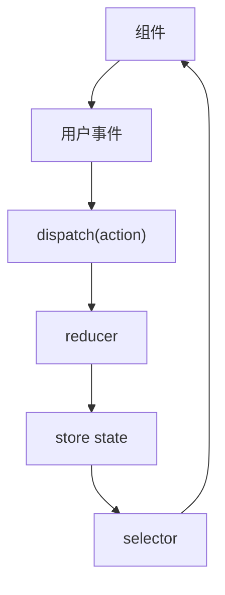

## 状态容器

Redux 的核心是一个可预测的状态容器。应用状态集中保存在 Store 中，组件通过 selector 读取状态，通过 dispatch 发送 action 触发更新。

```typescript
import { configureStore } from "@reduxjs/toolkit";

export const store = configureStore({
  reducer: {
    user: userReducer,
    cart: cartReducer,
  },
});

export type RootState = ReturnType<typeof store.getState>;
export type AppDispatch = typeof store.dispatch;
```

Store 不是简单的全局变量。它把状态、更新入口、中间件、调试工具和订阅机制放进同一条数据流里，适合状态复杂且需要追踪的应用。

Redux 最适合管理“跨多个地方共享、更新路径复杂、需要调试回放”的客户端状态。它不应该替代组件本地状态，也不应该把所有接口缓存都硬塞进状态树。现代 Redux 官方也更推荐使用 Redux Toolkit，而不是手写大量 action type、action creator 和 switch 样板。

## Action

Action 描述“发生了什么”。它至少有 `type`，通常还会携带 `payload`。

```typescript
const action = {
  type: "cart/itemAdded",
  payload: {
    productId: "p_1",
    quantity: 1,
  },
};
```

好的 action 命名接近业务事件，而不是接近 setter。`cart/itemAdded` 比 `setCart` 更容易从 DevTools 里看懂，也更适合沉淀测试用例。

Action 的价值在调试时尤其明显。DevTools 里如果看到 `user/loggedOut`、`cart/itemQuantityChanged`、`checkout/submitted`，你能还原业务过程；如果只看到一堆 `setState`，状态虽然更新了，但原因丢了。

```typescript
const itemQuantityChanged = {
  type: "cart/itemQuantityChanged",
  payload: {
    productId: "p_1",
    quantity: 3,
  },
};
```

## Reducer

Reducer 根据旧 state 和 action 计算新 state。它应该是纯更新逻辑，不发请求、不读写 storage、不依赖当前时间，也不修改外部变量。

```typescript
type CartState = {
  items: Array<{ productId: string; quantity: number }>;
};

const initialState: CartState = {
  items: [],
};

function cartReducer(state = initialState, action: { type: string; payload?: any }) {
  switch (action.type) {
    case "cart/itemAdded":
      return {
        ...state,
        items: [...state.items, action.payload],
      };
    default:
      return state;
  }
}
```

Reducer 的可预测性换来的是可测试、可回放和可调试。只要同一个 action 进入同一个 state，结果就应该一致。

Reducer 不应该知道 action 是从按钮、快捷键、接口回调还是自动任务触发的。它只处理“这个业务事件发生后，状态应该如何变化”。这种隔离让 reducer 可以独立测试。

```typescript
expect(cartReducer(initialState, itemAdded({ productId: "p1", quantity: 1 })))
  .toEqual({
    items: [{ productId: "p1", quantity: 1 }],
  });
```

## Dispatch

Dispatch 是触发状态变化的入口。组件不直接修改 Store，而是 dispatch action。

```tsx
function AddToCartButton({ productId }: { productId: string }) {
  const dispatch = useAppDispatch();

  return (
    <button
      onClick={() =>
        dispatch(itemAdded({ productId, quantity: 1 }))
      }
    >
      加入购物车
    </button>
  );
}
```

组件更适合表达“用户做了什么”，状态怎么变化由 reducer、slice 或异步逻辑负责。

Dispatch 不一定只派发普通对象。配合 thunk 中间件时，dispatch 也可以派发异步函数；配合 RTK Query 时，组件还可以通过生成的 hooks 触发请求。但无论形式如何，组件都不应该绕过状态流直接修改 store 内部数据。

## Selector

Selector 是组件读取 Store 的稳定接口。它把组件和状态树结构隔开。

```typescript
export const selectCartItems = (state: RootState) => state.cart.items;
```

当 Store 结构变化时，优先修改 selector，而不是让所有组件跟着改路径。复杂派生读取可以继续看 [[3.2.6 Selector|Selector]]。

Selector 还能承担派生计算，例如购物车总价、可见列表、权限判断。组件读 selector，而不是直接读深层路径，能降低状态树重构成本。

```typescript
export const selectCartTotal = (state: RootState) =>
  state.cart.items.reduce((total, item) => total + item.price * item.quantity, 0);
```

如果派生计算昂贵，再考虑 memoized selector，而不是把派生结果额外存进 store。

## 单向数据流

Redux 的数据流是单向的：UI 触发事件，dispatch action，reducer 计算新 state，组件订阅并重新渲染。



这个链路让排查问题有路径可循：先看 action 是否正确，再看 reducer 输出，再看 selector 读取，最后看组件渲染。

Redux 的单向数据流特别适合排查“状态为什么变了”。你可以从 DevTools 里看到 action 顺序、每次状态差异、当前 selector 结果。状态复杂时，这种可追踪性比“写起来短”更重要。

## Toolkit 写法

现代 Redux 项目默认使用 Redux Toolkit。它没有改变 Redux 的状态模型，而是用 `configureStore`、`createSlice`、Immer、默认中间件和 DevTools 减少样板代码。

```typescript
const counterSlice = createSlice({
  name: "counter",
  initialState: { value: 0 },
  reducers: {
    increment(state) {
      state.value += 1;
    },
  },
});
```

这里看起来像直接修改 `state`，实际由 Immer 生成不可变更新。学习顺序应该是先理解 Store、Action、Reducer、Dispatch、Selector，再用 Toolkit 提升效率。

Toolkit 的目标不是改变 Redux 原理，而是把正确实践变成默认：默认启用 thunk、DevTools、序列化检查和不可变检查；用 slice 组织 action 和 reducer；用 Immer 降低不可变更新成本。现在新项目不建议从裸 Redux 开始搭。

## 适用边界

Redux 适合状态复杂、跨页面共享、多来源更新、需要调试和回放的应用。它不适合所有小状态。

| 场景 | 是否适合 Redux |
| --- | --- |
| 单个组件开关 | 通常不适合 |
| 多页面共享购物车 | 适合 |
| 权限、用户、组织上下文 | 适合 |
| 接口缓存和失效 | 更适合 RTK Query |
| 表单局部输入 | 通常不适合 |

如果状态只是局部 UI，组件 state 更简单；如果状态有复杂共享、回放、调试和业务流程，Redux 才真正发挥价值。

一个实用判断是：如果你需要频繁回答“这个状态是谁改的、按什么顺序改的、能不能回放、跨多少地方读写”，Redux 很适合；如果只是“这个弹窗开不开”，Redux 通常太重。Redux 的优势是可预测和可调试，不是让所有状态统一进一个大对象。
