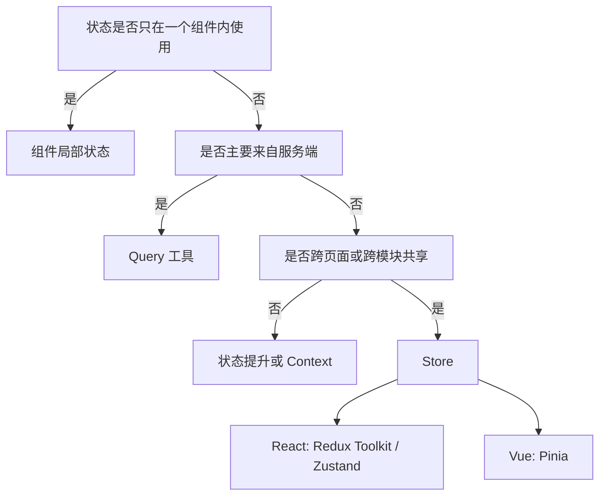

## Redux

Redux 适合状态转移规则复杂、需要强可追踪性、或者团队已经围绕它建立成熟规范的项目。

它更像“强约束的状态流程框架”，而不只是一个 Store 库。状态变化如果需要严格审计、回放或跨团队协作，Redux 的强约束会更有价值。

它的优势是状态流严谨、DevTools 生态成熟、Action 轨迹清楚；代价是概念和结构更多。现代项目通常优先使用 Redux Toolkit，而不是手写老式 Redux 模板。

如果业务里有大量状态转移、撤销回放、复杂权限流、跨团队协作，Redux 的约束会变成优势。  
如果只是几个页面共享主题和用户信息，Redux 往往显得过重。

Redux 的价值通常出现在流程复杂、边界清晰、状态转移需要统一记录的场景，而不是任何项目都默认最优。工具越重，越应该只在确有收益时使用。

Redux 更适合“状态变化需要被严肃管理”的场景，例如后台系统里复杂筛选和批量编辑、低代码编辑器、交易流程、多人协作状态、需要审计或回放的问题排查。它的约束会让团队写更多结构，但也能换来更稳定的状态轨迹。

```text
适合 Redux 的信号：
状态变化路径多
需要统一 DevTools 时间线
多人维护同一业务域
状态转移规则比 UI 本身更复杂
```

如果项目只是几个页面共享登录态、主题和购物车，Redux 的收益未必覆盖心智成本。现代 Redux Toolkit 已经降低了样板代码，但它仍然是偏强约束的方案。

## 问题类型

状态管理工具选择前，先区分问题类型。不同工具解决的问题并不相同。

| 问题 | 典型工具 | 关注点 |
| --- | --- | --- |
| 组件局部交互 | useState、ref | 简单、靠近使用处 |
| 深层依赖注入 | Context、provide/inject | 读取方便、更新频率可控 |
| 客户端业务状态 | Zustand、Pinia、Redux Toolkit | 规则、调试、复用 |
| 服务端状态 | TanStack Query、RTK Query、SWR | 缓存、刷新、失效 |
| 表单状态 | React Hook Form、VeeValidate | 校验、脏状态、提交 |

不要用一个工具解决所有状态。服务端缓存和客户端业务流程混在一起，是状态管理变复杂的常见原因。

很多团队最容易犯的错，就是把“服务器拿来的列表”也塞进和“本地编辑状态”同一套 Store。这样一来，缓存、失效和本地草稿都会混在一起，后面很难拆。

选工具前可以先把状态分成三类：本地交互状态、客户端业务状态、服务端缓存状态。很多项目不是缺状态库，而是把三类问题混在一起。

```text
本地交互：弹窗、tab、输入中内容
客户端业务：购物车草稿、当前工作区、编辑器选择
服务端缓存：用户列表、详情、分页、搜索结果
```

工具选择应该从问题出发，而不是从团队想用什么库出发。否则很容易出现“Redux 管一切”“Pinia 管一切”这种看起来统一、实际边界混乱的状态层。

## Redux Toolkit

Redux Toolkit 适合复杂业务流程、多人协作、大型应用和需要强调可追踪性的项目。

```ts
const orderSlice = createSlice({
  name: "order",
  initialState,
  reducers: {
    itemAdded(state, action) {
      state.items.push(action.payload);
    },
    orderSubmitted(state) {
      state.status = "submitting";
    },
  },
});
```

它的优势是 action 轨迹清楚、生态成熟、DevTools 强、约束明确。代价是概念更多，轻量项目会显得偏重。

如果团队已经有 Redux 经验，继续用 Redux Toolkit 往往比换库更省心；如果团队对 Redux 生态不熟，Pinia 或 Zustand 这类更轻的方案可能更快落地。

Redux Toolkit 的优势还包括标准化异步、不可变更新和 DevTools 记录。`createSlice` 降低了 reducer 样板，`createAsyncThunk` 和 RTK Query 又覆盖了常见异步与服务端缓存问题。

```ts
const fetchUser = createAsyncThunk("user/fetch", async (id: string) => {
  return userApi.getUser(id);
});
```

不过，不要把 Redux Toolkit 当成“所有 React 项目的默认标配”。如果团队只是需要轻量共享状态，Zustand 或 Context 可能更贴合；如果主要问题是接口数据，RTK Query 或 TanStack Query 才更接近问题本身。

## Zustand

Zustand 适合 React 项目中轻量、直接、业务边界清楚的客户端状态。

```ts
const useEditorStore = create((set) => ({
  selectedId: null,
  selectNode: (id: string) => set({ selectedId: id }),
}));
```

它的优势是 API 少、接入快、不需要 Provider。代价是架构约束较少，团队需要自己维护命名、拆分、测试和副作用边界。

Zustand 更像“轻量、直接、自己管理边界”的工具。它特别适合 React 项目里那些不想被太多样板代码拖住的业务状态，但团队也要更自觉地守住规则。

Zustand 适合编辑器、播放器、看板、局部复杂交互这类“状态变化频繁，但不想引入强流程框架”的场景。它的选择器能力可以让组件只订阅必要字段，避免整个 Store 变化导致大片重渲染。

```ts
const selectedId = useEditorStore((state) => state.selectedId);
const selectNode = useEditorStore((state) => state.selectNode);
```

它的风险是自由度过高。没有 slice、action 命名、异步边界、持久化规则时，Zustand 很容易从轻量 Store 变成散乱全局变量。团队要自己补上工程约束。

## Pinia

Pinia 是 Vue 生态中主流的 Store 方案，适合 Vue 3 项目管理跨组件业务状态。

```ts
export const useUserStore = defineStore("user", {
  state: () => ({ profile: null }),
  actions: {
    async loadProfile() {
      this.profile = await userApi.getProfile();
    },
  },
});
```

它与 Vue 响应式系统贴合，写法自然，适合替代 Vuex。Vue 项目中除非有特殊历史包袱，否则优先考虑 Pinia。

Pinia 的优势是它和 Vue 3 的语义非常贴合，学习成本低、组合式 API 体验好、对类型推导也友好。对大多数 Vue 新项目来说，它通常是默认答案。

Pinia 也很适合从 Vuex 迁移，因为它保留了 Store 的组织方式，但去掉了 mutation 这一层。迁移时可以把 Vuex 的 state、getter、action 对应过来，把 mutation 中的赋值逻辑合并进 action。

```text
Vuex state -> Pinia state
Vuex getter -> Pinia getter
Vuex action + mutation -> Pinia action
```

如果 Vue 项目的状态非常简单，也不必为了“标准化”强行引入 Pinia。组件状态、provide/inject 和 composable 已经能解决很多局部共享问题。

## 服务端状态工具

如果问题主要是接口数据缓存、分页、轮询、失效、重新请求，优先选 TanStack Query、RTK Query 或同类工具。

```ts
const { data, isLoading, error } = useQuery({
  queryKey: ["projects", { page }],
  queryFn: () => projectApi.list({ page }),
});
```

这类工具的价值不只是少写请求代码，而是把服务端状态生命周期标准化。手写 Store 很容易漏掉过期、竞态、重复请求和失败重试。

如果问题的中心是“接口数据怎么缓存、怎么失效、怎么重试”，那就别先选 Redux 或 Pinia，而是先选专门的服务端状态工具。这样职责分工会更清楚。

服务端状态工具尤其适合列表页和详情页：进入页面自动请求，窗口聚焦后可重新验证，请求失败可重试，多个组件读取同一个 query key 时共享缓存。手写 Store 也能做到，但很容易漏掉其中一两个边界。

```tsx
const project = useQuery({
  queryKey: ["project", projectId],
  queryFn: () => projectApi.detail(projectId),
  enabled: Boolean(projectId),
});
```

客户端 Store 可以保存 `projectId`、筛选条件、当前编辑模式；Query 工具保存项目详情。这样“选择哪个项目”和“项目详情怎么缓存”就分开了。

## 选择路径



工具选择不是技术偏好题，而是问题匹配题。项目规模、团队经验、调试要求和状态生命周期，比“哪个库更流行”更重要。

一个比较稳的判断是：先看状态类型，再看团队熟悉度，最后看未来维护成本。能用最少工具解决问题，就不要把工具栈堆得太复杂。

也可以从团队约束反推选择：小团队、迭代快、状态边界清楚，可以选轻量工具；多人协作、业务规则复杂、调试审计要求高，可以选强约束工具；Vue 项目优先 Pinia，React 项目再在 Redux Toolkit、Zustand、Query 工具之间分工。

```text
React 轻量客户端状态：Zustand
React 强约束业务状态：Redux Toolkit
React 服务端缓存：TanStack Query / RTK Query
Vue 客户端业务状态：Pinia
表单状态：React Hook Form / VeeValidate
```

工具选型最怕“混搭但无边界”。一个项目可以同时使用多个状态工具，但每个工具必须有清晰职责：谁管本地交互，谁管客户端业务，谁管服务端缓存，谁管表单。
