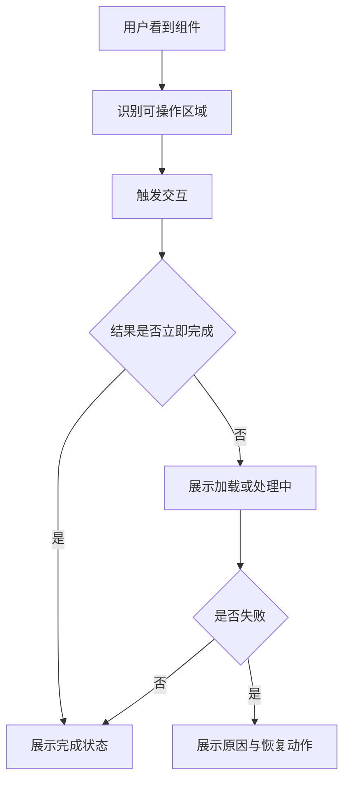

## 状态模型

组件规范首先要定义状态，而不是先画外观。按钮、输入框、选择器、弹窗这些组件都会在不同状态之间切换，如果状态没有被统一描述，组件实现就会变成“看到一个场景补一个样式”。

常见状态包括默认、悬停、聚焦、激活、加载、禁用、成功、警告、错误。并不是每个组件都要支持所有状态，但支持的状态必须有明确行为。

| 状态 | 用户感知 | 实现关注点 |
| --- | --- | --- |
| `hover` | 当前可交互 | 鼠标设备可见，触屏不依赖它 |
| `focus` | 键盘或程序聚焦 | 必须有可见焦点样式 |
| `active` | 正在触发 | 反馈应短暂且不改变布局 |
| `loading` | 操作处理中 | 阻止重复提交，保留结果预期 |
| `disabled` | 不可操作 | 同时处理视觉、事件和可访问性 |
| `error` | 输入或操作失败 | 需要文本说明，不能只靠颜色 |

组件状态要尽量通过明确属性表达，而不是从样式类名里反推业务含义。

```tsx
type ButtonProps = {
  variant?: "primary" | "secondary" | "danger";
  size?: "sm" | "md" | "lg";
  loading?: boolean;
  disabled?: boolean;
  children: React.ReactNode;
};

function Button({ loading, disabled, children, ...props }: ButtonProps) {
  const unavailable = disabled || loading;

  return (
    <button {...props} disabled={unavailable} aria-busy={loading || undefined}>
      {loading ? "处理中..." : children}
    </button>
  );
}
```

这里的 `loading` 不只是视觉状态，它还影响交互和提交逻辑。表单场景下它会直接影响 [[4.1.4 表单组件|表单组件]] 的重复提交控制。

状态规范的重点不是把所有状态都做出来，而是把允许出现的组合先定义清楚。比如 `loading + disabled` 是否同时存在、`error + disabled` 如何展示、`active` 和 `focus` 是否能并存，这些都应该在规范里写明。

如果状态定义不清，开发和测试就会在边界条件上各自猜测，最后同一个组件在不同页面出现不同表现。

规范还应该定义哪些状态会触发布局变化，哪些状态只是视觉变化。比如 `loading` 通常不应该改变组件尺寸；`error` 应该保留错误说明区域，避免成功和失败时整体布局跳动。

```text
不建议：loading 时按钮宽度变化
建议：loading 时保留原文案宽度或固定最小宽度
```

这样用户在操作过程中不会看到明显抖动。

## 尺寸体系

尺寸规范不是把每个组件都做成 `small / middle / large`，而是建立控件高度、字号、内边距、图标尺寸和间距之间的关系。尺寸一旦失衡，组件放在同一表单或工具栏里就会显得不协调。

```text
控件高度 = 内容字号 + 垂直内边距 + 边框
按钮横向空间 = 文本宽度 + 左右内边距 + 图标间距
表单行高 = 控件高度 + 字段说明 + 字段间距
```

尺寸不宜过多。后台系统通常三档已经足够，营销页面或移动端可以根据业务再扩展。过多尺寸会增加设计、开发和测试成本。

```css
.button[data-size="sm"] {
  min-height: 28px;
  padding-inline: 10px;
  font-size: 12px;
}

.button[data-size="md"] {
  min-height: 32px;
  padding-inline: 12px;
  font-size: 14px;
}

.button[data-size="lg"] {
  min-height: 40px;
  padding-inline: 16px;
  font-size: 16px;
}
```

尺寸规范还要照顾触控和密集布局。桌面端中后台可以接受更紧凑的控件，但移动端往往需要更大的点击区域；如果一个组件要同时适配多端，尺寸设计就要兼顾最小可点击面积和内容密度。

尺寸规范不只影响单个组件，也影响组件之间的组合关系。按钮、输入框、标签、选择器如果高度不统一，同一行里就会显得不齐；如果文字基线差异太大，表单会明显松散。

```css
.control {
  min-height: 32px;
  line-height: 1.5;
  padding-inline: 12px;
}
```

基础组件最好提供有限而稳定的尺寸档位，组合组件再根据场景做拼接，不要让每个页面随意定制高度。

## 交互反馈

交互规范要回答三个问题：用户能不能发现它可操作，操作后有没有反馈，失败时能不能恢复。优秀组件不是只在正常路径好看，而是在加载、失败、禁用、空数据这些边界下仍然清楚。



焦点样式是交互反馈里最容易被忽略的一部分。不能为了视觉简洁去掉 `outline`，而应该用符合设计语言的焦点环替代默认样式。

```css
.button:focus-visible {
  outline: 2px solid var(--color-focus-ring);
  outline-offset: 2px;
}
```

交互反馈最好覆盖三个层次：立即反馈、处理中反馈、结果反馈。立即反馈告诉用户“我点到了”，处理中反馈告诉用户“系统在忙”，结果反馈告诉用户“成功了还是失败了”。只做其中一个层次，体验通常都不完整。

反馈还要区分“局部反馈”和“全局反馈”。局部反馈通常只影响按钮、表单项或卡片；全局反馈则可能影响整页。比如保存按钮 loading 和整页遮罩就不是一回事，除非操作真的会阻塞整页。

```text
局部：按钮 loading、字段错误、单个卡片刷新
全局：页面级提交、全局空态、路由级加载
```

规范里如果不先定好反馈层级，业务页面就会自己决定，最后不同页面的交互强度会不一致。

## 空态与错误

很多组件规范只写“正常状态”，但真实系统里用户经常遇到空列表、网络失败、权限不足、校验错误、数据过期。组件需要把这些状态纳入规范，否则每个业务页面都会各写一套。

```tsx
type DataPanelProps = {
  loading?: boolean;
  error?: string;
  empty?: boolean;
  children: React.ReactNode;
};

function DataPanel({ loading, error, empty, children }: DataPanelProps) {
  if (loading) return <section aria-busy="true">加载中...</section>;
  if (error) return <section role="alert">加载失败：{error}</section>;
  if (empty) return <section>暂无数据，可以调整筛选条件后重试。</section>;
  return <section>{children}</section>;
}
```

错误状态不要只显示红色边框。颜色是辅助信息，真正的错误说明应该通过文本、位置和可访问性属性一起表达，这和 [[4.1.7 可访问性|可访问性]] 的信息可感知原则一致。

空态和错误态最好有区分。空态说明“目前没有数据，但流程正常”；错误态说明“数据获取或处理失败，需要恢复动作”。如果两个状态混在一起，用户会搞不清是没有内容还是出错了。

空态还可以分成首次空态、筛选后空态、权限空态和业务完成空态。不同空态对应的文案和动作不一样，不能全部用“暂无数据”糊过去。

```text
首次空态：引导用户开始
筛选后空态：建议调整条件
权限空态：说明缺少权限
业务完成空态：说明流程结束
```

规范越具体，业务页面越不需要重复设计空态。

## 状态矩阵

复杂组件需要状态矩阵，而不是只写几张设计稿。状态矩阵能帮助设计、开发和测试确认不同状态组合是否允许出现。

| 组件 | 状态组合 | 是否允许 | 处理方式 |
| --- | --- | --- | --- |
| Button | `loading + disabled` | 允许 | 展示 loading，禁止点击 |
| Input | `error + disabled` | 谨慎 | 禁用时保留错误说明或在上层解释 |
| Select | `open + loading` | 允许 | 面板内展示加载状态 |
| Modal | `open + submitting` | 允许 | 禁止重复提交，关闭策略由业务决定 |

状态矩阵的关键不是覆盖所有排列组合，而是提前定义冲突状态。这样实现时不会临时决定，测试也能围绕真实风险写用例。

状态矩阵最好和设计稿、交互说明、测试用例一起维护。否则矩阵只停留在文档里，最后实现还是会回到各自理解。

```text
设计：状态视觉稿
前端：实现与 API
测试：状态组合用例
产品：业务边界和文案
```

当一个组件状态很多时，矩阵能帮助发现“哪些状态不应该共存”。这比后面在线上猜 bug 要便宜得多。

状态矩阵也能帮助设计稿评审。很多组件在单一状态下没问题，但组合状态会出现拥挤、文案冲突、按钮消失或焦点不可见。提前列出矩阵，能更快发现这些问题。

## 交互延迟

组件反馈要考虑时间感。立即完成的操作可以直接改变状态；超过短时间的操作应该展示 loading；长时间任务需要可取消、可重试或明确进度。

```text
即时反馈：按钮按下、菜单展开、输入聚焦
短暂等待：提交中、加载中、搜索中
长任务：上传、导入、批量处理
失败恢复：重试、返回、修改输入
```

如果所有异步操作都只显示一个转圈图标，用户无法判断是否卡死、是否可以离开、是否能重试。组件规范应该规定反馈和恢复路径。

交互延迟也要区分局部与全局。局部 loading 只影响一个按钮或一个区块，全局 loading 可能影响整个页面导航或提交流。两者的文案、遮罩和恢复动作不应该混用。

对于异步耗时操作，规范最好明确是否支持取消、是否显示进度、是否允许重复提交、失败后是否保留输入。没有这些规则，开发和测试都只能自己补。

```text
短耗时：显示 loading
中耗时：允许取消或离开
长耗时：显示进度、状态可恢复
```

组件规范越像真实交互说明，业务接入就越少猜测。
