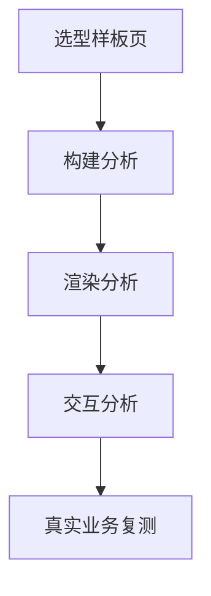

## 打包体积

组件库会影响首屏包体积、按需加载和 CSS 体积。越重的库越要确认 Tree Shaking 和按需引入是否真正生效。

```text
关注点：
1. JS 体积
2. CSS 体积
3. 图标体积
4. 主题运行时开销
5. 国际化和日期库体积
```

组件库体积不能只看 npm 包大小，要看最终进入产物的内容。图标库、日期库、主题运行时、全量样式都可能成为隐藏成本。

同一个组件库在不同工程里的最终体积可能差异很大。ESM 发布格式、副作用声明、构建工具配置、样式引入方式、图标使用方式都会影响最终产物。选型时不能只看官网给出的“gzip 后多少 KB”，要在项目自己的构建环境里测。

最容易膨胀的是图标和日期能力。比如只用了几个图标，却把整套图标库打进首屏；只用了日期选择器，却额外带入完整地区语言包。组件库如果提供明确的按需导入策略，这类问题会好控制很多。

体积分析最好用项目自己的构建报告。不同库在 Vite、Webpack、Next、Nuxt、SSR 和 CSR 下表现可能不同，不能只看官网 benchmark。

```text
构建报告要看：
1. 首屏 chunk
2. 公共 vendor chunk
3. CSS 产物
4. 图标和日期库
5. 低频重组件是否拆包
```

## 样式成本

有些库样式统一性高，但样式文件本身也可能不轻。选型时要把组件样式的加载成本一起算进去。

如果一个页面只用了按钮和输入框，却加载了整套组件样式，首屏会被无关 CSS 拖慢。支持按组件样式加载、CSS 变量主题和样式拆分的库，更适合大型项目。

```text
样式成本常被忽视的点：
1. 全局 reset
2. 图标字体
3. 动画关键帧
4. 主题变量初始化
5. 组件默认样式覆盖
```

CSS 的成本不只是下载体积，还包括解析、匹配和覆盖复杂度。大量全局选择器、深层选择器和运行时注入样式会增加调试难度，也可能让页面样式顺序变得脆弱。对于多团队项目，样式隔离和加载顺序本身就是性能与维护问题。

如果组件库使用 CSS-in-JS，要额外关注运行时注入、服务端样式收集和缓存策略；如果使用预编译 CSS，要关注是否能按组件拆分、是否会引入全局 reset、是否方便主题切换。两种方案没有绝对优劣，关键是和项目渲染模式匹配。

样式成本还会影响调试。CSS-in-JS 运行时注入可能让样式顺序更敏感，预编译 CSS 全量引入可能让覆盖范围更大。选型时要确认团队是否能稳定处理这些问题。

## 运行时性能

复杂表格、浮层、树、拖拽和大列表会放大组件库的运行时成本。

```text
高成本区域：
1. 大表格
2. 大型表单
3. 多层弹层
4. 高频交互列表
5. 虚拟滚动与固定列
```

选型时不能只看基础 Button、Input 的表现。真正拉开差距的往往是 Table、Form、Select、Tree、Modal、DatePicker 这些复杂组件。

复杂组件的成本主要来自三处：首次渲染、状态联动和布局重算。组件库如果在这些地方处理得不好，业务层再怎么节制也救不了太多。

表格是最值得单独验证的组件。真实业务表格往往包含固定列、列宽拖拽、行选择、展开行、合并单元格、筛选、排序、分页和批量操作。每多一个能力，状态联动和 DOM 数量都会增加。组件库如果没有虚拟滚动、列渲染缓存或合理的更新策略，大数据量页面会很快卡住。

浮层组件也容易出性能和稳定性问题。Tooltip、Popover、Dropdown、Modal、Drawer 都涉及定位、滚动容器、层级、焦点管理和 Portal。页面里浮层多了以后，事件监听、布局计算和层级冲突都可能成为真实成本。

运行时性能还要看低端设备。内部后台可能主要跑在办公电脑上，移动端 H5 则可能运行在低端 Android 和 WebView 里。组件库如果在低端设备滚动、输入和弹层打开时明显卡顿，就不能只用高配电脑的体验做判断。

## 按需加载

能按需引入的组件库通常更适合大型项目。按需引入不仅影响首屏，也影响开发体验和打包速度。

```tsx
import { Button } from "antd";
```

这行代码最终是否只带入 Button 相关代码，要看库发布格式、构建工具配置和副作用声明。选型时应该用实际项目构建报告验证，而不是只看文档宣称。

如果一个库默认导入就会带入大量全局样式，或者按需引入配置复杂到容易出错，那它的工程体积就不只体现在 bundle 字节数上。

按需加载要同时验证 JS 和 CSS。只做到组件 JS 按需，但样式仍然全量加载，首屏收益会打折。更细的做法是把低频重组件放进路由级懒加载，例如图表页、富文本编辑页、复杂表格页、导入导出页。

```tsx
const ReportTable = lazy(() => import("./ReportTable"));

function ReportPage() {
  return (
    <Suspense fallback={<div>加载报表...</div>}>
      <ReportTable />
    </Suspense>
  );
}
```

这类懒加载不应该滥用在所有小组件上，而是优先用于体积大、首屏不需要、交互路径较深的模块。

按需加载还要避免把拆包做得过碎。太多小 chunk 会增加请求调度和缓存管理成本。合理做法是按路由、业务域或低频重功能拆，而不是每个 Button 都懒加载。

## 性能验证

性能不能靠感觉，应该在样板页上看真实渲染和打包数据。

```text
验证方式：
1. bundle analyzer
2. 浏览器 Performance
3. 首屏渲染时间
4. 交互流畅度
5. React/Vue profiler
```

样板页至少要包含真实表格、复杂表单、弹窗、下拉选择和列表。只测空页面或官网示例，很容易低估运行时成本。



验证时要保留输入条件，否则数据没有可比性。比如表格行数、列数、是否开启虚拟滚动、是否开启固定列、网络环境、设备档位、构建模式都要固定。没有固定条件的性能对比，很容易变成主观印象。

性能验证也要看用户路径，而不是只看首屏。后台系统里，用户可能更在意表格筛选、弹窗打开、表单输入和批量操作是否流畅；移动端 H5 则更在意首屏、滚动和点击响应。

验证时最好记录硬件和数据规模，例如 1000 行表格、30 个表单字段、10 个弹层、低端 Android WebView。没有这些条件，性能结论很难复现。

## 性能预算

如果项目有严格性能预算，组件库选型时就要把预算写进去，而不是交给后期优化补救。

```text
示例预算：
首屏 JS gzip <= 180KB
首屏 CSS gzip <= 50KB
表格页交互延迟 <= 100ms
关键页面 LCP <= 2.5s
```

预算不一定要一开始很精确，但必须能约束方向。没有预算时，“为了效率先上重库”很容易变成长期债务。

预算要和页面类型绑定。运营活动页、登录页、官网首页通常需要更严格的首屏预算；内部后台可以在一定范围内用体积换开发效率；低端设备占比较高的业务，则要把交互延迟和内存占用纳入预算。

性能预算不是为了禁止使用组件库，而是为了明确取舍。比如中后台可以接受更高首屏成本换开发效率，但移动端活动页就应该更谨慎引入重型组件。

## 组件热区

真正影响性能的往往是高频热区，而不是整个库所有组件。比如表格页、筛选页、弹窗层和复杂表单页。

体积和性能不是绝对不能接受，而是要和项目价值、开发效率和维护成本一起权衡。中后台可以接受更重的组件库来换交付效率，营销页和移动端 H5 则要更谨慎。

热区优化要优先做局部替换，而不是轻易推翻整套组件库。如果只有 Table 性能不够，可以考虑替换表格组件或封装高性能业务表格；如果只有图标体积过大，可以替换图标导入方式；如果只有少数页面重，可以做路由拆包。

组件热区一旦识别出来，就应该配套专项验证。比如表格热区看行列规模、滚动、筛选和批量操作；表单热区看字段数量、校验频率和输入响应；弹层热区看打开速度、焦点和滚动锁定。

## 选型判断

如果库的体积和性能超出预算，可以优先检查：是否能按需引入、是否能拆掉低频依赖、是否能替换日期和图标方案、是否能把重组件限制在少数页面。很多“库太重”的问题，其实是用法太重。

但如果库的基础架构本身无法拆分、样式全量不可避免、复杂组件无法优化，就不要指望业务层后期慢慢补救。选型阶段发现的问题，通常比上线后发现便宜得多。

体积性能最终要和业务价值一起判断。不是越轻越好，而是在项目目标内足够轻、足够快、足够可维护。如果为了省几十 KB 导致团队反复自研基础组件，也未必划算。
