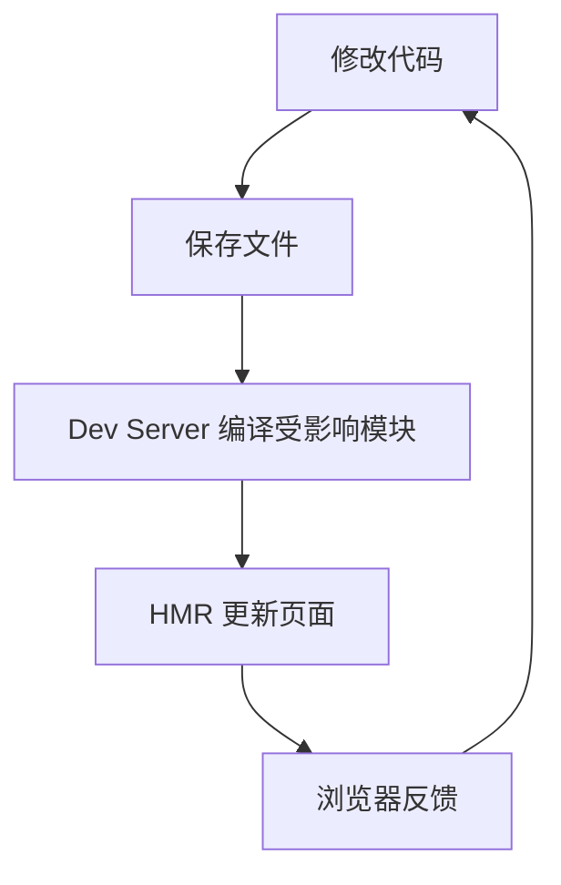
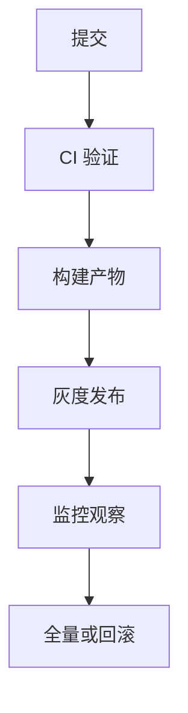

## 标准化目标

前端工程化的目标不是“工具越多越专业”，而是把开发、构建、测试、发布、监控这些环节变成可复制的标准流程。没有工程化约束的项目早期也能运行，但随着人员、页面、依赖和环境增多，隐性知识会变成协作成本。

```text
工程化要回答：
项目如何启动
代码如何组织
依赖如何锁定
质量如何检查
产物如何构建
版本如何发布
线上如何定位
```

成熟工程化的标志是新人能按仓库约定完成启动、开发、校验、构建和发布，而不是靠问某个“懂的人”。工程化本质上是在降低项目对个人经验的依赖。

工程化还要把“隐性流程”变成仓库里的显性约定。比如 Node 版本写在 `.nvmrc` 或 `package.json engines`，包管理器写在 `packageManager`，校验命令写在 `scripts`，CI 复用同一套命令。这样项目不会因为某个人离开就失去运行方式。

```text
隐性经验：先装某个版本 Node，再执行某条命令
显性约定：engines + packageManager + scripts + CI
```

## 开发反馈

开发反馈关注“从修改代码到看到结果”的路径是否足够短。现代工具如 Vite 利用原生 ESM、依赖预构建和 HMR 缩短反馈时间，但开发体验不只由工具速度决定。



本地环境还包括路径别名、Mock 数据、代理配置、环境变量、类型提示、错误覆盖层和调试工具。开发命令要快，重型检查可以放到单独命令或 CI 中；否则团队会自然绕过它。

```json
{
  "scripts": {
    "dev": "vite",
    "typecheck:watch": "tsc --noEmit --watch",
    "mock": "msw init public"
  }
}
```

开发反馈还要分“启动速度”和“修改反馈”。启动慢会影响每天第一次进入项目，HMR 慢会影响每次修改。大型项目里，依赖预构建、路由懒加载、Mock 服务和类型检查拆分都能改善这两个阶段。

## 质量门禁

质量门禁要分层：编辑器实时提示解决低成本问题，提交前检查改动文件，CI 做全量验证，发布前确认构建产物。所有检查都堆到本地提交前，会让提交变慢；所有检查都放到 CI，又会让反馈太晚。

```text
编辑器：格式化、类型提示、简单 lint
提交前：改动文件 lint、单元测试切片
CI：类型检查、测试、构建
发布前：产物检查、版本记录、灰度策略
```

质量工具要服务交付。规则太多、误报太多、运行太慢时，团队会花时间绕开规则。更好的做法是优先保留能稳定发现真实问题的规则，再逐步提高严格度。

质量门禁还要能本地复现。CI 里跑的 `lint`、`typecheck`、`test`、`build`，本地应该有同名脚本。否则 CI 失败后只能反复提交试错。

```json
{
  "scripts": {
    "verify": "pnpm lint && pnpm typecheck && pnpm test",
    "ci": "pnpm verify && pnpm build"
  }
}
```

## 构建产物

构建不是把源码压缩一下这么简单。生产构建要处理模块打包、代码分割、CSS 提取、资源 hash、兼容转换、压缩、预加载、Source Map 和静态资源路径。

```text
源码 -> 依赖解析 -> 转译 -> 打包 -> 分块 -> 压缩 -> 产物清单
```

产物必须可追踪。线上错误需要知道对应版本、提交、Source Map 和资源 hash；性能问题需要知道 chunk 体积、加载顺序和缓存策略。工程化不足的项目，线上问题常常卡在“这到底是哪次发的”。

生产产物最好生成 manifest 或版本信息。比如把 commit hash、构建时间、应用版本写入产物或监控上下文，线上报错时就能直接定位到代码版本。

```ts
reportError(error, {
  release: import.meta.env.VITE_RELEASE,
  commit: import.meta.env.VITE_COMMIT_SHA,
});
```

## 环境一致性

环境一致性来自 Node 版本、包管理器版本、锁文件、环境变量和构建命令。一个项目如果在不同机器上安装出不同依赖，后续所有验证都不可靠。

```json
{
  "engines": {
    "node": ">=20"
  },
  "packageManager": "pnpm@9.0.0"
}
```

CI 中应使用锁文件安装，例如 `pnpm install --frozen-lockfile`。本地可以灵活，CI 必须确定。这里和 [[5.1.5 依赖管理|依赖管理]] 是同一条线：依赖图不稳定，构建和发布就不稳定。

环境一致性还包括工具链版本。Node、pnpm、TypeScript、ESLint、Vite、测试框架这些工具如果在本地和 CI 里版本不同，就会出现“本地过、CI 不过”的问题。越靠近构建链的工具，越应该被锁定。

## 发布闭环

发布闭环包含构建、上传、灰度、监控、告警、回滚。前端发布看似只是静态资源上线，但真实项目还要处理 HTML 入口、CDN 缓存、资源 hash、接口兼容、Source Map 安全和版本灰度。



可回滚比“发得快”更重要。没有版本清单、没有旧产物保留、没有监控指标的发布，出了问题只能靠猜。工程化要让上线变成可控动作，而不是一次性上传。

发布闭环要有停止条件。灰度期间如果错误率、白屏率、接口失败率或关键路径转化异常，就应该暂停或回滚。没有指标的灰度只是“分批发版”，不是风险控制。

## 可观测性

工程化不止到发布结束。线上错误、性能指标、用户行为、接口失败、白屏率、资源加载失败都要能被发现和定位。否则项目只能依赖用户反馈。

```javascript
window.addEventListener("error", (event) => {
  reportError({
    message: event.message,
    filename: event.filename,
    lineno: event.lineno,
    colno: event.colno,
  });
});
```

可观测性要和版本系统打通。错误上报如果没有版本号、构建号和用户环境信息，就很难关联到具体发布。前端工程化的完整闭环，是从本地开发一直延伸到线上诊断。

可观测性还应该覆盖资源加载失败。前端静态资源依赖 CDN、缓存和 HTML 入口，chunk 加载失败、CSS 加载失败、Source Map 缺失都会直接影响用户体验。

## 复杂度控制

工程化会引入工具，但工具本身也是复杂度。脚手架、构建插件、代码生成、Monorepo、自动发布都应该解决真实问题，而不是为了“看起来完整”提前堆满。

```text
判断一个工具是否值得引入：
是否解决高频痛点
是否减少人工错误
是否能被团队理解和维护
是否有清晰退出方案
```

好的工程化不是把项目变成工具展览，而是在正确性、效率、维护成本之间取得平衡。简单项目保持简单，大项目逐步增强，这比一次性搭一套重型流程更可持续。

引入工具前最好先定义要改善的指标。比如构建从 5 分钟降到 2 分钟、提交前检查控制在 10 秒内、发布可在 5 分钟内回滚。没有目标的工程化，很容易变成“工具有了，但问题没少”。
