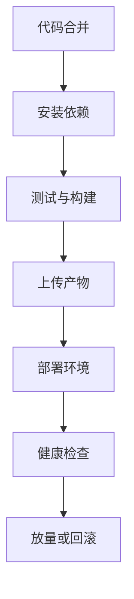

## 部署记录

每次部署都应该留下记录，包括版本、commit、部署人、环境、时间、产物地址和回滚目标。

```text
环境：production
版本：1.8.0
commit：a1b2c3d
产物：dist-20260725-01
回滚：1.7.3
```

部署记录是线上排查的重要入口。没有记录时，问题定位只能靠回忆，团队压力越大越容易出错。

部署记录最好能和监控、错误上报、产物仓库打通。看到线上异常时，应该能快速定位到 release、commit、构建产物和部署批次。

部署记录最好自动生成，并和 CI job、构建产物、监控告警、回滚目标建立关联。这样一旦出现异常，团队不需要重新拼接信息。

记录如果只能靠人工补，通常很快就会漏字段、漏时间或漏版本。自动记录的价值，不只是节省时间，更是保证事故发生时可以立即追到同一条发布链路上的所有信息。
## 流程分层

部署流程把构建产物从源码推进到用户环境。一个完整流程通常分为构建、校验、上传、发布、验证和回滚。



部署流程的目标不是“把 dist 传上去”，而是保证每次上线可追踪、可验证、可回滚。

如果部署只是复制文件，出了问题就只能靠人工判断。完整流程应该让每一步都有状态、日志和可重复操作。

部署流程最怕“手工补一步”。一旦某个环境需要手工改配置、手工上传文件或手工刷新缓存，就很容易和自动化流程脱节。必要时也应把手工步骤固化成按钮或脚本。

真正稳定的部署流程，应该让“重复做对同一件事”变得容易，让“临时绕开流程”变得困难。否则线上风险最终还是会落回个人经验和现场发挥。

## 环境划分

常见部署环境包括 development、staging、pre-production 和 production。不同环境使用不同域名、变量、密钥和权限。

| 环境 | 作用 |
|---|---|
| development | 本地或开发联调 |
| staging | 集成测试和产品验收 |
| pre-production | 接近生产的最终验证 |
| production | 真实用户环境 |

环境隔离要覆盖配置、数据、密钥、第三方回调和 CDN。只换接口域名不等于真正隔离。

预发环境越接近生产，越能提前暴露问题；但它也要避免连接真实用户数据和生产密钥。隔离不是多建几个域名，而是配置、权限和数据边界都清楚。

不同环境最好有不同可观测标识，比如 `environment`、`release`、`rollout`。这样监控和日志才能把问题和环境一起看，而不是只有域名。

环境划分还应该体现在权限上。能部署开发环境的人，不一定能直接操作生产；能看生产日志的人，也未必有回滚权限。环境隔离不只是技术问题，也是操作边界问题。

## 构建产物

前端部署通常发布静态资源和入口 HTML。构建阶段要注入版本信息，并保存产物用于回滚。

```bash
pnpm install --frozen-lockfile
pnpm test
pnpm build
```

```text
dist
├─ index.html
├─ assets/*.js
├─ assets/*.css
└─ assets/*.{png,woff2}
```

构建产物应该是不可变的。不要在部署阶段临时修改产物内容，否则同一个版本在不同环境可能不一致。

如果确实需要运行时配置，最好把配置独立成可短缓存的 JSON 或 HTML 注入变量，而不是重新构建同一份源码生成多个不可追踪产物。

部署时还要明确哪些资源是不可变的，哪些配置是可变的。不可变资源适合 hash 化并长期缓存，可变配置则应该短缓存或按版本刷新。

这个边界一旦模糊，部署会变得很难追。比如同一个版本号对应了多个不同配置产物，或者同一份 dist 在不同环境被临时改写，就会严重削弱版本追踪能力。

## 环境保护

GitHub Actions 等 CI 平台可以为环境设置审批、分支限制、并发控制和密钥隔离。生产部署应避免多个发布同时执行。

```yaml
concurrency:
  group: production
  cancel-in-progress: false

jobs:
  deploy:
    environment: production
```

审批和环境保护不是形式主义。它们能防止误发生产、并发覆盖和未经验证的发布直接进入真实用户环境。

生产发布还应限制并发。两个发布同时写入口 HTML、刷新 CDN 或修改配置，很容易造成版本交叉和难以复现的问题。

环境保护也能减少人为失误。比如对生产环境配置审批、分支限制、部署窗口和回滚权限，能让上线从“谁都能点”变成“有规则可控”。

并发控制尤其重要。前端部署常常看起来只是传静态文件，但一旦两个发布同时改入口、刷 CDN 或更新配置，线上就可能出现短时间版本交叉。

## 灰度发布

灰度发布让新版本先影响少量用户，再逐步放量。Web 常见灰度方式包括 CDN 分流、服务端开关、用户白名单、地域分流和实验平台。

```text
内部用户 -> 1% -> 10% -> 50% -> 100%
```

灰度期间要观察错误率、白屏率、接口失败率、核心转化和用户反馈。没有监控的灰度只是“慢一点全量”。

灰度发布还要提前定义暂停条件。哪些指标波动算正常，哪些波动必须停，这些规则要比“看感觉”更清楚。

灰度还要保证同一用户稳定命中同一版本，否则指标会被污染，用户体验也会变得不稳定。

灰度期间的部署最好还能保留中间状态记录。比如当前灰度比例、白名单范围、最近一次扩量时间、监控截图，这些都会直接影响后续是否继续放量。

## 缓存发布

前端部署最容易出问题的是缓存。HTML 应保持短缓存或可快速刷新，带 hash 的 JS/CSS 可以长期缓存。

```http
index.html
Cache-Control: no-cache

assets/main.abc123.js
Cache-Control: public, max-age=31536000, immutable
```

如果删除旧 chunk 太快，用户旧 HTML 可能请求不到旧资源，出现 chunk 404。部署流程要保留旧资源一段时间，或提供失败刷新机制。

缓存发布的关键是入口和资源匹配。hash 资源可以长期保留，HTML 或资源清单负责切换版本，旧资源至少要保留到旧 HTML 基本过期。

如果项目使用 Service Worker，还要把缓存更新策略纳入部署流程。否则即使 CDN 和 HTML 已经切换，部分用户仍可能被旧的离线缓存拦住。

## 健康检查

部署完成后要验证页面可访问、资源可加载、接口正常、关键链路可用。

| 检查项 | 目的 |
|---|---|
| 首页状态码 | 入口可用 |
| 静态资源 | JS/CSS 未丢失 |
| API 连通 | 接口配置正确 |
| 登录链路 | 认证未破坏 |
| 错误监控 | 新版本异常可见 |

自动化健康检查应该尽量覆盖“用户真正会遇到的问题”，而不是只检查服务返回 200。

前端健康检查可以包括首页加载、核心资源状态码、登录页渲染、接口连通、release 信息读取和错误监控是否能收到新版本事件。

健康检查最好既有自动化版本，也有人为可读的结果。部署成功不只是“脚本返回 0”，还要让值班的人快速知道页面是否真的正常。

自动化检查负责提高覆盖，人为可读结果负责提高决策速度。特别是在事故窗口里，值班同学需要快速知道“现在线上到底有没有恢复”，而不是只看一堆原始日志。

## 回滚路径

回滚方案要提前设计。静态前端常见回滚方式是切回上一份 HTML/资源清单、关闭功能开关、暂停灰度或恢复旧容器镜像。

```text
发现异常
  -> 暂停放量
  -> 切回上一版本入口
  -> 保留问题现场
  -> 修复后重新发布
```

部署流程和 [[5.9.6 版本追踪|版本追踪]]、[[5.9.5 监控接入|监控接入]] 直接相连。不能定位版本，就很难决定回滚范围。

回滚路径要在发布前就确认。等线上出问题后才找上一版产物、查 CDN 缓存、确认配置开关，往往已经错过最佳止损窗口。

部署流程里最值得重视的不是“怎么发”，而是“发错了怎么救”。把回滚当成部署的一部分，而不是事故后的补丁，整体会稳很多。

判断部署流程是否成熟，可以看这几个问题是否容易回答：

| 问题 | 成熟流程应能快速回答 |
| --- | --- |
| 线上现在是哪一版 | 能 |
| 上一稳定版是什么 | 能 |
| 哪次发布引入了问题 | 能 |
| 现在是否可以安全回滚 | 能 |
