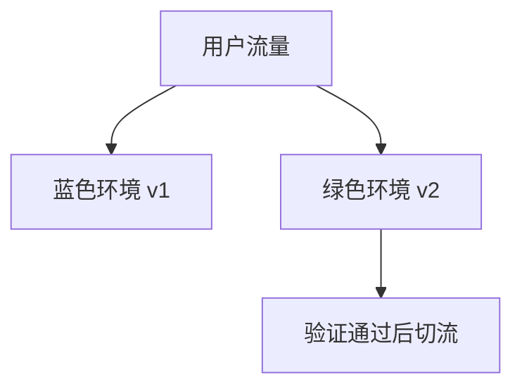

## 策略目标

部署策略决定新版本如何进入真实用户环境。好的策略不只是“能上线”，还要能控制影响范围、观察质量、快速回滚，并且让每次发布都有清晰证据。

```text
构建产物
  -> 预发布验证
  -> 小范围发布
  -> 监控观察
  -> 扩大流量
  -> 全量或回滚
```

部署策略要围绕业务风险设计。活动页和支付页、后台系统和 C 端首页、静态站和 SSR 应用，适合的发布方式并不一样。

策略越复杂，配套能力要求越高。没有监控、版本追踪和回滚能力时，灰度和金丝雀也很难真正发挥作用。

部署策略不是选一个看起来高级的名字，而是要和团队现有能力匹配。没有观测和回滚能力的复杂策略，通常只会把风险换一种形式隐藏起来。

## 全量发布

全量发布是把新版本一次性提供给所有用户。它最简单，但风险也最高。

| 优点 | 风险 |
|---|---|
| 流程简单 | 问题影响所有用户 |
| 运维成本低 | 回滚压力大 |
| 适合低风险页面 | 不适合核心链路大改 |

全量发布适合低风险改动、内部系统、小流量页面和静态内容更新。涉及登录、支付、下单、首页、基础组件大改时，不建议直接全量。

全量发布不是不能用，而是要知道它的事故半径最大。适合低风险、可快速回滚、影响面可接受的场景。

如果选择全量发布，通常就更需要在发布前把构建验证、健康检查和回滚入口准备充分，因为一旦出问题，影响面会同时放大。

## 蓝绿部署

蓝绿部署维护两套环境：当前生产环境和待发布环境。新版本先部署到绿色环境，验证通过后切流。



蓝绿部署的优势是回滚快，切回旧环境即可；缺点是资源成本更高，并且数据库、缓存和外部依赖要兼容两个版本。

前端蓝绿常体现为两套资源入口或两套托管环境。切流很快，但要确保旧资源和新资源都完整可访问。

蓝绿部署的关键不是双环境本身，而是切换动作是否足够可控、可观察、可撤回。没有这些配套，双环境也可能只是两套难维护的资源池。

## 金丝雀发布

金丝雀发布把新版本先放给少量用户，观察指标正常后逐步扩大。

```text
1% -> 5% -> 20% -> 50% -> 100%
```

前端金丝雀可以通过 CDN、网关、用户 ID、地域、账号白名单或实验平台实现。它适合高风险改动和核心链路改造。

金丝雀发布必须搭配观察窗口。只放 1% 但不看指标，等同于延迟发现问题。

对高风险页面来说，观察窗口比比例本身更重要。比例小只能缩小事故半径，真正决定能否及时止损的还是指标监控和人对指标的解释能力。

## 灰度规则

灰度规则要稳定，不能让同一个用户一会儿访问新版本，一会儿访问旧版本。常见做法是按用户 ID 或设备 ID 做哈希分桶。

```javascript
function inRollout(userId, percent) {
  const hash = simpleHash(userId);
  return hash % 100 < percent;
}
```

灰度还要考虑缓存。如果 HTML 被 CDN 缓存，用户可能无法稳定命中预期版本。灰度策略要和缓存策略一起设计。

稳定分桶的目标是让同一用户持续处在同一版本或同一功能状态里，避免流程中途切换导致数据和体验不一致。

如果一个用户在一次登录、下单或配置操作过程中跨版本切换，即使两个版本都各自可用，也可能在流程层面出现异常。这就是为什么灰度稳定性对前端特别重要。

## 静态资源

前端部署最容易出问题的是 HTML 和静态资源版本不一致。HTML 应短缓存，带 hash 的 JS/CSS 可以长缓存。

```http
index.html: Cache-Control: no-cache
assets/app.abc123.js: Cache-Control: public, max-age=31536000, immutable
```

发布时不要立刻删除旧资源。用户可能持有旧 HTML，仍会请求旧 chunk。资源保留策略能显著降低 chunk 404。

静态资源策略还要考虑 Service Worker 和客户端缓存。即使服务器切回旧版本，客户端也可能继续使用旧缓存，需要有更新和兜底机制。

因此部署策略不能只停留在服务器视角。浏览器端缓存、离线资源和前端状态恢复，也都属于版本切换路径的一部分。

## 回滚策略

回滚要有预案：回滚入口 HTML、切回旧环境、关闭开关、暂停灰度、发布修复版本。不同问题用不同回滚方式。

| 问题 | 回滚方式 |
|---|---|
| JS 运行错误 | 切回旧资源清单 |
| 某功能异常 | 关闭功能开关 |
| 接口兼容问题 | 切回旧 BFF 或服务端兼容 |
| 灰度异常 | 暂停放量 |

部署策略和 [[5.9.6 版本追踪|版本追踪]] 绑定很紧：不知道用户在哪个版本，就无法准确回滚。

回滚方式要按问题类型选择。配置问题优先配置回滚，资源问题优先入口回滚，数据兼容问题则可能需要服务端协同修复。

部署策略成熟的标志之一，就是团队能在问题发生时迅速判断“该用哪种回滚方式”，而不是所有问题都只能靠重新发版来救。

## 发布信号

发布后要看真实信号，而不是只看“部署成功”。核心信号包括白屏率、错误率、接口失败率、LCP/INP/CLS、关键转化和用户反馈。

```text
发布完成
  -> 观察 10-30 分钟
  -> 指标正常继续放量
  -> 指标异常暂停或回滚
```

部署策略最终要形成闭环：发布前有门禁，发布中能控量，发布后能观察，出问题能收回。

如果这四个环节缺任何一个，发布风险都会上升。策略不是写给流程图看的，而是为了事故发生时能快速决策。

选择部署策略时，最值得先问的通常是：

| 问题 | 用来判断什么 |
| --- | --- |
| 出问题时影响面能否被限制 | 风险控制能力 |
| 发布后多快能看到真实指标 | 观测能力 |
| 回滚是否能在分钟级执行 | 恢复能力 |
| 团队是否真的能长期执行这套流程 | 可持续性 |
