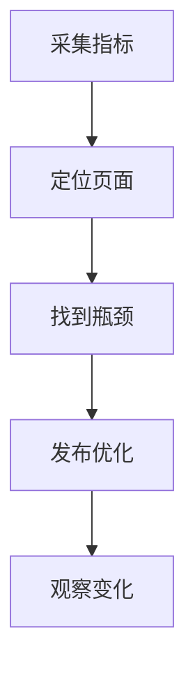

## 核心指标

性能优化不是“越快越好”，而是先定义用户真正感受到的慢在哪里。当前前端最常用的核心体验指标是 LCP、INP 和 CLS，它们分别描述首屏内容加载、交互响应和布局稳定性。

| 指标 | 关注点 | 典型阈值 |
| --- | --- | --- |
| LCP | 最大内容元素何时可见 | 2.5s 以内较好 |
| INP | 用户交互到页面响应的延迟 | 200ms 以内较好 |
| CLS | 页面是否发生意外位移 | 0.1 以下较好 |

这些值不是“工程里随便定的经验值”，而是浏览器与 Web Vitals 体系中常用的体验分界线。超过阈值时，用户开始明显感到页面慢、卡或乱跳。

核心指标的意义在于把“感觉慢”变成“可以比较的数字”。没有统一指标，优化就很难判断到底是变好了，还是只是在局部看起来更顺。

核心指标最重要的作用，是帮助团队达成同一套语言。产品、设计、前端、测试和运维如果对“慢”的理解不一样，优化就会不断跑偏。

真正有价值的指标，不是越多越好，而是能和用户体感、业务路径、发布决策连起来。只要指标和实际体验脱节，团队最后还是会回到“凭感觉优化”的状态。

## LCP

LCP 表示视口内最大内容元素完成绘制的时间。它通常对应首屏主图、标题、视频封面或大块文本。LCP 不是“页面整体加载完”的时间，而是“用户最先关注的主视觉是否出现”的时间。

```text
HTML 解析
  -> CSSOM / 渲染树
  -> 首屏关键资源加载
  -> 最大内容元素绘制
```

LCP 变差常见于这几类问题：

| 原因 | 现象 | 处理 |
| --- | --- | --- |
| 服务端慢 | HTML 到得晚 | 缓存、SSR、CDN |
| 主图慢 | 主视觉迟迟不出 | 图片压缩、正确尺寸、预加载 |
| CSS/JS 阻塞 | 关键渲染被卡住 | 拆包、延迟非关键脚本 |
| 字体阻塞 | 文本晚显示 | 字体预加载、`font-display` |

优化 LCP 时，要先找真正的 LCP 元素。否则可能优化了很多资源，却没有碰到真正的最大内容。首页是大图，详情页可能是标题和首段文本，后台页又可能是表格标题栏，页面不同，LCP 元素也不同。

如果 LCP 主要被图片拖慢，应该先看图片尺寸、格式和优先级；如果主要被服务端拖慢，就要优先查 TTFB 和 SSR；如果被脚本和样式拖慢，就说明关键渲染路径还有阻塞。

LCP 的优化优先级也要看页面价值。首页、详情页、活动页、落地页通常更依赖 LCP，因为用户对首屏主视觉特别敏感；后台型页面则未必总是把 LCP 放在第一位。

LCP 的目标不是让“整页都加载完”，而是让用户最先关注的内容尽快可见。它更适合评估首屏主内容，而不是后台复杂交互页面的全部体验。

## INP

INP 衡量用户交互到下一次页面绘制之间的延迟。它关注页面整个生命周期中的交互响应，而不是只看第一次点击。

```text
用户点击
  -> 事件回调排队
  -> JavaScript 执行
  -> 样式布局绘制
  -> 页面响应
```

INP 高通常意味着主线程被长任务占用、事件回调太重、渲染范围太大或第三方脚本阻塞。常见体感是：按钮点了没反应、输入卡顿、折叠菜单展开慢、拖拽不跟手。

INP 比单次点击更全面，因为它看的是页面整个生命周期中的交互响应。一个页面首屏不错，不代表交互也流畅。

```js
button.addEventListener("click", () => {
  // 把耗时计算拆出去，避免一次阻塞太久
  requestAnimationFrame(() => updateUI());
});
```

优化 INP 的方向通常是拆分长任务、减少重渲染、降低同步计算、推迟低优先级工作。它和 [[6.3.2 长任务优化|长任务优化]]、[[6.3.3 动画性能|动画性能]] 是连在一起看的：INP 反映用户感知，长任务和动画卡顿往往是具体原因。

如果交互卡顿发生在输入框、按钮点击和列表筛选，通常要优先看状态更新是否过大、是否同步做了太多计算，以及框架是否重复渲染了不必要的区域。

INP 和长任务关系很紧，但不等于完全相同。长任务是原因之一，框架更新、第三方脚本和布局重算也可能直接影响交互延迟。

交互指标特别适合用来保护“用户正在操作的瞬间”。一旦用户点击、输入、筛选、拖拽时卡顿明显，即使首屏再漂亮，整体体验也会被迅速拉低。

## CLS

CLS 衡量页面意外布局偏移。用户没有操作时，内容突然移动，就会造成不稳定体验。最典型的场景是图片、广告、异步插入内容把原本的位置挤开。

| 来源 | 处理 |
| --- | --- |
| 图片无尺寸 | 设置宽高或比例 |
| 广告异步插入 | 预留空间 |
| 字体切换 | 选择接近的回退字体 |
| 弹窗/提示插入 | 避免挤压已有内容 |

CLS 优化通常不难，但需要设计和开发一起做。空间预留、骨架尺寸、字体策略和折叠区域展开方式都会影响结果。尤其是营销页、资讯页和电商详情页，CLS 很容易在“上图下文”的布局里被忽略。

CLS 往往不是“代码写错了”，而是“布局没有为动态内容预留位置”。所以它特别依赖设计稿、骨架和资源尺寸约定。

CLS 也经常被字体和异步内容影响。只要页面中有晚到资源、动态插入模块或不稳定高度，布局位移就可能被放大。

很多团队会低估 CLS，因为它不一定表现为“慢”，而是表现为“烦”。按钮刚要点就被挤走、文本刚要读就跳动，这类体验问题非常影响信任感。

## FCP 与 TTFB

FCP 表示页面首次绘制内容，TTFB 表示浏览器收到首字节的时间。它们常用于定位加载链路的前半段。

| 指标 | 说明 | 关注方向 |
| --- | --- | --- |
| TTFB 高 | 服务端、网络、CDN 问题 | 后端与边缘缓存 |
| FCP 高 | HTML、CSS、字体、渲染阻塞问题 | 关键资源和渲染路径 |
| LCP 高但 FCP 正常 | 主体资源或数据慢 | 主图、首屏数据、优先级 |

不要只看一个指标。TTFB、FCP、LCP 连起来看，才能判断问题在服务端、资源加载还是页面渲染。

很多首屏问题会被误判成前端问题，其实真正瓶颈在 TTFB 或接口延迟。把指标串起来看，才能把责任落到正确层级。

如果 FCP 和 TTFB 都高，问题大概率在服务端或网络；如果 TTFB 正常但 FCP 高，就要更多看 HTML、CSS、字体和渲染阻塞。

这类指标联动判断非常重要。单看某一个指标，很容易把问题归错方向，最后在错误的层级上做了很多无效优化。

## 分位数

线上性能要看分位数，尤其是 P75 和 P95。平均值容易掩盖长尾问题。

| 分位数 | 含义 |
| --- | --- |
| P50 | 典型用户 |
| P75 | 常用体验评估点 |
| P95 | 长尾用户 |

同一个页面在高端设备和低端设备上的表现可能完全不同。指标应该按页面、设备、网络、地区、版本拆分。比如首页在办公网很好，不代表在弱网手机上也好。

如果不拆分人群，平均值会把问题抹平。真正的优化目标不是让“平均用户”更快，而是让关键人群更少卡顿。

性能指标最好按版本、端类型和人群拆开看。这样才能判断优化是否真的让目标页面变快，而不是被其他页面或设备的波动掩盖。

尤其是移动端、低端机、弱网、海外网络、嵌入式 WebView 这类人群，如果不单独拆开，很多真实问题会被主流设备平均掉。

## 优化闭环

核心指标应形成闭环：采集、分析、优化、发布、复测。



指标定义和 [[6.1.2 性能指标采集|性能指标采集]] 要分开看：前者告诉你看什么，后者告诉你怎么收集和解释数据。没有指标基线，后面的加载优化、渲染优化和包体积优化都很难判断是不是有效。

当指标体系稳定后，优化才有比较对象。否则每次发布都在讨论“感觉快了没有”，很难形成长期改进。

核心指标不是拿来做汇报装饰的，而是拿来指导优化优先级的。只要指标稳定，团队就能更清楚地决定先优化哪个页面、哪条链路和哪一类用户。

一个更实用的使用方式通常是：

| 指标异常 | 先看什么 |
| --- | --- |
| LCP 高 | 首屏主元素、图片、TTFB、关键资源优先级 |
| INP 高 | 长任务、状态更新范围、第三方脚本、重排 |
| CLS 高 | 尺寸预留、字体、异步插入、骨架稳定性 |

把指标和排查方向直接对应起来，团队才能更快从“发现慢”走到“知道先改哪里”。
