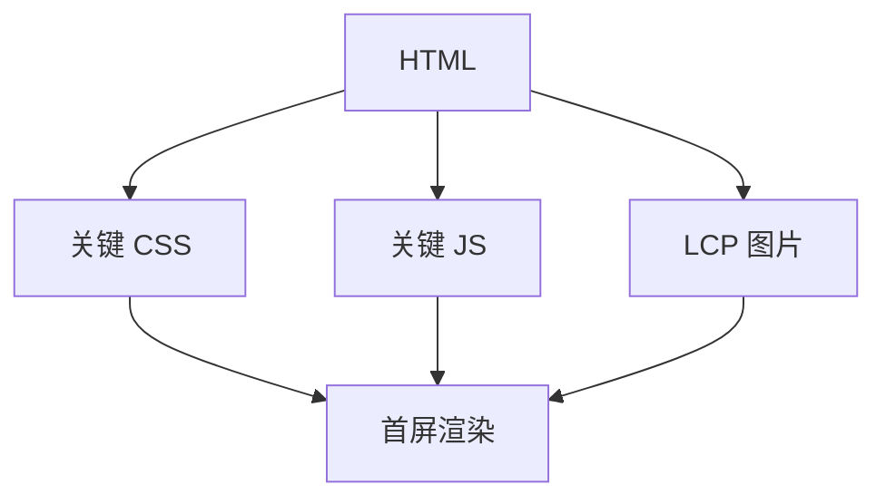

## 首屏定义

首屏时间指用户打开页面后，首屏关键内容可见所需时间。它不是单一标准指标，而是一组体验目标的业务化表达。

```txt
导航开始 -> HTML 返回 -> 关键资源加载 -> 首屏内容渲染
```

不同页面的首屏关键内容不同。文章页可能是标题和正文，商品页可能是主图、价格和购买按钮，后台页可能是核心表格骨架。

首屏时间不是单纯的“第一屏截图出现了没”，而是用户真正能开始阅读、理解或操作所需的关键内容是否已经到位。

所以首屏时间的判断一定要结合页面目标。用户进入页面后最先要完成什么，那个动作依赖哪些内容，这些内容什么时候真正到位，才是首屏优化的重点。

## 相关指标

首屏体验通常结合多个指标判断。

| 指标 | 含义 |
| --- | --- |
| TTFB | 首字节时间 |
| FCP | 首次内容绘制 |
| LCP | 最大内容绘制 |
| TTI | 可交互时间 |
| INP | 交互响应质量 |

如果 FCP 很快但 LCP 很慢，说明用户虽然看到了一点内容，但关键内容迟迟没有出现。只看一个指标容易误判。

首屏体验应该按“关键内容是否可用”来判断，而不是按“屏幕是不是已经有点东西了”来判断。

这也是为什么骨架、占位图和进度条不能直接等同于首屏完成。它们可以改善等待感，但不能代替真实内容的到位时间。

## 关键路径

首屏慢通常来自关键路径过长。



阻塞渲染的 CSS、同步 JS、大字体、晚发现的主图、慢接口都会拖慢首屏。

其中最常见的误区是把非首屏资源也放进关键路径。比如埋点脚本、客服 SDK、广告资源如果挡住了主内容，就会让首屏变慢。

关键路径优化的本质，是让真正影响首屏的资源优先被发现、优先被下载、优先被执行，而把其他内容尽量移出首屏阻塞区。

## 服务端影响

TTFB 过高会拖慢所有后续步骤。

```txt
DNS
TCP/TLS
服务器处理
数据库/接口
HTML 生成
边缘缓存
```

SSR 页面尤其要关注服务端耗时。接口串行、缓存缺失、冷启动、数据库慢查询都会体现在首屏上。

服务端慢的时候，前端再怎么拆包也救不回来。首屏优化经常要先查 TTFB，再查前端资源。

因此首屏优化很少是纯前端问题。网络、CDN、SSR、接口聚合、缓存策略和前端关键渲染路径通常要一起看。

## 前端资源

前端资源影响下载、解析和执行。

```html
<script type="module" src="/assets/main.js"></script>
<link rel="stylesheet" href="/assets/main.css" />
```

首屏优化常见手段包括压缩资源、拆分非首屏代码、内联关键 CSS、预加载 LCP 图片、延迟第三方脚本。

这些手段的共同目标是缩短“用户看见关键内容”之前的等待时间，而不是单纯压缩文件数量。

如果某个优化只是让资源总量变小，却没有真正缩短关键内容出现时间，那它对首屏的帮助可能非常有限。

## 数据请求

如果首屏依赖接口数据，就要控制请求链路。

```txt
页面加载 -> 请求用户 -> 请求权限 -> 请求列表 -> 渲染
```

串行请求会放大延迟。能并行的请求应并行，能服务端聚合的可以聚合，非首屏数据应延后加载。

首屏数据链路越短越好。每多一次必须等待的请求，首屏就多一个不确定因素。

对于依赖多接口的页面，往往要优先区分“首屏必须数据”和“首屏后可补数据”。把所有数据都绑进首屏，会让关键链路越拖越长。

## 骨架与真实首屏

骨架屏可以改善等待感，但不能把真实性能问题藏起来。

```tsx
if (loading) {
  return <ProductSkeleton />;
}
```

如果骨架显示很快但真实内容很久不出现，用户仍然会感到慢。首屏优化最终要让关键内容更快可用，而不是只更快显示占位。

骨架屏适合作为等待反馈，但它不能成为优化的借口。真正的目标仍然是让首屏内容和交互尽快到位。

如果骨架很快出现，但真实内容迟迟不来，用户感知会从“页面慢”变成“页面假装很快”。这种体验问题在高频页面上尤其明显。

## 优化路径

```txt
确定首屏关键内容
测量 TTFB/FCP/LCP
查看 Network 瀑布图
找阻塞 CSS/JS/图片/接口
拆分或提前关键资源
延迟非关键资源
用真实设备复测
```

首屏优化要围绕用户看到的关键内容展开。不同页面不要套同一套优化模板。

如果首屏已经很快，就不要为了继续压缩首屏而过度牺牲后续交互。性能优化同样需要取舍。

首屏优化是否有效，最好回到两个问题：

| 问题 | 用来判断什么 |
| --- | --- |
| 用户是否更早看到关键内容 | 体验是否变好 |
| 是否为了更快首屏牺牲了后续交互 | 取舍是否合理 |

只有同时回答好这两个问题，首屏优化才算真正有价值。
