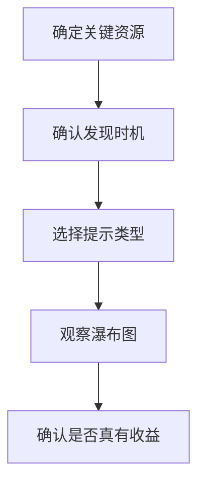

## preload

`preload` 用来告诉浏览器：这个资源马上就会用，而且优先级很高。它适合首屏关键 CSS、字体、LCP 图片和必须尽早到位的脚本。

```html
<link rel="preload" href="/fonts/brand.woff2" as="font" type="font/woff2" crossorigin />
<link rel="preload" href="/images/hero.webp" as="image" />
```

`preload` 不会直接执行资源，它只是提前开始下载。用错时，可能和真正的关键资源争抢带宽，反而拖慢首屏。

预加载最适合“确定会用，而且马上会用”的资源。它不是全局加速器，而是关键路径上的提前准备。

关键点在 `as`：浏览器会根据 `as` 判断资源类型、优先级和缓存分组。如果 `as` 写错，资源可能被下载两次，或者预加载结果无法被真正请求复用。

字体、图片、脚本、样式的 `as` 都不一样，写错后常见现象就是“看似预加载了，实际上没有复用”。这个细节很值得在验证时重点看。

预加载最常见的误区，是把“关键资源”理解成“以后会用到的资源”。只有当前页马上会用、并且发现时机确实偏晚的资源，才值得用 `preload` 抢优先级。

```html
<!-- 字体跨域时通常要带 crossorigin，否则可能无法复用预加载结果 -->
<link
  rel="preload"
  href="/fonts/inter.woff2"
  as="font"
  type="font/woff2"
  crossorigin
/>
```

## preconnect

`preconnect` 会提前建立 DNS、TCP 和 TLS 连接，适合第三方域名、字体 CDN、图片 CDN 这类很快就会请求的跨域资源。

```html
<link rel="preconnect" href="https://cdn.example.com" crossorigin />
```

如果资源很晚才用，或者根本不会用，不要预连接。连接建立本身也有成本，预得太多会浪费时间和端口。

`preconnect` 更适合确定会在首屏阶段使用的外部域名，比如字体服务、首屏图片 CDN、核心接口域名。对一堆“可能会用”的第三方域名全都预连接，通常不是优化，而是提前制造负担。

如果资源只是后续低概率使用，可以降级为 `dns-prefetch` 或完全不提示。预连接应该留给确定性更高的关键域名。

连接也是资源，预连接越多，浏览器要维护的连接状态越多。在移动端和弱网环境里，这种额外成本更容易放大。

## dns-prefetch

`dns-prefetch` 只做 DNS 解析，成本比 `preconnect` 更低，适合“可能会用，但没有那么确定”的域名。

```html
<link rel="dns-prefetch" href="//static.example.com" />
```

它的价值不是加速所有请求，而是在用户真正点击前先把解析做掉一点。它更像低成本试探，不像 `preconnect` 那样重。

如果只是“有可能会用”，`dns-prefetch` 通常比 `preconnect` 更安全，因为它成本更低。

## prefetch

`prefetch` 用来提前下载“未来可能会用到”的资源，优先级通常较低。它适合下一页路由、下一步流程、低频模块。

```html
<link rel="prefetch" href="/next-step.js" as="script" />
```

`prefetch` 不是首屏优化工具，而是“下一步体验优化”工具。把它当成首屏抢救手段，通常会失望。

例如电商详情页可以预取购物车页资源，搜索结果页可以预取前几个详情页路由，但不要在首屏还没稳定时预取大量低概率资源。

预取适合“下一步大概率会去”的资源，不适合盲猜。猜错了，不但没收益，还可能浪费带宽。

预取和懒加载常常是组合关系：把资源从首屏移出去，再对高概率下一步适度预取，既能减轻首屏，又能减少切换等待。

## modulepreload

`modulepreload` 适合 ESM 模块。浏览器会提前抓取模块及其依赖图，减少真正执行模块时的等待。

```html
<link rel="modulepreload" href="/entry.js" />
```

当项目大量使用原生 ESM、Vite 预构建产物或模块化运行时，`modulepreload` 往往比普通 `preload` 更贴合实际加载方式。

对于模块化应用，`modulepreload` 能减少导入链上的等待，但前提是模块路径稳定、构建产物可预测。

如果模块路径和 chunk 结构经常变化，`modulepreload` 的收益就会下降，因为浏览器很难持续复用这条提前发现路径。

## fetchpriority

`fetchpriority` 可以给图片、脚本、样式等资源提供优先级提示，常用于 LCP 图片。

```html

```

它和 `preload` 不是互斥关系。`preload` 更偏“提前发现资源”，`fetchpriority` 更偏“告诉浏览器资源优先级”。如果首屏大图在 HTML 中已经很早出现，优先尝试 `fetchpriority`；如果它藏在 CSS、JS 或组件懒加载后面，才更需要 `preload`。

两者的区别要分清：一个解决“浏览器什么时候知道它存在”，一个解决“知道之后把它排多前”。搞混之后，很容易多做无效提示。

## 使用边界

资源提示不是越多越好。浏览器已经有自己的优先级算法，手动提示只应该介入真正关键、稳定、可验证的资源。

| 提示 | 适合场景 | 风险 |
| --- | --- | --- |
| `preload` | 首屏关键资源 | 抢占带宽、重复下载 |
| `preconnect` | 很快会用的跨域资源 | 连接过多 |
| `dns-prefetch` | 可能会用的域名 | 收益有限 |
| `prefetch` | 下一页或低频模块 | 误判优先级 |
| `modulepreload` | ESM 模块入口 | 路径不稳定 |
| `fetchpriority` | LCP 图片或关键资源 | 优先级滥用 |



如果页面已经有很紧的首屏资源预算，优先顺序通常是：先优化真正关键的 HTML/CSS/JS，再考虑资源提示。`preload` 只是加速手段，不是资源治理本身。

资源提示最怕滥用。只要真实瀑布图已经说明资源顺序合理，就没必要为了“看起来高级”强行加一堆提示。

资源提示和 [[6.2.1 资源加载优化|资源加载优化]] 是配套关系：先判断资源重要性，再决定要不要提前。真正有效的预加载，应该能在 Network 瀑布图里看出顺序变化，而不是只在代码里多写几行标签。

资源提示是否值得保留，最终还是要看是否带来明确收益。没有收益的提示不仅增加维护成本，还会误导后来人继续叠加。

## 验证方法

验证预加载是否有效，要看三个信号：

1. 资源是否更早出现在 Network 瀑布图里。
2. 关键渲染指标是否改善，例如 LCP 或首屏稳定时间。
3. 是否出现重复下载、优先级挤占或无效预加载警告。

```text
如果 preload 后没有指标收益：
1. 资源可能本来就发现得很早
2. 资源不是当前瓶颈
3. as / crossorigin 配置不匹配
4. 带宽被错误资源抢走
```

预加载的目标不是“让资源更早下载”，而是“让正确资源在正确时间可用”。前者只是现象，后者才是性能结果。

验证时要看资源是否更早进入瀑布图、是否真正参与首屏渲染，以及有没有造成重复下载或抢占带宽。
