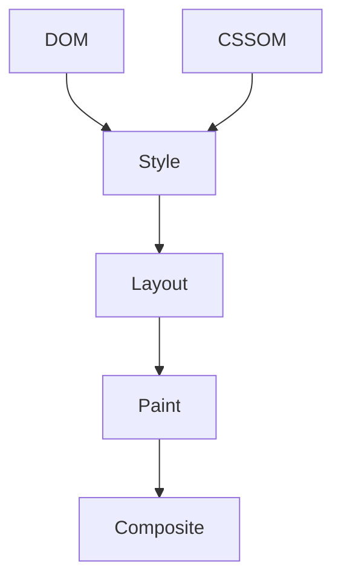

## 渲染路径

浏览器把 HTML、CSS、JavaScript 和资源变成屏幕上的像素，需要经历样式计算、布局、绘制和合成等阶段。理解这条路径，才能判断一次改动到底影响了哪类成本。



不是每次页面变化都会走完整流程。只改 `transform` 可能直接进入合成；修改宽高通常要重新布局；改变阴影和背景可能增加绘制成本。

理解渲染流水线的意义，是把“页面卡”拆成具体成本：JS 慢、样式慢、布局慢、绘制慢，还是合成图层太重。

渲染流水线不是背概念用的，而是排查性能问题的定位地图。看到卡顿时，先判断问题落在哪一段，再决定是拆 JS、减 DOM、改 CSS，还是减少复杂视觉效果。

这条流水线真正的价值，是把“页面卡”从模糊体感变成具体阶段。只有知道慢在 Style、Layout、Paint 还是 Composite，优化才不会乱用招数。

## Style

Style 阶段计算元素最终样式。CSS 选择器复杂度、DOM 规模、样式变更范围都会影响成本。

```css
.card.active .title {
  color: #1677ff;
}
```

现代浏览器对选择器很优化，通常不用为了性能牺牲可读性。但频繁修改大量节点 class，仍会触发样式重新计算。真正要关注的是“变更影响了多少节点”，而不是机械地把所有选择器写到最短。

样式计算的成本通常和 DOM 规模、变更范围有关。大型列表、复杂表格和频繁状态切换场景里，要尽量缩小影响范围。

样式优化不要迷信“选择器越短越快”。现代浏览器对选择器处理已经很强，真正要控制的是频繁变更和大范围失效。比如一个 class 改在根节点上，可能影响整页重新计算。

很多样式性能问题并不来自单个选择器写法，而是来自“改动发生得太频繁，影响范围又太大”。所以优化时更应该关注状态切换边界和 DOM 规模。

## Layout

Layout 计算元素位置和尺寸。几何变化、文本换行、容器尺寸变化都会进入这一阶段。

```text
width / height / margin / font-size / display / position
```

布局性能问题常见于大表格、复杂表单、瀑布流、虚拟列表失效和频繁读写布局属性。比如先读取 `offsetHeight`，再批量修改样式，再读取 `getBoundingClientRect()`，就可能让浏览器被迫提前完成布局计算。

```js
// 容易触发布局抖动：读写交错
const height = el.offsetHeight;
el.style.height = `${height + 10}px`;
const rect = el.getBoundingClientRect();
```

更好的方式是把读取和写入分批处理，或者把尺寸变化收敛到更小的容器中。

读写交错最容易制造强制同步布局。常见优化方式是先批量读布局信息，再批量写样式，避免浏览器反复计算。

布局成本也经常来自文本变化和容器尺寸变化。动态插入提示、异步加载图片、折叠面板展开，如果没有预留空间，都会让浏览器重新计算位置。

布局阶段最值得警惕的，是把几何变化扩散到大容器上。一个局部变化如果发生在高层容器，往往会让更多节点被重新计算。

## Paint

Paint 把元素绘制成像素。复杂背景、阴影、滤镜、大面积变化会增加绘制成本。

```css
.card {
  box-shadow: 0 12px 40px rgb(0 0 0 / 20%);
  backdrop-filter: blur(16px);
}
```

绘制问题常在滚动和动画中暴露。页面静止时还好，一滚动就掉帧，通常要看 Paint 和 Composite。大面积阴影、毛玻璃、滤镜叠加在移动端尤其容易变贵。

视觉效果越复杂，越要在真实设备上验证。桌面高性能 GPU 能扛住，不代表移动端也能扛住。

Paint 优化不能只看效果是否好看，还要看变化面积。一个小阴影问题不大，但如果滚动列表里每一项都有复杂阴影和滤镜，就会在移动端放大成本。

绘制成本常常不是单个元素太复杂，而是“复杂效果乘以大量节点、滚动和频繁变化”后的总成本。这个乘法效应在列表和卡片流里尤其明显。

## Composite

Composite 把多个图层组合成最终画面。`transform` 和 `opacity` 动画通常可以跳过 Layout 和 Paint，直接在合成阶段完成。

```css
.fade {
  opacity: 0;
  transform: translateY(8px);
  transition: opacity 160ms ease, transform 160ms ease;
}
```

合成不是免费午餐。图层太多会增加内存，移动端尤其明显。`will-change` 只应该给即将发生动画的元素使用，动画结束后要移除或避免长期挂在大量节点上。

合成层适合稳定的 transform/opacity 动画，不适合把所有元素都提升成图层。图层过多会占内存，也可能让合成成本升高。

`will-change` 适合短期提示浏览器“这里马上要变”，不适合长期挂在大量元素上。把所有动画元素都提升成图层，可能会从卡 CPU 变成卡内存和合成。

## 帧预算

60 FPS 意味着一帧约 16.7ms。JavaScript、样式、布局、绘制和合成都要在这个预算内完成。

```text
16.7ms = JS + Style + Layout + Paint + Composite
```

如果某一帧超过预算，就会掉帧。滚动、拖拽、动画和输入时尤其容易感知。低端手机上 CPU、GPU、内存都更紧张，即使桌面端看起来流畅，也不能说明移动端没有问题。

帧预算里还包括浏览器自己的工作，不是把 16.7ms 全部留给业务 JavaScript。业务代码越重，留给样式、布局和绘制的时间就越少。

低端设备上的帧预算更紧。即使目标是 60 FPS，也不能假设每帧都有完整 16.7ms 可用，真实环境还会被浏览器、系统和其他脚本占掉一部分。

因此渲染优化最好总在真实目标设备上验证。开发机上“看起来还行”的页面，在低端移动设备上可能早就掉帧明显了。

## 优化映射

不同阶段对应不同优化方法。

| 阶段 | 优化方向 |
| --- | --- |
| JavaScript | 拆长任务、减少同步计算 |
| Style | 缩小样式变更范围 |
| Layout | 避免读写交错、减少 DOM |
| Paint | 减少复杂视觉效果 |
| Composite | 使用 transform/opacity，控制图层数量 |

渲染流水线和 [[1.4.6 重排重绘|重排重绘]] 是一套机制的两个角度：流水线讲过程，重排重绘讲具体成本和触发条件。排查卡顿时，可以先用 Performance 面板确认瓶颈落在哪个阶段，再决定是拆 JS、改布局，还是减少绘制。

性能排查不要一上来就改代码。先录制一次真实交互，看主线程、Layout、Paint、Composite 哪个阶段最重，再选择对应优化手段。

优化后的验证也要回到同一条路径：同样页面、同样设备、同样操作，再录制一次对比。否则很容易出现“代码看起来优化了，但用户体验没变化”的情况。

一个更稳的排查顺序通常是：

| 问题现象 | 优先看什么 |
| --- | --- |
| 点击卡 | JS 任务、Layout、INP |
| 滚动卡 | Paint、合成层、列表节点数 |
| 动画卡 | 动画属性、图层数量、主线程占用 |
| 首屏卡 | 关键资源、首屏 Layout / Paint、LCP |
