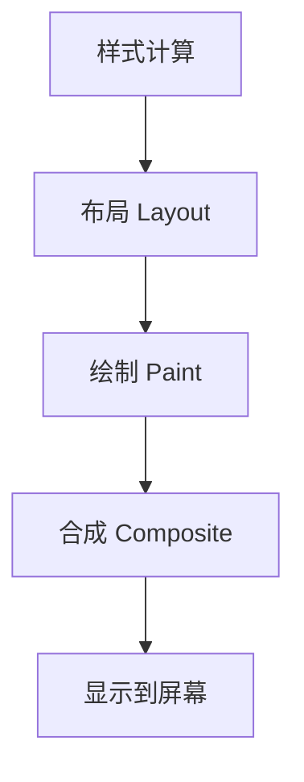

## 渲染流水线

浏览器把页面显示到屏幕上，大致会经历样式计算、布局、绘制、合成等阶段。



图层合成关注的是最后的合成阶段。浏览器会把部分内容提升到独立合成层，再由合成线程把多个图层组合成最终画面。

图层合成的价值在于把部分视觉变化从布局和绘制中分离出来，让动画更容易保持流畅。

但图层合成不是“只要上图层就更快”。它只是把问题转移到另一种成本模型里，所以是否值得一定要结合场景验证。

## 合成层

合成层可以让某些变化跳过布局和绘制，只在合成阶段完成，例如 `transform` 和 `opacity` 动画。

```css
.panel {
  transform: translateX(0);
  transition: transform 200ms ease;
}

.panel.is-open {
  transform: translateX(100%);
}
```

相比动画 `left`、`top`，动画 `transform` 更容易被浏览器放到合成阶段处理，减少主线程布局和绘制压力。

这也是为什么位移动画优先用 `transform`，淡入淡出优先用 `opacity`。它们更容易避开布局和绘制。

如果某个效果只是视觉位移，却用了会触发布局的属性，本质上就是在让浏览器做额外工作。动画属性选型是图层优化里最先该做对的事。

## 触发场景

浏览器会根据规则和启发式创建合成层。常见触发场景包括：

| 场景 | 说明 |
| --- | --- |
| 3D transform | 例如 `translateZ(0)` |
| `will-change` | 提前声明即将变化的属性 |
| video/canvas | 特殊渲染内容 |
| position fixed | 某些情况下独立合成 |
| opacity/transform 动画 | 合成友好的动画 |

具体行为由浏览器决定，不同浏览器和版本可能存在差异。不要把“触发合成层”当成绝对规则。

合成层是浏览器优化结果，不是 Web 标准承诺。写代码时应关注“属性变化是否减少布局和绘制”，而不是死记触发清单。

不同浏览器、不同设备、不同版本上的图层策略也可能不完全一致，所以经验规则最终都应该回到录制和真机验证。

## will-change

`will-change` 可以提示浏览器提前为某个元素做优化。

```css
.drawer {
  will-change: transform;
}
```

它适合即将发生动画的元素，但不应该长期大量使用。每个合成层都可能占用显存，过度提升会造成内存压力和合成成本上升。

更稳妥的做法是在动画前添加，动画后移除。

`will-change` 是提示，不是魔法开关。它让浏览器提前准备资源，但提前准备本身也要付出内存成本。

因此 `will-change` 最适合用在少量、短时、高频变化的元素上，而不是给整页卡片、列表项或公共组件默认常驻。

```js
panel.style.willChange = "transform";

panel.addEventListener("transitionend", () => {
  panel.style.willChange = "auto";
});
```

## 动画属性

渲染成本与属性类型密切相关。

| 属性变化 | 可能影响 |
| --- | --- |
| `width`、`height`、`top`、`left` | 布局、绘制、合成 |
| `color`、`box-shadow` | 绘制、合成 |
| `transform`、`opacity` | 通常只合成 |

高频动画优先使用 `transform` 和 `opacity`。布局属性适合状态切换，不适合每帧动画。

如果动画需要改变高度、宽度或位置，可以考虑用 transform 模拟视觉效果，再在动画结束后一次性更新真实布局。

## 图层爆炸

合成层不是越多越好。大量元素被提升成独立图层，会增加显存占用、纹理上传和合成成本。

```css
/* 不推荐给大量列表项统一加 */
.list-item {
  will-change: transform;
}
```

如果一个长列表里每个卡片都强制提升图层，滚动时可能更卡。优化前要用 Chrome DevTools 的 Layers、Performance 面板确认瓶颈。

图层爆炸在移动端尤其危险。显存压力上来后，合成成本和纹理上传反而会让页面更卡。

这类问题很容易在高性能电脑上被忽略，所以图层优化必须真机验证，尤其是低端移动设备和 WebView 场景。

## 定位方法

排查图层合成问题时，可以按这个顺序看：

```txt
Performance 面板确认掉帧
查看 Main 线程是否忙
查看 Paint 是否频繁
打开 Layers 看图层数量
检查动画属性和 will-change
真机验证低端设备表现
```

如果瓶颈在 JS 长任务，提升图层不能解决；如果瓶颈在大面积绘制，合成层隔离可能有帮助。先定位阶段，再选择优化手段。

所以图层优化不是万能性能药。它只对绘制和合成相关瓶颈有效，对网络慢、JS 慢、数据慢基本无能为力。

图层合成优化是否有效，可以重点看：

| 观察点 | 说明 |
| --- | --- |
| Paint 是否明显减少 | 图层隔离是否生效 |
| FPS 是否更稳定 | 动画交付是否改善 |
| 图层数量和内存是否失控 | 是否出现图层爆炸 |
| 真机滚动和动画是否更顺 | 真实设备收益 |
