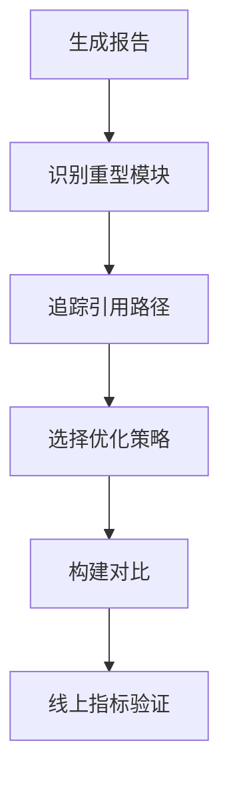

## 产物地图

可视化分析工具会把 chunk 和模块以面积图展示，帮助发现重型依赖、重复模块和意外引入。

```text
dist
├─ main.js
│  ├─ app pages
│  ├─ shared components
│  └─ vendor
├─ vendor-chart.js
└─ admin-page.js
```

看到大块依赖时，不要马上删除。先确认它为什么出现：是首屏必需、公共入口误引入、按需导入失效，还是某个组件间接依赖。

产物地图的价值在于追踪来源。一个库大不一定有问题，问题在于它是否出现在错误的入口或错误的时机。

看产物地图时，最好从入口 chunk 开始，而不是从最大文件开始。最大文件如果是低频后台页，影响可能有限；入口 chunk 里多出一个中等体积依赖，反而会影响所有用户。

所以包体积分析最应该优先回答的是“谁在影响首屏”，而不是“哪个文件面积最大”。两者有时一致，但很多时候并不完全相同。

## 首屏预算

包体积分析最好结合性能预算。预算不是绝对数字，而是团队对目标体验的约束。

```json
{
  "budgets": {
    "initialJsGzip": "180KB",
    "initialCssGzip": "50KB",
    "routeChunkGzip": "120KB"
  }
}
```

预算要按业务类型制定。内容站、营销页、电商首页、后台系统、编辑器应用的首屏预算不一样。关键是让新增依赖时有清晰成本意识。

性能预算最好接入 CI。这样新增大依赖时，PR 阶段就能看到影响，而不是上线后才发现首屏变慢。

预算不一定要一开始特别精确，但要能拦住明显退化。比如初始 JS 突然增加 80KB，就应该要求说明原因，而不是默认合并。

预算的作用不是阻止业务，而是迫使团队把体积增长说清楚。只要原因明确、收益合理、路径可接受，预算也可以被讨论，而不是僵硬执行。

## 依赖来源

大体积通常来自 UI 库、图表库、日期库、编辑器、地图、富文本、图标库、polyfill 和低频后台模块。

| 来源 | 常见处理 |
|---|---|
| UI 库 | 按需引入、样式按需 |
| 图表库 | 动态加载、按图表类型引入 |
| 图标库 | 按图标引入、使用 SVG sprite |
| 日期库 | 替换轻量库、移除多语言包 |
| 编辑器 | 延迟加载 |
| polyfill | 按目标环境裁剪 |

分析时要区分“库本身大”和“引入方式不对”。有些库可以树摇，有些库必须按子路径或插件方式引入。

例如图标库和工具库，经常因为全量导入进入主包。先检查导入方式，再决定是否替换依赖。

依赖来源还要看“是否可裁剪”。有些库支持按模块导入，有些库需要插件裁剪，有些库本身就不适合首屏。优化策略要根据库的发布形态决定。

分析大依赖时，最好先分成三类：可删除、可替换、可延后。这样后面的优化动作会更具体，不会停留在“这个库很大”的结论上。

## 代码路径

包体积异常经常来自代码路径不合理。比如只在设置页使用的图表库，因为被公共工具文件引用，最终进入首页包。

```javascript
// 不合理：公共工具里引入重库
import * as echarts from 'echarts';

export function renderChart() {}
```

更合理的方式是把重库留在使用它的低频路径里：

```javascript
export async function renderChart(container, options) {
  const echarts = await import('echarts');
  const chart = echarts.init(container);
  chart.setOption(options);
}
```

包体积分析要追引用链。只看最终产物，很容易错过真正把依赖拉进来的入口。

重依赖如果被公共工具文件引入，就会跟着公共工具进入所有页面。这类问题比单个页面使用重库更隐蔽。

排查代码路径时，可以从 bundle analyzer 里的模块反查到源码导入点，再看这个导入点是否属于公共入口。很多包体积问题，最后都是一个不该放在 `utils` 或 `index.ts` 里的导入。

这种问题特别容易出现在聚合导出、公共 helper 和基础组件层。看起来只是“方便复用”，实际上却把低频重依赖抬进了所有入口。

## 对比基线

每次优化都要和基线对比。没有基线，就无法判断优化是否有效，也无法发现新 PR 是否让包体积退化。

```text
main.js gzip: 210KB -> 168KB
vendor.js gzip: 380KB -> 260KB
initial request count: 12 -> 9
```

CI 可以保存历史构建报告，在 PR 中提示包体积变化。这样引入大依赖时，团队能在合并前讨论是否值得。

对比基线要看压缩前、gzip、brotli 和实际初始加载体积。不同维度能回答不同问题。

对比基线还要看请求数量和 chunk 数量。体积下降但请求暴增，未必一定更快；体积略增但缓存稳定，也可能是可接受的工程取舍。

因此体积分析不能只盯一个数字。下载体积、请求数量、执行成本、缓存命中和首屏路径要一起看，才不会把优化做偏。

## 分析闭环

包体积分析最终要落到策略：删除未用依赖、替换重库、改为按需加载、调整 chunk、裁剪 polyfill、优化图片字体、设置预算。



构建报告只说明“产物变了”，真实用户指标说明“体验变了”。包体积分析要和 [[6.1.2 性能指标采集|性能指标采集]] 配合，才能判断优化是否值得。

最终闭环是：发现体积异常，定位来源，选择策略，重新构建，再用线上指标确认用户体验是否改善。

包体积分析不能只停留在构建机上。最终要结合真实用户指标看 LCP、FCP、INP 是否改善，否则很可能只是把体积从一个文件挪到了另一个文件。

一个成熟的包体积分析，最终应该能推动这些判断：

| 判断 | 说明 |
| --- | --- |
| 这个依赖是否真的值得进入首屏 | 路径判断 |
| 这次增长是必要成本还是 accidental complexity | 价值判断 |
| 优化后用户是否真的更快 | 结果判断 |
