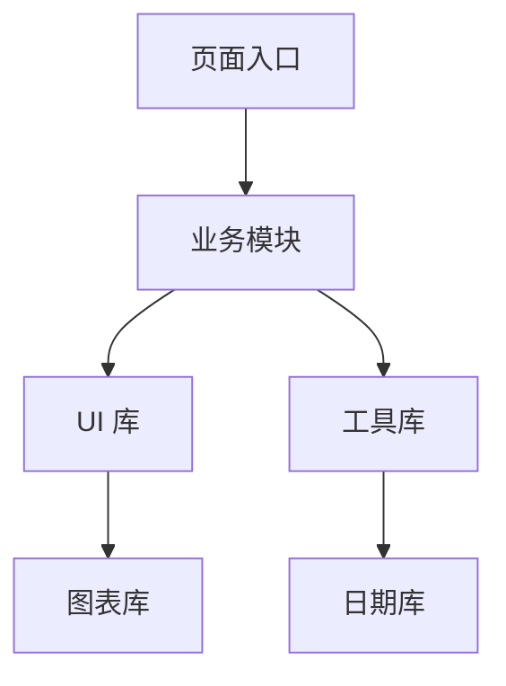

## 体积组成

一个包的体积通常由业务代码、共享代码、第三方依赖、polyfill、运行时代码和重复代码组成。

| 组成 | 典型来源 |
|---|---|
| 业务代码 | 页面、组件、状态、接口封装 |
| 第三方依赖 | UI 库、图表库、编辑器、工具库 |
| Polyfill | 兼容层、runtime |
| 重复代码 | 多入口重复引入、按需导入失误 |
| 运行时代码 | bundler runtime、chunk loader |

真正有价值的分析不是只看哪个包大，而是看它是否必要、是否可替换、是否可延后加载。

依赖分析要区分“下载成本”和“执行成本”。有些包体积不算最大，但初始化很重，也会拖慢首屏和交互。

依赖分析最重要的不是报表，而是定位“这个依赖为什么在这里”。一个库进了首屏，往往不是因为它大，而是因为导入路径、公共入口或错误的聚合引用把它带进来了。

所以依赖分析最应该优先做的，不是列出所有大库，而是先锁定首屏路径和高频路径，再看哪些依赖根本不该出现在那里。

## 构建报告

常见分析工具会生成可视化报告，帮助查看模块占比、引用路径和分包结果。无论用哪种工具，核心都要回答三个问题：谁最大、谁最热、谁最不该进首屏。

```text
分析结果应关注：
1. 首屏入口依赖
2. 重型第三方库
3. 重复打包模块
4. 深层链路上的低频代码
```

分析结果不要只记“某库很大”，还要记“它为什么会进首屏”。很多包本身不算大，但因为在公共入口被引用，就会进入所有页面。

最值得追的是首屏入口依赖。低频页面的大包可以接受，首页主路径里的重依赖才最危险。

如果某个依赖只在少数页面使用，就不要让它进入公共入口。公共入口越重，所有页面的首屏成本都会被抬高。

这类问题在工具库、聚合入口和基础组件层尤其容易发生。一个“顺手导入”的重库，最后可能让整个站点一起背成本。

## 依赖图

依赖图能揭示一个模块被哪些上游引用、又引用了哪些下游模块。依赖图越复杂，越容易出现“改一个地方，整包都变”的问题。



如果图表库和日期库都被很多页面共享，可以考虑放入独立 chunk；如果某个工具库只有少数页面用到，就不该被公共化。

依赖图还能帮助发现隐式引入。比如一个看似轻量的工具函数，因为从聚合入口导入，可能把整个工具库带进来。

看依赖图时，要特别关注“被谁引用”而不是只看“引用了谁”。一个模块如果被很多入口共享，它更适合单独拆 chunk；如果只被少数页面使用，就应该尽量保持局部。

依赖图本质上是在帮助你判断作用域。公共依赖应该稳定、低频依赖应该局部、实验依赖最好不要污染公共路径。

## 重复模块

重复模块是最隐蔽的体积问题之一。不同路径、不同版本、不同入口引用了同一库的多个拷贝，会导致包体积和运行时都变大。

| 现象 | 可能原因 |
|---|---|
| 同一个库出现多份 | 版本不一致、别名路径不同 |
| vendor 过大 | 通用入口引入过多低频依赖 |
| 某页面突然变大 | 新增重库被主入口引用 |
| 旧代码删了但包没变小 | 依赖链仍然被其他模块引用 |

依赖重复通常不是构建工具“坏了”，而是工程边界不清或者依赖版本不一致。先看引用路径，再决定是否去重、拆分或替换。

去重时要小心版本兼容。强行统一版本可能解决体积问题，但也可能引入行为差异，尤其是 UI 库、日期库和运行时框架。

依赖去重不是纯数字游戏。体积下降如果换来兼容风险、行为差异或构建不稳定，往往得不偿失。

依赖去重前最好先看重复路径。路径别名、深层导入和不同入口习惯都可能造成重复模块。先统一导入方式，再考虑版本合并，通常更稳。

## 按需加载

依赖分析最终要落到策略上。大库可以按需加载，低频页面可以懒加载，重型工具可以等用户触发后再引入。

```javascript
async function openChart() {
  const { default: echarts } = await import('echarts');
  renderChart(echarts);
}
```

按需加载不是万能的。如果某个依赖在首屏和交互中都频繁使用，分割反而会增加请求和调度开销。此时应优先考虑替换依赖、裁剪功能或预加载。

按需加载最适合低频重依赖。高频基础依赖更应该追求导入方式正确、可 tree shaking、版本统一和缓存稳定。

依赖分析的结果最好落到具体动作：删掉无用依赖、替换重量库、延迟加载低频能力、拆分公共入口、优化导入路径。只看图不行动，分析本身不会带来收益。

一个好的依赖分析报告，最后应该能指向明确动作，而不是只停留在“这个库看起来挺大”的观察层面。

## 优化顺序

优化依赖时，建议按这个顺序排查：

| 顺序 | 动作 |
|---|---|
| 1 | 找出首屏主路径 |
| 2 | 排查重型第三方库 |
| 3 | 去除重复依赖 |
| 4 | 延迟低频能力 |
| 5 | 再看 polyfill 和运行时代码 |

依赖分析和 [[6.4.4 Chunk 拆分|Chunk 拆分]] 应该一起看。前者告诉你哪些模块该拆，后者告诉你拆完之后如何组织产物和缓存。

完成依赖优化后，要对比初始 JS、异步 chunk、gzip/brotli 体积和真实指标。只看到 vendor 变小，不代表整体路径一定更快。

依赖分析是否有效，可以看这些问题：

| 问题 | 说明 |
| --- | --- |
| 首屏路径里的重依赖是否减少 | 路径优化是否命中重点 |
| 低频依赖是否被成功局部化 | 作用域是否收窄 |
| 重复模块是否减少 | 工程一致性是否提升 |
| 真实用户指标是否变好 | 最终体验是否受益 |
