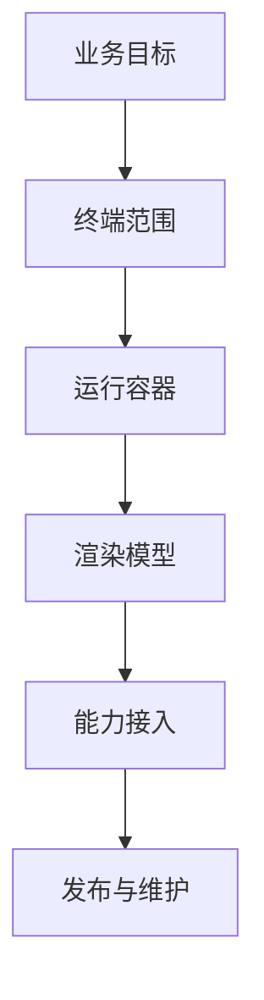

## 目标边界

多端开发不是把一份代码“无损运行到所有平台”，而是在业务目标、平台能力、团队技术栈和发布成本之间做取舍。前端视角下的多端，通常覆盖移动 Web、PWA、小程序、Hybrid、React Native、Flutter、Taro、uni-app、Electron 等路线。



判断一个方案是否合适，不能只看“能不能跨端”，还要看目标端是否真的一致、性能瓶颈在哪、原生能力要接多深、是否接受平台审核、团队是否能长期维护。

多端开发最容易误判的地方，是把“代码复用率”当成唯一指标。真正要看的是复用后是否降低了总成本，还是把差异隐藏到后期适配和线上问题里。

多端开发的本质不是“写一次跑所有端”，而是把共性沉淀出来，把差异收敛到可管理的边界里。越是成熟的多端方案，越会承认平台差异的存在。

所以多端开发最重要的不是追求表面统一，而是尽早把“不可能完全统一”的部分识别出来。越晚承认平台差异，后面的补丁成本越高。

## 终端差异

不同终端的差异不只在屏幕尺寸。输入方式、导航模型、权限体系、生命周期、网络环境、性能预算、发布机制都会改变开发方式。

| 维度 | 移动 Web | 小程序 | Native Runtime | 桌面容器 |
| --- | --- | --- | --- | --- |
| 发布 | 链接访问，更新快 | 平台审核与灰度 | 应用商店或热更新限制 | 安装包或自动更新 |
| 能力 | 受浏览器限制 | 平台 API | 原生能力强 | 系统能力较强 |
| 渲染 | 浏览器内核 | 平台 WebView/组件 | 框架运行时 | Chromium/WebView |
| 调试 | Web 工具成熟 | 平台工具链 | 原生与 JS 双侧 | Web + 桌面进程 |

同一个“扫码”需求，在 H5 里可能依赖浏览器能力或宿主 Bridge，在小程序里调用平台 API，在 React Native 里接原生模块，在 Electron 里可能接桌面摄像头权限。方案选择要从这些边界出发，而不是从框架热度出发。

终端差异越大，越不能用同一套 UI 细节硬套。更稳定的做法是复用业务规则和接口协议，把导航、布局、安全区、权限申请这些体验差异留给端侧适配。

如果页面目标是高频触达和快速迭代，Web 路线通常更灵活；如果要深度系统能力和更强交互，RN、Flutter 或原生容器会更合适。路线不是谁更高级，而是谁更贴合业务约束。

路线选择的核心问题通常不是“技术团队更喜欢什么”，而是“用户从哪里来、关键能力在哪、发布节奏能接受什么”。这三个问题清楚后，很多路线会自然收敛。

## 技术路线

常见多端路线可以分为四类：Web 扩展、宿主容器、跨端运行时、多端编译。它们不是递进关系，而是不同取舍。

```text
Web 扩展：移动 Web、PWA
宿主容器：Hybrid、小程序
跨端运行时：React Native、Flutter
多端编译：Taro、uni-app
桌面容器：Electron
```

Web 扩展适合触达和更新速度优先的业务；宿主容器适合依赖平台流量和部分原生能力的业务；跨端运行时适合体验和性能要求更高的应用；多端编译适合国内多小程序平台和 H5 同时交付；桌面容器适合把 Web 工程能力带到桌面应用。

技术路线没有绝对高低。H5 快但能力有限，RN/Flutter 体验强但工程链更重，Taro/uni-app 覆盖广但平台差异要处理，Electron 能力强但体积和安全成本高。

选路线时不要只看技术团队喜欢什么，还要看产品节奏、审核要求、设备分布和是否依赖原生能力。多端的长期成本，很多时候不是代码本身，而是发布、审核和适配流程。

多端项目的长期成本常常出现在后半段：审核、灰度、监控、版本兼容、宿主协同、真机适配。这些成本如果一开始不计入，早期的高复用率很容易变成后期维护压力。

## 代码复用

多端开发最值得复用的通常不是 UI 细节，而是业务模型、状态流、接口协议、校验规则、埋点规范和设计语言。UI 层可以复用，但平台差异越大，越需要允许端侧适配。

```ts
export type OrderStatus = "pending" | "paid" | "shipped" | "closed";

export function canCancelOrder(status: OrderStatus) {
  return status === "pending" || status === "paid";
}
```

这类纯业务逻辑可以跨 H5、小程序、React Native 和服务端测试复用。相反，滚动容器、导航栏、安全区、手势、文件上传这些和平台强相关的部分，应该通过适配层封装，而不是假装所有端都一样。

复用越靠近业务核心，收益越稳定；复用越靠近 UI 和平台能力，越要接受差异。成熟多端项目通常会把“可复用”和“必须分端”的部分明确切开。

很多多端失败案例，都是因为把 UI 层复用看得太重，最后不得不在平台适配里补大量 if 和分支。更稳的方式，是先统一模型、接口和校验，再决定每端怎么呈现。

复用越靠近页面表现，越容易被平台差异打断；复用越靠近业务规则、数据结构和协议层，收益通常越稳定。这是多端里很重要的优先级判断。

## 能力适配

多端项目里，能力适配层比“到处写 if 平台判断”更可维护。业务代码调用统一接口，平台层分别实现定位、扫码、支付、分享、通知、存储等能力。

```ts
export interface DeviceBridge {
  scanCode(): Promise<string>;
  getLocation(): Promise<{ latitude: number; longitude: number }>;
}

export async function scanProduct(bridge: DeviceBridge) {
  const code = await bridge.scanCode();
  return fetchProduct(code);
}
```

平台差异不要泄漏到所有页面。适配层可以返回统一数据结构，也可以明确声明某端不支持。比起运行时报一堆不可预期错误，提前把能力边界写进类型和错误处理更可靠。

能力适配层也要包含错误模型。比如用户拒绝权限、宿主版本过低、网络不可用、平台 API 不存在，都应该有统一错误码和降级路径。

否则业务层就会被迫感知平台细节，最后变成每个页面都要自己判断“当前是 H5 还是小程序，当前桥接是否存在，当前权限有没有开”。这种分散判断最难维护。

## 渲染差异

渲染模型决定了 UI 性能和调试方式。移动 Web 依赖浏览器渲染；React Native 把 JS 描述映射到原生视图；Flutter 使用自己的渲染引擎；小程序往往分为逻辑层和视图层；Electron 则把 Chromium 带到桌面端。

这会影响 [[7.1.2 渲染容器|渲染容器]] 的选择。比如大量文本和表单的业务，用 Web 容器通常效率很高；高频动画和复杂手势，可能更适合原生运行时或 Flutter；强桌面能力和本地文件操作，Electron 会更自然。

渲染差异还会影响团队调试方式。Web 主要看浏览器 DevTools，小程序看平台工具，RN 要看 JS 和原生双侧，Flutter 要理解 Widget、RenderObject 和引擎层。

## 发布形态

发布形态会反过来影响架构。H5 可以快速修复；小程序受平台审核和版本灰度影响；App 受应用商店审核、热更新规则和原生包版本影响；桌面应用要考虑安装包、自动更新、系统权限和签名。

```text
高频活动页：优先 H5 / 小程序
强原生体验：优先 RN / Flutter / 原生
多小程序渠道：优先 Taro / uni-app
桌面工具：优先 Electron 或原生桌面技术
```

如果业务需要“当天上线、当天回滚”，就不能忽略发布链路；如果业务需要深度系统能力，就不能只追求动态更新。多端方案的技术选择，本质上也是发布策略选择。

发布越受平台审核控制，越要提前设计灰度、回滚和功能开关。动态更新越自由，也越要重视监控和版本追踪。

分发方式本身就是架构约束。能否快速回滚、能否绕开审核、能否热更新，都会直接影响业务上线策略和故障处理方式。

## 选择判断

选择多端方案可以按四个问题推进：目标端是否明确，核心体验是否一致，能力缺口是否可控，团队维护是否可持续。只要其中一个问题答案模糊，就要先做小样验证。

小样验证最好覆盖最难的那部分，而不是只做静态页面。只要扫码、登录、支付、返回栈、滚动性能、键盘输入这些能跑通，方案基本方向才算靠谱。

```text
先验证：
页面导航和返回栈
核心列表与滚动性能
登录、支付、分享、扫码等关键能力
错误监控和灰度发布
低端设备与弱网表现
```

多端开发最怕“早期看起来统一，后期全靠补丁”。稳定的方案通常允许差异存在，但把差异收敛到清晰边界里，例如平台适配层、端侧组件、构建条件和发布流程。

如果一开始就要求所有端完全同构，后续往往会把复杂性堆到最末端。更健康的做法，是明确哪些能力共享、哪些端独有、哪些地方必须做平台适配。

选型前的小样验证要覆盖最难的部分，而不是只做一个静态页面。扫码、支付、登录、列表性能、路由返回、上传下载、监控上报这些才是真边界。

一个更稳的多端推进顺序通常是：

| 顺序 | 重点 |
| --- | --- |
| 1 | 先明确目标端和入口 |
| 2 | 再验证最难的能力和性能边界 |
| 3 | 再决定哪些层复用、哪些层分端 |
| 4 | 最后才去追求更高代码统一率 |
