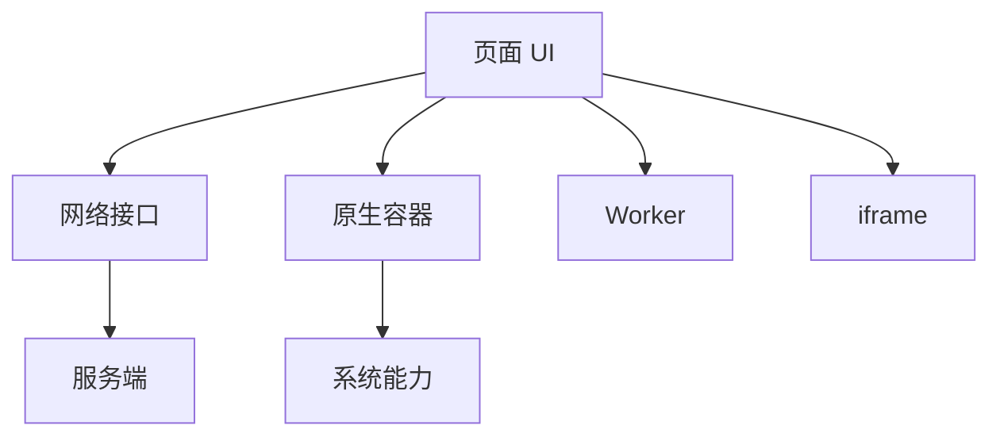

## 通信对象

多端开发里的通信模型描述的是不同运行环境之间如何交换数据和能力。前端不只和后端通信，还可能和原生容器、小程序宿主、桌面主进程、Worker、iframe、WebView 和设备系统通信。



通信模型要解决四个问题：谁调用谁，传什么，如何返回，失败如何处理。

多端通信最重要的是把边界写清楚。跨容器、跨进程、跨网络的调用都不是普通函数调用，必须默认会失败、会超时、会版本不兼容。

## 请求响应

请求响应是最常见模型。客户端发起请求，服务端返回结果。HTTP API、BFF、RPC 调用都可以归入这一类。

```typescript
async function fetchProfile() {
  const response = await fetch('/api/profile');
  if (!response.ok) {
    throw new Error(`http_${response.status}`);
  }

  return response.json();
}
```

请求响应适合查询、提交、保存、删除等明确动作。它的边界是：客户端必须处理超时、重试、取消、错误码和幂等。

移动端和小程序环境里，网络切换、后台挂起、弱网重试都很常见。请求响应模型要考虑取消和重复提交，否则容易出现脏数据。

## 事件通知

事件通知适合一对多、无强返回值的场景。例如原生通知 Web 页面登录态变化，页面通知组件刷新，WebSocket 推送新消息。

```javascript
window.dispatchEvent(new CustomEvent('auth:changed', {
  detail: { isLogin: true },
}));

window.addEventListener('auth:changed', (event) => {
  console.log(event.detail);
});
```

事件模型的风险是调用链不明显。事件名、负载结构和生命周期必须统一，否则项目会变成“谁都能发，谁都可能收”。

事件适合通知，不适合承载强流程依赖。如果发送方必须知道接收方是否处理成功，更适合请求响应或显式回调。

## 消息通道

iframe、Worker、WebView、Electron 渲染进程和主进程常通过消息通道通信。消息通常需要 `type`、`id`、`payload` 和来源校验。

```javascript
window.parent.postMessage({
  type: 'resize',
  payload: { height: document.body.scrollHeight },
}, 'https://example.com');
```

接收方必须校验来源：

```javascript
window.addEventListener('message', (event) => {
  if (event.origin !== 'https://example.com') return;
  handleMessage(event.data);
});
```

不要用 `'*'` 作为长期策略。跨上下文通信的安全边界比普通函数调用更重要。

消息通道还要校验 `type` 和 payload 结构。只校验 origin 不够，恶意或错误消息仍可能触发异常流程。

## 双向桥接

Hybrid、Electron、小程序插件等场景经常使用双向桥接。页面调用宿主能力，宿主异步回调页面。

```text
Web callNative
  -> Native dispatch
  -> System API
  -> Native callback
  -> Web Promise resolve
```

双向桥接要有请求 ID、超时、错误码和能力白名单。没有这些约束，调用一多就会出现回调错乱、能力滥用和版本兼容问题。

Bridge 协议最好版本化。宿主 App 和 H5 页面不一定同时发布，协议必须允许旧容器调用新页面，或新页面降级运行在旧容器上。

## 长连接

WebSocket、Server-Sent Events、实时数据库都属于长连接模型。它们适合聊天、通知、协作编辑、行情和实时状态。

```javascript
const socket = new WebSocket('wss://example.com/ws');

socket.addEventListener('message', (event) => {
  const message = JSON.parse(event.data);
  handleRealtimeMessage(message);
});
```

长连接必须处理重连、心跳、断网、重复消息和顺序问题。移动端切后台、弱网和系统省电策略都会影响连接稳定性。

长连接收到的消息也要幂等处理。断线重连后可能收到重复消息或补偿消息，客户端不能简单假设每条消息只来一次。

## 离线同步

离线同步是更复杂的通信模型：客户端先本地写入，网络恢复后再与服务端同步。

```text
本地操作
  -> 写入本地队列
  -> UI 乐观更新
  -> 网络恢复
  -> 同步服务端
  -> 冲突处理
```

它适合笔记、待办、草稿、协作编辑和弱网业务。核心难点不是“离线存储”，而是冲突合并、幂等提交和状态回滚。

离线同步要明确谁是最终真相。客户端可以乐观更新，但服务端确认、冲突解决和失败回滚必须有规则。

## 协议设计

通信协议应该明确字段、错误码、版本和兼容策略。

| 字段 | 作用 |
|---|---|
| `id` | 匹配请求和响应 |
| `type` | 消息类型 |
| `payload` | 业务数据 |
| `version` | 协议版本 |
| `error` | 错误信息 |

通信模型和 [[7.1.5 适配体系|适配体系]] 关系很近：不同终端的能力、网络和生命周期不同，通信协议必须能接受失败和降级。

协议设计越稳定，多端适配越轻。否则每个端都要针对模糊协议补分支，长期维护会非常痛。
