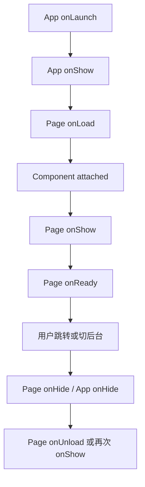

## 页面生命周期

小程序页面生命周期描述的是一个页面从创建、展示、隐藏到卸载的过程。它不是单纯的“函数执行顺序”，而是页面栈、渲染线程、逻辑线程和用户导航共同作用的结果。理解生命周期，可以避免重复请求、状态丢失、定时器泄漏和返回页面不刷新等问题。

典型页面会经历下面几类阶段：

| 阶段 | 钩子 | 适合处理的事情 |
|---|---|---|
| 创建 | `onLoad` | 读取路由参数、初始化页面状态、发起首屏请求 |
| 展示 | `onShow` | 页面重新可见、从其他页面返回后刷新轻量状态 |
| 初次渲染 | `onReady` | 获取节点尺寸、创建动画上下文、依赖视图完成的逻辑 |
| 隐藏 | `onHide` | 暂停音视频、停止轮询、记录临时状态 |
| 卸载 | `onUnload` | 清理定时器、取消订阅、释放页面级资源 |

```javascript
Page({
  data: {
    id: "",
    detail: null,
  },

  onLoad(options) {
    this.setData({ id: options.id });
    this.fetchDetail(options.id);
  },

  onShow() {
    // 从编辑页返回时，可在这里刷新不重的状态。
    if (this.needRefresh) {
      this.fetchDetail(this.data.id);
      this.needRefresh = false;
    }
  },

  onUnload() {
    clearInterval(this.timer);
  },

  fetchDetail(id) {
    wx.request({
      url: `https://example.com/api/goods/${id}`,
      success: ({ data }) => this.setData({ detail: data }),
    });
  },
});
```

`onLoad` 更像“页面实例初始化”，只在这个页面实例创建时执行一次；`onShow` 更像“页面重新进入前台”，每次页面可见都可能执行。详情页进入编辑页后再返回，通常不会重新触发 `onLoad`，所以需要把“返回后刷新”放到 `onShow` 或事件通道中。

生命周期常用于页面进入时拉取数据、页面隐藏时暂停计时器、页面卸载时清理订阅、页面显示时刷新状态。如果所有逻辑都堆在 `onLoad`，页面返回、前后台切换和缓存恢复时就容易出现状态不一致。

小程序生命周期最核心的认知，不是背出钩子顺序，而是分清“首次进入”“再次显示”“页面离开但实例还在”“页面真正销毁”这几种状态。很多重复请求、状态丢失和轮询泄漏，本质上都是把这几种状态混成了一种。

## 应用生命周期

应用生命周期作用在整个小程序级别，定义在 `app.js` 中。它适合处理登录态恢复、全局配置初始化、版本检查、埋点启动等跨页面任务，但不适合承载具体页面的业务数据。

```javascript
App({
  globalData: {
    userInfo: null,
    launchOptions: null,
  },

  onLaunch(options) {
    this.globalData.launchOptions = options;
    this.restoreSession();
  },

  onShow(options) {
    this.reportAppVisible(options.scene);
  },

  onHide() {
    this.flushAnalytics();
  },

  restoreSession() {
    const token = wx.getStorageSync("token");
    if (!token) return;
    wx.request({
      url: "https://example.com/api/me",
      header: { Authorization: `Bearer ${token}` },
      success: ({ data }) => {
        this.globalData.userInfo = data;
      },
    });
  },
});
```

应用级状态要克制使用。`globalData` 适合放用户信息、启动参数、运行配置这类少量共享状态；购物车、筛选条件、表单草稿这类业务状态更适合放到页面、组件或专门状态模块中，否则页面之间会形成隐式依赖，排查成本很高。

应用生命周期更适合处理“整个小程序什么时候进入可用状态”这类问题，例如登录恢复、全局配置加载、埋点启动和版本检查，而不是承接页面业务本身。越是跨页面的逻辑，越要警惕它是否真的应该全局化。

## 组件生命周期

组件生命周期描述自定义组件实例从创建到销毁的过程。页面生命周期关注“页面栈”，组件生命周期关注“组件实例”。同一个页面里，一个组件可能因为条件渲染、列表变更或父组件数据变化而多次创建和销毁。

```javascript
Component({
  properties: {
    productId: String,
  },

  data: {
    price: null,
  },

  lifetimes: {
    attached() {
      this.loadPrice(this.properties.productId);
    },

    detached() {
      this.abortRequest?.();
    },
  },

  pageLifetimes: {
    show() {
      this.resumeCountdown();
    },

    hide() {
      this.pauseCountdown();
    },
  },

  methods: {
    loadPrice(productId) {
      // 组件只关心自身展示所需的数据，不直接修改页面状态。
    },
  },
});
```

组件的 `lifetimes` 与 `pageLifetimes` 不要混用。`attached` 适合初始化组件自身资源；`pageLifetimes.show` 适合处理页面可见性变化带来的暂停和恢复，例如倒计时、播放器和曝光埋点。

组件销毁后异步回调仍然更新状态，是列表页和弹窗里很常见的问题。请求、订阅、计时器、观察器都要在 `detached` 中释放，尤其是列表项组件反复创建销毁时，隐藏副作用会被迅速放大。

复杂组件里，生命周期往往比页面更容易出错，因为组件可能在用户无感知的情况下频繁挂载和销毁。只要组件内部还有轮询、倒计时、观察器、动画或异步请求，就必须把进入和退出路径配套设计好。

## 生命周期顺序

进入一个普通页面时，大致顺序是应用已启动、页面创建、页面展示、页面首次渲染完成。页面内组件的创建会穿插在页面渲染过程中，因此不要假设页面 `onReady` 之前所有组件异步数据都已经完成。



真实项目里更应该关注“这个副作用属于谁”。页面请求详情数据，就放在页面生命周期；组件加载自己的远程选项，就放在组件生命周期；应用恢复登录态，就放在应用生命周期。边界清晰以后，生命周期就不再是一组要背的钩子，而是副作用归属的组织方式。

顺序本身不是用来死记的，而是用来帮助你判断“为什么这个时机会拿不到数据”“为什么节点尺寸还没准备好”“为什么返回上一页没有重新执行初始化”。理解顺序的价值，在于能更快定位副作用放错了层级。

## 数据刷新

小程序页面栈会保留前一个页面实例。用户从列表页进入详情页，再返回列表页，列表页通常不会重新执行 `onLoad`。如果详情页修改了数据，列表页需要通过事件通道、全局状态或 `onShow` 判断来刷新。

```javascript
// 列表页
Page({
  onShow() {
    if (this.shouldReload) {
      this.loadList();
      this.shouldReload = false;
    }
  },

  goEdit(item) {
    wx.navigateTo({
      url: `/pages/edit/index?id=${item.id}`,
      events: {
        updated: () => {
          this.shouldReload = true;
        },
      },
    });
  },
});

// 编辑页
Page({
  submit() {
    const channel = this.getOpenerEventChannel();
    channel.emit("updated");
    wx.navigateBack();
  },
});
```

如果刷新成本很低，可以在 `onShow` 中直接拉取；如果请求昂贵，就用标记位或事件通道判断是否需要刷新。这个判断和 [[7.3.4 路由|路由]] 的页面栈行为强相关。

这里最容易踩的坑是“返回后总是全量刷新”和“返回后永远不刷新”两个极端。前者会让用户感觉每次返回都重新加载，后者会让用户看到旧状态。更好的做法是按数据类型拆分：轻量状态返回时补刷，重数据结合标记或事件只在必要时刷新。

## 资源清理

生命周期最容易出问题的地方不是“少请求了一次”，而是“没有停止”。定时器、WebSocket、事件订阅、背景音频、位置监听和长轮询如果不清理，会让隐藏页面继续消耗资源，甚至造成重复回调。

```javascript
Page({
  onShow() {
    this.timer = setInterval(() => {
      this.pollOrderStatus();
    }, 5000);
  },

  onHide() {
    this.stopPolling();
  },

  onUnload() {
    this.stopPolling();
  },

  stopPolling() {
    if (!this.timer) return;
    clearInterval(this.timer);
    this.timer = null;
  },
});
```

同一清理逻辑通常要同时放在 `onHide` 和 `onUnload` 能覆盖的路径里：切后台、跳转到其他页面、返回上一页都可能发生。对于组件，也要在 `detached` 中释放订阅，否则列表组件频繁销毁创建时会留下隐藏副作用。

资源清理的难点在于它通常不会立刻报错，而是在线上以“越来越卡”“回调重复执行”“偶尔状态错乱”的形式出现。生命周期里凡是有启动动作的地方，最好都反向检查一遍它在什么时机会被停止。

## 触发边界

生命周期容易出错的地方包括：误以为 `onLoad` 每次返回页面都会触发，页面隐藏后未清理计时器，路由跳转方式不同导致生命周期不同，组件销毁后异步回调仍然更新状态。

写小程序时，要先确定页面是“首次加载”“再次显示”还是“重新进入”，再决定逻辑放在哪个生命周期。页面生命周期不是越多用越好，而是要把初始化、恢复、清理和销毁这些副作用放在准确的位置。

只要把生命周期理解成“副作用应该挂在哪一层、在哪个时机启动、在哪个时机停止”，很多看似零散的问题就会连起来。它和页面栈、路由、数据绑定、组件通信本来就是同一套运行模型的不同切面。
