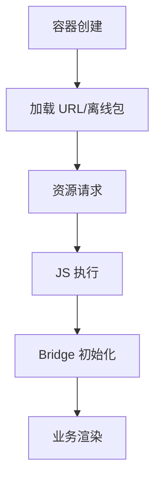

## 容器定位

WebView 是原生应用中承载 Web 页面的容器。Hybrid 开发的核心就是让 H5 运行在 App WebView 中，并通过容器获得部分原生能力。

```txt
Native App
  ├─ 原生页面
  ├─ WebView 容器
  │   └─ H5 页面
  └─ Bridge 能力
```

WebView 不是完整浏览器。它缺少浏览器地址栏、扩展、部分调试能力，也会受到 App 容器、系统版本和内核差异影响。

同一个 H5 页面在 Chrome 里正常，不代表在 App WebView 里也一定正常。WebView 还会受到 App 初始化、容器注入脚本、网络代理、离线包、权限配置和系统内核版本影响。

WebView 的“像浏览器”只体现在承载 Web 内容，不代表运行环境完全一样。很多移动端问题其实来自容器层，例如内核版本差异、UA 差异、Cookie 策略、媒体自动播放限制、文件选择器、键盘避让和页面返回行为。排查时不能只看前端代码，还要确认宿主 App 是否改写了默认行为。

对前端来说，真正重要的不是记住某个 WebView API，而是先建立一个认知：页面看到的是 Web 界面，问题根因却可能在原生容器。只要还把 Hybrid 页面当成“放进 App 的普通 H5”，很多排查方向都会跑偏。

## 加载来源

WebView 可以加载线上 URL，也可以加载本地离线包资源。

```kotlin
webView.loadUrl("https://m.example.com/product/1")
```

```kotlin
webView.loadUrl("file:///android_asset/offline/index.html")
```

线上 URL 更新快，但受网络影响；本地离线包首屏稳定，但需要版本管理、校验和回滚。成熟 Hybrid 项目通常会结合两者。

加载来源的选择，本质上是在“更新速度”和“首屏稳定性”之间找平衡。活动页、营销页、临时运营页更适合线上 URL；核心首页、登录页、交易页往往更适合离线包或混合方案。不同页面可以采用不同来源，不必所有页面都强行一致。

| 来源 | 优点 | 风险 |
| --- | --- | --- |
| 线上 URL | 更新快、发布简单 | 网络波动、首屏不稳定 |
| 离线包 | 首屏稳定、可控性强 | 版本管理复杂 |
| 混合模式 | 兼顾速度和更新 | 容器逻辑更复杂 |

离线包最容易出问题的地方是“版本不一致”。如果 H5 代码、Bridge 协议和原生容器版本没有对齐，就会出现只在部分用户设备上复现的灰度问题。

离线包还要考虑缓存清理、资源签名和灰度回滚。用户设备里可能同时存在多个版本的资源，如果容器没有按版本隔离缓存，旧页面和新脚本混用就会引发非常隐蔽的白屏、点击失效或接口参数错误。

加载来源没有绝对优劣，关键是按页面类型做选择。越接近交易、登录、首页这类稳定主链路，越要重视首屏稳定和版本可控；越接近活动、营销、运营配置类页面，越要重视更新效率和热修复能力。

## 生命周期

WebView 要跟随原生页面生命周期处理暂停、恢复和销毁。

```txt
Activity onResume -> WebView 恢复
Activity onPause -> WebView 暂停
Activity onDestroy -> WebView 销毁
```

音视频、定位、定时器、WebSocket、页面订阅都可能受生命周期影响。页面关闭时没有释放 WebView，容易造成内存泄漏。

```kotlin
override fun onDestroy() {
  webView.stopLoading()
  webView.removeAllViews()
  webView.destroy()
  super.onDestroy()
}
```

销毁 WebView 时要同时考虑页面内 JS 任务和原生资源。只关闭页面 UI，不等于网络请求、定时器和媒体资源都已经释放。

WebView 的生命周期还和内存回收有关。频繁新建和销毁 WebView 会消耗更多内存和初始化时间，所以很多容器会尝试复用实例或做预创建。但复用也会带来状态残留风险，必须在进入页面时清理上一个页面留下的注入变量、事件监听和缓存状态。

生命周期处理得成熟时，容器和页面会像一套完整应用一样协作：页面知道什么时候该暂停轮询、释放监听、保存草稿，容器知道什么时候该暂停渲染、释放资源、销毁实例。两边只要有一侧把退出流程处理得不完整，问题就会在线上慢慢积累成卡顿和泄漏。

## URL 拦截

容器可以拦截 URL，用于登录跳转、协议识别、资源加载控制等。

```txt
myapp://openLogin?redirect=/checkout
https://m.example.com/product/1
```

自定义协议要做白名单校验，不要让任意 URL 调用敏感原生能力。能通过 Bridge 明确调用的能力，不建议滥用 URL scheme。

URL 拦截适合简单跳转和历史兼容；复杂能力调用更适合走明确的 Bridge 协议，因为 Bridge 更容易做参数校验、权限控制和版本管理。

URL 拦截也常用于外链治理。H5 页面里出现第三方跳转、支付回跳、下载链接、电话链接时，容器可以决定是留在 WebView 内、交给原生页面，还是打开系统浏览器。这个分流应该在容器层统一管理，而不是页面里到处写 `window.location`。

把 URL 拦截当成“通用能力入口”时要特别谨慎。简单跳转和历史兼容可以走 URL scheme，复杂业务能力还是应该回到显式 Bridge 协议，否则后期参数校验、权限判断和版本兼容都会越来越难做。

## JavaScript 注入

Hybrid 容器经常需要向页面注入环境变量、Bridge 对象或初始化脚本。

```js
window.NativeBridge = {
  invoke(name, params) {
    // 调用原生能力
  },
};
```

注入脚本要控制时机。太早可能页面还没准备好，太晚可能业务代码已经访问了 Bridge。成熟项目通常会定义明确的 ready 事件，让 H5 等容器能力就绪后再调用。

注入还要防止重复和冲突。页面刷新、路由切换、热更新或 WebView 复用时，Bridge 对象可能被多次注入。最好把注入结果做成幂等的，避免同名对象被覆盖后出现回调丢失或老页面监听失效。

注入脚本最好有清晰的 ready 语义。页面不应该靠“猜现在大概已经注入完成了”去调用容器能力，而应该等容器明确宣布可用。Hybrid 里大量偶发 bug，本质上都是时序没定义清楚。

## 安全配置

WebView 安全边界非常重要。H5 一旦被 XSS 攻击，可能进一步调用 Bridge 影响原生能力。

| 配置 | 建议 |
| --- | --- |
| JavaScript | 按需开启 |
| 文件访问 | 尽量限制 |
| mixed content | 禁止或严格控制 |
| 域名 | 白名单 |
| Bridge 方法 | 最小暴露 |
| 调试开关 | 生产关闭 |

WebView 的风险不是“页面被篡改”这么简单，而是 Web 漏洞可能变成 App 能力滥用。涉及登录态、支付、定位、相册、通讯录等能力时，容器必须做权限和来源校验。

安全配置还包括 Content Security Policy、混合内容限制、Cookie 策略、文件访问权限和调试开关。生产环境里任何“临时放开一点”的配置都可能扩大攻击面，尤其是能访问用户登录态或本地资源的容器页面。

WebView 安全和普通 H5 安全最大的差别在于后果范围。页面如果只是在浏览器里出问题，影响通常停留在 Web 层；页面如果能进一步调起宿主能力，风险就会从 XSS 扩大到登录态、支付、文件和设备能力滥用。

## 调试方式

Hybrid 调试需要同时看 H5 和原生。

```txt
H5: Console、Network、Source Map
Android: Chrome Inspect、Logcat
iOS: Safari Web Inspector、Xcode Console
容器: Bridge 日志、离线包版本、路由日志
```

白屏问题尤其要同时检查资源加载、JS 错误、Bridge 初始化、离线包版本和容器拦截规则。

调试时要区分“页面没加载”还是“加载后没渲染”。前者看容器和网络，后者看 JS、框架、Bridge 和数据。很多 Hybrid 白屏并不是 Web 代码一开始就错，而是原生注入没完成、接口没返回、离线包版本错配或页面等待 Bridge 导致的。

Hybrid 调试最忌讳只盯着单侧日志。Web 侧可能只看到“Bridge 不存在”，原生侧才知道其实是注入失败；Web 侧可能只看到接口超时，容器侧才知道其实是离线包加载了错误版本。只有两边日志能对齐，问题才真正可复现。

## 白屏排查

WebView 白屏通常不是单一原因。可以按加载链路从外到内排查。



如果 Network 没有请求，先看容器加载和拦截；如果资源成功但页面空白，先看 JS 错误；如果页面依赖原生能力，继续看 Bridge 是否注入、协议版本是否匹配。

白屏排查时最好同时记录容器版本、离线包版本、页面 URL、网络环境和首个异常日志。只靠截图很难复现，必须把“页面在哪个容器里、加载了哪个资源、调用了哪个桥方法”描述清楚。

白屏治理的关键，不只是出了问题后能查，而是平时就把加载链路埋清楚。容器创建、URL 加载、资源请求、首屏渲染、Bridge ready、关键接口完成这些节点如果都有记录，线上排查成本会低很多。

## 性能边界

WebView 性能问题常见于首次创建、资源加载、JS 执行、图片渲染和 Bridge 高频通信。

预创建 WebView、离线包、资源缓存、首屏骨架、减少同步 Bridge 调用都能改善体验。但这些优化都要权衡内存、版本一致性和实现复杂度。Hybrid 的性能优化不是单纯 Web 优化，也不是单纯原生优化，而是容器、页面和协议一起优化。

常见优化手段还包括预创建 WebView、减少首屏同步脚本、拆分重型页面、延后 Bridge 依赖、压缩静态资源和控制消息频率。尤其是 Bridge 高频调用，一旦发生在滚动或动画过程中，就容易把原本还行的页面拖慢成卡顿页。

Hybrid 性能优化通常不是某一层单独完成的。页面、容器、Bridge 和资源策略必须一起看，才能判断用户感知里的“慢”到底是创建慢、下载慢、执行慢还是通信慢。
