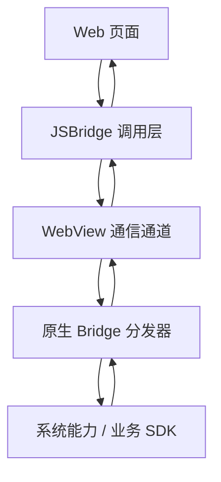

## 协议版本

JSBridge 应该有协议版本。页面和宿主不一定同步发布，如果没有版本检测，新页面很容易调用旧宿主不存在的接口。

页面调用敏感或新能力前，可以先查询容器版本或能力列表，再决定展示入口或走降级逻辑。

版本检测最好按“能力”而不是“整包版本号”来做。不同渠道、灰度包、热修复包都可能让同一个版本号下能力不完全一致，所以 Bridge 更适合暴露 `canIUse` 或能力清单，由页面按能力决定是否展示入口。

协议版本真正要解决的不是“页面能不能知道版本号”，而是“页面能不能在不确定宿主版本的情况下安全运行”。只要这个问题没解决，Hybrid 项目迟早会遇到新页面调用旧宿主的事故。

## 错误模型

桥接错误要有统一模型，至少区分：

- 接口不存在
- 参数错误
- 用户取消
- 权限不足
- 原生执行失败
- 超时

如果所有错误都只返回失败，页面就无法给用户正确提示，也无法准确监控问题来源。

错误模型最好能区分用户取消、权限拒绝、能力不可用、参数错误、超时、容器异常和业务失败。这样页面才能决定是安静返回、弹授权引导、提示重试，还是把问题上报给监控系统。

错误模型清晰之后，Bridge 才真正像一个可维护的接口层。否则页面看到的只有“失败了”，原生看到的只有“回调过了”，两边都说不清到底是用户取消、权限没开还是协议本身出了问题。
## 通信边界

JSBridge 是 Hybrid 页面和原生容器之间的通信桥。Web 页面负责 UI 和业务逻辑，原生容器负责系统能力、账号、支付、分享、扫码、定位、文件和安全能力。JSBridge 的作用是把这些能力包装成前端可调用的协议。



Bridge 的边界必须清晰：Web 不应该直接知道原生内部实现，原生也不应该执行 Web 任意传来的指令。双方通过稳定协议通信。

清晰边界的另一个好处是方便版本演进。Web 可以更快迭代 UI 和交互，但只要协议稳定，原生就不需要跟着每次页面改动一起发布。反过来，原生升级也不会把页面逻辑带坏，只要协议版本和兼容策略写清楚。

Bridge 最怕边界模糊。一旦 Web 开始依赖原生实现细节，或者原生开始假设 Web 一定按某种顺序调用，协议层就会慢慢失去独立性，后续每次改动都要双端一起冒险。

## 协议结构

一个可维护的 Bridge 协议通常包含方法名、参数、请求 ID、回调、超时和错误码。不要只传一个字符串，也不要把复杂对象拼成不可校验的 URL。

```typescript
type BridgeRequest<T = unknown> = {
  id: string;
  method: string;
  params: T;
};

type BridgeResponse<T = unknown> =
  | { id: string; ok: true; data: T }
  | { id: string; ok: false; code: string; message: string };
```

请求 ID 用来匹配异步回调，错误码用来区分用户取消、权限拒绝、能力不可用、参数错误和系统异常。协议越早规范，后续加能力越不容易失控。

协议设计时还要约定同步和异步语义。像获取用户信息、打开分享面板、发起支付、选择图片这类能力，是否同步返回、何时回调、取消时返回什么，都应该在协议层明确，不然页面和原生会对“调用成功”的理解完全不同。

协议结构越明确，监控也越容易做。请求 ID、方法名、错误码和耗时一旦标准化，就可以同时在 Web 侧和原生侧打通一条完整调用链。

## 调用封装

页面层不应该直接拼接 Bridge 请求，而应该通过统一封装调用。封装层负责生成请求 ID、注册回调、设置超时、处理错误和清理回调。

```typescript
const callbacks = new Map<string, {
  resolve: (value: unknown) => void;
  reject: (reason: Error) => void;
  timer: number;
}>();

export function callNative<TParams, TResult>(
  method: string,
  params: TParams,
  timeout = 8000,
): Promise<TResult> {
  return new Promise((resolve, reject) => {
    if (!window.NativeBridge) {
      reject(new Error('bridge_unavailable'));
      return;
    }

    const id = `${Date.now()}_${Math.random().toString(16).slice(2)}`;
    const timer = window.setTimeout(() => {
      callbacks.delete(id);
      reject(new Error('bridge_timeout'));
    }, timeout);

    callbacks.set(id, { resolve: resolve as (value: unknown) => void, reject, timer });
    window.NativeBridge.postMessage(JSON.stringify({ id, method, params }));
  });
}

window.__bridgeCallback__ = (response) => {
  const callback = callbacks.get(response.id);
  if (!callback) return;

  clearTimeout(callback.timer);
  callbacks.delete(response.id);

  if (response.ok) {
    callback.resolve(response.data);
  } else {
    callback.reject(new Error(response.code));
  }
};
```

这层封装是 Hybrid 项目的生命线。没有它，页面里会散落大量平台判断、超时处理和错误分支，后期很难统一治理。

封装层还能处理幂等和并发。比如连续点击支付按钮时，应该阻止重复调用；页面销毁时，应该清理未完成回调；Bridge 没准备好时，应该统一排队或拒绝，而不是让每个页面自己猜。

对业务页面来说，理想状态是把 Bridge 当成一个受控的异步服务，而不是一个随时可能失联的全局对象。封装层做得越扎实，页面层就越不用反复处理超时、兼容和回调清理这些重复问题。

## 能力白名单

Bridge 必须有白名单。原生侧只允许调用被注册、被审核、参数可校验的方法，不能根据 Web 传来的字符串任意反射执行。

```typescript
const bridgeMethods = {
  'share.open': shareOpen,
  'scan.open': scanOpen,
  'auth.getToken': authGetToken,
};

function dispatch(request) {
  const handler = bridgeMethods[request.method];

  if (!handler) {
    return {
      id: request.id,
      ok: false,
      code: 'method_not_allowed',
      message: 'method is not registered',
    };
  }

  return handler(request.params);
}
```

越敏感的能力越要有额外校验。支付、文件、定位、账号、剪贴板这类能力不应该仅凭页面发起调用就执行，还要结合页面来源、用户状态、权限和业务场景判断。

白名单不是只限制方法名，还要限制参数来源。比如分享链接必须来自可信域名，支付金额必须来自服务端下单结果，定位和账号能力必须确认当前页面有调用资格。对原生来说，Web 页面永远是“不完全可信”的输入方。

真正成熟的白名单体系，关注的是“哪些页面、在什么条件下、能调用哪些能力、带哪些参数”。方法名只是入口，权限和上下文才决定是否真的应该执行。

## 参数校验

Bridge 参数来自 Web 页面，必须当作不可信输入。原生侧要校验类型、范围、必填字段、URL 来源和业务权限。

```typescript
function validateShareParams(params: unknown) {
  if (typeof params !== 'object' || params === null) {
    throw new Error('invalid_params');
  }

  const value = params as { title?: unknown; url?: unknown };

  if (typeof value.title !== 'string' || value.title.length > 80) {
    throw new Error('invalid_title');
  }

  if (typeof value.url !== 'string' || !value.url.startsWith('https://example.com')) {
    throw new Error('invalid_url');
  }

  return {
    title: value.title,
    url: value.url,
  };
}
```

参数校验不只是防攻击，也能减少线上兼容问题。Web 版本和 App 版本不一致时，字段缺失、类型变化、枚举新增都很常见。

如果参数结构需要演进，可以采用向后兼容策略：新字段可选、旧字段保留默认值、枚举新增时保持旧分支可运行。这样 Web 升级后，旧 App 至少还能跑通基础流程，不会因为一个字段变化整条链路崩掉。

参数校验除了防攻击，也是在防线上混版本。只要 Web 和 App 不能保证完全同步发布，参数缺失、字段重命名和类型漂移就迟早会发生，校验层越早收口，线上越稳。

## 版本兼容

Hybrid 最大的复杂度在于 Web 可以随时发布，App 用户却分散在多个版本。新 Bridge 能力上线时，前端必须检测能力是否存在，并准备降级路径。

```typescript
async function shareArticle(article) {
  if (window.NativeBridge?.canIUse?.('share.open')) {
    return callNative('share.open', {
      title: article.title,
      url: article.url,
    });
  }

  await navigator.clipboard.writeText(article.url);
  showToast('链接已复制');
}
```

能力检测比 App 版本号判断更稳。不同渠道、灰度包、热修复包可能导致同一版本号下能力不完全一致。Bridge 应尽量提供 `canIUse` 或能力清单。

页面层在使用新能力时，也应该准备降级方案。例如分享图片能力不可用时退回到复制链接，扫码能力不可用时回退到手动输入，获取定位失败时允许用户手动选择城市。Bridge 不是只负责“能不能”，还要负责“不能时怎么办”。

兼容策略如果没有提前设计，最后通常只剩下两种糟糕结果：要么强制用户升级 App，要么页面线上直接失效。Hybrid 的稳定性，很大程度上就取决于这些降级路径是否提前准备好了。

## 回调语义

Bridge 回调要区分“失败”和“用户取消”。用户取消分享、取消支付、拒绝授权都是正常业务分支，不应该全部当成系统错误。

| code | 含义 | 页面处理 |
|---|---|---|
| `cancelled` | 用户主动取消 | 通常不弹错误 |
| `permission_denied` | 权限拒绝 | 引导授权或降级 |
| `unsupported` | 当前容器不支持 | 使用 Web 兜底 |
| `timeout` | 调用超时 | 提示重试 |
| `internal_error` | 原生异常 | 上报并兜底 |

回调语义清楚以后，页面交互会自然很多。用户取消不该被吓一跳，系统失败则应该有明确重试或反馈入口。

对支付、授权、分享这类用户明确可控的动作，`cancelled` 应当被视为正常结果而不是错误。真正需要上报的是桥超时、原生异常、协议不匹配和参数错误，这些才是会影响稳定性的信号。

回调语义稳定之后，页面交互会自然很多。用户取消不再被误判成系统故障，监控也不会把正常取消堆成错误洪峰，团队才能真正看见高风险问题集中在哪些桥能力上。

## 安全来源

Bridge 不应该对所有页面开放。原生容器要校验当前 URL 来源，限制只有可信域名或可信离线包能调用敏感能力。

```text
可信页面
  -> 注入 Bridge
  -> 允许基础能力
  -> 按能力继续校验权限

非可信页面
  -> 不注入 Bridge
  -> 外链使用系统浏览器打开
```

JSBridge 和 [[7.4.7 容器能力|容器能力]] 是同一个安全体系的两面：Bridge 是调用协议，容器能力是可暴露资源。协议越强，越需要边界越清楚。

如果页面既要调用登录、支付，又要处理弱网和离线包，就更应该把 Bridge 层和业务层分开。业务页面只关心“我要支付/我要分享”，Bridge 层负责协议、回调、超时和权限，容器层负责真正执行能力。这样后续换宿主、换版本、换协议都不会牵连整页代码。

Bridge 安全最终不是一条校验规则，而是一整套来源、能力、参数、权限和回调的治理体系。只要其中任何一环过于宽松，Web 页面和宿主能力之间的边界就会被慢慢侵蚀。
