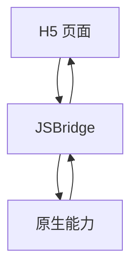

## Bridge 模型

Hybrid 容器通信通常通过 JSBridge 完成。H5 调用原生能力，原生也可以回调 H5。



Bridge 是 H5 和 Native 之间的协议层。它应该提供业务化能力，而不是把原生系统 API 原样暴露给 H5。

容器通信不只是“谁能调用谁”，还包括消息是否可靠、是否可追踪、是否可回放。一个稳定的通信层，至少要支持请求响应、主动通知、超时处理和错误码回传，否则一旦线上出问题，页面和原生很难对齐到底是哪一步出了故障。

Bridge 的设计最好像接口协议一样严肃。H5 和 Native 的发布节奏不同，一旦协议随意变化，就会出现“新 H5 调旧 App”“旧 H5 调新 App”的兼容问题。

容器通信如果只是“先能调通”，项目后面几乎一定会在版本兼容和问题排查上补更多成本。越早把它当成一层正式协议，后面的页面和容器协作就越稳。

## H5 调用原生

H5 调用原生时，通常传入方法名、参数和回调 id。

```ts
bridge.call("chooseImage", {
  count: 1,
}).then((result) => {
  console.log(result.files);
});
```

方法名要白名单注册，参数要校验。比如 `chooseImage` 可以暴露，但任意文件读取、任意 shell 调用绝对不能暴露。

方法设计也应该尽量业务化，例如 `payOrder`、`openLogin`、`chooseImage`、`getDeviceInfo`，而不是直接暴露“打开系统相册”“执行某段原生代码”。越贴近业务，权限边界越容易控制，页面也越容易读懂。

H5 调用原生时一定要有超时和取消处理。原生 SDK 可能无响应、用户可能取消授权、App 可能切到后台，调用方不能无限等待。

调用路径最好也能被追踪。页面发出了什么请求、容器是否收到、原生是否执行、多久返回、返回了什么结果，这些如果都能串起来，线上定位会轻松很多。

## 原生通知 H5

原生可以向 H5 发送事件，例如网络变化、登录成功、页面返回、扫码结果。

```ts
bridge.on("networkChanged", (payload) => {
  updateNetworkStatus(payload.type);
});
```

事件要有清晰命名和 payload 结构。不要让 H5 依赖某个平台的原生对象，否则多端容器会很难统一。

原生通知 H5 的事件最好是少而明确。网络变化、登录变化、页面返回、扫码结果、主题变化这类事件已经足够覆盖大多数场景。事件越多，H5 越容易对平台细节形成隐式依赖，后续迁移成本也越高。

事件通知要注意页面生命周期。页面销毁后应取消监听，否则原生继续回调时可能触发旧页面逻辑，造成重复弹窗、重复请求或内存泄漏。

原生主动通知的价值，在于把平台级变化同步给页面，而不是把页面业务逻辑搬到原生侧驱动。通知越贴近宿主状态，页面越容易保持独立。

## 协议设计

一个稳定 Bridge 协议至少包含方法名、参数、返回值、错误码、版本和权限。

```json
{
  "method": "payOrder",
  "params": {
    "orderId": "o1"
  },
  "bridgeVersion": "3"
}
```

返回值也要规范。

```json
{
  "success": false,
  "errorCode": "PAY_CANCELLED",
  "message": "用户取消支付"
}
```

没有错误码规范时，H5 只能靠字符串猜测失败原因，后续很难做重试、降级和埋点分析。

协议版本和方法版本最好统一规划。方法升级时尽量保留旧参数兼容，必要时通过新方法名、新版本号或能力探测平滑切换，而不是让 H5 和原生在同一个方法上同时猜对方支持什么。

协议还应该明确错误结构。比如 `code` 表示机器可判断的错误，`message` 用于展示或日志，`detail` 用于调试。不要让 H5 靠字符串包含关系判断失败原因。

一个好的通信协议，应该让页面不必知道宿主内部是 Android 还是 iOS，也不必知道底层 SDK 细节。页面只看统一请求和统一结果，这样跨平台容器才有真正的一致性。

## 版本兼容

H5 更新速度通常快于 App。新 H5 调用旧 App 不支持的 Bridge 方法，是 Hybrid 常见事故。

```ts
if (bridge.supports("shareProduct", "2.1.0")) {
  bridge.call("shareProduct", { productId });
} else {
  copyShareLink(productId);
}
```

Bridge 能力要可探测。服务端下发 H5 资源时，也应根据 App 版本控制可用功能。

能力探测也能帮助灰度发布。比如新能力先只对部分 App 版本开放，H5 根据 `supports` 结果显示入口，服务端再按版本控制资源下发，这样可以避免新旧版本混跑时的全量故障。

版本兼容的兜底方案要提前设计。旧 App 不支持分享能力时，可以退化为复制链接；不支持扫码时，可以退化为手动输入。没有降级路径，就只能强制用户升级 App。

通信兼容最重要的不是“新能力怎么上线”，而是“旧用户怎样不断”。只要旧版本用户还在使用，容器通信就必须默认自己长期处在混版本环境里。

## 安全边界

Bridge 安全要按“最小能力、最小参数、最小域名”设计。

| 风险 | 防护 |
| --- | --- |
| XSS 调用 Bridge | 域名白名单、CSP、参数校验 |
| 任意 URL 唤起能力 | scheme 白名单 |
| 敏感接口滥用 | 登录态校验、权限校验 |
| 参数注入 | schema 校验 |
| 旧版本能力缺失 | 版本探测、降级 |

H5 侧也要把 Bridge 调用封装成领域 API，例如 `payOrder`、`chooseAvatar`、`openLogin`，页面不要直接拼底层协议。

从调用方视角看，Bridge 通信越像普通业务 API 越好；从宿主视角看，Bridge 能力越少、越清楚、越可校验越好。两边目标并不冲突，前提是协议层把“业务语义”和“底层实现”分开。

安全边界还要配合域名白名单和登录态校验。只允许可信 H5 页面调用敏感能力，并且每次调用都要校验参数和权限，不能因为页面运行在 App 内就默认可信。

容器通信真正健康的状态，是页面既能把原生能力当成稳定服务来调用，宿主又始终保留足够强的校验和控制权。这样既不会让页面处处受限，也不会让宿主暴露出过大的攻击面。
