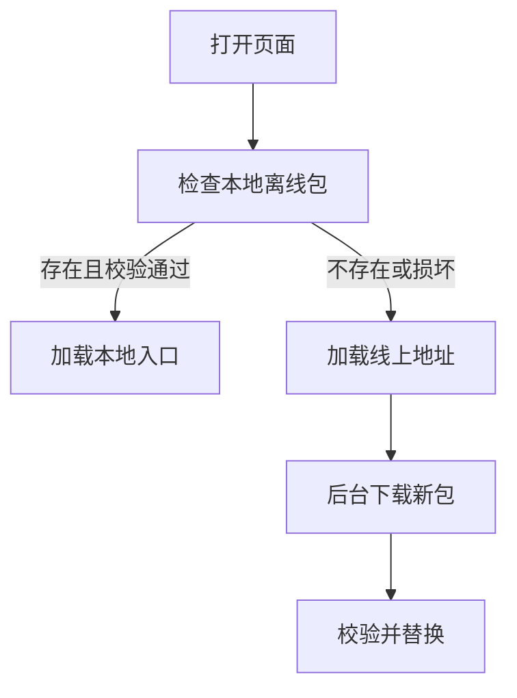

## 离线包定位

离线包是把 H5 资源提前下载到 App 本地，再由 WebView 从本地加载。它解决的是弱网、首屏慢、资源不稳定和网络抖动带来的体验波动。

```text
服务端发布资源 -> App 下载离线包 -> 校验解压 -> WebView 本地加载
```

离线包不是缓存的简单别名。它通常有版本、灰度、校验、回滚和增量更新策略，更像一套“可控的前端交付包”。

离线包的核心价值不是“离线也能跑”，而是把前端资源交付从不稳定的网络环境里剥离出来，让容器在可控条件下加载一组已知版本的资源。对于首页、登录页、交易页这类高价值页面，离线包可以显著降低首屏抖动，但它也把版本管理责任带到了客户端。

离线包真正难的地方不在“怎么下载下来”，而在“下载之后如何长期稳定使用”。只要包版本、宿主版本、Bridge 能力和缓存策略没有一起设计，离线包带来的可控性很快就会变成新的复杂度来源。

## 资源清单

离线包需要清楚描述资源版本和文件完整性。

```json
{
  "version": "2026.07.28.1",
  "entry": "index.html",
  "files": [
    {
      "path": "assets/app.js",
      "sha256": "..."
    },
    {
      "path": "assets/app.css",
      "sha256": "..."
    }
  ]
}
```

清单用于判断是否需要更新、下载后是否完整、加载入口在哪里。没有校验的离线包，一旦下载损坏就会变成白屏风险。

资源清单一般还会配合校验和、文件大小和依赖关系一起使用。这样即使只下发了部分文件，也能快速识别出是不是完整包，而不是等到 WebView 运行后才发现页面缺资源。

资源清单还可以记录最低 App 版本、目标平台、灰度规则和回滚版本。这样服务端下发包时，就能避免把不兼容的资源发给旧客户端。

清单设计得越完整，线上排查越省力。至少要知道这个包是谁构建的、对应哪个分支、依赖了哪个 Bridge 版本、适用于哪些平台、是否允许离线回退、是否允许覆盖旧包。没有这些元数据，出问题时只能靠猜。

资源清单本质上就是离线包的“发布契约”。客户端按它判断能不能下、能不能装、能不能开，服务端按它判断发给谁、什么时候回滚、是否需要强更。契约越清楚，运行时越稳。

## 加载流程

WebView 启动时可以优先检查本地离线包，失败时降级到线上地址。



本地加载能提升稳定性，但必须保留远程兜底。否则离线包损坏、版本不兼容或解压失败时，用户会直接卡死。

离线包的加载顺序通常不是“有本地就全程本地”，而是“本地优先、远程兜底、异常回落”。尤其是首屏入口、登录态获取和关键配置读取，不能只依赖本地包自己完成。

离线包的启动顺序还要区分“首次安装”和“再次打开”。首次安装时更适合边下载边显示进度或直接走线上兜底；再次打开时则应优先使用已验证版本。不要把首次安装和增量更新混成同一种加载逻辑。

加载流程设计成熟时，页面不会因为“本地有包”就盲目相信本地，也不会因为“线上一定最新”就忽略本地优势。它应该始终在“可用性、正确性、速度”三者之间做明确取舍。

## 更新策略

离线包更新通常不阻塞当前页面。更常见做法是后台下载，下次打开生效。

| 策略 | 适合场景 | 风险 |
| --- | --- | --- |
| 启动前强更新 | 重大兼容修复 | 阻塞启动 |
| 后台静默更新 | 普通资源更新 | 本次打开仍是旧版 |
| 增量更新 | 大包频繁发布 | 差量计算复杂 |
| 灰度发布 | 风险控制 | 版本管理复杂 |

涉及支付、登录、协议变更的关键更新，要有强制策略和回滚能力。

如果业务页面需要频繁改动，增量更新会比整包更新更省流量，但实现复杂度也更高。要不要上增量更新，通常看包体规模、发布频率和终端网络环境，不是看名字好不好听。

如果页面更新频率高但资源复用低，整包更新反而更容易实现。增量更新适合大包、频繁发布、资源重复率高的场景；否则 patch 计算和合并逻辑本身可能比重新下载更复杂。

更新策略最好按页面价值和风险等级分层。首页、登录、支付链路更适合稳健策略，活动页、运营页和内容页可以更积极一些。不是所有页面都值得享受同一种热度和复杂度。

## 缓存失效

离线包和 HTTP 缓存要配合设计。入口 HTML、JS、CSS、图片资源的缓存策略不同。

```text
index.html -> 跟随离线包版本
app.[hash].js -> 长缓存
app.[hash].css -> 长缓存
runtime 配置 -> 可独立刷新
```

资源文件名带 hash 可以避免旧资源污染。入口文件负责引用当前版本资源，不要让多个版本互相混用。

离线包和浏览器缓存一样，都怕“入口没换、内容换了”或“内容换了、入口没换”。只要版本边界没切干净，就很容易出现白屏、资源 404 或页面功能错乱。

入口文件最好只负责引用当前版本资源，不要把版本判断、环境判断和业务逻辑堆进去。入口越纯粹，版本切换越安全。静态资源则适合按 hash 长缓存，让新旧版本可以并存，减少互相污染。

缓存失效真正要避免的是“新入口引用旧资源”或“旧入口引用新资源”。只要新旧资源开始交叉组合，问题往往不会立刻暴露，而是以偶发现象慢慢渗出来，最难排查。

## 安全校验

离线包属于可执行前端代码，必须校验来源和完整性。

```txt
HTTPS 下载
签名或哈希校验
版本白名单
失败回滚
解压路径限制
```

解压时要防止路径穿越，不能让包内文件写到离线包目录之外。离线包系统一旦被污染，影响会比普通接口缓存更大。

安全校验还应该覆盖下载链路和解压链路。下载前看来源域名和签名，解压前看目录边界和文件类型，解压后看 hash 和入口文件是否存在。不要因为“本地包更快”就放松校验。

离线包不是离线模式的全部。很多页面仍然要访问接口、登录态和配置中心，所以网络失败后的兜底路径也要一起设计。真正稳定的离线包方案，不是“本地资源一定能跑”，而是“本地资源跑不了时，仍然知道怎么退回线上”。

如果离线包还承载了敏感能力，比如支付、登录、协议签署，就要把校验、回滚、灰度和版本控制设计得更严格。因为这类问题一旦出错，影响的不是体验，而是业务正确性。

离线包方案最终要落到可观测和可回滚。用户有没有拿到新包、拿到的新包能不能启动、启动后是否白屏、桥是否正常、接口是否成功，这些都要能被记录和回滚，而不是只看“下载成功”。

离线包治理成熟的标志，不是“我们已经上了离线包”，而是“我们知道每个用户现在跑的是哪个包、这个包能不能安全启动、出问题时能不能快速切回上一版本”。
