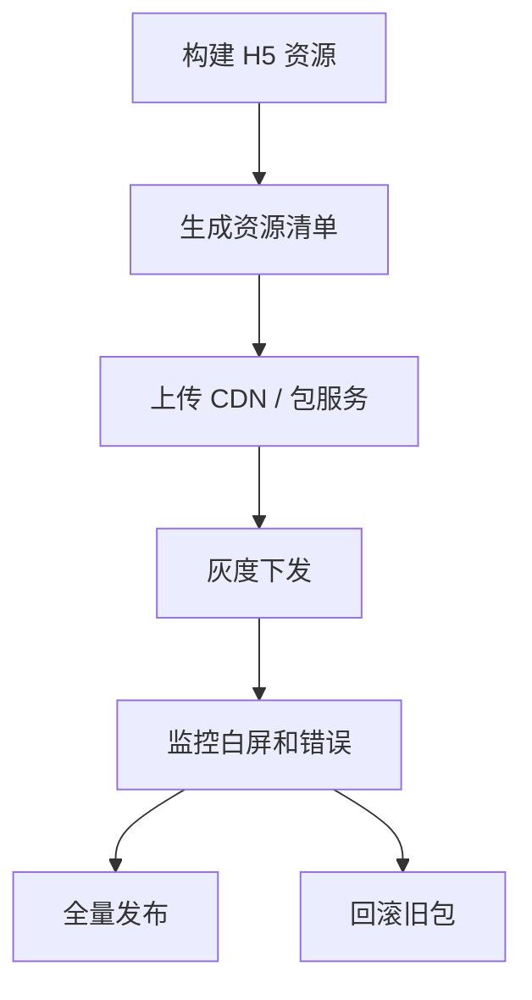

## 更新边界

Hybrid 热更新通常指在不重新发布完整 App 的情况下，更新 WebView 中的 H5 资源、离线包、业务配置或低风险文案。它不是绕过应用商店审核的万能通道，也不适合随意改变原生能力、支付链路、隐私权限或安全敏感逻辑。

```text
适合热更新：
H5 页面资源
离线包资源
远程业务配置
低风险文案和样式

不适合热更新：
原生二进制能力
权限声明变化
支付和风控核心逻辑
平台要求审核的能力变化
```

热更新的价值是缩短修复链路，但边界必须清楚。越接近资金、账号、隐私和数据一致性，越应该保守。

热更新最适合修复静态资源、模板结构、样式和非核心配置。它的价值在于“尽快止血”，但不是任何问题的默认解法。越是与支付、账号、风控和权限相关的逻辑，越应该走更稳妥的发布链路。

热更新最危险的误用，就是把它当成“线上任何问题都能立刻修”的万能通道。修得越快，不代表风险越小；如果边界没收清，热更新只会把局部问题更快地放大到全量用户。

## 离线包

Hybrid 常用离线包提升加载速度和可用性。App 先下载一份资源包到本地，WebView 打开页面时优先读取本地资源，再根据版本策略更新。

```json
{
  "packageId": "mall-home",
  "version": "3.8.0",
  "entry": "index.html",
  "minAppVersion": "2.14.0",
  "files": {
    "index.html": "sha256-...",
    "assets/app.js": "sha256-..."
  }
}
```

离线包必须有清单、版本、完整性校验和入口文件。没有校验的热更新会把网络传输、缓存污染、资源篡改风险放大到所有用户。

离线包和热更新常常是一体两面：离线包解决交付形态，热更新解决发布速度。它们都需要版本指针、资源签名、灰度策略和回滚通道，否则“热”起来的不是更新效率，而是事故扩散速度。

在 Hybrid 体系里，热更新通常不是单独存在的一项功能，而是建立在离线包、资源清单、版本治理和容器能力之上的发布机制。底座不稳，更新越热，风险越高。

## 版本匹配

H5 资源经常依赖宿主 App 的 Bridge 能力。新 H5 调用了旧 App 没有的 Bridge API，就会出现运行时失败。所以热更新下发必须按 App 版本、系统平台、渠道、灰度人群过滤。

```ts
type PackageRule = {
  h5Version: string;
  minAppVersion: string;
  maxAppVersion?: string;
  platforms: Array<"ios" | "android">;
  rollout: number;
};
```

版本匹配要双向考虑：旧 App 能不能跑新资源，新 App 是否还能兼容旧资源。大型 Hybrid 项目通常会维护 Bridge 版本和能力探测，而不是只靠 App 版本号判断。

如果热更新资源依赖新的 Bridge 协议，最好同时检查资源版本、Bridge 版本和 App 版本。三者只要有一个不匹配，页面就可能在首屏、按钮点击或授权流程上掉链子。

版本匹配真正要解决的是“谁有资格拿到这个更新”。不是所有客户端都应该拿到同一份资源，特别是在 Android/iOS、老新版本、不同渠道包、灰度组并存的情况下，下发范围本身就是风险控制的一部分。

## 下发流程

可控热更新流程至少包含构建、上传、校验、灰度、监控、全量、回滚。少任何一环，都会把“快速修复”变成“快速扩大事故”。



灰度比例不要只按随机用户，也要覆盖平台、App 版本、渠道和设备类型。否则灰度阶段看起来正常，全量后才暴露某个端的兼容问题。

灰度期间最应该关注的不是平均成功率，而是失败分布。比如某个低端 Android、某个 iOS 系统版本或某个渠道包错误率明显偏高，就应该立即暂停扩大发布，而不是等整体指标掉下去再处理。

可控下发的关键不是有没有灰度，而是灰度后能否及时停。只要扩大比例的动作比问题发现和回滚动作还快，灰度就会失去它本来应该承担的保护作用。

## 缓存策略

热更新最容易出问题的是缓存。HTML、JS、CSS、图片、离线包清单可能处在不同缓存层：App 本地缓存、WebView 缓存、CDN 缓存、HTTP 缓存。更新策略必须明确谁控制入口，谁控制静态资源。

```text
推荐：
入口清单短缓存
静态资源带 hash 长缓存
离线包按版本目录存放
回滚保留上一稳定版本
```

不要覆盖同名资源后期待所有用户立即生效。更稳的方式是版本化路径和资源 hash，让新旧版本可以共存，回滚时只切换清单或版本指针。

缓存治理的关键是把“谁在控制入口”说清楚。通常由清单控制入口，由 hash 控制静态资源，由版本目录控制回滚。这样客户端即使缓存了一份旧清单，也不会误用新旧混杂的资源。

真正稳定的热更新，往往不是资源下载得多快，而是缓存层级之间职责足够清楚。入口负责选版本，静态资源负责被稳定引用，客户端负责保留旧版，服务端负责切换指针，谁都不要多做一步。

## 完整性校验

热更新资源下载后要校验完整性。清单里记录文件 hash，客户端下载后逐个校验，失败时使用旧包或在线兜底。否则半包、脏包、网络中断都可能导致白屏。

```ts
async function verifyFile(filePath: string, expectedHash: string) {
  const actualHash = await sha256File(filePath);
  if (actualHash !== expectedHash) {
    throw new Error("resource integrity check failed");
  }
}
```

校验失败不能继续使用新包。客户端应保留上一可用版本，并把失败信息上报，包括 App 版本、包版本、文件名、网络状态和设备信息。

完整性校验通过不代表包一定可用，还要检查入口是否能执行、首屏接口是否正常、Bridge 是否可用。很多线上事故不是“包损坏”，而是“包虽然完整，但依赖的宿主能力没变”。

所以完整性应该分成两层看：文件完整性保证“资源没坏”，运行完整性保证“资源能跑”。只有两层都通过，热更新包才算真正可用。

## 回滚机制

热更新必须能回滚。回滚可以通过服务端停止下发、切回上一版本、客户端检测失败自动降级、关键页面在线兜底等方式实现。

```text
回滚能力：
服务端版本指针回退
客户端保留旧包
异常阈值自动熔断
关键页面远程开关降级
```

回滚也要考虑缓存。如果 CDN 仍然缓存错误清单，服务端切回旧版本也可能无效。因此清单缓存时间要短，静态资源可长缓存但必须版本化。

回滚最好预留自动熔断条件，例如白屏率超过阈值、桥失败率升高、下载失败连续增加、关键页面首屏明显超时，就自动停止继续下发新版本。人工回滚很重要，但自动熔断更像最后一道保险。

热更新体系成熟时，回滚应该像发布一样标准化，而不是事故发生后临时想办法。能不能一键切回、多久能切回、客户端多久感知到切回，这些都要在平时就验证过。

## 监控指标

热更新发布后要重点看白屏率、JS 错误率、资源下载失败率、Bridge 调用失败率、页面打开耗时和业务转化指标。只看“包下载成功”是不够的。

```javascript
reportHybridMetric({
  appVersion,
  packageVersion,
  bridgeVersion,
  page: location.pathname,
  type: "white-screen",
});
```

监控必须带上 App 版本、包版本和 Bridge 版本。没有版本维度，就无法判断问题来自热更新资源、宿主能力还是某个渠道包。

热更新监控不能只看“发出去多少”，还要看“用户真的用上了吗”“用上以后是否正常”。下载成功只是开始，首屏可用、关键动作可用、核心链路可用，才说明这次热更新真正生效。

监控最有价值的时候，不是在一切正常时证明“没问题”，而是在某一版开始变差时，能立刻知道是哪个版本、哪个端、哪个页面、哪种链路出了问题。没有版本维度的监控，热更新几乎无法长期稳定运行。

## 政策风险

移动平台通常允许一定范围内的 Web 内容更新，但对绕过审核、改变核心功能、下载可执行代码、引入未声明权限等行为有限制。热更新方案要符合平台政策和公司合规要求。

对于 Hybrid 应用，安全边界要更保守：热更新资源来自可信源，下载链路使用 HTTPS，清单签名或校验，敏感能力由宿主做权限控制。热更新越强，越需要治理，否则它会成为线上风险放大器。

如果更新内容触及平台政策边界，宁可慢一点也不要硬推。热更新不是规避审核的捷径，而是缩短安全范围内的修复路径。越靠近平台规则红线，越应该先确认合规再发布。

从治理角度看，平台政策本身也是热更新边界的一部分。技术上能做到，不代表产品上应该做；能快速上线，也不代表可以跳过审核和合规判断。
