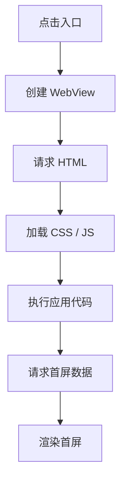

## 白屏来源

Hybrid 白屏通常不是单一问题，而是容器启动、网络请求、资源加载、JS 执行、接口失败和桥通信共同作用的结果。治理白屏要先定位发生在哪一层，再决定是优化加载、增加降级还是修复异常。

空白页是最差的失败形态。核心页面即使不能恢复，也应该提供重试、返回或联系客服等路径，而不是让用户停留在纯白页面。

白屏不只是视觉问题，也是产品问题。用户看到空白时，往往不知道页面是在加载、失败还是卡住了，所以治理白屏的第一步不是优化，而是让失败路径可见、可操作、可恢复。

| 层级 | 可能原因 | 表现 |
|---|---|---|
| 容器层 | WebView 创建慢、内核异常、进程被杀 | 页面还没开始加载 |
| 网络层 | HTML 请求失败、DNS 慢、证书错误 | 长时间空白或错误页 |
| 资源层 | JS/CSS 加载失败、缓存损坏 | HTML 到达但页面不渲染 |
| 执行层 | JS 语法错误、运行时异常 | 页面停在空壳 |
| 数据层 | 首屏接口失败、接口超时 | 骨架屏后无内容 |
| 桥层 | JSBridge 未注入或调用失败 | 依赖原生能力的页面卡住 |

白屏治理的关键是把“空白”拆成可观测阶段。否则只能靠用户截图猜问题，修复会很被动。

如果同一个白屏在不同设备上表现不同，优先看层级差异而不是先改代码。容器层、网络层、资源层、执行层、数据层、桥层分别对应不同修复方式，混在一起会让排查成本翻倍。

白屏治理最重要的前提，是先把“空白”翻译成具体阶段故障。只要还停留在“用户说页面白了”这个粒度，团队就很容易在容器、H5、服务端三边来回拉扯。

## 加载链路

Hybrid 页面从用户点击到首屏展示，大致经历容器创建、HTML 下载、静态资源加载、JS 执行、数据请求和渲染提交。



每个阶段都要有时间点埋点。比如 `container_start`、`html_start`、`html_end`、`js_loaded`、`app_mounted`、`first_data_ready`、`first_screen_rendered`。有了阶段数据，才能判断优化重点是容器预热、资源缓存还是接口性能。

加载链路埋点的价值，不只是定位慢点，也是在区分“有没有加载”与“加载后为什么没显示”。这两类问题在用户看来都像白屏，但根因和修复路径完全不同。

## 容器兜底

容器层白屏要靠原生侧兜底。WebView 加载超时、主文档失败、进程崩溃或收到错误状态时，原生容器应展示错误页、重试按钮或降级入口，而不是让用户停留在纯白页面。

```text
WebView 加载
  -> 超时计时
  -> 成功渲染首屏：关闭计时
  -> 超时未完成：展示容器错误页
  -> 用户点击重试：重新加载或切换离线包
```

容器兜底不能依赖前端 JS，因为 JS 可能根本没有执行。越底层的失败，越应该由更底层兜底。

容器错误页最好带上重试、返回上一页、切换线上版本或联系客服入口。用户在白屏时最需要的不是解释，而是尽快离开或重试；容器层兜底的目标就是把“卡死”降级成“可恢复”。

容器层兜底一旦存在，很多严重问题就不再以“纯白卡死”的方式暴露给用户。哪怕底层没有立刻修好，至少还能把失败转成一次明确、可操作的恢复路径。

## 资源兜底

静态资源失败是 Hybrid 白屏的高频原因。常见方案包括离线包、资源预加载、版本校验、CDN 多域名、HTML 降级和缓存修复。

```html
<script>
  window.__APP_BOOT_TIMEOUT__ = setTimeout(function () {
    document.body.innerHTML = '<div class="fallback">页面加载失败，请重试</div>';
  }, 8000);
</script>
<script src="https://cdn.example.com/app.abc123.js"></script>
<script>
  clearTimeout(window.__APP_BOOT_TIMEOUT__);
</script>
```

这个兜底只能处理部分前端启动失败，不能替代容器级错误页。真正稳定的 Hybrid 通常会配合离线包：HTML 和核心 JS 预置或提前下载，弱网时优先使用本地资源。

资源兜底还要考虑缓存失效。HTML 常常是入口，JS 和 CSS 可能由 hash 文件控制，图片和字体则可能来自 CDN。只要有一层兜底失败，就要回到更上层重新加载，而不是在同一层无限重试。

资源兜底真正有用的时候，是能让页面快速知道“继续等已经没意义了”。继续等待只会让白屏时间更长，而及时切换到降级页、旧包或线上版本，往往更能保护体验。

## 数据兜底

首屏数据失败不应该表现为白屏。页面至少要能展示骨架屏、空状态、错误状态和重试入口。对于首页、频道页、商品详情这类高价值页面，可以使用缓存数据先展示，再后台刷新。

```javascript
async function loadHome() {
  const cached = await readCache('home-data');
  if (cached) {
    renderHome(cached, { stale: true });
  }

  try {
    const fresh = await requestHome();
    renderHome(fresh, { stale: false });
    writeCache('home-data', fresh);
  } catch {
    if (!cached) {
      renderError({ retry: loadHome });
    }
  }
}
```

缓存兜底要标记数据是否过期，不能让用户误以为旧数据是最新状态。涉及价格、库存、权益、支付等敏感数据时，缓存只能用于展示，不应用于最终决策。

数据兜底还有一个边界：不可以让“旧缓存 + 新交互”组合成错误状态。比如用户已经下单、余额已变、权限已改时，页面应该优先保证动作正确，再考虑展示缓存数据。

这也是为什么数据兜底要区分“可展示的旧数据”和“不可作为决策依据的旧数据”。骨架屏、缓存摘要、旧内容预览都可以帮助用户少等，但关键动作还是要基于当前真相。

## JSBridge 兜底

Hybrid 页面如果依赖 JSBridge 获取登录态、定位、设备信息或支付能力，桥未就绪也会造成白屏。页面应区分“桥未注入”“调用超时”“能力不可用”和“用户取消”。

```javascript
function callBridge(name, payload, timeout = 5000) {
  return new Promise((resolve, reject) => {
    if (!window.NativeBridge) {
      reject(new Error('bridge_not_ready'));
      return;
    }

    const timer = setTimeout(() => reject(new Error('bridge_timeout')), timeout);

    window.NativeBridge.call(name, payload, (result) => {
      clearTimeout(timer);
      resolve(result);
    });
  });
}
```

桥能力失败时，页面要有替代路径。例如无法获取定位时让用户手动选择城市，无法唤起分享时复制链接，无法读取登录态时跳转登录页。

桥兜底一般还要配合超时阈值。调用原生能力如果一直不回调，页面不能无限等待；应该在超时后切换到降级方案，并把失败记录到监控里，避免用户看起来像“页面卡住”。

很多 Hybrid 页面之所以看起来像白屏，不是因为页面完全没起来，而是页面把首屏建立在某个桥能力一定成功的假设上。只要这个假设被打破，首屏就应该尽快切到可恢复状态，而不是继续空等。

## 监控闭环

白屏治理必须依赖监控闭环。仅靠异常上报不够，因为很多白屏没有 JS 异常。需要同时采集加载阶段耗时、资源错误、接口超时、桥调用失败、容器错误和用户重试。

| 指标 | 含义 |
|---|---|
| 白屏率 | 首屏超时或无有效内容的比例 |
| 首屏耗时 | 从入口点击到首屏可见 |
| 资源失败率 | JS/CSS/图片加载失败 |
| 接口超时率 | 首屏接口超过阈值 |
| 桥失败率 | JSBridge 调用失败或超时 |
| 重试成功率 | 用户重试后恢复比例 |

白屏治理和 [[7.4.2 JSBridge|JSBridge]]、[[7.4.5 热更新|热更新]] 都有直接关系：桥负责能力可用性，热更新负责快速修复资源和代码问题，但两者都需要监控判断是否真的解决了白屏。

白屏治理不是一次性修完就结束，而是持续监控。新版本发出后要盯首屏可见率、容器错误率、资源失败率和桥失败率，只要某个指标回升，就说明白屏链路又有新的风险点。

真正的闭环是这样的：先通过链路埋点知道白屏发生在哪一层，再用兜底把失败变成可恢复，再用监控验证修复是否真的生效。只有这三件事连起来，白屏治理才不是一次次被动救火。
