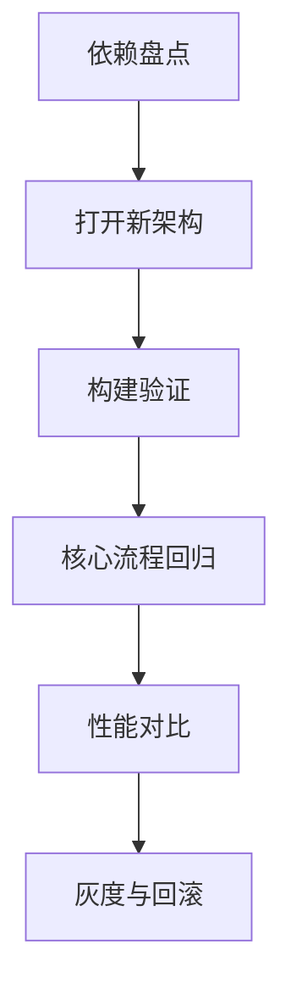

## 新渲染架构

Fabric 是 React Native 新架构中的渲染系统，目标是让 React 与原生视图之间的协作更同步、更类型化、更高效。

```txt
React Fiber -> Shadow Tree -> Fabric Renderer -> Native Views
```

它不是一个 UI 组件库，而是底层渲染架构升级。业务开发者更多感受到的是新架构兼容性、性能和原生组件接入方式变化。

Fabric 与 Turbo Modules、JSI、Codegen 一起构成 React Native 新架构的重要部分。理解 Fabric 时，不要只看“渲染更快”，还要看它如何改变 JS 与原生之间的协议边界。

Fabric 带来的真正变化，不只是“更快”，而是把渲染、布局和原生更新的职责重新整理了一遍。对业务层来说，这意味着组件协议更类型化、原生组件接入更规范，但也意味着老旧组件和第三方库必须重新验证。

Fabric 最容易被误解成一次“纯性能升级”。实际上它更像一次底层渲染协作模式重构，性能只是结果之一，真正受影响的是组件协议、原生接入方式、第三方库兼容和调试验证路径。

## Shadow Tree

React Native 会先构建用于布局和渲染计算的 Shadow Tree，再提交到原生视图层。

```txt
JS 组件树
  -> Shadow Tree 布局计算
  -> Commit
  -> Native View 更新
```

Fabric 改进了这条链路，让渲染更新更接近 React 的并发能力，也减少旧架构中 Bridge 序列化带来的成本。

Shadow Tree 可以理解为“原生视图更新前的中间表示”。它不等同于真实 UI，而是布局、属性和更新计划的承载层。

Shadow Tree 的存在让布局和提交之间多了一层可控中间态。这样做有助于并发能力和更新一致性，但如果业务代码频繁制造无意义更新，Fabric 依旧会被拖慢。底层更先进，不代表上层可以更粗糙。

这也是理解 Fabric 的关键点之一：它改善的是“更新如何被组织和提交”，不是替代业务层做状态治理和渲染收敛。上层如果仍然频繁重渲染、大量创建节点或堆积复杂列表，底层收益会被很快吃掉。

## 与旧架构差异

| 维度 | 旧架构 | Fabric |
| --- | --- | --- |
| 通信 | Bridge 异步序列化 | JSI 更直接 |
| 渲染 | UIManager | Fabric Renderer |
| 原生组件 | 旧 Native UI Component | Codegen + 新组件模型 |
| 类型 | 较弱 | 更依赖规范和生成 |
| 并发能力 | 受限 | 更贴近 React 新能力 |

迁移 Fabric 时，最大成本通常不是业务 JSX，而是原生组件、第三方库和构建配置兼容。

旧架构里很多问题来自 JS 和 Native 之间的异步序列化通信：参数要排队、序列化、跨线程传递。Fabric 并不是让所有更新都免费，而是减少一部分协议和通信成本，并让渲染链路更适合 React 新能力。

迁移 Fabric 时，最容易忽略的是“原来勉强能跑的库，现在是否仍然可用”。原生组件、手势库、地图、视频、动画、导航和第三方 UI 库都可能依赖旧渲染假设，所以升级前一定要做依赖盘点，而不是只看业务页面 JSX。

旧架构到 Fabric 的差异，不只是接口名和底层对象变化，更是一些隐含行为可能变了：事件时序、属性更新时机、布局测量节奏、原生组件挂载与销毁方式都可能出现细微漂移。这些漂移往往只会在复杂交互和边缘设备上暴露。

## Codegen

新架构鼓励通过规范文件生成 JS 与原生之间的类型绑定。

```ts
export interface NativeProps extends ViewProps {
  color?: string;
  onChange?: DirectEventHandler<{
    value: string;
  }>;
}
```

Codegen 能减少 JS/Native 协议不一致，但会增加构建链路要求。团队需要把生成步骤和类型规范纳入工程流程。

对业务团队来说，Codegen 的价值是让原生组件接口更可预测。属性名、事件参数、类型变化不再只是约定，而会进入生成和编译流程。

Codegen 也改变了协作方式。以前很多原生组件接口靠文档和口头约定，容易出错；现在规范文件、生成代码和 TS 类型能把接口变成可检查的产物。代价是构建链路更复杂，工程配置和 CI 必须跟上。

Codegen 的价值不只是“少写样板代码”，而是让 JS 和原生之间的契约从松散约定变成构建期可验证的接口。这对大型团队尤其重要，因为原生组件一旦多起来，靠口头同步几乎一定会漂移。

## 原生组件

Fabric 对自定义原生组件的接入方式有影响。旧组件如果没有适配新架构，可能无法直接工作，或者在事件、布局、属性更新上出现差异。

```text
迁移前要盘点：
1. 项目自研 Native UI Component
2. 第三方原生组件库
3. 动画、手势、地图、视频等重原生依赖
4. 构建脚本和 Codegen 配置
```

如果项目只是普通业务页面，Fabric 的迁移感知可能不强；如果项目有大量自定义原生组件，迁移工作量就会明显增加。

自定义原生组件越多，越要确认事件模型、属性更新、测量方式和生命周期是否和新架构匹配。一个组件如果同时参与布局、手势和动画，它的迁移风险通常比普通展示组件高得多。

原生组件迁移最怕“看起来能显示，但行为悄悄变了”。一个地图、视频、手势面板或复杂输入组件，只要事件顺序、尺寸回调或状态同步稍微漂移，就可能让业务流程出错。

## 迁移策略

迁移 Fabric 不应该只改开关。要先盘点第三方库和自定义原生组件。

```txt
确认 RN 版本
检查依赖是否支持新架构
迁移自定义 Native Module / Component
打开新架构构建
真机验证核心流程
性能对比与回滚预案
```

如果项目依赖大量老旧原生库，直接开启新架构风险很高。可以先从新项目、独立模块或低风险业务试点。

迁移过程最好保留可回滚路径。新架构收益很诱人，但线上稳定性优先级更高。尤其是支付、登录、地图、视频、扫码这类原生能力密集的流程，要放到第一批回归清单里。

新架构试点最好从独立模块或低风险页面开始，不要一口气全量切换。先验证构建、启动、页面切换、原生组件、动画和错误上报，再逐步扩大范围，比一次切全更稳。

迁移策略的本质不是“怎么尽快开开关”，而是“怎么把风险限制在可回滚范围内”。先小范围试点、先打通观测、先准备回滚，再扩大覆盖，通常比一次性切全更符合移动端稳定性要求。

## 性能认知

Fabric 能改善底层协作效率，但不会自动解决所有性能问题。

| 问题 | Fabric 是否直接解决 |
| --- | --- |
| 大列表渲染过多 | 不直接解决 |
| 图片过大 | 不解决 |
| JS 线程长任务 | 不直接解决 |
| Bridge 通信开销 | 有改善 |
| 原生组件协议混乱 | 通过 Codegen 改善 |

业务层仍然要做好列表虚拟化、状态拆分、图片优化和真机 profiling。Fabric 更像“底盘升级”，不是“业务性能自动优化器”。

如果性能瓶颈来自 JS 长任务、图片解码、网络请求或列表 item 过重，Fabric 的帮助就有限。它更适合解决渲染链路协作问题，而不是替代上层业务优化。

性能认知如果不先对齐，团队很容易把 Fabric 当成“性能总开关”。更现实的理解是：它能改善一部分底层协作效率，但前提是你的主要瓶颈确实在渲染架构，而不是更上层的资源、状态和业务逻辑。

## 验证路径

Fabric 验证不能只看 App 能否启动。应该覆盖启动、页面切换、原生组件渲染、事件回调、动画、手势、错误上报和低端机表现。



如果性能数据没有改善，也不代表 Fabric 没价值；也可能说明当前瓶颈不在渲染架构，而在 JS 长任务、图片、列表或网络。迁移后仍然要结合 [[7.5.8 Hermes|Hermes]]、列表优化和原生 profiling 一起看。

验证 Fabric 的关键不是“能否启动”，而是“旧页面行为有没有变化”。要回归的点包括输入、滚动、动画、原生组件尺寸、事件时序、手势响应和错误上报。只要其中一项漂移，迁移就不能算完成。

真正有效的验证，应该能回答三个问题：构建是否稳定、行为是否一致、指标是否改善。三者缺一不可。只有启动成功没有行为回归，或者只有性能对比没有错误观测，都不足以支撑正式迁移。
