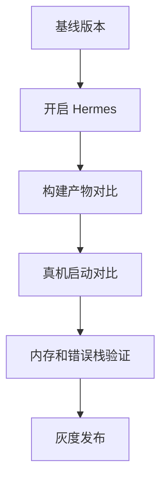

## 调试差异

切换 JavaScript 引擎后，调试链路、错误栈、性能分析和某些运行时行为可能会变化。团队升级时要重点验证：

1. 常用调试工具是否可用。
2. 线上错误堆栈是否仍然可读。
3. 关键依赖是否依赖特定 JS 引擎行为。
4. 性能收益是否能在真机上复现。

不要只在开发机上看启动速度，低端 Android 设备更能暴露引擎切换后的真实收益和风险。

Hermes 的价值通常体现在冷启动、包体执行和内存控制上，但它不会直接解决网络慢、原生初始化多、列表渲染重这些问题。验证前先明确瓶颈位置，避免把所有收益都寄托在引擎切换上。

引擎切换最容易被高估的地方，就是把所有性能问题都归因到 JS 执行层。Hermes 很重要，但它只是 RN 运行时的一部分，不能替代资源、导航、列表和原生初始化层面的优化。

## 引擎定位

Hermes 是面向 React Native 优化的 JavaScript 引擎，目标是改善启动速度、内存占用和移动端运行表现。

```txt
JS 源码 -> Hermes 字节码 -> Hermes VM 执行
```

它与浏览器里的 V8、JavaScriptCore 类似，都是 JS 执行引擎；区别是 Hermes 更关注 RN 移动端场景。RN 应用的 JS bundle 通常在移动设备上执行，解析、编译、启动和内存压力都比桌面浏览器更敏感。

在 RN 里，Hermes 更像是把“JS 执行”这一步变得更适合移动端。它并不改变 React 的编程模型，也不替你优化业务逻辑，只是把解释执行、编译和内存占用这部分基础开销尽量降下来。

所以评估 Hermes 时，重点不在“它是不是更先进”，而在“你当前项目的问题是不是刚好落在它能改善的范围里”。如果当前瓶颈根本不在引擎层，切换后收益自然不会很明显。

## 字节码执行

Hermes 会把 JavaScript 预编译成字节码，让应用启动时减少解析和编译成本。

```txt
普通流程：加载 JS -> 解析 -> 编译 -> 执行
Hermes：加载字节码 -> 执行
```

这对首启和低端 Android 设备尤其重要。因为低端设备 CPU 弱、存储慢、内存紧，JS 解析编译成本更容易被用户感知。

Hermes 的收益也会受到 bundle 大小影响。bundle 越大，预编译带来的收益越明显；如果启动慢的主要原因是原生 SDK 初始化、首屏接口串行或图片加载，Hermes 的提升就不会特别夸张。

字节码执行降低的是“JS 从资源到可运行”这段基础成本。如果项目在这段路径上很重，收益会更明显；如果启动时间主要被别的环节占走，引擎层优化就只能改善其中一部分。

## 启动性能

启动性能受很多因素影响，包括 bundle 大小、原生初始化、首屏请求、图片资源。Hermes 改善的是 JS 引擎层面的成本，不代表首屏会自动变快。

如果项目在启动阶段还做了大量同步计算、数据转换或者复杂初始化，那么 Hermes 只能解决一部分问题。它的收益更像“把 JS 引擎的基础成本降下来”，而不是“替你重写应用架构”。

```text
启动慢可能来自：
1. JS bundle 过大
2. 原生 SDK 初始化太多
3. 首屏接口阻塞
4. 图片和字体加载重
5. JS 同步任务过长
```

启动性能评估最好拆阶段看：原生启动、JS bundle 加载、引擎初始化、首屏路由建立、数据请求、首屏渲染。这样才能知道 Hermes 带来的收益究竟落在哪一段，而不是只看一个总耗时数字。

## 内存表现

移动端内存紧张，Hermes 在 RN 场景下通常能提供更可控的内存表现。

| 优化方向 | 说明 |
| --- | --- |
| 字节码执行 | 减少运行时解析编译压力 |
| GC 策略 | 面向移动端交互优化 |
| 引擎体积 | 与 RN 集成优化 |

具体收益要看设备、RN 版本、业务复杂度和 bundle 规模。性能结论应来自真机数据，而不是默认假设。

内存收益也不是固定值。不同业务对字符串、对象图、缓存和图片的使用方式不同，Hermes 的 GC 与内存分配表现会因此变化。线上评估时要看同一批设备、同一条业务路径的真机数据。

内存表现也要和真实业务结合看。一个长列表、图片流、复杂状态缓存较多的应用，和一个轻量工具型应用，对引擎内存特性的敏感程度并不一样。

## 调试影响

启用 Hermes 后，调试工具链会有所不同。现代 RN 支持 Hermes 调试、Source Map、性能分析等能力，但要确认项目工具链配置正确。

```txt
Source Map 是否可用
错误堆栈是否能还原
性能采样是否能定位函数
线上错误是否能符号化
```

上线前要验证错误上报平台能正确解析 Hermes 堆栈，否则线上问题会很难定位。

调试影响还包括 DevTools、Profiler 和 source map 生成链路。只要错误堆栈或映射不稳定，线上问题就会变得比之前更难追。引擎切换不是纯性能改动，它会影响整个可观测链路。

这也是为什么引擎升级一定要把可观测性放进第一批回归项。只要错误栈不好还原、source map 不稳定或监控平台无法正确符号化，线上定位成本会立刻上升。

## 兼容边界

Hermes 支持现代 JavaScript 主要能力，但某些依赖如果使用非标准 API、动态执行或引擎特定行为，仍可能出现差异。

```txt
检查第三方库兼容
验证 polyfill
验证国际化能力
验证错误堆栈和 source map
真机回归核心流程
```

如果项目从 JSC 切换到 Hermes，不要只看能否构建通过。登录、支付、列表、动画、错误上报都要跑一遍。

兼容边界里还要特别检查第三方库是否使用了非标准行为、动态代码执行或引擎特定特性。库本身跑得起来，不代表在 Hermes 下没有边缘差异，尤其是调试、国际化和错误栈还原。

兼容验证最好覆盖真实核心链路，而不是只跑一个首页。登录、列表、动画、表单、支付、深链、错误上报和国际化都是高优先级检查点，因为这些地方最容易暴露运行时差异。

## 选型判断

Hermes 不是“用了就一定更快”，而是“在移动端 RN 场景里常常更划算”。如果项目主要问题是 JS 解析和启动开销，Hermes 通常值得验证；如果瓶颈在网络、图片、原生初始化或业务逻辑，单换引擎不会解决全部问题。

选型时最好把 Hermes 当成“可验证的优化项”，而不是“必选项”。如果项目现有瓶颈不在 JS 引擎层，保留现状也可能更稳，因为切换引擎本身也会带来测试和回归成本。

Hermes 的选型判断，最终还是一个收益和成本的问题：能不能明显改善关键设备上的启动和内存，值不值得为此承担调试链路和兼容回归成本。只有这个账算清楚了，切换才是理性的。

## 验证流程

最可靠的方式是做 A/B 对比：同一台真机、同一套业务、同一段流程，分别记录启动、内存、错误栈和核心交互数据，再决定是否全量迁移。引擎升级应该以真实指标说话，而不是凭“新架构更先进”直接拍板。



如果指标没有改善，不要急着回滚或坚持。先看瓶颈是否确实在 JS 引擎层。如果瓶颈在首屏请求、图片解码或原生初始化，Hermes 的收益自然不会明显。

最稳妥的验证方式，还是在同一台真机上做 A/B 对比：启动耗时、首屏可见、内存曲线、错误栈还原、核心交互响应都要记录。引擎升级应该靠数据决策，而不是靠“新架构一定更好”的直觉。

验证流程如果足够完整，最后就能比较清楚地回答：Hermes 是否改善了关键机型上的启动和内存，是否影响了错误观测，是否带来了兼容问题，以及这些收益是否值得在全量版本里承担迁移成本。
