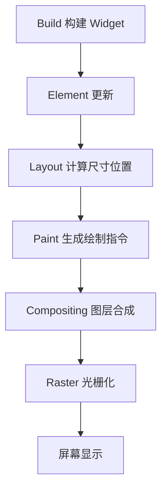

## 渲染路径

Flutter 不依赖浏览器 DOM，也不直接使用原生控件渲染大部分 UI。它通过自己的引擎完成布局、绘制和合成，最终把画面呈现到屏幕上。



这也是 Flutter 跨平台视觉一致性较强的重要原因。性能问题可能发生在任何阶段，频繁重建不一定等于绘制慢，绘制慢也不一定是布局问题。

渲染路径可以理解成一条流水线：Widget 负责描述，Element 负责复用，RenderObject 负责布局和绘制，Engine 负责合成和光栅化。排查问题时先判断是哪一段慢，再决定是拆 Widget、改布局、隔离重绘还是压缩图片。

Flutter 的渲染管线最值得建立的心智，是“每一段都只负责自己那层事情”。只有先分清 build、layout、paint、composite、raster 各在做什么，后面遇到卡顿和异常时才不会把所有问题都归结为“页面太复杂”。

## Build 阶段

Build 阶段执行 `build` 方法，生成新的 Widget 描述。

```dart
@override
Widget build(BuildContext context) {
  return ProductList(products: products);
}
```

`build` 应该快速、可重复执行。不要在 `build` 中发请求、解析大 JSON、读写文件或做昂贵计算。复杂计算可以提前缓存、放到状态层，或异步处理。

Build 慢通常来自三类问题：状态放得太高导致大范围重建，`build` 里做了派生计算，或者复杂列表一次性构建太多子项。把状态下沉、使用 `const`、拆小 Widget 和使用惰性列表，都是更直接的处理方式。

Build 阶段最怕的是“逻辑本来不重，但被调用得很多”。只要某个状态更新会频繁触发大块子树重建，再轻的单次 build 也会慢慢累积成掉帧。

## Layout 阶段

Layout 阶段根据约束计算尺寸和位置。复杂嵌套、无限约束、频繁测量都会增加布局成本。

```dart
Column(
  children: [
    const Header(),
    Expanded(
      child: ListView.builder(
        itemBuilder: buildItem,
      ),
    ),
  ],
);
```

滚动容器要有明确约束。看到 unbounded height 这类错误时，不是渲染引擎“坏了”，而是父子约束没有建立清楚。

Layout 慢常见于嵌套过深、动态测量太多、滚动容器嵌套不清和大量自适应尺寸。优化时不要只盯某个 Widget，而要顺着约束链看父级给了什么、子级要求什么。

Layout 问题经常不是某个控件“有 bug”，而是整条约束链在表达冲突。只要父级和子级对尺寸预期不一致，后面就会表现成溢出、无限约束或测量成本升高。

## Paint 阶段

Paint 阶段把渲染对象转换为绘制指令。阴影、裁剪、透明、模糊、大量自定义绘制都可能增加成本。

```dart
RepaintBoundary(
  child: ComplexChart(data: data),
);
```

`RepaintBoundary` 可以隔离重绘边界，适合复杂但相对独立的区域。它不是越多越好，过度使用会增加图层管理成本。

Paint 阶段的优化重点是减少复杂绘制和不必要重绘。图表、地图覆盖层、复杂渐变、阴影和自定义绘制区域，如果和周围内容更新频率不同，就适合考虑边界隔离。

Paint 阶段最容易被忽略，因为页面视觉上“只是一个效果”。但很多小阴影、小透明叠层、小裁剪在低端设备上都可能很贵，所以绘制复杂度一定要结合真实设备来判断。

## 合成与光栅化

合成阶段把多个图层组合起来，光栅化阶段把绘制指令转换为像素。复杂图层、过度裁剪、大图片都会影响这两个阶段。

| 问题 | 可能阶段 | 优化方向 |
| --- | --- | --- |
| 首次进入页面慢 | Build/Layout | 减少首屏组件和同步任务 |
| 滚动掉帧 | Build/Paint/Raster | 列表懒加载、图片优化 |
| 阴影模糊卡顿 | Paint/Raster | 简化效果、缓存、边界隔离 |
| 动画卡顿 | Build/Composite | 减少动画期间重建 |

判断阶段时要结合 Flutter DevTools，而不是只凭肉眼猜。

Raster 慢通常更接近“画得太重”：大图片、模糊、裁剪、阴影、复杂 Path、过多图层都可能压垮低端设备。UI 线程没问题但仍然掉帧时，要重点看 Raster 和 GPU 相关指标。

如果 UI 线程看起来正常，但用户仍然明显感到卡，就不要只在 Dart 层找原因了。很多时候问题已经下沉到图层合成和光栅化阶段，需要从图片、效果和图层策略入手。

## 帧预算

60fps 下每帧预算约 16.67ms，120fps 下预算约 8.33ms。任何阶段超时都可能导致掉帧。

```txt
Build + Layout + Paint + Raster <= 一帧预算
```

动画、滚动和手势期间尤其敏感。优化时优先保证这些高频交互路径，而不是平均页面都做微小优化。

帧预算不是平均分，而是每一帧都要按时完成。一次偶发的 80ms 长帧，用户会直接感受到卡顿；所以滚动、拖拽和动画期间要避免触发大范围重建、图片解码和同步计算。

帧预算真正要关注的是最差帧，而不是平均帧。页面整体平均表现不错，不代表用户不会在某个交互点上明显感受到顿挫。

## Web 差异

Flutter 渲染管线和 Web 完全不同。Web 关注 DOM、CSSOM、Layout、Paint、Composite；Flutter 更关注 Widget、Element、RenderObject 和引擎绘制。

理解这点后，就不会把 Web 性能经验原样套到 Flutter 上。比如 Web 里常说“少改 DOM”，Flutter 里更接近的问题是“减少不必要 build、控制布局约束、隔离重绘边界”。

Web 经验仍然有借鉴价值，比如减少无意义更新、控制图片大小、降低绘制复杂度，但落点要换成 Flutter 的术语和工具。不要用“少 DOM”解释 Flutter 问题，而要说清楚是 Widget 重建、Layout 约束、Paint 复杂还是 Raster 压力。

把 Web 经验迁移到 Flutter 时，最重要的是“换术语、换观察点、不换优化思维”。减少无意义更新仍然重要，只是要落到 Widget 树、约束链和绘制阶段上。

## 诊断方向

排查渲染性能时，可以关注 build 是否过频、layout 是否过重、paint 是否复杂、是否有大图和复杂阴影、动画是否持续触发重建。

Flutter DevTools 能帮助定位帧耗时和重建范围。先找阶段，再选手段，通常比直接加缓存或盲目拆 Widget 更稳。

诊断时可以先用 profile 模式复现卡顿，再看慢帧属于 UI 线程还是 Raster 线程。UI 慢看 build/layout/Dart 逻辑，Raster 慢看图片、阴影、裁剪和图层；内存持续上涨则要检查图片缓存、列表保留和控制器释放。

渲染问题一旦分层清楚，很多优化选择会自然变简单。先知道慢在哪一段，再决定是拆 Widget、改约束、减绘制还是控资源，通常比凭感觉下手更稳。
