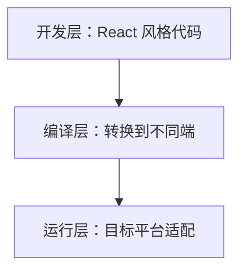

## 框架定位

Taro 是面向多端应用开发的框架，常见目标是用一套接近 React 的开发方式输出到微信小程序、H5、部分小程序平台以及部分跨端环境。

它的核心价值不是“完全无差异跨端”，而是把多端差异收敛到统一开发模型和适配层中。对于团队来说，Taro 更像一套“开发模型 + 编译适配 + 平台映射”的体系，而不是简单的代码转换工具。

理解 Taro 时，最重要的是接受“多端一致性是工程治理结果，不是框架自动保证”。框架能统一组件、API 和编译入口，但平台能力、审核规则、包体积、性能和调试链路仍然会回到具体端上。

这也是 Taro 最容易被高估的地方。它确实能帮团队减少重复开发，但它并不会替团队自动做完端差异设计、能力分层和测试治理。真正稳定的多端项目，靠的是架构收口和验证体系，而不是单靠框架名字。

## 分层结构

Taro 可以粗略理解为三层：

- 开发层：组件、路由、状态和业务代码
- 编译层：把源码转换到不同端目标
- 运行层：在目标平台上适配组件、API 和生命周期

多端差异主要被编译层和运行层承接。开发层尽量保持一致，平台差异尽量向下收口。



分层越清楚，项目越容易长期维护。业务页面只关心业务状态和交互；适配层处理平台 API、环境判断和能力降级；编译配置处理目标端差异。如果业务页面里到处都是 `TARO_ENV` 判断，说明差异没有被收口。

分层结构的价值，在于把“跨端成本出现在哪里”看清楚。业务层负责通用表达，适配层负责平台差异，编译层负责目标产物，这三层一旦混在一起，项目很快就会变成“到处能跑一点，但哪里都不好改”。

## 开发模型

Taro 常用 React 风格组织页面和组件。开发者更关注组件组合、状态更新和页面路由，而不是直接写每个平台的原生语法。

```tsx
import { View, Text } from "@tarojs/components";

export default function Index() {
  return (
    <View>
      <Text>Hello Taro</Text>
    </View>
  );
}
```

这降低了多端开发门槛，但也要求理解目标平台的限制。小程序端、H5 端和其他端并不是完全一样的运行环境。如果把 Taro 当成“只写一次就什么都不用管”的方案，后面通常会在路由、生命周期、样式和 API 能力上碰壁。

Taro 的开发模型更适合“以一个主端为基准，兼顾其他端”。例如很多团队以微信小程序为主目标，再扩展 H5；如果同时追求多个端完全一致，就要把端差异列入设计、开发、测试和发布计划。

主端思维很重要。只要不先定义主端，很多组件、路由、样式和能力设计都会在多个目标端之间来回摇摆，最后既牺牲体验，也放大维护成本。

## 运行适配

Taro 通过组件映射和 API 适配把统一代码映射到不同端的能力模型中。比如 `View`、`Text`、`Image`、`Button` 这类跨端组件，在目标端会有不同实现。

```tsx
import { View, Image, Button } from "@tarojs/components";

function ProductCard({ product }) {
  return (
    <View className="product-card">
      <Image src={product.cover} className="cover" />
      <Button>加入购物车</Button>
    </View>
  );
}
```

统一 API 可以减少平台差异，但不能完全抹平所有能力。支付、分享、订阅消息、权限、蓝牙、定位等能力仍然要看目标端支持情况。

| 统一能力 | 说明 |
| --- | --- |
| 组件映射 | 用统一标签表达跨端 UI |
| 生命周期映射 | 用近似生命周期接口组织页面逻辑 |
| API 映射 | 包装常见平台能力 |
| 样式适配 | 处理单位、布局和兼容差异 |

真正的多端成本，往往不是页面能不能跑起来，而是同一段业务在不同端是否能稳定地“看起来一样、交互一样、调试一样”。

运行适配层还会影响错误排查。一个按钮点击失败，可能来自 Taro 事件适配、目标端组件限制、权限配置或业务逻辑本身。排查时要按“统一代码 -> 编译结果 -> 端侧运行”逐层确认。

Taro 的运行适配价值，不在于“差异完全消失”，而在于“差异有一个相对固定的承接位置”。只要这个承接位置稳，业务层就不必反复知道每个平台的底层细节。

## 平台差异

Taro 的跨端能力建立在平台能力交集之上。只要业务进入平台专有能力，就需要接受条件编译、平台判断或端侧分支。

```tsx
if (process.env.TARO_ENV === "weapp") {
  // 微信小程序专有逻辑
}
```

平台差异不一定是坏事。合理的差异层可以把特殊能力隔离在小范围里，让大部分业务仍然共享同一套组件和状态模型。

平台差异最好通过能力函数、适配组件和条件编译集中处理。比如支付、分享、订阅消息、文件选择这类能力，可以封装成业务 API；页面只关心“发起支付”或“选择图片”，而不是关心每个端具体怎么调。

平台差异不是问题本身，差异失控才是问题。只要差异被集中管理，跨端收益仍然很大；一旦差异扩散到页面 JSX、样式和事件细节里，跨端项目就会越来越像几套代码硬绑在一起。

## 适用场景

Taro 适合以小程序为主要目标、同时兼顾 H5 的项目，也适合团队熟悉 React、希望统一组件和业务逻辑的场景。

```text
适合：
1. 业务页面重复度高
2. 小程序/H5 需要同时交付
3. 团队 React 经验较强

不太适合：
1. 强依赖单端原生能力
2. 需要极致性能或复杂动画
3. 平台差异本身就是产品重点
```

如果项目强依赖某个平台独有能力，就不能只依赖统一抽象，还要写平台差异逻辑。平台差异越多，跨端收益越依赖工程治理。

选 Taro 前要看页面相似度、能力相似度和团队技能。页面结构越类似、业务逻辑越可复用、团队 React 经验越强，Taro 收益越明显；如果每个端都需要不同交互和强原生能力，跨端框架可能只会把复杂度藏得更深。

是否适合 Taro，核心不是“团队会不会 React”，而是“产品的多端共性到底有多高”。共性越高，统一模型越划算；差异越大，跨端抽象就越可能反过来成为负担。

## 架构边界

Taro 的边界在于：统一开发模型不能完全消除平台差异。组件表现、API 能力、包体积、性能和发布流程仍然要按目标端处理。

理解这点后，就不会把它当成“写一次到处完全一样”的魔法工具，而是把它当成统一开发与多端适配之间的中间层。如果某个页面的差异主要集中在少数平台能力上，Taro 仍然有价值；如果差异扩散到布局、交互、权限和生命周期都不同，那就要认真评估是不是应该改成“局部复用 + 平台分治”的方案。

架构上更稳的做法，是把可复用的业务模型、请求层、状态层和纯展示组件沉淀下来，把端差异隔离在入口、适配器和平台组件中。这样即使某个页面最终需要端侧分治，也不会推翻全部工程结构。

Taro 架构成熟时，团队会很清楚哪些代码是真正跨端资产，哪些代码只是端侧适配。只有这条边界清楚，项目才不会因为某个端要做特化而把整套结构一起拖乱。
