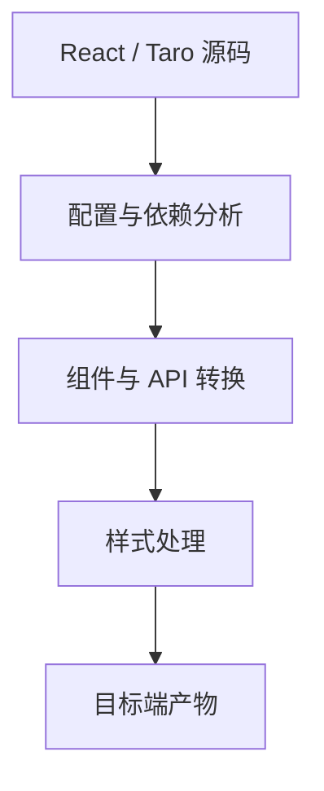

## 编译目标

Taro 多端编译的目标是把同一套源代码输出到不同平台，例如微信小程序、H5、React Native 以及其他小程序端。目标端不同，产物目录、运行时能力、组件映射、API 适配、样式规则和调试方式都会不同。

```json
{
  "scripts": {
    "dev:weapp": "taro build --type weapp --watch",
    "dev:h5": "taro build --type h5 --watch",
    "build:weapp": "taro build --type weapp",
    "build:h5": "taro build --type h5"
  }
}
```

多端编译不是一次构建覆盖所有端。每个目标端都应该有独立构建、独立验证和独立发布流程。否则“代码统一”会掩盖“质量没有验证”的问题。

编译目标越多，工程治理越重要。不是编译成功就算完成，而是每个产物都要经过自己的路由、样式、API、性能和真机验证。统一源码只是起点，不是交付完成。

多端编译最容易制造的错觉，就是“同一份代码已经生成出来，所以这几个端应该都差不多没问题”。实际上每个目标端的运行边界、宿主限制和发布流程都不一样，编译通过只说明第一步成立。

## 转换链路

可以把 Taro 编译理解为一条转换链路：读取源码和配置，分析页面、组件、样式、依赖和平台条件，再生成目标端工程。



这条链路会处理很多差异，但不能让所有平台能力完全一致。越靠近平台底层的能力，例如分享、支付、地图、相机、文件、蓝牙，越需要独立适配。

编译链路的价值在于把“通用代码”尽量输出成目标端可运行产物，把“平台差异”尽量收口到适配层。这样业务开发只面对一套抽象，但最终产物仍然尊重各端规则。

一旦理解这条链路，就不会把所有问题都归给“框架没编好”。很多差异本来就是目标端真实存在的，编译器只能转换结构，不能替代你决定业务该怎么跨端落地。

## 平台变量

平台差异可以通过 `process.env.TARO_ENV` 判断。它适合处理少量目标端差异，例如某个平台打开分享菜单，某个平台使用不同配置。

```ts
if (process.env.TARO_ENV === "weapp") {
  Taro.showShareMenu({
    withShareTicket: true,
  });
}
```

平台判断不要扩散到所有业务文件。大量 `if (TARO_ENV)` 会让代码难以阅读，也让每次新增端都变成全仓库搜索替换。更好的做法是把端差异封装到适配层。

平台变量适合少量、明显的分支，比如分享菜单、导航栏样式或某端特有的开关。只要分支变多，就说明当前抽象已经开始失效，应该退回到文件级拆分或能力函数封装。

`TARO_ENV` 最好只出现在适配层和少量入口层代码里。它一旦大量进入页面和组件层，基本就意味着跨端差异已经开始突破原本的架构边界。

## 文件差异

复杂差异更适合使用文件级拆分。比如分享、支付、地图等能力，可以分别提供 H5、小程序、默认实现，让业务层只依赖统一接口。

```text
share.ts
share.weapp.ts
share.h5.ts
```

```ts
export async function shareProduct(productId: string) {
  return platformShare({
    title: "商品详情",
    path: `/pages/product/detail?id=${productId}`,
  });
}
```

文件级差异能把平台代码隔离在少数模块里。业务页面不需要知道每个平台如何分享，只需要调用业务语义明确的函数。

文件级拆分的前提，是接口保持一致。业务层只调用 `shareProduct`、`openLogin` 这类统一接口，具体实现才放到各端文件里。这样新增端时只补实现，不改业务逻辑。

文件级差异是跨端工程里很实用的一种“承认差异”的方式。只要接口统一、实现分端，业务层就能继续保持稳定，而不用在一份文件里被越来越多的条件分支拖垮。

## 组件映射

Taro 基础组件会映射到目标端组件。`View`、`Text`、`Image`、`Button` 在小程序端更自然，在 H5 端则会转成对应 Web 结构。组件映射降低了跨端成本，但仍要注意平台差异。

```tsx
import { View, Text, Button } from "@tarojs/components";

export function EmptyState({ onRetry }) {
  return (
    <View className="empty">
      <Text>暂无数据</Text>
      <Button onClick={onRetry}>重试</Button>
    </View>
  );
}
```

强平台组件不要假设所有端都支持。地图、相机、开放数据、视频、Canvas 等组件要查目标端支持矩阵，并准备降级或拆分实现。

组件映射的真实边界，是目标端组件库是否能表达当前交互。如果某个组件在某端无法达到业务要求，应该尽早拆分成“通用实现 + 平台实现”，而不是指望编译器自动兜底。

映射成功不等于体验一致。只要组件背后的交互模型、样式能力或宿主限制不同，端侧体验就可能出现明显差异，所以组件映射要和真机验证一起看。

## 样式处理

样式编译会涉及单位、选择器、样式隔离、资源路径和平台限制。小程序端和 H5 端对某些 CSS 能力的支持并不完全一致，复杂选择器和浏览器特有能力要谨慎。

```scss
.card {
  padding: 24px;
  border-radius: 16px;
  background: #fff;
}
```

跨端样式应优先使用简单布局、明确层级和可控单位。动画、固定定位、滚动容器、遮罩层要按端测试。移动端适配相关单位可以和 [[7.2.3 REM 与 VW|REM 与 VW]] 一起判断。

样式编译最容易出问题的地方，往往不是主布局，而是细节：单位换算、层级覆盖、原生组件样式和滚动容器。复杂样式要尽量在设计和组件层收口，不要把 CSS 写成平台差异补丁堆。

样式处理越依赖“编译后再看效果补一层”，维护成本越高。更稳的方式是先用基础布局能力把大结构写对，再把端差异控制在少量组件和样式变量里。

## 依赖边界

不是所有 npm 包都适合 Taro 多端项目。依赖如果直接访问 DOM、`window`、Node API、浏览器特有对象，在小程序端可能无法运行。引入依赖前要确认它是否支持目标端。

```ts
function canUseBrowserStorage() {
  return typeof window !== "undefined" && Boolean(window.localStorage);
}
```

公共工具最好保持纯函数和平台无关。需要平台能力时，通过适配层注入，而不是在工具函数里直接访问浏览器或小程序 API。

依赖边界也决定了编译是否稳定。只要一个依赖偷偷碰了 DOM、window、Node API 或平台专有对象，编译到别的端时就可能出问题。因此依赖引入前就该按目标矩阵评估。

依赖问题往往不是在引入当天暴露，而是在某个目标端、某次编译或某条边缘路径上突然出错。所以多端项目里的依赖选择，应该比普通 Web 项目更保守一些。

## 目标矩阵

多端项目要明确支持矩阵。哪些端是一等支持，哪些端只是兼容输出，哪些端暂不支持，要写进工程和测试策略里。

| 支持级别 | 含义 | 验证要求 |
| --- | --- | --- |
| 一等支持 | 核心业务目标端 | 每次发布必须完整验证 |
| 兼容支持 | 允许访问但非核心 | 核心流程抽测 |
| 实验支持 | 技术预研或低流量 | 小样验证 |
| 不支持 | 明确不交付 | 构建或入口限制 |

如果所有端都声称支持，但没有对应真机、工具链、测试账号和发布流程，质量最终会不可控。多端编译真正难的是工程治理，不只是编译命令。

目标矩阵应该落地到团队流程：哪些端是主战场，哪些端是兼容输出，哪些端只做实验验证。没有矩阵的多端项目，最后往往会把所有端都当作“应该支持”，然后谁都没法负责。

支持矩阵说清楚之后，很多取舍就更容易做：某个问题要不要立刻修、某个端是否允许降级、某个新能力是否值得接入，都可以基于矩阵来判断，而不是每次临时讨论。

## 验证流程

每个目标端都要独立构建、运行和验收。H5 通过浏览器和部署环境验证，小程序通过开发者工具和真机验证，React Native 或 App 端还要验证原生能力。

```text
验证清单：
页面是否能打开
路由和返回是否正确
组件样式是否一致
平台 API 是否可用
包体积是否超限
关键流程是否可恢复
```

Taro 多端编译和 [[7.1.1 多端开发|多端开发]] 的核心判断一致：统一源码只是起点，目标端质量要靠真实运行环境验证。

验证流程要和构建产物绑定。每个目标端都应该独立检查页面打开、路由、组件样式、平台 API、包体积和关键流程，而不是只看同一个源码仓库能不能编译通过。

多端编译真正成熟时，团队不会再把“源码统一”当成终点，而是会把每个目标端都当成一个独立交付物来验收。只有这样，统一源码才真正转化成可交付质量。
