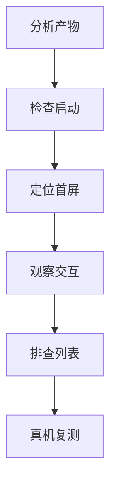

## 产物分析

Taro 性能问题经常能从编译产物里看到线索。比如某个端输出了不必要的依赖、公共代码过大、页面包划分不合理，都会影响启动和页面切换。

排查时可以先看主包是否过大、页面依赖是否被错误提前打入、静态资源是否重复输出、平台分支是否被正确裁剪。编译产物是跨端框架性能优化的重要证据，不要只看源码。

```text
重点检查：
1. 主包体积是否接近平台限制
2. 低频页面是否进入主包
3. 大型依赖是否被公共模块引用
4. 平台专有代码是否被错误打入其他端
5. 图片、字体、JSON 是否重复输出
```

跨端项目里，源码看起来“只引用一次”，不代表产物里也只出现一次。公共组件、工具函数、样式入口和平台判断都可能影响最终拆包结果。

产物分析最好和目标端一起看。小程序端关注主包和分包，H5 端关注首屏 chunk、缓存和资源瀑布，RN 端关注 JS bundle 和原生依赖。不同端慢的原因不一样，不能只用一套指标判断。

跨端性能优化真正要先建立的是“按产物说话”的习惯。源码看起来很简单，不代表编译结果也轻；某个端表现很慢，也不代表所有端都慢。先看产物，再看源码，通常更接近真实瓶颈。

## 包体控制

Taro 小程序端首先要关注包体积。主包过大，会直接影响启动、下载耗时和平台审核限制。

```txt
公共基础代码 -> 主包
低频业务页面 -> 分包
大型活动模块 -> 分包
平台特有依赖 -> 按端引入
```

依赖引入要谨慎。为了一个小工具引入大型库，会让小程序主包变重。公共组件也要避免把低频业务依赖带进主包。

```tsx
// 不推荐：公共组件里直接引入大型低频能力
import HeavyChart from "heavy-chart";

// 更稳：进入对应页面后再加载
const ChartPanel = lazy(() => import("./ChartPanel"));
```

包体控制不是只盯压缩后体积，还要看“谁被谁引用”。如果一个低频组件被基础布局引用，它就很可能变成主包成本。

公共模块要保持克制。越基础的组件越不应该依赖低频业务能力，因为它会把低频成本扩散到所有页面。包体治理时先查公共入口，再查页面级依赖，通常比盲目压缩更有效。

包体治理最怕“无意中放大公共依赖”。一个看起来无害的低频库，只要被公共组件顺手引入，就可能把所有页面都拖重。跨端项目里，这类问题往往比单端项目更隐蔽。

## 首屏加载

首屏性能受包下载、JS 初始化、页面渲染和接口请求共同影响。

```tsx
function Index() {
  const [products, setProducts] = useState([]);

  useLoad(async () => {
    const data = await productApi.list({ page: 1 });
    setProducts(data);
  });

  return <ProductList products={products} />;
}
```

首屏请求要控制数量。非首屏模块可以延迟加载，低优先级数据可以在页面显示后再请求。若首屏渲染依赖太多异步结果，用户会感到明显空白。

更稳定的做法是把首屏拆成“必须立即展示”和“可以延后补齐”两层：标题、核心商品、关键按钮优先；推荐位、埋点初始化、低优先级配置可以后置。

```tsx
useLoad(async () => {
  const firstPage = await productApi.list({ page: 1 });
  setProducts(firstPage);

  requestIdleCallback?.(() => {
    preloadRecommend();
  });
});
```

如果目标端不支持某些浏览器 API，就要用 Taro 或平台能力做降级。性能优化的代码不能只在 H5 端优雅，也要在小程序端真实可用。

首屏优化要避免“为了快而空”。如果页面只展示骨架但核心内容迟迟不出现，用户感知仍然很差。更好的策略是尽快展示可交互的核心内容，再逐步补充推荐、次要配置和非关键图片。

首屏优化真正重要的是“用户多久能开始用”，而不是“技术上第一个像素多久出现”。骨架屏只是过渡手段，真正决定体验的仍然是关键内容和关键操作能否尽快到位。

## 更新频率

Taro 最终会映射到小程序或其他端的渲染机制，高频状态更新仍然有成本。

```ts
const handleInput = debounce((value: string) => {
  setKeyword(value);
  search(value);
}, 300);
```

搜索、滚动、拖拽、倒计时等高频场景要控制更新频率。不要每次事件都触发复杂渲染和请求。

```tsx
function SearchBox() {
  const [keyword, setKeyword] = useState("");

  const search = useMemo(
    () =>
      debounce((value: string) => {
        productApi.search(value);
      }, 300),
    []
  );

  return (
    <Input
      value={keyword}
      onInput={(event) => {
        const value = event.detail.value;
        setKeyword(value);
        search(value);
      }}
    />
  );
}
```

高频更新最怕“状态更新、网络请求、列表重排、图片加载”同时发生。优化时要拆开看：先减少更新次数，再减少每次更新的节点数量，最后再看渲染和网络。

输入搜索、滚动加载和倒计时是高频更新高发区。可以用防抖、节流、局部状态、分页和批量更新把压力拆开。不要让一个输入事件同时触发请求、列表替换、埋点和全页状态更新。

高频更新治理得好，页面会显得很顺；治理不好，用户会直接感觉“这个页面一输入就卡”“一滚动就顿”。跨端框架不会自动帮你解决这些问题，更新节奏仍然要自己设计。

## 列表渲染

长列表要分页、懒加载或使用更适合的列表方案。

```tsx
<ScrollView scrollY onScrollToLower={loadNextPage}>
  {items.map((item) => (
    <ProductCard key={item.id} product={item} />
  ))}
</ScrollView>
```

列表项要提供稳定 key，图片要控制尺寸和数量。长列表一次性渲染过多节点，会让小程序端明显卡顿。

列表优化可以按三个层次推进：

1. 数据层分页，避免一次拉太多。
2. 渲染层懒加载，避免一次渲染太多节点。
3. 资源层压缩图片，避免滚动时持续解码大图。

如果列表卡顿，不要只怀疑 Taro。真实原因可能是节点太多、图片太大、子组件太重、状态更新范围太大，或者接口返回结构需要前端做大量转换。

列表性能要看“数据、节点、资源、状态”四个维度。数据太多要分页，节点太多要懒加载，资源太重要裁剪，状态范围太大要拆分订阅。只调一个滚动参数通常不够。

长列表优化最怕只盯着某一个层面。列表卡不一定是渲染层问题，也可能是图片、状态、请求或数据转换叠在一起造成的，所以排查时最好按这四个维度一起看。

## 图片资源

小程序和 H5 都容易被图片拖慢首屏。图片优化不只是压缩体积，还包括尺寸、格式、加载时机和占位策略。

```tsx
<Image
  src={product.cover}
  mode="aspectFill"
  lazyLoad
  className="product-cover"
/>
```

首屏大图要明确尺寸，避免布局抖动；列表图片要懒加载；图标类资源优先考虑精简方案。跨端项目尤其要注意：同一张图在 H5 看起来还好，在小程序低端机上可能就是滚动掉帧的来源。

图片资源还要关注端侧缓存和解码。小程序里频繁切页面、长列表滚动和大图预览都可能推高内存。图片优化应从 CDN 尺寸、格式、占位、懒加载和复用策略一起考虑。

图片在跨端项目里经常是最容易被低估的性能点。H5 能勉强扛住的图，在小程序或低端设备上可能就会直接体现在首屏慢、滚动掉帧和内存升高上。

## 平台验证

性能优化要按端验证。H5 流畅不代表小程序流畅，开发者工具流畅也不代表真机流畅。

| 场景 | 验证重点 |
| --- | --- |
| 小程序 | 包体、setData、长列表、图片 |
| H5 | 首屏资源、缓存、浏览器性能 |
| RN | JS 线程、列表、原生组件 |
| 低端机 | 内存、滚动、启动耗时 |

性能结论要来自目标端数据。跨端框架只是统一开发方式，不会自动消除平台性能差异。

平台验证时要尽量使用真实数据量。十条测试数据流畅，不代表一千条业务数据也流畅；开发者工具不卡，不代表低端 Android 真机不卡。性能验证如果脱离真实数据，结论很容易过于乐观。

性能验证要和目标矩阵绑定。主端必须完整验证，兼容端至少要跑关键路径；否则很容易出现“主端优化好了，另一个端反而退化了”的情况。

## 排查路径

Taro 性能排查可以按“产物 -> 启动 -> 首屏 -> 交互 -> 长列表 -> 真机”推进。



每次优化都要记录优化前后的数据。只凭主观感觉做性能优化，很容易把问题从一个端移动到另一个端。

排查路径也要保留证据：产物体积、首屏耗时、接口耗时、列表节点数、图片大小、真机录屏和平台日志都能帮助复盘。跨端性能优化不是一次性技巧，而是持续的工程度量。

真正成熟的性能排查，不是每次临时抓感觉，而是能持续积累证据和基线。只有这样，后续每次加新端、加新模块、加新依赖时，团队才能更早发现性能退化。
