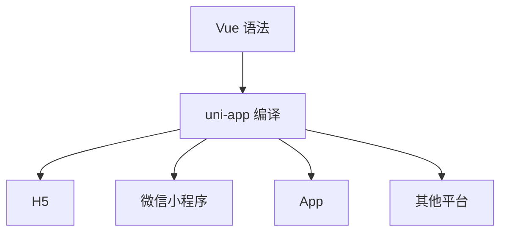

## 框架定位

uni-app 是以 Vue 语法开发多端应用的框架，目标是用一套工程模型输出到 H5、小程序、App 等多个平台。它统一了页面、组件、配置、API 和发布入口，但并不消除平台差异。

```vue
<template>
  <view class="page">
    <text>{{ title }}</text>
  </view>
</template>

<script setup>
import { ref } from "vue";

const title = ref("Hello uni-app");
</script>
```

开发时使用 `view`、`text`、`image`、`scroll-view` 等跨端组件，而不是直接写浏览器 DOM 标签。这种抽象让代码更容易映射到小程序和 App，但也意味着不能完全按 Web DOM 思维写页面。

uni-app 的价值不是“所有端完全一致”，而是让 Vue 团队用相对统一的工程模型覆盖多个端。越是基础页面、列表、表单和业务流程，复用收益越明显；越是强平台能力、复杂动画和原生交互，越需要差异化设计。

对 uni-app 最稳的预期，不是“写一次到处一样”，而是“通用部分尽量统一，差异部分有明确承接位置”。只要预期放对，后面的组件、路由和能力适配设计就会更自然。

## 分层结构

uni-app 的工程可以理解为三层：

- 开发层：Vue 组件、页面、状态和业务代码
- 编译层：把源码转换到不同平台
- 运行层：在目标平台上承接容器、组件和 API

平台差异主要由编译层和运行层承接。开发层尽量统一，差异尽量向下收口到少数适配模块。

这三层如果混在一起，项目会很快失控。页面里到处写条件编译，说明平台差异没有被收口；工具函数里直接访问 `window` 或原生 API，说明业务代码和平台能力耦合太深。

分层结构最大的价值，是让团队知道复杂度应该落在哪里。业务层负责可复用流程，适配层负责平台能力和差异，编译层负责目标产物。如果这三层边界不清，后面每加一个端都会明显变慢。

## 工程入口

uni-app 工程通常围绕 `pages.json`、`manifest.json`、页面目录、组件目录和平台条件编译组织。`pages.json` 管页面路由、窗口样式、tabBar 和分包；`manifest.json` 管应用标识、平台配置和 App 能力。

```json
{
  "pages": [
    {
      "path": "pages/index/index",
      "style": {
        "navigationBarTitleText": "首页"
      }
    }
  ],
  "tabBar": {
    "list": [
      {
        "pagePath": "pages/index/index",
        "text": "首页"
      }
    ]
  }
}
```

路由不是运行时随便注册的，很多目标端需要编译期知道页面列表。新增页面后如果只创建文件、不更新配置，就会出现页面无法打开或目标端缺失入口的问题。

`pages.json` 和 `manifest.json` 是 uni-app 工程的关键契约。前者决定页面能不能被找到，后者决定应用在各端如何运行。它们不是附属配置，而是跨端工程的一部分。

很多 uni-app 问题看起来像“页面代码没写对”，根因其实在入口配置。页面注册、tabBar、分包、权限声明、App 能力开关，只要其中一项没同步，源码再正确也可能无法正常交付。

## 运行模型

uni-app 的运行模型可以理解为“Vue 开发体验 + 跨端组件/API + 编译适配”。页面代码经由编译工具输出到不同平台，平台再用自己的容器运行。



这也是为什么某些 Web 写法不能直接迁移：浏览器 DOM、`window`、`document`、CSS 能力、事件对象在不同端不一定存在或一致。跨端代码应优先依赖 uni-app 提供的组件和 API。

运行模型也决定了调试方式。H5 里看到的问题可能来自浏览器，微信小程序里可能来自宿主限制，App 端可能来自原生容器。排查时要从源码、编译产物、目标端运行环境三层一起看。

uni-app 真正的多端难点，不在于模板语法，而在于“同一份页面最后会运行在哪种容器里”。只要宿主变了，生命周期、权限、渲染和调试行为都会跟着变。

## 能力适配

uni-app 提供统一 API，但统一 API 不代表每个端能力完全一致。相同接口在不同端可能参数不同、权限不同、失败码不同、用户授权流程不同。

```ts
export async function chooseAvatar() {
  const result = await uni.chooseImage({
    count: 1,
    sizeType: ["compressed"],
    sourceType: ["album", "camera"],
  });

  return result.tempFilePaths[0];
}
```

封装能力时要统一成功结果和错误结果。业务层不应该直接处理一堆平台错误码，而应该拿到“用户取消、无权限、平台不支持、系统失败”这类稳定语义。

能力适配层越稳定，业务代码越干净。比如选择图片、发起支付、获取定位、打开分享这类能力，最好封装成业务函数，对外只暴露统一结果，对内再处理端差异、权限和降级。

能力适配要尽量做成“业务能看懂的平台接口”。页面知道的是“选择图片成功了没有”“定位失败属于哪一类”，而不是每个端返回了什么原始对象和错误码。

## 状态与数据

多端架构里，状态层要尽量与平台无关。用户信息、购物车、订单状态、表单草稿这类业务状态可以复用；页面生命周期、滚动位置、权限弹窗、分享入口这类端侧状态要按平台处理。

```ts
type PlatformError =
  | { type: "cancel" }
  | { type: "permission-denied" }
  | { type: "unsupported" }
  | { type: "unknown"; message: string };
```

清晰的数据边界能减少条件编译扩散。业务状态越纯，越容易跨 H5、小程序和 App 复用；端侧状态越集中，越容易测试和替换。

状态与数据层最好尽量保持纯净：请求、缓存、业务模型、表单数据可以跨端复用；权限弹窗、分享入口、平台路由和原生插件状态则要放在适配层。这样跨端项目才不会越写越像多个端的拼贴。

状态一旦和平台细节混在一起，跨端项目就会很难维护。保持业务状态纯净，实际上是在为后面的条件编译收口、测试隔离和平台扩展预留空间。

## 架构边界

uni-app 适合 Vue 团队快速覆盖多小程序、H5 和部分 App 场景。它不适合把所有平台差异都压扁成一套完全相同体验，尤其是高度依赖原生性能、复杂动画、深度系统能力的应用。

选择 uni-app 时，要提前确认目标端、核心能力、性能预算和发布流程。它和 [[7.1.1 多端开发|多端开发]] 的关系很直接：跨端方案选型不是选“写法最统一”，而是选长期差异成本最低的路径。

如果项目的主要目标是微信小程序、H5 和普通 App 页面，uni-app 通常很合适；如果核心能力依赖大量原生插件、高帧率动画、复杂地图或深度系统能力，就要提前评估是否需要原生、Flutter、React Native 或 Hybrid 配合。

架构选型最后还是一个长期成本判断：如果业务主要是页面和流程，uni-app 往往很高效；如果端差异本身就是产品能力的一部分，就不要指望跨端框架替代平台级设计。
