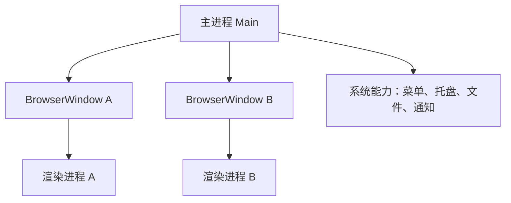

## 多进程模型

Electron 继承了 Chromium 的多进程架构。一个 Electron 应用通常包含一个主进程和多个渲染进程。



主进程负责应用生命周期、窗口管理和原生能力；渲染进程负责页面 UI。把它想成“桌面外壳 + Web 页面”会更容易理解。

Electron 的核心复杂度来自“Web 技术运行在桌面权限环境里”。普通 Web 页面最多影响浏览器沙箱，Electron 页面一旦拿到错误的主进程能力，就可能读写文件、打开外部程序或访问系统资源。因此架构设计首先要划清主进程、渲染进程和 preload 的边界。

理解 Electron 架构时，可以把它拆成三层：主进程掌握桌面能力，渲染进程负责界面，preload 负责安全桥接。只要这三层边界清楚，后续功能就更容易扩展和审计。

Electron 最值得先建立的认知，不是 API 清单，而是“桌面权限不该直接落到页面上”。只要主进程、渲染进程和 preload 三层边界混了，后面无论是安全、调试还是扩展都会越来越难收拾。

## 主进程

主进程运行在 Node.js 环境中，可以访问 Electron 主进程 API 和系统能力。

```ts
import { app, BrowserWindow } from "electron";
import path from "node:path";

function createWindow() {
  const win = new BrowserWindow({
    width: 1200,
    height: 800,
    webPreferences: {
      preload: path.join(__dirname, "preload.js"),
    },
  });

  win.loadFile("index.html");
}

app.whenReady().then(createWindow);
```

窗口创建、菜单、托盘、自动更新、文件读写等能力通常从主进程发起。主进程权限高，不应该塞入大量 UI 业务逻辑。

主进程要保持“小而稳”。它适合做生命周期、窗口、系统菜单、托盘、文件选择、自动更新和 IPC 分发，不适合承载大量页面状态、复杂表单逻辑或 UI 组件判断。主进程越复杂，崩溃影响越大，也越难测试。

主进程也要避免同步重任务。文件扫描、压缩、加密、大量 IO 如果直接阻塞主进程，可能会让整个应用窗口卡住。重任务更适合放到 worker、子进程或后端服务里。

主进程更像桌面应用的控制台，而不是业务逻辑大仓库。它负责生命周期、窗口和系统能力协调，一旦开始承载大量页面状态和重任务，整机体验和稳定性都会被拖累。

## 渲染进程

渲染进程运行 Web 页面。React、Vue、CSS、路由、状态管理等前端代码主要在这里执行。

```tsx
export function App() {
  return <main>桌面应用界面</main>;
}
```

渲染进程应该尽量按浏览器安全模型编写。不要为了方便打开 `nodeIntegration`，尤其是加载远程内容时，风险会明显放大。

渲染进程可以使用 React、Vue、路由和状态管理，但要把自己当成不可信页面来约束。它不应该直接访问 Node、文件系统或系统命令；需要桌面能力时，通过 preload 暴露的受限 API 调用。

如果渲染进程加载远程页面，安全要求要更高。远程内容一旦出现 XSS，就可能试图调用桌面能力，所以暴露给页面的 API 必须最小化、白名单化。

渲染进程写起来像普通前端，但风险等级比普通网页高得多。它一旦通过 preload 连接到桌面能力，就不再只是“一个浏览器页面”，所以页面层的安全假设必须更保守。

## Preload

Preload 脚本运行在渲染进程加载页面之前，适合通过 `contextBridge` 暴露安全的最小 API。

```ts
import { contextBridge, ipcRenderer } from "electron";

contextBridge.exposeInMainWorld("desktopApi", {
  openFile: () => ipcRenderer.invoke("dialog:openFile"),
});
```

渲染进程调用：

```ts
const filePath = await window.desktopApi.openFile();
```

不要把 `ipcRenderer` 原样暴露给页面。暴露的 API 应该是业务化、白名单式、参数受控的。

Preload 是 Electron 架构里最重要的安全缓冲层。页面看到的是 `desktopApi.openFile()` 这样的业务 API，而不是任意 IPC channel。这样即使页面出现 XSS，攻击面也被限制在少量受控能力里。

preload 暴露的 API 应该像后端接口一样设计：参数要校验、返回值要稳定、错误要可识别。不要把 `ipcRenderer.send`、`ipcRenderer.invoke` 直接丢给页面。

可以把 preload 理解成桌面能力的 API 网关。页面只看到少量经过命名和裁剪的业务能力，真正的通道细节和主进程能力都被挡在这层之后，这才是长期可维护的结构。

## IPC

IPC 用于主进程和渲染进程通信。常见模式是渲染进程 `invoke`，主进程 `handle`。

```ts
ipcMain.handle("dialog:openFile", async () => {
  const result = await dialog.showOpenDialog({
    properties: ["openFile"],
  });

  return result.filePaths[0] ?? null;
});
```

IPC 通道是安全边界。主进程处理 IPC 时要验证参数、限制能力、避免把文件系统、shell、系统命令等高权限能力直接交给页面。

IPC 设计要像后端接口一样严谨：通道命名、参数 schema、错误码、超时、权限和审计都要考虑。不要因为主进程和渲染进程在同一个应用里，就把 IPC 当成本地函数随便调用。

IPC 还要处理窗口来源。多窗口应用里，不同窗口能调用的能力可能不同；主进程处理请求时应确认来源窗口、用户状态和业务权限。

IPC 设计得越像正式接口，项目越稳。通道命名、参数 schema、来源校验、错误语义和超时策略一旦清楚，主进程和页面之间的协作就不会越来越像“本地黑盒调用”。

## 安全默认值

Electron 应用要优先启用安全默认值。

| 配置 | 建议 |
| --- | --- |
| `contextIsolation` | 保持开启 |
| `nodeIntegration` | 渲染进程关闭 |
| `sandbox` | 尽量开启 |
| `webSecurity` | 不要关闭 |
| 远程内容 | 使用 HTTPS |
| 外部链接 | 校验后用 `shell.openExternal` |

Electron 的危险点在于 Web 漏洞可能升级成桌面权限问题。把主进程能力收口到 preload 暴露的少量 API，是最基础的架构边界。

安全默认值应该成为项目模板的一部分，而不是上线前临时检查。尤其是 `nodeIntegration`、`contextIsolation`、外部链接打开、远程内容加载和 CSP，这些配置一旦放松，就会改变整个应用的风险等级。

Electron 架构的长期可维护性，取决于是否把安全配置、IPC 白名单、自动更新和崩溃监控都纳入工程默认值。桌面应用不是普通网页打包，它天然接近系统权限边界。

架构层最理想的状态，是让“危险能力默认拿不到”。这样业务开发者即使没有每次都高度警觉，也不容易无意间把高权限接口暴露到页面层。
