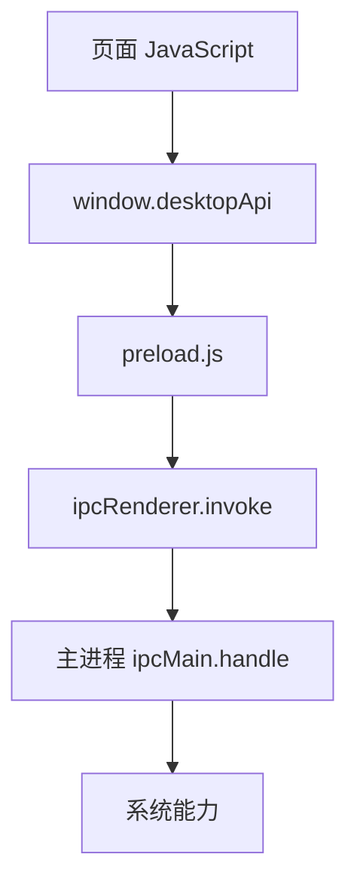

## 版本演进

随着应用升级，预加载脚本暴露的 API 也会演进。要避免随意删除旧 API，否则旧页面、旧窗口或缓存资源可能调用失败。

更稳妥的方式是保留兼容层，并通过能力检测让渲染进程判断接口是否可用。

版本演进要把 preload 当成接口契约。页面、主进程和 preload 可能不是同一时间更新，尤其在自动更新、增量资源和多窗口场景下，兼容层能减少灰度期间的异常。

预加载 API 一旦对外暴露，就应该像正式接口一样被维护。随手改名、随手删方法、随手变更返回结构，短期方便，长期会让多窗口和灰度发布变得非常脆弱。
## 桥接定位

预加载脚本运行在 Electron 渲染进程加载页面之前，它适合做“受控能力桥接”：从主进程拿到有限桌面能力，再通过 `contextBridge` 暴露给页面。它不是业务逻辑层，也不是把 Node.js 塞回页面的后门。



预加载脚本的设计质量直接决定 Electron 应用的安全边界。它越薄、越明确、越语义化，后续越容易审计。

可以把 preload 理解成“桌面能力的网关”。它不应该承担业务流程，也不应该做复杂状态管理；它只负责把少量被允许的能力安全地递给页面。

preload 最容易被误用成“顺手补能力的地方”。但它越像临时工具层，安全边界就越模糊；它越像正式 API 网关，Electron 架构就越稳。

## contextBridge

开启 `contextIsolation` 后，页面和预加载脚本运行在不同上下文中。`contextBridge.exposeInMainWorld` 可以把少量安全 API 暴露给页面。

```javascript
const { contextBridge, ipcRenderer } = require('electron');

contextBridge.exposeInMainWorld('desktopApi', {
  getVersion: () => ipcRenderer.invoke('app:get-version'),
  selectFile: () => ipcRenderer.invoke('dialog:select-file'),
});
```

页面侧只能访问暴露出来的 `desktopApi`：

```javascript
const version = await window.desktopApi.getVersion();
const file = await window.desktopApi.selectFile();
```

不要暴露 `ipcRenderer` 本身。页面如果能发送任意 IPC，就等于绕过了预加载脚本的能力边界。

`contextBridge` 暴露出去的对象应尽量冻结能力边界：方法名固定、参数明确、返回结构稳定。不要把底层 channel、事件对象或 Node 模块透传给页面。

`contextBridge` 的真正作用，不只是“让页面能调到主进程”，而是“让页面只能调到被允许的少量能力”。这就是 Electron 页面和普通本地脚本之间最关键的安全差异。

## API 设计

预加载 API 应该按业务语义命名，而不是按底层实现命名。`selectFile()` 比 `send('dialog:open')` 更安全、更稳定，也更容易替换实现。

```javascript
contextBridge.exposeInMainWorld('desktopApi', {
  readUserConfig: () => ipcRenderer.invoke('config:read-user'),
  saveUserConfig: (config) => ipcRenderer.invoke('config:save-user', config),
});
```

好的预加载 API 具备几个特征：

| 特征 | 说明 |
|---|---|
| 语义明确 | 页面知道调用目的，不知道底层通道 |
| 参数受限 | 不允许传任意路径、任意命令 |
| 返回稳定 | 成功失败结构清晰 |
| 可审计 | 能快速列出页面能调用哪些桌面能力 |

桌面能力越敏感，API 越应该靠近业务语义。例如“导出当前报表”比“写入任意文件”安全得多。

API 设计时要少给自由度。页面传 `reportId`，主进程决定导出路径，比页面直接传文件路径安全；页面请求“打开设置页”，比页面传任意 URL 更容易校验。

API 设计越接近业务语义，后续越容易做权限收口和版本演进。页面知道“我要导出当前报表”，而不是知道“我要调用哪个 channel 写哪个路径”，这就是健康的预加载 API。

## IPC 封装

预加载脚本可以进一步封装 IPC，统一处理超时、错误码和返回结构。

```javascript
function invoke(channel, payload, timeout = 8000) {
  return Promise.race([
    ipcRenderer.invoke(channel, payload),
    new Promise((_, reject) => {
      setTimeout(() => reject(new Error('ipc_timeout')), timeout);
    }),
  ]);
}

contextBridge.exposeInMainWorld('desktopApi', {
  exportReport: (reportId) => invoke('report:export', { reportId }),
});
```

主进程侧仍然必须校验参数，预加载脚本不能替代主进程校验。预加载只负责减少页面可调用范围，最终执行系统能力的一侧仍要防御。

IPC 封装还可以统一错误语义。比如 `cancelled`、`permission_denied`、`timeout`、`invalid_payload` 要让页面能区分，这样 UI 才能决定安静取消、提示授权还是展示重试。

封装层越稳定，页面侧越不需要自己补一层又一层错误判断。真正适合给页面用的，不是原始 IPC，而是经过命名、限权、超时和错误整理后的业务 API。

## 类型声明

TypeScript 项目应为暴露到 `window` 上的 API 编写声明文件。否则页面侧只能得到 `any`，安全边界会被类型系统抹掉。

```typescript
export {};

declare global {
  interface Window {
    desktopApi: {
      getVersion(): Promise<string>;
      selectFile(): Promise<{ path: string } | null>;
      exportReport(reportId: string): Promise<{ path: string }>;
    };
  }
}
```

类型声明要和预加载实际暴露的 API 保持一致。它既是调用提示，也是前端和桌面能力之间的接口契约。

类型声明最好和 preload API 一起维护。每次新增、废弃或调整 API，都同步更新类型和调用示例，避免页面侧因为 `any` 绕过安全边界。

类型声明在 Electron 里不只是开发体验优化，它还是边界表达的一部分。页面能看到什么、能传什么、会拿到什么，最好都通过类型系统明确下来。

## 参数校验

预加载脚本可以做第一层轻量校验，主进程做最终校验。两层校验的目的不同：预加载让页面尽早失败，主进程保证安全。

```javascript
function assertReportId(reportId) {
  if (typeof reportId !== 'string' || !/^[a-zA-Z0-9_-]{1,64}$/.test(reportId)) {
    throw new Error('invalid_report_id');
  }
}

contextBridge.exposeInMainWorld('desktopApi', {
  exportReport: (reportId) => {
    assertReportId(reportId);
    return ipcRenderer.invoke('report:export', { reportId });
  },
});
```

不要暴露路径参数让页面自由传入。路径拼接、目录范围、文件名规范都应该在主进程中处理，避免目录穿越和敏感文件读取。

预加载校验偏向早失败，主进程校验偏向强安全。两层都需要，但不能互相替代。只在 preload 校验，一旦页面绕过或 API 演进出错，主进程仍然可能执行危险操作。

这两层校验可以理解成“体验层防呆 + 权限层防线”。前者让页面尽快得到可理解错误，后者保证真正高权限操作不会因为任何前端失误而失守。

## 事件订阅

预加载脚本也常用于订阅主进程事件，例如更新进度、下载状态、系统主题变化。订阅 API 要返回取消订阅函数，避免页面重复监听。

```javascript
contextBridge.exposeInMainWorld('desktopApi', {
  onUpdateProgress: (callback) => {
    const listener = (_event, progress) => callback(progress);
    ipcRenderer.on('update:progress', listener);

    return () => {
      ipcRenderer.removeListener('update:progress', listener);
    };
  },
});
```

页面侧组件卸载时应调用取消函数：

```javascript
const off = window.desktopApi.onUpdateProgress((progress) => {
  renderProgress(progress.percent);
});

window.addEventListener('beforeunload', off, { once: true });
```

事件订阅如果不释放，会造成重复回调和内存泄漏。这和 Web 里的 [[1.3.16 内存泄漏|内存泄漏]] 是同一类问题。

事件订阅还要注意窗口生命周期。窗口关闭后监听器必须释放；多窗口应用里，也要避免一个窗口订阅到另一个窗口的敏感事件。订阅 API 返回取消函数，是最基础的资源管理约定。

预加载层的订阅 API 越像正式资源句柄，页面越容易正确释放它。只要没有明确取消机制，Electron 里的重复监听和窗口残留问题就会越来越常见。

## 安全边界

预加载脚本应遵守最小权限原则。常见禁忌包括：暴露 `ipcRenderer`、暴露 `require`、暴露文件系统、暴露命令执行、允许页面传任意 channel。

| 危险做法 | 更安全做法 |
|---|---|
| `window.ipc = ipcRenderer` | 暴露语义化方法 |
| `window.fs = require('fs')` | 主进程提供受限文件能力 |
| 页面传任意 channel | 预加载固定 channel |
| 页面传任意路径 | 主进程根据业务 ID 解析路径 |

预加载脚本和 [[7.9.4 安全隔离|安全隔离]] 是配套关系。安全配置决定页面拿不到 Node，预加载脚本决定页面能拿到哪些被允许的桌面能力。

安全边界的最终目标，是让渲染进程即使被攻击，也只能调用少量经过设计和校验的桌面能力。预加载脚本越像“白名单 API 层”，Electron 应用越接近可审计、可维护的安全模型。

预加载脚本写得成熟时，它既不会成为业务黑盒，也不会成为权限后门。它只是一个非常明确的白名单层，而这恰恰是 Electron 长期可维护性的关键。
