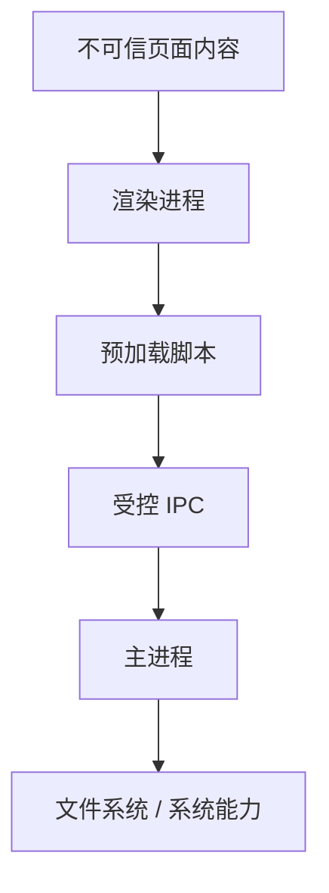

## 进程隔离

Electron 安全的第一条原则是不要把浏览器页面当成可信环境。Electron 同时拥有 Chromium 渲染能力和 Node.js 系统能力，如果渲染进程被 XSS 攻破，又能直接访问 Node API，攻击者就可能读写本地文件、执行命令或窃取用户数据。



安全隔离的目标是让页面只能访问被明确暴露的最小能力，而不是把主进程和 Node.js 暴露给页面。

Electron 安全的关键，不是完全不使用桌面能力，而是让能力经过明确边界。页面是 UI 层，preload 是能力网关，主进程是高权限执行层；任何让渲染进程绕过这个链路的设计，都会显著扩大攻击面。

## 窗口配置

窗口配置是安全边界的第一层。创建窗口时要谨慎处理 Node 集成、上下文隔离、预加载脚本和远程内容加载。

```javascript
const { BrowserWindow } = require('electron');

function createWindow() {
  const win = new BrowserWindow({
    width: 1200,
    height: 800,
    webPreferences: {
      nodeIntegration: false,
      contextIsolation: true,
      sandbox: true,
      preload: path.join(__dirname, 'preload.js'),
    },
  });

  win.loadURL('https://app.example.com');
}
```

这些配置不是“加固项”，而应该是默认项。危险往往不是某一项单独造成的，而是多个宽松配置叠加后让页面拥有了过大的本地能力。

窗口配置要和加载内容一起评估。如果加载本地可信资源，风险相对低；如果加载远程页面，必须更严格地控制 Node 能力、导航、CSP 和 preload API。远程内容一旦被攻击，等于攻击者拿到了桌面应用入口。

除了 `nodeIntegration` 和 `contextIsolation`，还要关注 `webSecurity`、`allowRunningInsecureContent`、`enableRemoteModule` 这类历史上常见的宽松配置。很多安全问题不是“必须用某个危险开关”，而是开发阶段为了调试临时放开，后面又忘了收回。真正稳的做法是把安全默认值固化到窗口创建模板里，让后续新窗口也自动继承同一套限制。

## 预加载边界

预加载脚本运行在页面和主进程之间，是能力暴露的边界。它不应该把 `ipcRenderer`、`fs`、`process` 原样挂到 `window` 上，而应该暴露语义化、受限的函数。

```javascript
const { contextBridge, ipcRenderer } = require('electron');

contextBridge.exposeInMainWorld('desktopApi', {
  selectFile: () => ipcRenderer.invoke('dialog:select-file'),
  getAppVersion: () => ipcRenderer.invoke('app:get-version'),
});
```

页面侧只知道 `desktopApi.selectFile()`，不知道底层 IPC 通道名、文件系统路径和主进程实现。这能减少攻击面，也让能力调用更容易审计。

预加载边界越业务化越安全。例如“选择用户文件”比“读取任意路径”安全，“导出当前报表”比“写入任意文件”安全。API 越接近业务语义，参数越容易限制。

预加载还应当避免承载业务状态。它更适合做参数整理、类型转换、订阅解绑、错误格式统一，而不适合在里面塞权限判断、缓存策略和复杂流程控制。因为 preload 一旦变成“小型业务层”，后面就很容易继续向它堆能力，最后反而模糊了安全边界。

## IPC 校验

IPC 是 Electron 安全里最容易被忽略的入口。即使页面不能直接访问 Node，只要它能发送任意 IPC 消息，仍然可能诱导主进程执行危险操作。

```javascript
ipcMain.handle('file:read-user-note', async (_event, noteId) => {
  if (!/^[a-zA-Z0-9_-]{1,64}$/.test(noteId)) {
    throw new Error('invalid note id');
  }

  const filePath = path.join(userDataDir, `${noteId}.json`);
  if (!filePath.startsWith(userDataDir)) {
    throw new Error('invalid path');
  }

  return fs.promises.readFile(filePath, 'utf8');
});
```

主进程必须把所有来自渲染进程的数据当作不可信输入。参数类型、路径范围、权限状态和业务身份都要校验，不能因为“这是本地客户端”就跳过防护。

IPC 校验要放在主进程最终执行前。preload 可以做早期校验，但不能替代主进程校验；因为真正有系统权限的是主进程，它必须对每次调用负责。

如果应用有多窗口、多工作区或多账号场景，IPC 校验还要增加“上下文约束”。同一个通道在 A 窗口允许，在 B 窗口未必允许；同一个导出动作在管理员身份可做，在访客身份未必能做。也就是说，Electron 的 IPC 校验不是单纯校验参数形状，还要校验调用方当前处于什么上下文。

## 内容安全策略

Electron 页面同样需要 CSP。CSP 可以限制脚本来源、内联脚本、资源加载和连接目标，降低 XSS 攻击后的可利用程度。

```html
<meta
  http-equiv="Content-Security-Policy"
  content="default-src 'self'; script-src 'self'; connect-src 'self' https://api.example.com; img-src 'self' data: https:;"
/>
```

即使是桌面应用，也应该重视内容安全策略。如果应用必须加载远程资源，要明确哪些域名可信，哪些资源只允许本地加载。

CSP 不是万能防线，但它能显著降低 XSS 后的利用空间。内联脚本、远程脚本、任意连接目标和不受限图片源都要谨慎放开，尤其是应用存在登录态和本地能力时。

如果渲染层用的是现代前端框架，还要顺带检查模板注入、`innerHTML`、富文本渲染和第三方脚本注入点。CSP 负责约束“脚本从哪里来”，框架层则负责减少“为什么会执行到不可信脚本”，两者缺一不可。

## 导航控制

桌面应用常见风险是被跳转到恶意页面，或通过 `window.open` 打开带权限的新窗口。窗口创建后应限制可导航 URL，并拦截新窗口。

```javascript
win.webContents.on('will-navigate', (event, url) => {
  if (!url.startsWith('https://app.example.com')) {
    event.preventDefault();
  }
});

win.webContents.setWindowOpenHandler(({ url }) => {
  shell.openExternal(url);
  return { action: 'deny' };
});
```

导航控制和 [[7.9.3 预加载脚本|预加载脚本]] 是一组配套措施：预加载限制能力，导航控制限制谁能拿到这套能力。

外部链接应该默认交给系统浏览器打开，并校验协议和域名。不要让第三方页面留在拥有 preload 能力的应用窗口里，否则它可能拿到不该暴露的桌面 API。

如果业务需要在应用内打开多个页面，最好按页面类型分窗口配置，而不是所有页面复用同一个窗口模板。内部受信页面可以拿较完整的 preload API，外部帮助页、支付页、文档页则应该尽量简化能力，必要时甚至直接禁用 preload。

## 依赖与更新

Electron 应用的安全不只在代码里，也在依赖和更新链路里。过旧的 Electron 版本意味着 Chromium 漏洞无法及时修复；不安全的自动更新可能让攻击者投递恶意包。

| 风险 | 防护 |
|---|---|
| 旧版 Chromium 漏洞 | 定期升级 Electron |
| 依赖投毒 | 锁定版本、审计依赖、最小化依赖 |
| 更新包被替换 | 签名校验、HTTPS、可信发布通道 |
| 本地数据泄漏 | 加密敏感数据、限制日志内容 |

Electron 的安全基线应该进入发布检查清单，而不是上线前临时看一眼。桌面端一旦被攻击，影响范围通常比普通网页更大。

依赖与更新链路也属于安全隔离的一部分。过旧 Electron 版本意味着浏览器内核漏洞无法修复，不安全的更新链路则可能直接把恶意包安装到用户电脑上。

## 审计清单

Electron 安全审计可以先看这些问题：

- 渲染进程是否直接使用 Node 能力
- 预加载脚本是否暴露过宽 API
- IPC 是否有参数校验
- 是否加载不可信远程页面
- 是否允许任意外部链接在应用内打开

安全隔离做得好，后续原生能力扩展才不会不断放大风险。

安全审计最好在每次新增 IPC、preload API、外部链接和远程内容时触发。Electron 的安全不是一次配置完成，而是随着功能增加持续维护的边界。

一个实用的做法是把安全审计并入发布前检查：看新版本新增了哪些通道、哪些窗口、哪些外部域名、哪些文件操作、哪些协议跳转。这样安全隔离就不会停留在“早期架构设计”，而会真正进入日常开发流程。
