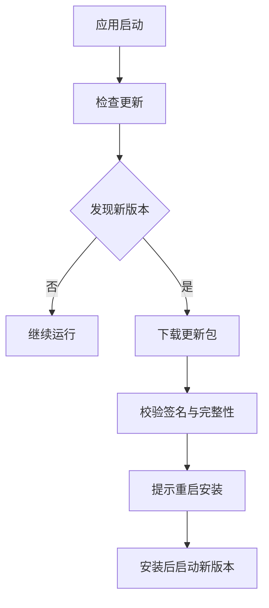

## 更新模型

Electron 自动更新的目标是让桌面应用像 Web 一样持续交付，但它的风险和移动端更像：用户安装的是本地二进制包，更新失败可能导致应用无法启动，更新链路被攻击可能导致恶意代码落地。

自动更新的本质不是“推送新版本”，而是“让不同版本之间可以安全接力”。所以它既要解决下载与安装，也要解决版本兼容、数据迁移、渠道控制和失败恢复。



自动更新不是简单下载文件。它需要版本比较、渠道控制、签名校验、下载进度、失败重试、用户提示和回滚策略。

在桌面端，更新模型还要考虑“谁决定更新”。有的应用由客户端主动轮询，有的由服务端控制是否返回更新信息，还有的会在启动时检查一次、运行中再提示一次。不同策略决定了更新体验和服务压力。

## 发布通道

桌面应用通常会区分 stable、beta、alpha、internal 等通道。不同通道面向不同用户群，更新频率、稳定性和日志级别都不同。

通道设计的价值在于把风险隔离开。新功能、实验配置、灰度包和正式包如果混在一起，出问题时很难控制影响范围。

| 通道 | 用户 | 特点 |
|---|---|---|
| internal | 团队内部 | 更新频繁，诊断能力完整 |
| beta | 外部测试用户 | 提前验证真实环境 |
| stable | 普通用户 | 稳定优先，灰度放量 |

通道信息可以写入构建配置，也可以由服务端根据用户、组织或设备返回。关键是不要让测试通道的包误发给正式用户。

如果企业内部既有测试版又有正式版，建议把通道和更新地址一起配置，并在启动时打印当前通道、版本和平台。这样定位“为什么没收到更新”会快很多。

除了通道命名，还要定义通道切换规则。比如安装了 beta 的用户能否直接降回 stable、internal 包能否覆盖 beta、不同通道是否共用同一份本地数据。没有这些约束，更新行为会越来越难预测。

## 版本检查

更新检查需要知道当前版本、平台、架构、通道和用户灰度状态。只用版本号判断往往不够，因为 Windows、macOS、arm64、x64 可能对应不同安装包。

版本检查除了“是否有新版本”，还要判断“这次更新是否适合当前用户”。比如不同架构包、不同渠道包、不同实验开关的可见性都应该由服务端或更新配置控制。

```javascript
const { app, autoUpdater } = require("electron");

function configureAutoUpdate() {
  const platform = process.platform;
  const arch = process.arch;
  const version = app.getVersion();
  const channel = process.env.UPDATE_CHANNEL || "stable";

  autoUpdater.setFeedURL({
    url: `https://updates.example.com/${channel}/${platform}/${arch}/${version}`,
  });
}
```

更新服务应该返回当前平台可用的更新，而不是让客户端自己猜下载哪个包。服务端也可以在发现异常时暂停某个版本的放量。

如果更新服务支持条件判断，最好让它返回明确的结果类型，例如无更新、可选更新、强制更新、跳过当前版本、仅修复某平台问题。这样客户端的 UI 和逻辑都更清晰。

版本检查还应避免过于频繁。启动即查、手动检查、后台定时检查可以并存，但要防止多个窗口同时触发请求，或者用户刚打开应用就被连续弹窗打断。桌面端更新体验的关键之一，就是“存在感适中”。

## 下载与安装

自动下载要考虑网络中断、磁盘空间不足、代理、杀毒软件拦截和用户正在工作等情况。对办公类、编辑类应用，强制静默重启会造成数据丢失，应该让用户选择合适时机。

下载阶段最怕的不是慢，而是不透明。用户不知道在下什么、还要等多久、失败后能不能继续，体验就会非常差。所以更新进度、剩余时间、失败原因都值得单独设计。

```javascript
autoUpdater.on("update-available", () => {
  mainWindow.webContents.send("update:available");
});

autoUpdater.on("download-progress", (progress) => {
  mainWindow.webContents.send("update:progress", {
    percent: Math.round(progress.percent),
  });
});

autoUpdater.on("update-downloaded", () => {
  mainWindow.webContents.send("update:ready");
});

ipcMain.handle("update:restart", () => {
  autoUpdater.quitAndInstall();
});
```

用户体验上，检查更新可以静默，下载进度可以轻提示，安装重启必须明确告知。涉及未保存内容时，要先触发保存或确认流程。

如果更新包比较大，可以考虑先展示“可用更新已发现”，再由用户点击开始下载。这样能把下载、安装和重启三个动作拆开，减少工作被打断的感觉。

下载流程里还要想清楚“失败后怎么恢复”。是从头重下、断点续传，还是提示切换网络稍后重试；是保留已下载缓存，还是失败后立刻清理。更新系统成熟与否，往往就体现在这些失败细节上。

## 签名校验

自动更新必须配合代码签名和完整性校验。签名用于证明包来自可信发布者，完整性校验用于确认下载过程中未被篡改。

对于桌面更新来说，签名校验并不是“多一道检查”，而是“防止供应链被篡改的最后一道门”。没有它，更新链路本身就成了攻击入口。

```text
构建产物
  -> 代码签名
  -> 生成更新元数据
  -> 上传更新服务器
  -> 客户端下载
  -> 校验签名与版本
  -> 安装
```

不要从不可信 HTTP 地址下载更新包，不要绕过签名校验，也不要把更新密钥放在客户端。更新链路本身就是桌面应用的供应链入口。

如果更新包托管在 CDN 或第三方存储上，最好还要校验元数据来源和下载地址生成逻辑。也就是说，不只是包要可信，告诉客户端“去哪里下载”的那一段也要可信。

## 灰度与回滚

桌面端回滚比 Web 慢，但可以通过更新服务控制“谁收到新版本”。常见策略是内部用户先更新，低比例灰度，再逐步全量。

灰度不是只看比例，还要看群体。内部员工、外部测试用户、付费用户、企业客户，风险容忍度往往不同，灰度策略也应当不同。

| 问题 | 处理 |
|---|---|
| 新版本崩溃率升高 | 暂停该版本更新 |
| 单个平台异常 | 只关闭该平台更新 |
| 用户已安装坏版本 | 发布修复版本并提高优先级 |
| 数据结构不兼容 | 保留迁移回滚或兼容读取 |

自动更新要配合崩溃监控和版本追踪。否则你只知道“发了新版本”，不知道新版本是否真的健康。

如果某个版本在启动后立即崩溃，更新服务应该能快速暂停放量，甚至临时把新版本隐藏掉。回滚机制越早接入，越能减少用户被坏版本影响的时间。

桌面端回滚还要特别关注本地数据是否已经迁移。如果新版本修改了数据库结构、缓存格式或插件目录，单纯把二进制包回滚并不能解决问题。更稳的策略是让迁移具备版本标记、备份和兼容读取能力。

## 强制更新

强制更新只适合安全漏洞、协议不可兼容或旧版本无法继续服务的场景。普通功能升级不适合频繁强制，否则会破坏桌面应用的使用连续性。

强制更新最好带有清晰说明，比如“当前版本已不再受支持”“需要升级以继续使用同步服务”。如果只是简单弹窗拦截，用户很容易产生反感。

强制更新也要提供失败兜底，不能让用户卡在“更新失败但旧版本不能用”的状态。强制更新前要确认下载通道、签名校验、安装权限和旧版本提示都可用。

如果强制更新涉及数据格式变化，就更要谨慎。用户可能正在离线工作，或者受限于公司网络无法立刻下载新包，至少要提供联系支持、稍后重试或离线安装的路径。

很多团队会误把“想让用户尽快升级”当成强制更新理由，但真正该强制的，通常只有安全、协议和服务可用性问题。普通功能迭代如果靠频繁强更推动，最后只会换来更高的卸载率和更多运维压力。

## 数据兼容

桌面应用经常有本地配置、缓存和用户数据。自动更新时要考虑新旧版本的数据结构兼容，尤其是数据库、配置文件和插件目录。

数据兼容的关键是“不要把迁移和升级绑死”。能兼容读取的尽量兼容读取，不能兼容的要先迁移备份，再切换新结构。这样即使更新失败，也有回退空间。

如果更新过程会迁移本地数据，必须保证迁移失败可以恢复。更稳的方式是迁移前备份、迁移过程可重试、旧版本能兼容读取或至少能提示用户修复。

对于使用 SQLite、本地索引或插件系统的应用，最好额外设计版本号和迁移脚本。这样每次更新都能明确知道“从哪版迁到哪版”，而不是让启动逻辑里堆一堆 if/else。

## 企业环境

Electron 应用经常运行在企业网络里，会遇到代理、内网证书、权限限制和软件管控。自动更新如果只在开发者网络里验证，很容易上线后大面积失败。

企业环境里的问题往往不是“代码错了”，而是“假设错了”。比如默认直连外网、默认能写安装目录、默认能校验证书链，这些在企业网络里都可能不成立。

| 企业约束 | 影响 |
|---|---|
| HTTP 代理 | 更新请求失败或超时 |
| 自签证书 | TLS 校验失败 |
| 软件白名单 | 安装包被拦截 |
| 普通用户权限 | 无法写入安装目录 |

企业软件最好提供手动更新、离线安装包和明确错误提示。自动更新失败时，用户要知道下一步怎么做，而不是只看到“更新失败”。

如果应用面向企业客户，建议把更新失败的错误码和处理建议做成可读文案，而不是只显示技术堆栈。这样 IT 管理员和普通用户都能更快找到出路。

在企业环境里，更新链路还经常要配合资产管理、白名单、版本审计和变更窗口。也就是说，自动更新不只是客户端能力，还牵涉企业 IT 的管理流程。写更新功能时越早考虑这些现实约束，后面越不容易返工。
